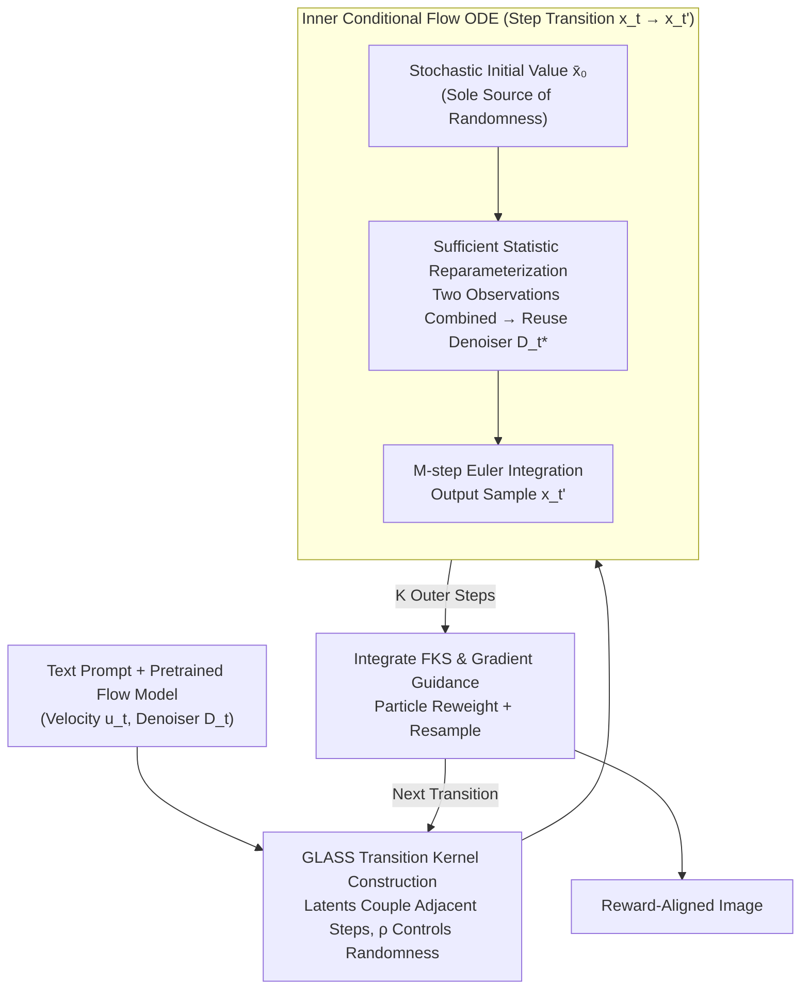

# GLASS Flows: Efficient Inference for Reward Alignment of Flow and Diffusion Models

**Conference**: ICLR 2026 Oral  
**OpenReview**: [https://openreview.net/forum?id=vH7OAPZ2dR](https://openreview.net/forum?id=vH7OAPZ2dR)  
**Code**: Yes  
**Area**: Image Generation / Diffusion Models  
**Keywords**: flow matching, diffusion models, reward alignment, Feynman-Kac steering, GLASS, stochastic transitions, inference-time scaling

## TL;DR
Ours proposes GLASS (Gaussian Latent Sufficient Statistic) Flows—a new "flow-within-a-flow" sampling paradigm. By reparameterizing stochastic Markov transitions $p_{t'|t}(x_{t'} | x_t)$ as inner ODE solving problems via Gaussian sufficient statistics (reusing pretrained denoisers without retraining), it achieves Feynman-Kac Steering without the trade-off between ODE efficiency and SDE randomness. This consistently outperforms Best-of-N ODE baselines on FLUX models, setting a new SOTA for inference-time reward alignment.

## Background & Motivation
**Background**: Flow matching and diffusion models can be enhanced during inference via reward adaptation algorithms (inference-time scaling). Existing methods like Sequential Monte Carlo (SMC) and Feynman-Kac Steering (FKS) require introducing randomness into denoising trajectories to explore high-reward regions.

**Limitations of Prior Work**: Stochastic transitions (SDE sampling) are far less efficient than deterministic ODE sampling and suffer from severe quality degradation in few-step regimes. Experiments show that standard FKS using SDE transitions fails to even surpass simple Best-of-N ODE baselines—a fundamental conflict between efficiency and randomness.

**Key Challenge**: Methods like FKS/SMC theoretically require stochastic branching provided by SDEs to effectively explore the posterior distribution, but the computational and quality costs of SDEs make them infeasible for actual SOTA models. Best-of-N ODE is efficient but does not utilize intermediate reward signals.

**Goal**: Eliminate the trade-off between efficiency and randomness—enabling ODE sampling to produce rich stochastic transitions, thereby making FKS truly effective.

**Key Insight**: It is observed that the Gaussian transition kernel $p_{t'|t}$ can be transformed into an inner conditional flow matching ODE driven by the pretrained denoiser through sufficient statistics and time reparameterization.

**Core Idea**: Recast stochastic transitions as "inner flow matching" ODEs. By reusing the pretrained model via sufficient statistics, "ODE speed + SDE diversity" is achieved.

## Method

### Overall Architecture
The contradiction GLASS Flows addresses is: reward-aligned sampling (e.g., Feynman-Kac Steering, FKS) must rely on **stochastic transitions** to branch out and explore high-reward regions in denoising trajectories, but traditional SDE stochastic transitions degrade significantly under low step counts. The mechanism is—**keep the outer reward-guided loop intact, but replace the stochastic transition at each step with an efficient "inner flow matching ODE"**.

Specifically, the outer layer is an FKS loop: a set of particles is maintained along the $x_1 \to \cdots \to x_0$ denoising trajectory, with reweighting + resampling based on rewards every few steps to concentrate compute on high-reward paths. While FKS originally used SDEs for stochastic transitions between adjacent timesteps $x_t \to x_{t'}$, GLASS reformulates **this stochastic transition itself** as a small conditional flow matching problem. Given a random initial value $\bar{x}_0 \sim \mathcal{N}(\bar{\gamma} x_t, \bar{\sigma}_0^2 I)$, an inner ODE $\frac{d\bar{x}_s}{ds} = \bar{u}_s(\bar{x}_s \mid x_t, t)$ over auxiliary time $s\in[0,1]$ is driven by the pretrained denoiser. Integrating via Euler for $M$ steps yields the final state $\bar{x}_1 \sim p_{t'|t}(\cdot \mid x_t)$, which is an $x_{t'}$ sample. All randomness originates from the starting point, while subsequent evolution is a deterministic ODE—thus achieving both SDE diversity and ODE stability/efficiency. This is literally a "flow within a flow."

### Key Designs

**1. GLASS Transition Kernel Construction: Coupling two denoising steps with a latent variable to make randomness a tunable knob**

To enable ODEs to generate stochastic branches, the first step is to provide a clean probabilistic model for transitions. GLASS treats adjacent steps $(X_t, X_{t'})$ as two "noisy observations" of the same latent variable $Z$: $X_t = \alpha_t Z + \sigma_t \epsilon_1$ and $X_{t'} = \alpha_{t'} Z + \sigma_{t'} \epsilon_2$, with correlated noise $\text{Corr}(\epsilon_1, \epsilon_2) = \rho$. The joint distribution is thus a Gaussian with correlation:

$$\begin{pmatrix} X_t \\ X_{t'} \end{pmatrix} = \begin{pmatrix} \alpha_t \\ \alpha_{t'} \end{pmatrix} Z + \begin{pmatrix} \sigma_t \epsilon_1 \\ \sigma_{t'} \epsilon_2 \end{pmatrix}, \quad \Sigma = \begin{pmatrix} \sigma_t^2 & \rho \sigma_t \sigma_{t'} \\ \rho \sigma_t \sigma_{t'} & \sigma_{t'}^2 \end{pmatrix}$$

The correlation parameter $\rho$ acts as the knob for stochastic intensity: $\rho = \alpha_t \sigma_{t'} / (\sigma_t \alpha_{t'})$ reverts to standard DDPM transitions, $\rho = 1$ reverts to deterministic ODEs, and intermediate values provide controllable stochasticity. Experiments find $\rho = 0.4$ optimal—retaining exploration without degrading quality like SDEs.

**2. Sufficient Statistic Reparameterization: Compressing two observations using Gaussian conjugacy to reuse pretrained denoisers with zero extra training**

The core contribution is sampling this kernel without retraining. Using Gaussian conjugacy, the noisy observations $x_t$ and the inner state $\bar{x}_s$ can be compressed into a single sufficient statistic:

$$S(\mathbf{x}) = \frac{\mu^\top \Sigma^{-1}}{\mu^\top \Sigma^{-1} \mu} \begin{pmatrix} x_t \\ \bar{x}_s \end{pmatrix}, \quad \mu = (\alpha_t, \bar{\alpha}_s + \bar{\gamma}\alpha_t)^\top$$

Ours proves that the GLASS denoiser equals the pretrained denoiser evaluated at an equivalent time:

$$D_{\mu, \Sigma}(x_t, \bar{x}_s) = D_{t^\star}(\alpha_{t^\star} S(\mathbf{x}))$$

where $t^\star = g^{-1}\big((\mu^\top \Sigma^{-1} \mu)^{-1}\big)$, and $g(t) = \sigma_t^2 / \alpha_t^2$ is the signal-to-noise ratio function. Intuitively, two noisy observations are merged into an equivalent observation $S(\mathbf{x})$, which is then denoised by the original model at time $t^\star$. Since this is an exact algebraic identity, the reparameterization is entirely training-free.

**3. Inner Conditional Flow ODE: Solving the single-step stochastic transition as a complete flow matching problem**

Substituting the GLASS denoiser into the conditional flow matching framework turns $x_t \to x_{t'}$ into an inner ODE. With auxiliary time $s \in [0,1]$ and CondOT schedule $\bar{\alpha}_s = s \bar{\alpha}_1, \bar{\sigma}_s = (1-s)\bar{\sigma}_0 + s\bar{\sigma}_1$, the inner velocity field is:

$$\bar{u}_s = w_1(s)\, \bar{x}_s + w_2(s)\, D_{mu(s), \Sigma(s)}(x_t, \bar{x}_s), \quad w_1(s) = \frac{\dot{\bar{\sigma}}_s}{\bar{\sigma}_s}, \quad w_2(s) = \dot{\bar{\alpha}}_s - \bar{\alpha}_s \frac{\dot{\bar{\sigma}}_s}{\bar{\sigma}_s}$$

Integrating for $M$ steps via Euler yields $x_{t'}$. Randomness comes purely from $\bar{x}_0 \sim \mathcal{N}(\bar{\gamma} x_t, \bar{\sigma}_0^2 I)$. Unlike SDEs, which accumulate error by injecting noise throughout the path, GLASS places noise at the start and relies on ODE stability. Each inner step costs only 1 NFE.

**4. Plug-and-Play Integration with FKS & Guidance: Swap the sampler without touching models or training**

The GLASS transition kernel is a drop-in replacement. Any SDE-based method can benefit by swapping the transition. In FKS-GLASS, reward gradients $\nabla_y r\big(D_{t^\star}(y)\big)\big|_{y=\alpha_{t^\star}S(\mathbf{x})}$ can even be added directly inside the inner ODE for stronger guidance. Total NFE $= K \times M$ ($K$ outer steps $\times M$ inner ODE steps).

## Key Experimental Results

### Main Results: FLUX Text-to-Image Reward Alignment (GenEval + PartiPrompts)

| Method | CLIP ↑ | PickScore ↑ | HPSv2 ↑ | ImageReward ↑ | GenEval ↑ |
|------|--------|------------|---------|--------------|-----------|
| ODE (Best-of-8) | Baseline | Baseline | Baseline | Baseline | Baseline |
| FKS + SDE | < Best-of-8 | < Best-of-8 | < Best-of-8 | < Best-of-8 | ≈ |
| FKS + GLASS | **> Best-of-8** | **> Best-of-8** | **> Best-of-8** | **> Best-of-8** | **Gain** |
| FKS + GLASS + Guidance | **Highest** | **Highest** | **Highest** | **Highest** | **Highest** |

### Ablation Study

| Configuration | Key Metric | Description |
|------|---------|------|
| Best-of-N (ODE) | Baseline | Simple but ignores intermediate reward signals |
| Best-of-N (GLASS) | ≈ Best-of-N (ODE) | Same marginal distribution, consistent endpoint quality |
| FKS + SDE | < Best-of-N (ODE) | SDE quality is too low, dragging down FKS |
| $\rho = 0.2, 0.4, 0.6, 0.8, 1.0$ | $\rho = 0.4$ is optimal | All $\rho$ values maintain ODE-level quality |
| DreamSim Diversity | ODE ≈ SDE ≈ GLASS | All samples come from the same marginal distribution |
| SiT-XL ImageNet-256 | GLASS FID ≈ ODE FID | Effective on non-FLUX models |

### Key Findings
- **FKS + SDE fails on FLUX**: Standard SDE transitions in the 50-step FLUX configuration degrade quality (residual noise), underperforming Best-of-N ODE.
- **GLASS eliminates the efficiency-randomness trade-off**: FKS-GLASS consistently outperforms Best-of-N ODE across 4 reward models and 2 benchmarks, unlike FKS-SDE.
- **Randomness source**: Randomness in GLASS comes from initial conditions $\bar{X}_0 \sim \mathcal{N}(\bar{\gamma} x_t, \bar{\sigma}_0^2 I)$, while subsequent evolution follows a deterministic ODE.
- **Marginal preservation**: Ours theoretically proves $X_{t_k} \sim p_{t_k}$ for any $\rho$.

## Highlights & Insights
- **Elegance of "Flow-within-a-Flow"**: Recasting stochastic transition as conditional flow matching is conceptually simple yet powerful.
- **Mathematical beauty of sufficient statistics**: Using Gaussian conjugacy to reuse pretrained denoisers without training is a core breakthrough.
- **Solving a practical pain point**: FKS/SMC were previously hindered by SDE quality; GLASS removes this bottleneck.
- **Drop-in Utility**: No retraining required. It is compatible with existing samplers and can accelerate RL training (e.g., Flow-GRPO).

## Limitations & Future Work
- Assumes Gaussian transition kernels; applicability to non-Gaussian architectures is unverified.
- $\rho$ is currently constant; time-dependent $\rho(t, t')$ could be explored.
- Selection of inner ODE steps $M$ involves computation trade-offs.
- Comparison with discrete-time diffusion (standard DDPM schedules) regarding numerical stability could be deeper.

## Related Work & Insights
- **vs. DDPM/SDE Sampling**: GLASS samples the same transition distribution in the continuous limit but replaces SDE with ODE integrators for better quality/efficiency.
- **vs. TADA (arXiv:2506.21757)**: While using similar Gaussian tools, GLASS focuses on stochastic transitions for reward alignment rather than training-free improvement.
- **vs. Best-of-N**: FKS-GLASS utilizes intermediate signals and particle resampling, whereas Best-of-N only considers the final reward and independent samples.

## Rating
- Novelty: ⭐⭐⭐⭐⭐ "Flow-within-a-flow" and sufficient statistic construction are highly original.
- Experimental Thoroughness: ⭐⭐⭐⭐ Strong validation on FLUX 768×1360, though more architectures could be tested.
- Writing Quality: ⭐⭐⭐⭐⭐ Rigorous mathematical derivation and clear progression from intuition to formalism.
- Value: ⭐⭐⭐⭐⭐ Directly addresses a major bottleneck in inference-time reward alignment with high practical utility.

<!-- RELATED:START -->

## Related Papers

- [\[ICLR 2026\] DenseGRPO: From Sparse to Dense Reward for Flow Matching Model Alignment](densegrpo_from_sparse_to_dense_reward_for_flow_matching_model_alignment.md)
- [\[CVPR 2026\] Learning Straight Flows: Variational Flow Matching for Efficient Generation](../../CVPR2026/image_generation/learning_straight_flows_variational_flow_matching_for_efficient_generation.md)
- [\[ICLR 2026\] Diffusion Blend: Inference-Time Multi-Preference Alignment for Diffusion Models](diffusion_blend_inference-time_multi-preference_alignment_for_diffusion_models.md)
- [\[ICLR 2026\] Inference-Time Scaling of Diffusion Models Through Classical Search](inference-time_scaling_of_diffusion_models_through_classical_search.md)
- [\[ICLR 2026\] CMT: Mid-Training for Efficient Learning of Consistency, Mean Flow, and Flow Map Models](cmt_mid-training_for_efficient_learning_of_consistency_mean_flow_and_flow_map_mo.md)

<!-- RELATED:END -->
