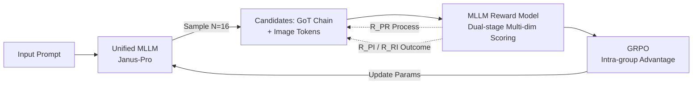

# GoT-R1: Unleashing Reasoning Capability of Autoregressive Visual Generation with Reinforcement Learning

**Conference**: ICLR 2026  
**OpenReview**: [https://openreview.net/forum?id=Z9FjSaBuYt](https://openreview.net/forum?id=Z9FjSaBuYt)  
**Code**: [https://github.com/gogoduan/GoT-R1](https://github.com/gogoduan/GoT-R1)  
**Area**: Image Generation / Autoregressive Visual Generation / Reinforcement Learning  
**Keywords**: Autoregressive Image Generation, Generation Chain-of-Thought, GRPO, MLLM Reward Model, Compositional Generation, Semantic-Spatial Reasoning  

## TL;DR
GoT-R1 transfers the success of "exploring reasoning strategies via Reinforcement Learning" (like GRPO in LLMs) to autoregressive image generation. By utilizing a dual-stage multi-dimensional reward scored by an MLLM to simultaneously supervise the "reasoning chain" and the "final image," the model significantly improves generation fidelity for compositional prompts involving multiple objects, precise spatial relations, and attribute binding.

## Background & Motivation

**Background**: While text-to-image models (diffusion/autoregressive) generate high-fidelity images, they frequently fail on complex prompts requiring specified multiple objects, precise spatial relations, and attribute binding (e.g., "a butterfly to the left of a candle"). This occurs because they typically map text embeddings directly to visual features without explicit reasoning about the scene's compositional structure.

**Limitations of Prior Work**: The predecessor GoT (Generation Chain-of-Thought) proposed generating a reasoning chain of "semantics + spatial coordinates" (e.g., `a playful brown dog (100,200),(350,450)`) before drawing, which improved compositional fidelity. however, GoT was trained via Supervised Fine-Tuning (SFT) on human-templated data, leading to two major issues: ① reasoning strategies were locked into fixed templates, preventing the discovery of more effective reasoning; ② SFT models often generated reasoning chains that were "formatted correctly but unfaithful to the prompt," where incorrect reasoning became a bottleneck for downstream generation.

**Key Challenge**: While autoregressive architectures are naturally suited for token-by-token sequential reasoning (similar to how RL triggers CoT in o1/DeepSeek-R1), applying RL to visual generation faces unique difficulties. First, visual rewards are hard to design as they must evaluate semantic fidelity, spatial layout, attribute binding, and aesthetics. Second, using only "outcome rewards" (prompt-image alignment) leaves the intermediate reasoning unsupervised, potentially leading to images that look good but are compositionally incorrect or cases where a good plan is not executed in the final image.

**Goal**: To equip autoregressive visual generation models with an RL framework that supervises both the reasoning process and the final output, allowing the model to autonomously explore reasoning strategies beyond fixed templates.

**Core Idea**: **Dual-stage multi-dimensional rewards using MLLM as a judge + GRPO**. The base is a unified MLLM (Janus-Pro) modeling both text and image tokens. After initial SFT for basic reasoning, GRPO is used to explore optimal reasoning chains. Rewards are scored by an MLLM across three pairs: "prompt↔reasoning," "reasoning↔image," and "prompt↔image," linking process and outcome supervision into a complete chain.

## Method

### Overall Architecture

GoT-R1 stacks reinforcement learning onto the "reason-then-generate" paradigm of GoT. Using a unified MLLM (e.g., Janus-Pro), the model takes a prompt and outputs a GoT reasoning chain followed by image tokens. Training consists of two stages: the **SFT Stage** initializes templated reasoning capabilities, and the **RL Stage** samples $N=16$ candidate sets (reasoning chain + image tokens) per prompt. An MLLM reward model scores these candidates, and GRPO updates parameters based on relative advantages within the group to encourage high-reward strategies.

### Key Designs

**1. Dual-stage Multi-dimensional Reward: Supervising "Process" and "Outcome".** To prevent the reasoning process from deviating when only outcome rewards are used, the framework decomposes generation into prompt→reasoning and reasoning→image stages. Four reward types are defined: $R_{PI}$ measures overall alignment between prompt and image; $R_{PR}$ measures reasoning faithfulness to the prompt (process supervision); $R_{RI}$ measures image fidelity to the reasoning plan; and $R_{HPS}$ uses HPS v2.1 for aesthetic quality. $R_{PR}$ is further split into semantic reward $R_{sem}$ and spatial reward $R_{spa}$. The total reward is a product, ensuring no single dimension fails:

$$R_{total} = R_{PI} \cdot R_{PR} \cdot R_{RI} \cdot R_{HPS} = R_{PI} \cdot \frac{(R_{sem}+R_{spa})}{2} \cdot R_{RI} \cdot \frac{R_{HPS}}{1}$$

**2. "Visualize the Coordinates" for MLLM Spatial Feedback: Key trick for $R_{spa}$.** Lightweight MLLMs are often insensitive to text-based bounding box coordinates. The authors observed that **MLLMs possess much stronger spatial understanding when processing visual data than text coordinates**. Thus, they render the text coordinates from the reasoning chain as actual bounding boxes on a blank canvas. The MLLM then scores the spatial layout based on this image, significantly improving the reliability of spatial judgment.

**3. Four-dimensional Scoring for Semantic Reward $R_{sem}$.** To ensure the reasoning chain is faithful to the prompt, the MLLM scores four dimensions (0–10): Completeness (covering all concepts), Faithfulness (no contradictions), Consistency (logical self-consistency), and Clarity (coherence and formatting). This granular signal addresses the "formatted-but-unfaithful" issue seen in SFT models.

**4. Aligning "Reasoning Plan" with "Final Image" via IoU — $R_{RI}$.** During RL, models sometimes generate images that deviate from their own plans. $R_{RI}$ uses the MLLM to perform grounding on the generated image, extracting actual bounding boxes $B_{Image}$ for objects and calculating the IoU against the planned boxes $B_{GoT}$. This ensures the reasoning chain serves as a genuine blueprint rather than a hallucinated artifact.

## Key Experimental Results

Training used Janus-Pro-1B/7B, pre-trained for 70,000 steps on GoT datasets, followed by 1,000 GRPO steps using T2I-CompBench and LAION-Aesthetics prompts. The reward model was Qwen2.5-VL-7B.

### Main Results

**T2I-CompBench (Core Compositional Benchmark)**:

| Model | Color | Shape | Texture | 2D-Spatial | Non-Spatial | Complex |
|------|-------|-------|---------|-----------|-------------|---------|
| FLUX.1 | 0.7407 | 0.5718 | 0.6922 | 0.2863 | 0.3127 | 0.3703 |
| Stable v3 | 0.8132 | 0.5885 | 0.7334 | 0.3200 | 0.3140 | 0.3771 |
| Janus-Pro-7B | 0.6359 | 0.3528 | 0.4936 | 0.2061 | 0.3085 | 0.3559 |
| Janus-Pro-7B-GoT | 0.6551 | 0.5008 | 0.5836 | 0.2457 | 0.3113 | 0.3754 |
| **GoT-R1-7B** | **0.8139** | **0.5549** | **0.7339** | **0.3306** | **0.3169** | **0.3944** |

GoT-R1-7B achieves SOTA in 5 out of 6 categories, with gains up to 15%.

**GenEval**:

| Model | Overall | Single | Two Obj | Counting | Colors | Position | Attr. Binding |
|------|---------|--------|---------|----------|--------|----------|---------------|
| Janus-Pro-7B-GoT | 0.64 | 0.99 | 0.69 | 0.48 | 0.85 | 0.43 | 0.43 |
| **GoT-R1-7B** | **0.75** | 0.99 | **0.94** | 0.50 | **0.90** | 0.46 | **0.68** |

Overall score increased from 0.64 to 0.75, with the most significant gains in "Two Object" (0.69→0.94) and "Attribute Binding" (0.43→0.68).

### Ablation Study

Evaluated on Janus-Pro-1B-GoT with 1,000 GRPO steps:

| Config | $R_{sem}$ | $R_{spa}$ | $R_{RI}$ | $R_{PI}$ | Color | 2D-Spatial | Complex |
|------|-----------|-----------|----------|----------|-------|-----------|---------|
| Baseline | ✗ | ✗ | ✗ | ✗ | 0.6336 | 0.2140 | 0.3490 |
| $R_{RI}$ Only | ✗ | ✗ | ✓ | ✗ | 0.3340 | 0.0076 | 0.2488 |
| $R_{PI}$ Only | ✗ | ✗ | ✗ | ✓ | 0.7401 | 0.2398 | 0.3724 |
| **All (GoT-R1-1B)** | ✓ | ✓ | ✓ | ✓ | **0.7632** | **0.2674** | **0.3749** |

### Key Findings
- **Multi-dimensional rewards are indispensable**: Removing any reward results in a performance drop; the full combination is optimal across nearly all categories.
- **$R_{RI}$ cannot be used alone**: Using only $R_{RI}$ (reasoning-image IoU) leads to catastrophic failure (2D-Spatial drops to 0.0076) because it forces the image to align with potentially incorrect reasoning.
- **"Visual Box Rating" is vital**: Rendering coordinates as images for MLLM evaluation is the key driver for gains in the 2D-Spatial category.

## Highlights & Insights
- **Clean migration of RL-for-reasoning to visual generation**: It leverages the natural fit of AR architectures for sequential reasoning, allowing the model to explore strategies beyond human templates.
- **Multiplicative total reward as a strong constraint**: Multiplying four terms ensures any weak dimension is heavily penalized, forcing balanced improvements.
- **Modality alignment for evaluation**: The finding that MLLMs are better at judging images than reading coordinates is a reusable insight for any task requiring spatial MLLM feedback.
- **Process + Outcome closure**: The two-stage cross-check ($R_{PR}/R_{RI}/R_{PI}$) ensures the reasoning chain is both faithful to the prompt and accurately translated into the image.

## Limitations & Future Work
- **Dependency on MLLM Reward Model**: The system's bottleneck is the perception and grounding capability of the judge (Qwen2.5-VL-7B).
- **High Training Cost**: Sampling $N=16$ candidates followed by MLLM grading and grounding is computationally expensive.
- **Limited Absolute Spatial Precision**: Even after improvements, 2D-Spatial scores remain around 0.33, indicating that complex spatial generation is far from solved.
- **Generalization to Dense Scenes**: The current focus is on 2–3 object prompts; performance on densely populated scenes with long-range relations remains to be tested.

## Related Work & Insights
- **GoT (Fang et al., 2025)**: The direct predecessor which introduced the reason-then-generate paradigm; GoT-R1 solves its "rigid template" and "unfaithful reasoning" limitations.
- **DeepSeek-R1 / GRPO (Shao et al., 2024)**: Provided the efficient RL engine without a critic via intra-group relative reward normalization.
- **Unified MLLMs (Janus-Pro / Chameleon)**: Provided the base capable of joint text and image token modeling.
- **Insight**: For generation tasks split into "planning + output," designing separate process rewards and using objective signals (like IoU) to verify consistency between stages is a powerful paradigm.

## Rating
- **Novelty**: ⭐⭐⭐⭐ Effectively migrates RL-for-reasoning to AR vision; the dual-stage reward and "visualized box" judgment are solid designs.
- **Experimental Thoroughness**: ⭐⭐⭐⭐ Comprehensive benchmarks and detailed reward ablations; lacks analysis on reward hacking.
- **Writing Quality**: ⭐⭐⭐⭐ Clear logic from motivation to ablation; intuitive figures.
- **Value**: ⭐⭐⭐⭐ Provides a clear SOTA on compositional generation; the insights on MLLM-as-reward are highly reusable.

<!-- RELATED:START -->

## Related Papers

- [\[ICLR 2026\] RePrompt: Reasoning-Augmented Reprompting for Text-to-Image Generation via Reinforcement Learning](reprompt_reasoning-augmented_reprompting_for_text-to-image_generation_via_reinfo.md)
- [\[ICLR 2026\] Group Critical-token Policy Optimization for Autoregressive Image Generation](group_critical-token_policy_optimization_for_autoregressive_image_generation.md)
- [\[NeurIPS 2025\] Janus-Pro-R1: Advancing Collaborative Visual Comprehension and Generation via Reinforcement Learning](../../NeurIPS2025/image_generation/janus-pro-r1_advancing_collaborative_visual_comprehension_and_generation_via_rei.md)
- [\[ICLR 2026\] BAR: Refactor the Basis of Autoregressive Visual Generation](bar_refactor_the_basis_of_autoregressive_visual_generation.md)
- [\[ICLR 2026\] Autoregressive Image Generation with Randomized Parallel Decoding](autoregressive_image_generation_with_randomized_parallel_decoding.md)

<!-- RELATED:END -->
