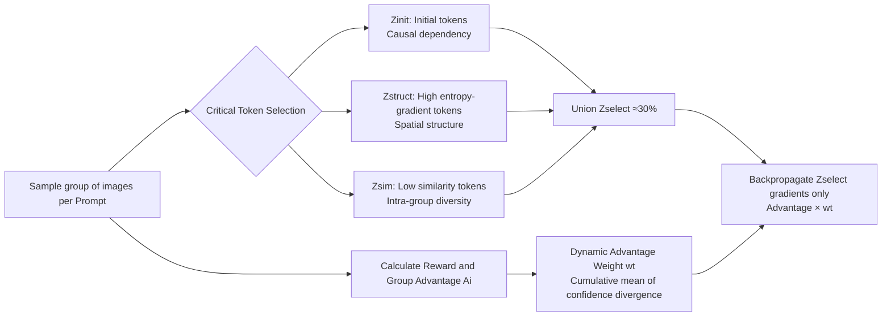

# Group Critical-token Policy Optimization for Autoregressive Image Generation

**Conference**: ICLR 2026  
**OpenReview**: [https://openreview.net/forum?id=hYMlDtplMf](https://openreview.net/forum?id=hYMlDtplMf)  
**Code**: [https://github.com/zghhui/GCPO](https://github.com/zghhui/GCPO)  
**Area**: Image Generation / Autoregressive Visual Generation / RLVR  
**Keywords**: Autoregressive Image Generation, GRPO, RLVR, Critical token, token-wise optimization, Text-to-Image  

## TL;DR
This paper proposes GCPO, which identifies truly "critical" tokens in autoregressive image generation from three perspectives: causal dependency, spatial structure of entropy gradients, and intra-group token diversity. By performing RLVR optimization on only 30% of these tokens with dynamic advantage weights, the method outperforms GRPO applied to the entire token sequence.

## Background & Motivation
- **Background**: RLVR (specifically GRPO) has been progressively introduced into autoregressive (AR) text-to-image generation. These methods improve preference alignment and controllability through visual CoT, reward design, and customized datasets, achieving significant progress.
- **Limitations of Prior Work**: Existing methods assume that "every image token contributes equally to the training objective," performing **uniform optimization** across the entire sequence. However, image tokens serve distinct roles—some determine global structure while others represent background or fine details. Treating all tokens equally wastes computation and dilutes critical gradient signals.
- **Key Challenge**: In LLM reasoning, prior work found that "fork tokens" (high-entropy logical connectors) dominate reasoning capabilities. However, due to **causal AR modeling** and **2D bidirectional image structures**, visual generation is more complex. Direct application of entropy-based token selection from LLMs is insufficient, as experiments show high/low entropy tokens do not consistently correspond to structure or background.
- **Goal**: Establish a set of critical token identification criteria tailored for AR visual generation and implement targeted token-wise optimization.
- **Core Idea**: **[Critical Token Selection + Dynamic Advantage Weighting]**. The union of critical tokens is identified from three complementary views (causal, entropy-gradient, and intra-group diversity). Confidence divergence between the policy and reference models is utilized as a token-wise exploration weight, backpropagating gradients only for critical tokens.

## Method

### Overall Architecture
GCPO inserts "token selection + weighting" steps into the standard GRPO pipeline. After sampling a group of images for each prompt and calculating rewards, a set of critical tokens $Z_{select}=Z_{init}\cup Z_{struct}\cup Z_{sim}$ is identified based on three criteria. A dynamic advantage weight $w_t$, based on confidence divergence, is calculated for each critical token. Finally, the GRPO objective uses an indicator function to retain only critical token gradients, scaled by the weight $w_t$.

### Key Designs

**1. Causal dependency for initial tokens: Early tokens are the foundation of global structure.** The causal attention in AR modeling allows early tokens to continuously influence all subsequent tokens. Through perturbation experiments (injecting noise at different positions), it was found that perturbing the first 58 tokens (indices 0~58) significantly alters global image structure, while perturbing middle tokens (indices 250~308) only affects local details. This proves that initial tokens serve as a "global prior and structural guide," leading to the selection of the first $K_{init}$ tokens as $Z_{init}$.

**2. Entropy gradients for structural tokens: The spatial gradient of entropy, rather than entropy itself, stably corresponds to structure.** Initial attempts using entropy alone (mimicking LLMs) showed instability across different prompts. By reshaping the entropy sequence into a 2D entropy map and observing its gradients, **high entropy-gradient tokens were found to consistently correspond to subject structures and region boundaries**, a correlation that strengthens during RL training. To suppress noise, local neighborhood averaging is applied: $\bar{H}_t=\text{mean}(H_t+H_t^{(l,u)}+H_t^{(u)}+H_t^{(r,u)}+H_t^{(l)})$. Central difference is then used to calculate gradients, and the top $K_{struct}$ tokens are selected as $Z_{struct}$.

**3. Intra-group diversity for token selection: Positions with low similarity carry effective reward information.** GRPO relies on variance between samples to guide optimization; highly similar samples provide limited information. At each sequence position $t$ across a group of $G$ images, the cosine similarity of token embeddings $S^{(t)}_{jk}=\frac{e_{t,j}\cdot e_{t,k}}{\lVert e_{t,j}\rVert\lVert e_{t,k}\rVert}$ is calculated and averaged as $\bar{S}_t$. Background textures exhibit high similarity and reflect few differences, whereas complex structural areas show low similarity and richer information. Thus, $K_{sim}$ tokens with the lowest $\bar{S}$ are selected as $Z_{sim}$. Each subset accounts for 10% of the sequence length, with the union being approximately 30%.

**4. Dynamic Advantage Weighting (DAW): Automatically adjusting exploration intensity via model divergence.** Different critical tokens require different exploration constraints. Initial tokens require restrained exploration to prevent structural collapse, while high entropy-gradient and low-similarity tokens should explore more boldly. The confidence divergence between the policy and reference models matches this distribution (low divergence for initial tokens, high for structural tokens) and evolves dynamically. Since position $t$ depends on preceding tokens, cumulative average divergence is used for the weight: $w_t=\frac{1}{t}\sum_{j=1}^{t}\text{clip}(C^{policy}_j-C^{ref}_j,-\epsilon_w,\epsilon_w)$, where $C$ represents log-probabilities and $\epsilon_w$ is a clip value to ensure stability. The final objective multiplies the GRPO term by the indicator $\mathbb{I}[z_t\in Z_{select}]$ and the weight $w_t$.

## Key Experimental Results

### Main Results Table (GenEval Overall)

| Model | Overall↑ | Counting↑ | Color↑ | Position↑ |
|:---|:---:|:---:|:---:|:---:|
| Janus-Pro-7B | 0.80 | 0.59 | 0.90 | 0.79 |
| Janus-Pro-7B + GRPO | 0.87 | 0.71 | 0.94 | 0.92 |
| **Janus-Pro-7B + GCPO** | **0.90** | **0.90** | 0.90 | **0.95** |
| Janus-Pro-1B + GRPO | 0.84 | 0.59 | 0.84 | 0.88 |
| **Janus-Pro-1B + GCPO** | **0.85** | 0.63 | 0.88 | 0.91 |
| LlamaGen + GRPO | 0.39 | 0.28 | 0.68 | 0.11 |
| **LlamaGen + GCPO** | **0.42** | 0.25 | 0.71 | 0.13 |

Using only 30% of tokens, GCPO consistently outperforms GRPO using 100% of tokens. For Janus-Pro-7B, the Counting task improvement is notably large (+0.19).

### Ablation Study Table (T2I-CompBench / DEQA / HPS)

| Init-T | HG-T | LS-T | DAW | GenEval↑ | Shape↑ | Texture↑ | Spatial↑ | HPS↑ |
|:--:|:--:|:--:|:--:|:---:|:---:|:---:|:---:|:---:|
| ✓ | - | - | - | 0.82 | 0.282 | 0.350 | 0.237 | 28.90 |
| - | ✓ | - | - | 0.81 | 0.271 | 0.337 | 0.226 | 28.22 |
| - | - | ✓ | - | 0.82 | 0.294 | 0.410 | 0.257 | 28.78 |
| ✓ | ✓ | ✓ | - | 0.83 | 0.292 | 0.399 | 0.294 | 29.33 |
| ✓ | ✓ | ✓ | ✓ | **0.85** | **0.320** | **0.480** | **0.322** | **29.61** |

The three critical token types are all essential; their union significantly outperforms any single type. All metrics reach optimum when DAW is applied.

### Key Findings
- **30% Critical Tokens > 70% Remaining Tokens**: While the "remaining tokens" are more numerous, training on them alone leads to a performance drop, emphasizing that selecting the right tokens is more important than token quantity.
- **Negligible Overhead**: GCPO increases training time by only about 1% compared to GRPO.
- **Selection Ratio Inflection Point**: Maximum gain (+2.81) is achieved at a 10% selection ratio for each category; gains diminish (+0.95) beyond this. Increasing the total ratio from 30% to 45% yields almost no gain, while decreasing to 15% causes significant degradation. Applying DAW to all tokens actually decreases performance.
- **Cross-Paradigm Portability**: The method extends from next-token to next-scale prediction paradigms (initial token importance translates to early scale importance).
- **Generalization**: On T2I-CompBench (which differs significantly from training distributions), improvements were observed in Shape (+0.117), Texture (+0.118), and Spatial (+0.134).

## Highlights & Insights
- **Migration of the "critical token" concept from LLM reasoning to AR visual generation**: The authors identify key differences and introduce the "2D spatial gradient of entropy" as a more precise proxy to solve the instability of entropy-structure mapping.
- **Three complementary perspectives with clear physical meanings**: Causal (temporal foundation), Entropy gradient (spatial structure), and Intra-group diversity (reward information density). These are orthogonal and validated as essential via ablation.
- **Elimination of manual parameter tuning via DAW**: Using confidence divergence between the policy and reference models naturally produces a distribution where initial tokens explore less and structural tokens explore more.
- **Win-win for efficiency and performance**: 30% tokens outperform the full-sequence baseline with virtually no extra time cost.

## Limitations & Future Work
- The fixed 10% ratio for each subset (total 30%) is an empirical setting. While supported by ablations, an adaptive selection mechanism is currently lacking.
- Selection relies on intermediate calculations like entropy maps and intra-group similarity; the approach is somewhat heuristic and lacks a deeper theoretical unified characterization of why these three specifically define "criticality."
- Primarily validated on rewards like GenEval/HPS and models like Janus-Pro/LlamaGen. Scalability to larger unified multimodal models or more complex rewards (e.g., fine-grained human preferences) remains to be examined.
- The performance drop when applying DAW to all tokens suggests a coupling between dynamic weighting and token selection that is not yet fully understood.

## Related Work & Insights
- **AR Visual Generation**: LlamaGen, Emu3, Show-o, Janus-Pro, and BAGEL use next-token paradigms for T2I, gradually unifying understanding and generation.
- **RL for Visual Generation**: SimpleAR validated that GRPO improves aesthetics and alignment. T2I-R1 jointly optimizes semantic and token-level CoT. This work builds on the GRPO framework but introduces token-level selection.
- **Critical Token RL in LLMs**: "Critical Tokens Matter," "ConfPO," and "fork token" works inspired the idea of optimizing only essential tokens. This paper generalizes the concept from 1D text to 2D causal image sequences.
- **Insight**: "Not all tokens deserve equal optimization" is a cross-modal insight. Using internal model signals (entropy gradients, intra-group diversity, confidence divergence) to identify critical units unsupervised provides a path to making RLVR more efficient and effective.

## Rating
- **Novelty**: ⭐⭐⭐⭐ — First systematic introduction of "critical token optimization" to AR visual generation, with a clear innovation in the combination of three-view selection, entropy-gradient proxies, and dynamic advantage weights.
- **Experimental Thoroughness**: ⭐⭐⭐⭐ — Covers multiple benchmarks (GenEval/T2I-CompBench/DrawBench/HPS) and three base models, with detailed ablations of each component and selection ratios.
- **Writing Quality**: ⭐⭐⭐⭐ — Clear chain of motivation-observation-methodology; visualizations (perturbation, entropy-gradient, similarity) strongly support the claims.
- **Value**: ⭐⭐⭐⭐ — Achieving better performance with 30% tokens and near-zero overhead provides direct value for the efficiency and effectiveness of RLVR T2I training.

<!-- RELATED:START -->

## Related Papers

- [\[CVPR 2026\] MaskFocus: Focusing Policy Optimization on Critical Steps for Masked Image Generation](../../CVPR2026/image_generation/maskfocus_focusing_policy_optimization_on_critical_steps_for_masked_image_genera.md)
- [\[CVPR 2026\] Curriculum Group Policy Optimization: Adaptive Sampling for Unleashing the Potential of Text-to-Image Generation](../../CVPR2026/image_generation/curriculum_group_policy_optimization_adaptive_sampling_for_unleashing_the_potent.md)
- [\[ICLR 2026\] Hyperspherical Latents Improve Continuous-Token Autoregressive Generation](hyperspherical_latents_improve_continuous-token_autoregressive_generation.md)
- [\[ICLR 2026\] NextStep-1: Toward Autoregressive Image Generation with Continuous Tokens at Scale](nextstep-1_toward_autoregressive_image_generation_with_continuous_tokens_at_scal.md)
- [\[ICLR 2026\] PCPO: Proportionate Credit Policy Optimization for Preference Alignment of Image Generation Models](pcpo_proportionate_credit_policy_optimization_for_preference_alignment_of_image_.md)

<!-- RELATED:END -->
