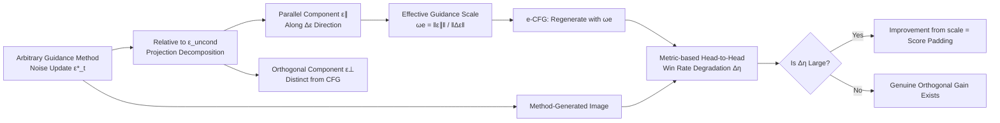

# Guidance Matters: Rethinking the Evaluation Pitfall for Text-to-Image Generation

**Conference**: ICLR 2026  
**OpenReview**: [https://openreview.net/forum?id=T9xcbgFD3k](https://openreview.net/forum?id=T9xcbgFD3k)  
**Code**: [https://github.com/Maxwells-Demons/Guidance-Matters](https://github.com/Maxwells-Demons/Guidance-Matters)  
**Area**: image_generation / diffusion guidance / evaluation methodology  
**Keywords**: Classifier-Free Guidance, human preference models, evaluation bias, effective guidance scale, diffusion sampling  

## TL;DR
This paper exposes a neglected evaluation pitfall: human preference metrics such as HPSv2 and ImageReward exhibit a strong preference for large guidance scales, allowing scores to be inflated by simply increasing CFG. The authors propose the GA-Eval framework with "effective guidance scale calibration" for fair comparisons, revealing that the "improvements" claimed by eight recent diffusion guidance methods are largely dividends of increased effective guidance scales.

## Background & Motivation
- **Background**: Text-to-image generation quality increasingly relies on reward models fine-tuned on human preferences (e.g., HPS v2, PickScore, ImageReward). These have become the de facto standards for evaluating new guidance methods (SAG, PAG, SEG, CFG++, FreeU, APG, Z-Sampling, etc.), as they are considered closer to human aesthetics than IS, FID, or CLIPScore.
- **Limitations of Prior Work**: Humans naturally prefer images with intense, vibrant colors, which are induced by large guidance scales. This correlation leads human preference models to exhibit a systematic bias toward high guidance scales—**even when images are over-saturated, contain artifacts, or suffer from obvious quality degradation, the scores continue to rise** (e.g., HPSv2 for SDXL continues increasing as $\omega$ moves from 5.5 to 20 in Figure 1).
- **Key Challenge**: Do the "improvements" reported by new guidance methods represent genuine enhancements in generation quality, or are they simply implicitly increasing the effective guidance strength to exploit biased metrics? Existing evaluation paradigms cannot distinguish between these two sources.
- **Goal**: Decouple the "parallel enhancement effect" (equivalent to amplifying guidance scale) from the "orthogonal effect" (genuine novelty distinct from CFG) relative to standard CFG. Perform fair comparisons at the same effective guidance strength to quantify how much of a method's gain is "hacked."
- **Key Insight**: **Examine bias using bias**—since metrics favor large guidance scales, every method can be mapped to an equivalent CFG scale (e-CFG). Standard CFG is then used to regenerate images at that same strength for a win-rate comparison. A significant drop in win rate indicates that the method is primarily exploiting the large guidance scale dividend.

## Method

### Overall Architecture
Rather than proposing a better generation method, the paper builds an evaluation system for **exposure, calibration, and falsification**. It empirically demonstrates the bias of human preference metrics toward large guidance scales, decomposes the noise update of any guidance method into "parallel" and "orthogonal" components, calculates the effective guidance scale $\omega_e$ from the parallel component, and finally compares the original method against the $\omega_e$-calibrated e-CFG to observe the win rate degradation $\Delta\eta$. A dummy method, TDG, is designed to generate high scores without quality improvement to confirm the trap's existence.

### Key Designs
**1. Empirical Reveal of Bias: Metrics Blinded by High Saturation.** The paper systematically sweeps various metrics in the range $\omega \in [5.5, 20]$ (Fig. 3, SDXL + Pick-a-Pic). Except for AES and PickScore, HPSv2, ImageReward, and CLIPScore monotonically increase as the guidance scale grows. The mechanism is that large guidance scales push the predicted noise $\tilde{\epsilon}_t$ more strongly toward the conditional noise $\epsilon^{cond}_t$, enhancing semantic alignment but causing over-saturation. CLIP-based metrics equate "alignment" with quality, while reward models fine-tuned on human data are tricked by high-saturation results present in their training distributions.

**2. Effective Guidance Scale $\omega_e$: Mapping Arbitrary Methods Back to CFG Strength.** The standard CFG update is $\tilde{\epsilon}_t = \epsilon^{uncond}_t + \omega(\epsilon^{cond}_t - \epsilon^{uncond}_t)$. The guidance scale can be expressed as $\omega = \frac{\tilde{\epsilon}_t - \epsilon^{uncond}_t}{\Delta\epsilon}$, where $\Delta\epsilon = \epsilon^{cond}_t - \epsilon^{uncond}_t$. For any guidance method, the update $\tilde{\epsilon}^*_t - \epsilon^{uncond}_t$ can be orthogonally decomposed along $\Delta\epsilon$ into a parallel component $\epsilon^{\parallel}_t = \frac{\langle \tilde{\epsilon}^*_t - \epsilon^{uncond}_t,\ \Delta\epsilon\rangle}{\langle \Delta\epsilon, \Delta\epsilon\rangle}\Delta\epsilon$ and an orthogonal component $\epsilon^{\perp}_t$. The parallel component is equivalent to "enhancement along the CFG direction." Thus, the per-step effective guidance scale is $\omega^e_t = \frac{\|\epsilon^{\parallel}_t\|}{\|\Delta\epsilon\|}$, and the constant calibrated scale for the method is defined as the average along the sampling path $\omega_e = \frac{1}{T}\sum_t \omega^e_t$. Methods modifying sampling at the latent level (e.g., Z-Sampling, CFG++) are handled by back-calculating equivalent noise updates via DDIM: $\tilde{\epsilon}^*_t = \frac{\sqrt{\alpha_t}x_{t-1} - \sqrt{\alpha_{t-1}}x_t}{\sqrt{\alpha_t\beta_{t-1}} - \sqrt{\alpha_{t-1}\beta_t}}$.

**3. GA-Eval Win Rate Degradation $\Delta\eta$: Fair Comparison at Equal Effective Strength.** Given $\omega_e$, standard CFG is used to generate e-CFG images. These are compared head-to-head against the original method's images using metric $M$ per prompt. Let the win rate relative to standard CFG be $\eta^{CFG}$ and the win rate relative to e-CFG be $\eta^{e\text{-}CFG}$. The diagnostic value is $\Delta\eta = \eta^{CFG} - \eta^{e\text{-}CFG}$. If a method's lead over the original CFG vanishes when CFG is also run at the same effective strength (high $\Delta\eta$), its improvement comes from exploiting the guidance scale rather than innovation.

**4. TDG—Designing a "High-Scoring but Useless" Method.** To confirm the trap can be abused, the authors design Transcendent Diffusion Guidance (TDG). It randomly replaces tokens in the prompt $c$ with null tokens $\varnothing$ to obtain a weakened prompt $c^*$, then combines the weak conditional score $\epsilon^{weak}$, $\epsilon^{cond}$, and $\epsilon^{uncond}$ during sampling with zero additional training. TDG significantly inflates HPSv2 scores in traditional frameworks but is exposed by GA-Eval (high $\Delta\eta$), proving that "inflating human preference scores" and "improving quality" are decoupled.

## Key Experimental Results
Models evaluated include SD-XL, SD-2.1, SD-3.5, and DiT-XL/2. Datasets include Pick-a-Pic (100), DrawBench (200), HPD (3200), GenEval (553), and COCO-30K / ImageNet-50K for FID/IS. Metrics include HPSv2, AES, PickScore, ImageReward, and CLIPScore.

### Main Results: Win Rates and Degradation of Eight Methods on SD-XL (Average $\eta$ and $\omega_e$)

| Method | Pick-a-Pic Avg η (CFG/e-CFG) | ωe | DrawBench Avg η (CFG/e-CFG) | ωe |
|---|---|---|---|---|
| Z-Sampling | 73% / 69% | 13.51 | 74% / 60% | 11.94 |
| CFG++ | 61% / 58% | 8.91 | 61% / 51% | 8.89 |
| SAG | 60% / 52% | 8.14 | 59% / 52% | 7.42 |
| TDG (Hacking) | 57% / 48% | 8.27 | 58% / 52% | 8.24 |
| SEG | 52% / 47% | 6.10 | 52% / 51% | 6.13 |
| PAG | 52% / 45% | 5.98 | 53% / 53% | 6.04 |
| FreeU | 46% / 40% | 7.47 | 47% / 43% | — |
| APG | 41% / 38% | 15.05 | — | — |

> Standard $\omega=5.5$. Most methods have $\omega_e$ significantly larger than $\omega$ (e.g., Z-Sampling 13.51, APG 15.05), indicating implicit amplification. When CFG matches this strength, almost all methods' win rates drop to near or below 50%.

### Ablation Study

| Phenomenon | Evidence |
|---|---|
| Metric Bias Direction | HPSv2/ImageReward/CLIPScore increase monotonically with $\omega$; **AES and PickScore decrease** (Fig. 3). |
| Negative $\Delta\eta$ in AES | AES gives lower scores to large guidance scales for multiple methods, reversing the bias of human preference metrics. |
| TDG Validation | TDG inflates scores in traditional frameworks but shows significant degradation in GA-Eval. |

### Key Findings
- **Increasing CFG alone matches most guidance methods**: e-CFG achieves visual "improvements" comparable to recent methods (Fig. 2).
- **Nearly all methods exhibit severe win rate degradation**, except Z-Sampling, which maintains a high win rate after calibration, suggesting it contains significant orthogonal gains. APG even performs worse than standard CFG (as it suppresses over-saturation and is thus "discriminated" against by preference metrics).
- Different metrics have inherent biases; relying on a single human preference score is highly misleading.

## Highlights & Insights
- **Clever logic of "testing bias with bias"**: No new unbiased metric is needed. By comparing win rate degradation at equal effective guidance strength, "scale hacking" is separated from "genuine innovation." This is plug-and-play for almost any guidance method.
- **Computable $\omega_e$ via projection decomposition**: Transforms "how much CFG strength this method is equivalent to" into a scalar with a closed-form expression. The use of DDIM inversion unifies noise-based and latent-based methods.
- **Strong falsification with TDG**: Creating a useless method that inflates scores directly proves the trap's existence, warning the community that "score increases $\neq$ method effectiveness."
- **Insight into APG's "discrimination"**: Methods designed to reduce saturation (closer to human visual comfort) are penalized by current metrics, indicating that the evaluation paradigm is incorrectly incentivizing research directions.

## Limitations & Future Work
- The paper is stronger at "falsification" than "constructive replacement": it reveals the trap and provides diagnostic tools but does not propose a new metric free from scale bias.
- $\omega_e$ collapses a method's parallel enhancement into a single constant CFG scale, potentially losing information for methods with time-varying or spatially adaptive guidance.
- Evaluations are focused on the SD series and DiT; verification on newer flow-matching or rectified flow architectures is needed.
- The nature of "orthogonal gains" in the $\epsilon^{\perp}$ component requires further qualitative analysis beyond win rates.

## Related Work & Insights
- **CFG and its Genealogy**: SAG/PAG/SEG (weak conditions/attention perturbation), CFG++ (off-manifold issues), FreeU (U-Net feature amplification), Z-Sampling/W2SD (guidance as denoising-inversion difference), and APG (projection for anti-saturation) are unified under the $\omega_e$ scale.
- **Evaluation Metrics**: Tracks the evolution from IS/FID/CLIPScore to preference models like HPSv2/PickScore. This paper is the first to systematically signal the large-scale bias in the latter.
- **Insights**: Any field relying on learned preference models for benchmarks (image, video, 3D generation, or LLM alignment) should be cautious. When metrics correlate highly with easily tunable hyperparameters, benchmarking may simply be fitting metric blind spots. Researchers should report de-saturation/anti-hacking metrics and perform comparisons at the same "effective strength."

## Rating
- Novelty: ⭐⭐⭐⭐⭐ High. Transforms a vague intuition into a computable $\omega_e$ + $\Delta\eta$ diagnostic, delivering a significant critique to the guidance method community.
- Experimental Thoroughness: ⭐⭐⭐⭐ Solid coverage across 4 models, 6 datasets, and multiple metrics. Could benefit from human subjective studies for validation.
- Writing Quality: ⭐⭐⭐⭐ Clear logic and powerful visuals (Figs 1/2/3).
- Value: ⭐⭐⭐⭐⭐ Directly addresses score-padding in T2I generation and provides a reusable tool for fair comparison, likely influencing future evaluation standards.

<!-- RELATED:START -->

## Related Papers

- [\[ICLR 2026\] Routing Matters in MoE: Scaling Diffusion Transformers with Explicit Routing Guidance](routing_matters_in_moe_scaling_diffusion_transformers_with_explicit_routing_guid.md)
- [\[ICLR 2026\] Rethinking Global Text Conditioning in Diffusion Transformers](rethinking_global_text_conditioning_in_diffusion_transformers.md)
- [\[CVPR 2026\] GenColorBench: A Color Evaluation Benchmark for Text-to-Image Generation](../../CVPR2026/image_generation/gencolorbench_a_color_evaluation_benchmark_for_text-to-image_generation.md)
- [\[CVPR 2026\] Self-Evaluation Unlocks Any-Step Text-to-Image Generation](../../CVPR2026/image_generation/self-evaluation_unlocks_any-step_text-to-image_generation.md)
- [\[ICLR 2026\] Factuality Matters: When Image Generation and Editing Meet Structured Visuals](factuality_matters_when_image_generation_and_editing_meet_structured_visuals.md)

<!-- RELATED:END -->
