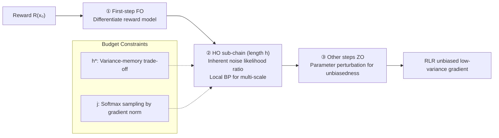

# Half-order Fine-Tuning for Diffusion Model: A Recursive Likelihood Ratio Optimizer

**Conference**: ICLR 2026  
**OpenReview**: [https://openreview.net/forum?id=AZ6lqcvHLX](https://openreview.net/forum?id=AZ6lqcvHLX)  
**Code**: [https://github.com/RTkenny/RLR-Optimizer](https://github.com/RTkenny/RLR-Optimizer)  
**Area**: Image Generation / Diffusion Model Fine-Tuning / Gradient Estimation  
**Keywords**: Diffusion Model Alignment, Likelihood Ratio Gradient Estimation, Half-order Optimization, Reward Fine-Tuning, Unbiased Low-variance  

## TL;DR
This paper introduces the **Recursive Likelihood Ratio (RLR)** optimizer, which unifies gradient estimation for each step of the diffusion chain into a design space of "First-Order (FO) + Half-Order (HO) + Zero-Order (ZO)". By leveraging the inherent stochastic noise of diffusion models for likelihood ratio estimation, RLR achieves an **unbiased, low-variance, and memory-controllable** gradient estimator for fine-tuning, simultaneously addressing the structural bias of truncated BP and the high variance of Reinforcement Learning (RL).

## Background & Motivation
- **Background**: Diffusion Models (DM) are the mainstream framework for high-fidelity visual generation. However, post-training fine-tuning is required to align pre-trained models with downstream preferences (aesthetics, human preference rewards, etc.). The core challenge lie in computing the gradient of rewards with respect to parameters across a recursive denoising chain ($T$ steps with a shared backbone).
- **Limitations of Prior Work**: Two main approaches exist, both with significant drawbacks. ① **Full Backpropagation (full BP)** is theoretically precise but memory consumption explodes with the number of steps and model size—running full BP for SD 1.4 with batch=1 and 50 steps requires approximately **1TB VRAM**, which is impractical. ② **Truncated BP** (e.g., AlignProp, VADER) saves memory by backpropagating only through the last $T'$ steps but introduces **structural bias**, losing multi-scale information from early steps and leading to **model collapse** (generation degrades into pure noise, see Figure 3). ③ **Reinforcement Learning (RL, e.g., DDPO)** does not rely on differentiable connections between steps and is memory-efficient, but the gradient estimates have **extremely high variance**, leading to low sample efficiency and slow convergence.
- **Key Challenge**: Truncated BP trades memory for **bias**, while RL trades memory for **variance**. It is difficult to simultaneously achieve "unbiased + low-variance + memory-controllable" estimation.
- **Goal**: Construct an **unbiased gradient estimator with minimal variance** under a given computational and memory budget.
- **Core Idea**: **Use the "inherent noise" of the diffusion model itself instead of external perturbations for likelihood ratio estimation.** The entire chain is decomposed into a flexible combination of step-wise estimation strategies: FO for the first step to pass through the reward model, "Half-Order" for a local BP sub-chain to capture multi-scale information, and ZO for the remaining steps to ensure unbiasedness. It is termed **Half-Order (HO)** because it requires perturbations (like ZO) but retains a local BP segment (like FO).

## Method

### Overall Architecture
RLR views the gradient estimation for each step of the diffusion chain as an **optional strategy design space** $\mathcal{G}_{full}$: each step can choose FO (exact BP), HO (likelihood ratio + local BP), or ZO (parameter perturbation). In the optimization problem of "minimizing variance under unbiasedness and budget constraints," the design space converges to a specific configuration: **First step FO connected to the reward model → An HO sub-chain of length $h$ starting from a random point $j$ → ZO for all other steps**. This leaves two decision variables—sub-chain length $h$ and starting point $j$, determined by variance-memory trade-offs and gradient norm importance sampling, respectively.

The fine-tuning objective is to maximize the expected reward $\max_\theta \mathbb{E}[R(x_0)] = \mathbb{E}_{z_{1:T}}[R(\phi_{1:T}(x_T, z_{1:T}; \theta))]$, where $x_{t-1} = \phi_t(x_t, z_t; \theta)$ is the single-step denoising mapping with noise $z_t = \sigma_t \epsilon_t$.

### Key Designs

**1. Unified design space composed of three types of estimators.** The paper moves beyond the "BP vs RL" binary, noting that each timestep can independently select one of three strategies: FO uses exact backpropagation (minimum variance, maximum memory); ZO directly adds perturbations to parameters $\phi_t(x_t; \theta + \sigma_t\epsilon_t)$ and estimates via function values $\frac{R(\cdot)}{\sigma_t}\epsilon_t$ (minimum memory, maximum variance); the proposed HO utilizes the **inherent noise $z_t$** (rather than external perturbations) with the likelihood ratio trick to provide an estimate of the form $R(x_0)\cdot D_\theta^\top \phi_{t:t+h-1}\cdot \nabla\log f(z_t)$, where $D_\theta\phi_{t:t+h-1}$ is the Jacobian of a local sub-chain of length $h$. A key insight is that **RL is a special case of HO where $h=1$**. All three are unbiased, forming a continuous spectrum of variance/memory (FO < HO < ZO, Table 1).

**2. Structured RLR estimator: Splicing FO + HO sub-chain + ZO.** To make the problem tractable, two structural constraints are applied: HO steps must form a continuous sub-chain (fragmentation increases variance), and FO must directly connect to the reward model. The complete estimator is written as the sum of three terms:
$$G = \underbrace{D_\theta^\top \phi(x_1, z_1; \theta)\frac{dR(x_0)}{dx_0}}_{\text{First-step FO}} - \underbrace{R(x_0)D_\theta^\top \phi_{j:j+h}\nabla_z\ln f(z_j)}_{h\text{-step HO}} - \underbrace{\sum_{i\in C} R(x_0)\nabla_z\ln f(z_i)}_{\text{ZO}}$$
The first term allows gradients to pass accurately through the reward model; the HO term uses inherent perturbation $z_j$ to open a local $h$-step BP chain to **capture visual information at a specific scale**; the ZO term handles the remaining steps $C=\{1,\dots,T\}\setminus\{j,\dots,j+h\}$ by injecting noise into parameters, requiring no latent variable caching and minimal memory. The combination is **globally unbiased** and compresses expensive full BP into a short segment.

**3. Solving for $h$ and $j$: Variance-memory trade-off + Importance sampling.** The sub-chain length $h$ is solved by optimizing a proxy for the estimator's variance upper bound under the memory budget $B_h h + B_z(T-1-h)\le B$, yielding $h^* = \min\{\lfloor\frac{B-B_z(T-1)}{B_h-B_z}\rfloor, \lfloor\frac{TV_z}{2(V_z-V_h)}-1\rfloor\}$. Since HO/FO variance $V_h$ is significantly smaller than ZO variance $V_z$, the memory budget usually determines $h$ (recommending $h=2$ for 30–40GB budgets). The starting point $j$ uses **gradient norms to measure step importance**, sampled from $j\sim\text{CAT}(\text{Softmax}(\|g_1\|,\dots,\|g_{T-h}\|))$, ensuring the HO sub-chain targets steps with the richest gradient information.

**4. Diffusive Chain-of-Thought (DCoT): Multi-scale prompting synergistic with RLR.** Leveraging the "coarse-to-fine" nature of diffusion, the chain is divided into coarse/mid/fine segments. ChatGPT is used to split the original prompt into multi-level prompts corresponding to these scales. When a specific scale is deficient (e.g., hand generation), the **HO sub-chain sampling is constrained to that scale's interval** $j\sim U(a,b)$, concentrating low-variance unbiased gradients on the problematic scale.

## Key Experimental Results

### Main Results: Text2Image Reward Scores (Table 2, Excerpts)

| Model | Method | PickScore | HPSv2 | AES | ImageReward |
|------|------|-----------|-------|-----|-------------|
| SD1.4 | Base | 16.19 | 22.08 | 4.42 | 32.90 |
| SD1.4 | DDPO (RL) | 17.53 | 22.79 | 5.52 | 52.06 |
| SD1.4 | AlignProp (Truncated BP) | 19.17 | 27.02 | 6.02 | 67.18 |
| SD1.4 | **RLR** | **21.38** | **29.22** | **6.65** | **76.55** |
| SD2.1 | Base | 16.25 | 23.32 | 4.57 | 36.03 |
| SD2.1 | **RLR** | **23.22** | **30.98** | **6.74** | **83.07** |

RLR **outperforms** RL and truncated BP baselines across multiple DMs and reward models.

### Main Results: Text2Video (VBench, Table 3, Excerpts)

| Method | Dynamic Degree (DD) | Aesthetic Quality (AQ) | Weighted Average |
|------|-----------|---------|----------|
| VADER (Truncated BP) | 66.94 | 66.04 | 83.45 |
| DDPO (RL) | 58.29 | 59.23 | 80.78 |
| **RLR** | **70.69** | **66.15** | **84.63** |

RLR leads significantly in DD and AQ, achieving the best weighted average, even surpassing some closed-source API models.

### Ablation Study (Table 5, SD1.4 + HPD v2)

| Variant | PickScore | HPSv2 | AES | ImageReward |
|------|-----------|-------|-----|-------------|
| RLR w/o HO & ZO (Single-step BP) | 18.43 | 23.66 | 5.78 | 60.07 |
| RLR w/o ZO (Biased) | 20.11 | 27.07 | 6.23 | 68.35 |
| RLR w/o HO (Unbiased, no multi-scale) | 19.28 | 26.70 | 5.92 | 63.85 |
| **RLR (Full)** | **21.38** | **29.22** | **6.65** | **76.55** |

### Key Findings
- **Sample Efficiency**: DDPO converges slowly due to high variance. AlignProp matches RLR early on but collapses later. Only **RLR provides sustained reward improvement**.
- **Importance of Unbiasedness**: The "w/o ZO" (biased) variant performs worse than the full RLR, suggesting total unbiasedness is more critical than just adding HO.
- **Scaling $h$**: Variance decreases as $h$ increases but with diminishing returns, while memory and time costs grow linearly or faster. $h=2$ is sufficient in practice.

## Highlights & Insights
- **Unified Perspective**: Integrating BP, RL, and ZO into a "FO/HO/ZO combination" design space is a strong theoretical unification.
- **Inherent Noise Utilization**: Using existing noise $z_t$ for likelihood ratio estimation provides unbiased gradients with nearly zero additional cost.
- **Theoretical Completeness**: Formal explanations (including structural bias propositions and convergence proofs) clarify why RLR avoids the collapse seen in truncated BP.
- **Practicality**: Closed-form solutions for $h$ and importance sampling for $j$ make the method robust and reduce 1TB memory requirements to the 30–40GB range.

## Limitations & Future Work
- Optimal selection of $h$ and $j$ relies on proxy variance estimates and assumptions (e.g., $V_h \ll V_z$), which may require verification in extreme configurations.
- Experiments focus on older backbones (SD 1.4/2.1, VideoCrafter). Transferability to SDXL, DiT, or Flow Matching architectures is not yet fully explored.
- DCoT depends on manual or LLM-generated prompts and manual scale interval targeting, which limits automation for large-scale deployment.
- Dependence on an external reward model means that existing reward biases and "reward hacking" issues remain unaddressed.

## Related Work & Insights
- **Truncated BP Route** (AlignProp, VADER, DRaFT): Efficient but biased; the paper visually and theoretically demonstrates their collapse.
- **RL Route** (DDPO, DPO variants): Unbiased but high variance; RLR proves RL is a degenerate special case of HO.
- **Zero-Order/Forward Learning**: RLR "localizes" likelihood ratio techniques into an HO sub-chain, successfully porting classic stochastic optimization to diffusion chains.
- **Insight**: Framing gradient estimation as "step-wise strategy selection + variance minimization under budget" is applicable to any **long recursive sequence** (e.g., autoregressive RL, long video diffusion).

## Rating
- **Novelty**: ⭐⭐⭐⭐⭐ Proposed the HO estimator and unified FO/HO/ZO design space, formalizing fine-tuning as a constrained variance minimization problem.
- **Experimental Thoroughness**: ⭐⭐⭐⭐ Covers T2I and T2Video across multiple rewards; includes efficiency and ablation studies, though backbones are slightly dated.
- **Writing Quality**: ⭐⭐⭐⭐ Clear motivation and logical progression; formulas are dense but well-supported by figures.
- **Value**: ⭐⭐⭐⭐⭐ Solves both truncated BP bias and RL high variance, making full-chain fine-tuning feasible on consumer-grade hardware.

<!-- RELATED:START -->

## Related Papers

- [\[ICCV 2025\] ShortFT: Diffusion Model Alignment via Shortcut-based Fine-Tuning](../../ICCV2025/image_generation/shortft_diffusion_model_alignment_via_shortcut-based_fine-tuning.md)
- [\[ICLR 2026\] Any-step Generation via N-th Order Recursive Consistent Velocity Field Estimation](any-step_generation_via_n-th_order_recursive_consistent_velocity_field_estimatio.md)
- [\[ICLR 2026\] Diffusion Fine-Tuning via Reparameterized Policy Gradient of the Soft Q-Function](diffusion_fine-tuning_via_reparameterized_policy_gradient_of_the_soft_q-function.md)
- [\[ECCV 2024\] Memory-Efficient Fine-Tuning for Quantized Diffusion Model](../../ECCV2024/image_generation/memory-efficient_fine-tuning_for_quantized_diffusion_model.md)
- [\[ICLR 2026\] Quantization-Aware Diffusion Models for Maximum Likelihood Training](quantization-aware_diffusion_models_for_maximum_likelihood_training.md)

<!-- RELATED:END -->
