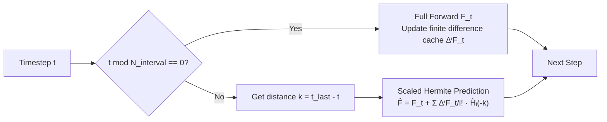

# HiCache: A Plug-in Scaled-Hermite Upgrade for Taylor-Style Cache-then-Forecast Diffusion Acceleration

**Conference**: ICLR 2026  
**OpenReview**: [https://openreview.net/forum?id=faYbbo1KsQ](https://openreview.net/forum?id=faYbbo1KsQ)  
**Code**: [https://github.com/fenglang918/HiCache](https://github.com/fenglang918/HiCache)  
**Area**: Diffusion Acceleration / Feature Caching  
**Keywords**: Diffusion Acceleration, Feature Caching, Hermite Polynomials, Training-free, Diffusion Transformer  

## TL;DR
HiCache discovers that the finite difference approximations of DiT features follow a multivariate Gaussian distribution. Based on this, it replaces the monomial Taylor basis in TaylorSeer with "Scaled Hermite Polynomials" and uses dual scaling to ensure numerical stability. It achieves a 5.55× speedup on FLUX.1-dev with image quality surpassing the original model, while offering a plug-and-play upgrade to existing caching methods with zero extra FLOPs.

## Background & Motivation
- **Background**: Iterative sampling of diffusion models is computationally expensive, making training-free feature caching a popular acceleration tool. Early methods (DeepCache, FORA, ToCa, ClusCa) belong to the "cache-then-reuse" paradigm, which directly uses features from adjacent timesteps. Recently, TaylorSeer proposed "cache-then-forecast," using Taylor series to extrapolate future features, significantly reducing caching errors.
- **Limitations of Prior Work**: Standard monomial bases in Taylor series are monotonically increasing. They fail to capture complex **non-monotonic dynamics with inflection points** in diffusion feature trajectories. Figure 2 shows that Taylor extrapolation deviates significantly at trajectory turning points, with errors diverging rapidly as prediction steps and orders increase (Proposition 1: error is $O(k^{m+1}/(m+1)!)$, and the supremum at inflection points can be arbitrarily large).
- **Key Challenge**: The mismatch between mathematical tools (monotonic polynomials) and empirical properties (non-monotonic feature trajectories) limits the maximum achievable speedup ratio before quality degrades.
- **Goal**: Find a prediction basis aligned with the intrinsic statistical properties of feature dynamics to push "cache-then-forecast" to higher speedups while maintaining quality, without training or significant computational overhead.
- **Core Idea**: **[Empirical Observation → Theoretical Basis Selection]** Empirical tests reveal that the derivative approximations of DiT features consistently present a multivariate Gaussian distribution. According to approximation theory, Hermite polynomials are the (potentially) optimal orthogonal basis for Gaussian-related processes. Therefore, the monomial basis is replaced with a scaled Hermite basis.

## Method

### Overall Architecture
HiCache maintains the "periodic full computation + intermediate step extrapolation" framework of TaylorSeer: a full forward pass is performed every $N_{interval}$ steps to update finite difference caches $\{\Delta^i F_t\}$, while other steps are extrapolated by the predictor. The only modification is replacing the monomial basis $(-k)^i$ in the extrapolation formula with the scaled Hermite basis $\tilde H_i(-k)$—keeping the same predictor form and computational structure with only a few scalar evaluations and no extra matrix multiplications.

### Key Designs
**1. Gaussian Discovery: Why Hermite instead of other bases.** The foundation of this method is a dual empirical and theoretical argument. Empirically (Proposition 2), the feature difference $\Delta F_t = F(x_t,t) - F(x_{t-\Delta}, t-\Delta)$ achieves conditional Gaussianity $\Delta F_t \approx \mathcal{N}(\mu_t, \Sigma_t)$ through local linearization, which then converges to Gaussian via the Central Limit Theorem (Berry-Esseen bound $O(\eta_t)$) after aggregation by network components. Theoretically (Corollary 1), when temporal correlation can be approximated by a Gaussian kernel $K(s,t)=\exp(-(s-t)^2/2\tau^2)$, the eigenfunctions of its Karhunen-Loève expansion are precisely the scaled Hermite functions—meaning Hermite is the optimal orthogonal basis in the weighted $L^2(\gamma)$ sense. This elevates the "basis change" from an empirical trick to a choice based on approximation theory.

**2. Scaled Hermite Basis: Trading monotonicity for oscillation.** Standard Hermite polynomials $H_n(x)=(-1)^n e^{x^2}\frac{d^n}{dx^n}e^{-x^2}$ satisfy the recursion $H_{n+1}(x)=2xH_n(x)-2nH_{n-1}(x)$. Unlike the monotonically increasing Taylor basis, they are **oscillatory**, which naturally fits inflection points in feature trajectories and provides implicit regularization. However, Hermite polynomials are numerically unstable for large arguments. The paper introduces a contraction factor $\sigma\in(0,1)$ to define the scaled version $\tilde H_n(x)=\sigma^n H_n(\sigma x)$. The final predictor is:
$$\hat F^{HiCache}_{t-k} = F_t + \sum_{i=1}^{N_{order}} \frac{\Delta^i F_t}{i!}\,\tilde H_i(-k)$$

**3. Dual Scaling: One hyperparameter addressing two types of divergence.** The contraction factor $\sigma$ serves as a dual stabilizer: input scaling $\sigma x$ constrains the prediction within a stable oscillatory range, while coefficient scaling $\sigma^n$ suppresses the exponential growth of high-order terms. The error bound $\|E_{total}\| \le O\!\big((\sigma\sqrt 2|\Delta s|)^{N+1}/\sqrt{(N+1)!}\big) + O(\Delta t_{hist}\sqrt N) + O(\epsilon_{machine})$ shows that when $\sigma\sqrt 2|\Delta s|<1$, the Hermite truncation error can be smaller than that of Taylor due to the $\sigma^{N+1}$ suppression. This dual scaling mechanism can also be applied **independently** to TaylorSeer to yield gains (Hi-Taylor in ablations).

**4. Plug-and-play: Zero-cost upgrade for existing caching frameworks.** Since it only moves basis functions without changing the predictor form or computation graph, HiCache is a model-agnostic, training-free drop-in replacement. It can be embedded directly into any Taylor-style "cache-then-forecast" pipeline (TaylorSeer, ClusCa, etc.), with computational overhead limited to a few scalar evaluations per step.

## Key Experimental Results
The experiments cover four types of tasks: Text-to-Image (FLUX.1-dev), Text-to-Video (HunyuanVideo), Class-conditional generation (DiT-XL/2), and Super-resolution (Inf-DiT).

### Main Results (FLUX.1-dev Text-to-Image, 5.55× Speedup)

| Method | Speed (FLOPs) ↑ | ImageReward ↑ | PSNR ↑ | LPIPS ↓ |
|---|---|---|---|---|
| FLUX.1-dev 50 steps (Baseline) | 1.00× | 0.9872 | ∞ | 0.0000 |
| FORA (N=7) | 5.55× | 0.7418 | 28.32 | 0.5409 |
| ClusCa (N=7) | 5.52× | 0.9480 | 28.63 | 0.4560 |
| TaylorSeer (N=7,O=2) | 5.55× | 0.9572 | 28.63 | 0.4520 |
| **Hi-ClusCa** (N=7) | 5.52× | 0.9840 | 28.94 | 0.4040 |
| **HiCache** (N=7,O=2,σ=0.5) | 5.55× | **0.9979** | 28.94 | 0.3982 |

At 5.55× speedup, HiCache's ImageReward (0.9979) even **exceeds the unaccelerated baseline** (0.9872). Replacing the Taylor predictor in ClusCa with Hermite (Hi-ClusCa) increases its ImageReward from 0.9480 to 0.9840 with zero extra FLOPs.

### Ablation Study (FLUX.1-dev, σ and Dual Scaling)

| Configuration | Speed | ImageReward ↑ | LPIPS ↓ |
|---|---|---|---|
| HiCache σ=0.4 | 5.55× | 0.9683 | 0.3914 |
| **HiCache σ=0.5** | 5.55× | **0.9979** | 0.3982 |
| HiCache σ=0.7 | 5.55× | 0.9623 | 0.4479 |
| HiCache σ=1.0 (No contraction) | 5.55× | 0.7586 | 0.7208 |
| Hi-Taylor σ=0.5 | 5.55× | 0.9624 | 0.3998 |
| TaylorSeer (N=7) | 5.55× | 0.9572 | 0.4520 |

### Key Findings
- **Contraction factor is crucial**: With σ=1.0 (original Hermite without scaling), ImageReward drops to 0.7586, confirming the numerical instability of Hermite at large arguments; σ=0.5 is the sweet spot.
- **Dual scaling provides independent gains**: Hi-Taylor (adding dual scaling to TaylorSeer without changing the basis) increases the score from 0.9572 to 0.9624, proving the scaling mechanism is orthogonal to the basis change.
- **Greater advantage at higher speedups**: In video tasks at N=7, O=2, HiCache's lead over TaylorSeer is more pronounced (VBench 79.65 vs 79.28). In class-conditional generation at ~7.1×, FID/sFID relative improvements are approximately 6%.

## Highlights & Insights
- **Elegant "Empirical Observation → Optimal Basis" paradigm**: First measure the Gaussianity of feature differences, then use approximation theory (KL expansion/Hermite as the optimal orthogonal basis for Gaussian processes) to derive the tool. This elevates the method from a heuristic trick to a theory-supported design.
- **One hyperparameter σ solves two types of divergence** (input bounds + coefficient explosion), and this stabilization mechanism can be extracted and used independently, resulting in a clean engineering solution.
- **True drop-in replacement**: No modification to the predictor form, no changes to the computation graph, and zero extra matrix multiplications. It provides "free" performance boosts for the entire family of caching methods with extremely low deployment barriers.

## Limitations & Future Work
- The Gaussianity argument relies on local linearization and CLT approximations, making it "approximately optimal" rather than strictly optimal. Performance on tasks with non-Gaussian feature dynamics has not been fully discussed.
- σ needs to be tuned per task/speedup ratio (e.g., σ=0.3 for schnell, σ=0.5 for dev). While it is a single hyperparameter, an adaptive selection mechanism is still lacking.
- Observed wall-clock speedup (approx. 2.43× for super-resolution) is significantly lower than the theoretical FLOPs speedup (~5.93×). Memory access and scheduling bottlenecks exist, so end-to-end gains require specific evaluation.

## Related Work & Insights
- **TaylorSeer** (Liu et al., 2025) is the direct predecessor that pioneered "cache-then-forecast" using Taylor extrapolation; HiCache identifies and replaces the fundamental flaws of its monomial basis.
- **Cache-then-reuse family** (DeepCache/FORA/ToCa/ClusCa) are the targets for upgrades; HiCache enhances them in a plug-and-play manner.
- Insight: When a class of methods centers on "fitting signals with basis functions," quantifying the statistical properties of the signal first (Gaussianity in this case) and picking the mathematically optimal basis is often more effective than stacking higher-order or more complex models.

## Rating
- Novelty: ⭐⭐⭐⭐ The insight of "Feature Difference Gaussianity → Hermite Optimal Basis" is novel and supported by approximation theory, rather than being a simple basis replacement.
- Experimental Thoroughness: ⭐⭐⭐⭐ Covers four task types, multiple models, σ/dual scaling ablations, and plug-and-play verification.
- Writing Quality: ⭐⭐⭐⭐ Propositions/Corollaries are well-organized. Figure 2's trajectory comparison illustrates the point clearly. Theory and empirical findings are well-linked.
- Value: ⭐⭐⭐⭐ Training-free, zero extra FLOPs, and capable of upgrading an entire class of caching methods. High practical value with low deployment barriers.

<!-- RELATED:START -->

## Related Papers

- [\[CVPR 2026\] ResCa: Residual Caching for Diffusion Transformers Acceleration](../../CVPR2026/image_generation/resca_residual_caching_for_diffusion_transformers_acceleration.md)
- [\[ICLR 2026\] SSG: Scaled Spatial Guidance for Multi-Scale Visual Autoregressive Generation](ssg_scaled_spatial_guidance_for_multi-scale_visual_autoregressive_generation.md)
- [\[CVPR 2026\] Forecast the Principal, Stabilize the Residual: Subspace-Aware Feature Caching for Diffusion Transformers](../../CVPR2026/image_generation/forecast_the_principal_stabilize_the_residual_subspace-aware_feature_caching_for.md)
- [\[CVPR 2026\] Adaptive Spectral Feature Forecasting for Diffusion Sampling Acceleration](../../CVPR2026/image_generation/adaptive_spectral_feature_forecasting_for_diffusion_sampling_acceleration.md)
- [\[ICLR 2026\] HiGS: History-Guided Sampling for Plug-and-Play Enhancement of Diffusion Models](higs_history-guided_sampling_for_plug-and-play_enhancement_of_diffusion_models.md)

<!-- RELATED:END -->
