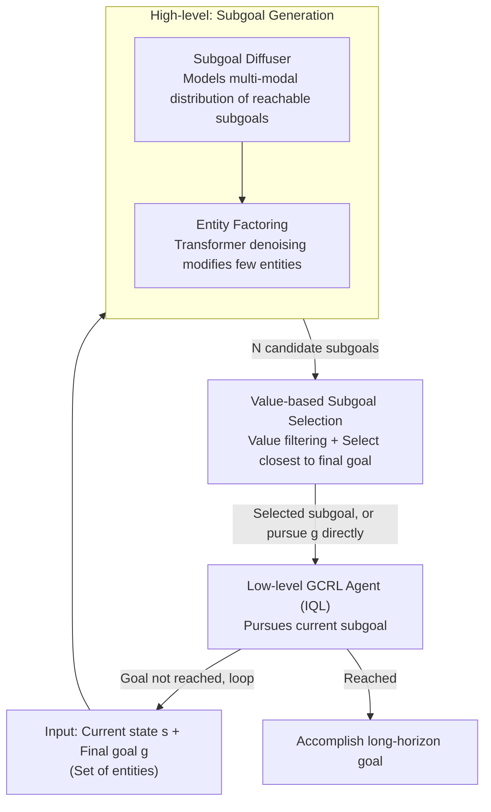

# Hierarchical Entity-centric Reinforcement Learning with Factored Subgoal Diffusion

**Conference**: ICLR 2026  
**arXiv**: [2602.02722](https://arxiv.org/abs/2602.02722)  
**Code**: [GitHub](https://github.com/DanHrmti/HECRL)  
**Area**: Diffusion Models  
**Keywords**: Hierarchical Reinforcement Learning, Goal-conditioned RL, Diffusion Models, Entity-centric, Subgoal Generation

## TL;DR
Proposes HECRL, a hierarchical entity-centric offline goal-conditioned RL framework. By combining a value-based GCRL agent with a factored subgoal diffusion model, it achieves a 150%+ success rate improvement in multi-entity long-horizon tasks.

## Background & Motivation
Achieving long-horizon goals in multi-entity environments is a core challenge for RL. Goal-conditioned RL (GCRL) facilitates generalization across goals but remains limited in high-dimensional observations and combinatorial state spaces, especially under sparse rewards. Existing methods like HIQL extract hierarchical policies from a single value function but struggle with combinatorial state spaces and image observations on the OGBench benchmark. The **Key Challenge** is that the approximation error of Temporal Difference (TD) learning accumulates over long horizons; the further from the goal, the lower the signal-to-noise ratio of the value signal, defining a "policy capability radius" $R_\pi^V$. The **Key Insight** of HECRL is to utilize entity-factored structures to generate sparse modification subgoals, decomposing long-horizon tasks into multiple short-horizon subtasks within the policy's capability radius.

## Method

### Overall Architecture
HECRL addresses the issue that in multi-entity, long-horizon, sparse-reward offline environments, TD learning's approximation error accumulates over distance. Since each policy is only reliable within a finite "capability radius" $R_\pi^V$, HECRL uses a high-level module to decompose distant goals into a sequence of near subgoals within this radius. The system employs a two-layer architecture: the high-level layer is a conditional diffusion model that treats states/goals as sets of entities and performs iterative denoising to generate candidate intermediate subgoals; the low-level layer is a value-based entity-centric GCRL agent providing the policy and value function $V$, responsible for execution and evaluating high-level candidates. Both layers are trained independently on the same offline data. During testing, the value function filters a subgoal from the high-level candidates for the low-level agent to pursue. Thus, the high-level module can be paired with any value-based GCRL algorithm without joint optimization.

### Key Designs

**1. Subgoal Diffuser: Capturing multi-modal distributions of "next reachable subgoals"**

The low-level policy is only reliable within its capability radius, necessitating a module to provide near subgoals reachable within $K$ steps. The difficulty lies in the fact that given a current state $s$ and final goal $g$, multiple valid intermediate subgoals often exist—the distribution $p(\tilde{g}\mid s, g)$ is highly multi-modal. Deterministic regression would average these modes into a blurry goal. HECRL uses a conditional diffusion denoiser to directly model $p(\tilde{g}\mid s, g)$, sampling training data uniformly from offline logs without assuming goal-directed behavior, thus preserving co-existing subgoal patterns.

**2. Factored Entity Subgoals: Structural inductive bias for "sparse subgoals"**

When a state consists of multiple independently controllable factors, subgoals that modify only a few entities are more easily achievable. HECRL represents states and goals as entity sets $s=\{s_m\}_{m=1}^M$ and $g=\{g_m\}_{m=1}^M$. The diffusion model performs denoising over these sets. Crucially, the denoiser uses a Transformer: the attention mechanism naturally allows input tokens to be copied to the output. For entities that do not require modification, the model tends to preserve them as-is. Entity-level sparsity emerges from the architecture itself rather than explicit constraints. This distinguishes it from deterministic methods (like AWR), which might average multiple entity states into a non-existent blurry target.

**3. Value-based Subgoal Selection: Complementing the diffuser with "optimality"**

The diffuser only learns the distribution of behaviors in the data and does not inherently know which subgoal is closer to the final goal. Therefore, a value function is used for selection during inference. As described in Algorithm 1, $N$ candidate subgoals are sampled and filtered using a value threshold $\hat{R}$ to retain only reachable candidates satisfying $V(s,\tilde{g}) > \hat{R}$. Among these, the candidate closest to the final goal (highest $V(\tilde{g}, g)$) is selected. If the final goal itself is closer than any candidate, the subgoals are skipped. This division of labor allows the diffuser to provide "diverse reachable options" while the value function "selects the optimal one."

### Loss & Training
- The low-level GCRL agent is trained using IQL.
- The high-level diffusion model is trained with a standard diffusion denoising objective, requiring only 10 steps for denoising.
- Both layers share the same offline dataset but are trained separately without joint optimization.

## Key Experimental Results

### Main Results (Success rate in long-horizon manipulation)

| Environment | EC-SGIQL (Ours) | EC-IQL | EC-Diffuser | HIQL | IQL |
|------|---------------|--------|-------------|------|-----|
| PPP-Cube (State) | **82.5±3.1** | 51.5±4.4 | 44.8±6.7 | 48.3±7.3 | 34.3±4.9 |
| PPP-Cube (Image) | **64.3±4.9** | 25.0±5.7 | 0.3±0.5 | 0.0±0.0 | 0.0±0.0 |
| Scene (Image) | **61.5±5.9** | 53.0±5.5 | 3.3±2.5 | 8.3±1.3 | 17.5±2.7 |
| Push-Tetris (Image) | **61.4±3.3** | 31.6±1.3 | 7.9±0.5 | 5.2±0.8 | 3.4±0.8 |

### Ablation Study (Subgoal Quality — Average number of modified entities)

| Method | PPP-Cube | Stack-Cube | Description |
|------|----------|------------|------|
| EC-Diffusion (Ours) | **1.36** | **1.04** | Close to modifying only 1 entity |
| EC-AWR | 2.96 | 2.82 | Modifies nearly all 3 entities |
| AWR | 2.98 | 2.98 | Modifies all entities |

### Key Findings
- Achieves a 150%+ success rate gain (25.0 → 64.3) on the most difficult PPP-Cube (Image) task.
- Diffusion model subgoals exhibit significantly better sparsity than AWR deterministic models (1.36 vs 2.96 modified entities).
- Subgoals generated by AWR contain weighted averages of multiple entities, providing blurry targets to the low-level policy.
- Zero-shot combinatorial generalization: Training on 3 objects partially generalizes to 4-5 objects.

## Highlights & Insights
- Elegant modular design: The two layers are trained independently and combined flexibly during testing via the value function.
- The inductive bias of entity-centric diffusion naturally produces sparse subgoals without explicit constraints.
- Deep insight into the mechanism where Transformers selectively copy input entities to the output.

## Limitations & Future Work
- The value threshold $\hat{R}$ requires manual tuning; adaptive schemes remain to be explored.
- DLP representations occasionally duplicate the same entity in subgoals.
- Generalization performance degrades as the number of objects increases, which might be improved through curriculum learning or online fine-tuning.

## Related Work & Insights
- **vs HIQL**: HIQL extracts deterministic subgoals from the value function, failing to produce effective sparse subgoals; ours uses a diffusion model to capture multi-modal distributions.
- **vs EC-Diffuser**: Behavior cloning diffusion predicts actions directly under goal conditioning but lacks hierarchical reasoning through subgoals.

## Rating
- Novelty: ⭐⭐⭐⭐ Innovative combination of hierarchy, entity-centricity, and diffusion.
- Experimental Thoroughness: ⭐⭐⭐⭐⭐ Comprehensive across multiple environments, ablations, generalization, and visualization.
- Writing Quality: ⭐⭐⭐⭐ Clear exposition of motivation and methodology.
- Value: ⭐⭐⭐⭐ Significant reference value for multi-entity offline RL.

<!-- RELATED:START -->

## Related Papers

- [\[ICLR 2026\] HierLoc: Hyperbolic Entity Embeddings for Hierarchical Visual Geolocation](hierloc_hyperbolic_entity_embeddings_for_hierarchical_visual_geolocation.md)
- [\[ICML 2025\] Hierarchical Reinforcement Learning with Uncertainty-Guided Diffusional Subgoals](../../ICML2025/image_generation/hierarchical_reinforcement_learning_with_uncertainty-guided_diffusional_subgoals.md)
- [\[ICLR 2026\] RIDER: 3D RNA Inverse Design with Reinforcement Learning-Guided Diffusion](rider_3d_rna_inverse_design_with_reinforcement_learning-guided_diffusion.md)
- [\[ICLR 2026\] Improved Object-Centric Diffusion Learning with Registers and Contrastive Alignment (CODA)](improved_object-centric_diffusion_learning_with_registers_and_contrastive_alignm.md)
- [\[CVPR 2026\] HiCoGen: Hierarchical Compositional Text-to-Image Generation in Diffusion Models via Reinforcement Learning](../../CVPR2026/image_generation/hicogen_hierarchical_compositional_text-to-image_generation_in_diffusion_models_.md)

<!-- RELATED:END -->
