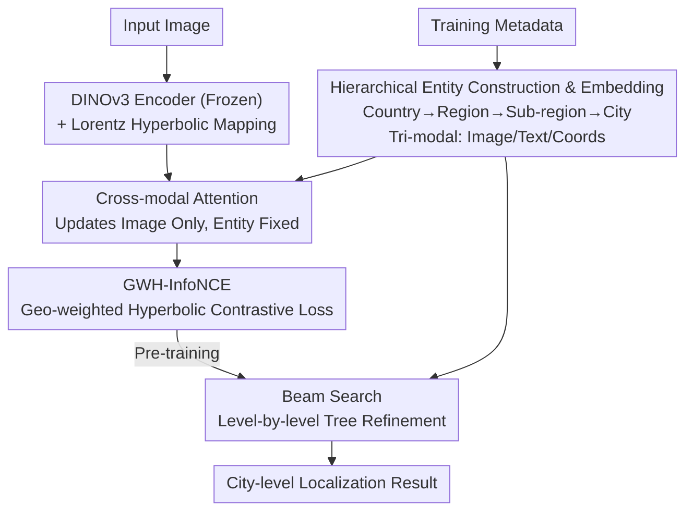

# HierLoc: Hyperbolic Entity Embeddings for Hierarchical Visual Geolocation

**Conference**: ICLR 2026  
**arXiv**: [2601.23064](https://arxiv.org/abs/2601.23064)  
**Code**: None  
**Area**: Diffusion Models  
**Keywords**: Visual Geolocation, Hyperbolic Embeddings, Hierarchical Entities, Contrastive Learning, Retrieval

## TL;DR
The paper proposes HierLoc, which remodels geolocation as an image-entity alignment problem in hyperbolic space. By replacing 5M+ image embeddings with 240k hierarchical geographic entity embeddings, it reduces the mean geodesic error by 19.5% and improves sub-region accuracy by 43% on the OSV5M dataset.

## Background & Motivation
Visual geolocation (inferring location from image content) is a cross-scale global challenge. Existing methods are divided into retrieval-based (requiring indexing millions of images), classification-based (grid classification ignoring geographic continuity), and generative-based (diffusion models struggling at fine scales). **Key Challenge**: Geography possesses an inherent hierarchical structure (Country → Region → Sub-region → City). The number of entities grows exponentially from country to city levels, whereas Euclidean distance only grows linearly, leading to crowding and reduced discriminability for deep-level entities. **Key Insight**: Hyperbolic space naturally provides exponential volume growth, perfectly matching this hierarchical branching structure. The **Goal** of HierLoc is to transform geolocation from "image-to-image retrieval" into "image-to-entity alignment."

## Method

### Overall Architecture
HierLoc addresses global-scale visual geolocation by reframing it: rather than "image-to-image retrieval," it treats localization as "image-to-geographic entity alignment." The pipeline processes an input image through a frozen DINOv3 encoder, which is then mapped to a Lorentz hyperbolic manifold. Simultaneously, training metadata is compressed into approximately 240,000 hierarchical geographic entities (Country → Region → Sub-region → City). Each entity is pre-embedded into the same hyperbolic space using multi-modal features (image, text, and coordinates). Cross-modal attention aligns the image with hierarchical entities across four levels. The representations are pre-trained using GWH-InfoNCE, a geographically weighted hyperbolic contrastive loss. During inference, instead of scanning millions of images, the model performs a top-down refinement on the entity tree using beam search to reach city-level entities.

### Key Designs

**1. Hierarchical Entity Construction: Compressing Millions of Images into Discriminative Prototypes**

A major pain point for retrieval methods is the linear increase in search cost with database size. HierLoc aggregates training metadata into ~240,000 hierarchical entities (233 countries, 4,946 regions, 29,214 sub-regions, 209,894 cities), replacing massive image samples with entity prototypes. Each entity associates tri-modal features: mean image embedding $\text{Img}_i$ (average DINOv3 features of all training images under that entity), text embedding $\text{Text}_i$ (entity name encoded via CLIP), and coordinate embedding $\text{Coords}_i$ (latitude/longitude encoded via SphereM+). Anchor embeddings $A_i$ are initialized in the tangent space and mapped to the hyperboloid, with the final embedding as $H_i = \exp_O(\log_0(A_i) + \alpha_{\text{node}} \Delta_i)$. This approach reduces retrieval complexity from $O(N)$ to sub-linear hierarchical traversal.

**2. Cross-modal Attention: Aligning Images to Entities with Asymmetric Updates**

To align image features with the correct hierarchical entities, HierLoc utilizes multi-head attention in the tangent space. Image features serve as the query, while entity embeddings act as key/values. Eight-head attention is performed independently across the four levels. Contexts are concatenated, fused via MLP, and added back to the original image features. The **Mechanism** uses **asymmetric updates**: attention only updates the image stream, while entity embeddings remain fixed. This prevents entities from overfitting to specific training images, preserving the generalization of prototypes as reliable targets for unseen images.

**3. GWH-InfoNCE Loss: Encoding Geographic Proximity into Negative Weights**

Standard InfoNCE treats all negative samples equally. However, in geolocation, negative samples closer to the positive sample are harder to distinguish and more valuable for discrimination. GWH-InfoNCE calculates the great-circle distance $g_{\ell,k}$ between negative and positive samples using the haversine formula to weight negatives:

$$w_{\ell,k} = 1 + \lambda \exp(-g_{\ell,k}/\sigma)$$

Geographically proximal negatives receive higher weights. The loss for a single hierarchy level is:

$$\mathcal{L}_\ell = -\log \frac{\exp(-d_\ell^+/\tau)}{\exp(-d_\ell^+/\tau) + \sum_k w_{\ell,k} \exp(-d_{\ell,k}^-/\tau)}$$

where $d$ is the distance in hyperbolic space. The total loss aggregates four levels: $\mathcal{L} = \sum_{\ell} \beta_\ell \mathcal{L}_\ell$. This weighting significantly improves discriminative power at fine scales, resulting in a 43% gain in sub-region accuracy.

### Loss & Training
- Euclidean parameters use AdamW; manifold parameters use RiemannianAdam.
- Batch size 16, learning rate 2×10⁻⁴, trained for 5 epochs on 6× L40S GPUs (~60 hours).
- Inference employs beam search (width 10) for level-by-level refinement on the entity hierarchy.

## Key Experimental Results

### Main Results (OSV5M Benchmark)

| Method | GeoScore↑ | Distance (km)↓ | Country% | Region% | Sub-region% | City% |
|------|-----------|----------|-------|-------|---------|-------|
| SC Retrieval | 3597 | 1386 | 73.4 | 45.8 | 28.4 | 19.9 |
| LocDiff | - | - | 77.0 | 46.3 | - | 11.0 |
| **HierLoc (DINOv3)** | **3963** | **861** | **82.9** | **55.0** | **40.7** | **23.3** |

### Ablation Study

| Configuration | GeoScore | Description |
|------|----------|------|
| Euclidean Space | Baseline | Crowding of deep-level entities |
| + Hyperbolic Space | Gain | Exponential volume growth |
| + GWH-InfoNCE | Optimal | Geographically aware negative weighting |
| Laplace vs Gaussian decay | Laplace better | Choice of decay kernel impacts performance |

### Key Findings
- Accuracy improved by +8.8% for Country, +20.1% for Region, +43.2% for Sub-region, and +16.8% for City levels.
- Mean geodesic error reduced by 19.5% (1386km → 861km vs. SC Retrieval).
- Search space drastically reduced from ~9.6M image records to 240k entities.
- DINOv3 encoder outperforms ViT-L/14.

## Highlights & Insights
- "Image-to-entity alignment" reduces retrieval complexity from $O(N)$ to sub-linear hierarchical traversal.
- The geographic distance-weighted negative sample design in GWH-InfoNCE is intuitive—geographically close samples are the strongest negatives.
- Asymmetric cross-modal attention (updating only images, keeping entities fixed) prevents overfitting.

## Limitations & Future Work
- Using mean image embeddings for city-level entities might lose visual diversity information.
- A fixed beam search width of 10 is used; adaptive strategies might perform better.
- Requires pre-constructed hierarchies, which may be restricted in regions lacking administrative division data.

## Related Work & Insights
- **vs PIGEON**: Based on large-scale classification and semantic fusion, but collapses into single-level output, losing hierarchical signals.
- **vs GeoCLIP**: Directly predicts coordinates as targets without utilizing hierarchical structures.

## Rating
- Novelty: ⭐⭐⭐⭐⭐ First to apply hyperbolic embeddings to global hierarchical geolocation.
- Experimental Thoroughness: ⭐⭐⭐⭐⭐ Comprehensive OSV5M evaluation plus validation on external benchmarks.
- Writing Quality: ⭐⭐⭐⭐ Detailed methodology with clear mathematical derivation.
- Value: ⭐⭐⭐⭐⭐ Geometry-aware hierarchical embeddings provide insights for other hierarchical tasks.

<!-- RELATED:START -->

## Related Papers

- [\[ICLR 2026\] Hierarchical Entity-centric Reinforcement Learning with Factored Subgoal Diffusion](hierarchical_entity-centric_reinforcement_learning_with_factored_subgoal_diffusi.md)
- [\[AAAI 2026\] Hyperbolic Hierarchical Alignment Reasoning Network for Text-3D Retrieval](../../AAAI2026/image_generation/hyperbolic_hierarchical_alignment_reasoning_network_for_text-3d_retrieval.md)
- [\[ICLR 2026\] A Hidden Semantic Bottleneck in Conditional Embeddings of Diffusion Transformers](a_hidden_semantic_bottleneck_in_conditional_embeddings_of_diffusion_transformers.md)
- [\[ICCV 2025\] HypDAE: Hyperbolic Diffusion Autoencoders for Hierarchical Few-shot Image Generation](../../ICCV2025/image_generation/hypdae_hyperbolic_diffusion_autoencoders_for_hierarchical_few-shot_image_generat.md)
- [\[ICLR 2026\] Next Visual Granularity Generation](next_visual_granularity_generation.md)

<!-- RELATED:END -->
