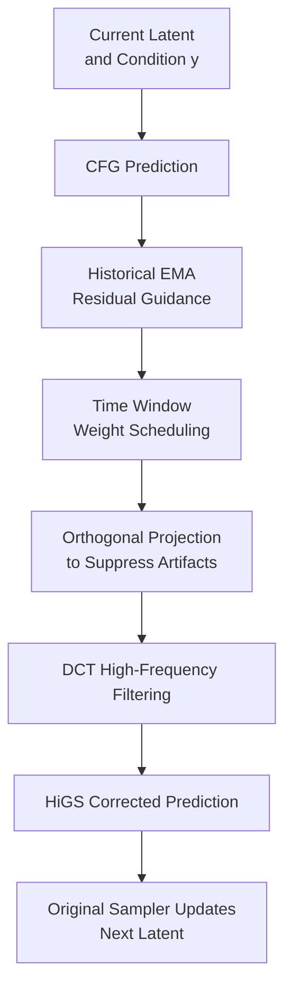

# HiGS: History-Guided Sampling for Plug-and-Play Enhancement of Diffusion Models

**Conference**: ICLR 2026  
**OpenReview**: [https://openreview.net/forum?id=cyQUZDMpg3](https://openreview.net/forum?id=cyQUZDMpg3)  
**Code**: Unconfirmed  
**Area**: Diffusion Models / Image Generation  
**Keywords**: History-Guided Sampling, Diffusion Model Acceleration, CFG, Low-step Generation, Frequency Domain Filtering  

## TL;DR
HiGS is a training-free, additional-forward-free sampling plugin for diffusion models. It corrects the sampling direction using the difference between current model predictions and the EMA of historical predictions, significantly improving image clarity, structure, and detail under low NFE or low CFG scales.

## Background & Motivation
**Background**: Diffusion models have become the mainstream paradigm for image generation. Architectures ranging from Stable Diffusion and SDXL to Transformer-based DiT and SiT rely on a reverse denoising process to gradually transform noise into images. During deployment, samplers typically perform multiple neural function evaluations (NFEs) and often utilize classifier-free guidance (CFG) in conditional generation to enhance image quality and prompt alignment.

**Limitations of Prior Work**: High-quality diffusion sampling is computationally expensive. Reducing sampling steps to decrease latency often results in blurry images, loss of local details, and unstable global structures. While decreasing the CFG scale can reduce over-saturation and diversity loss, it frequently degrades image quality. Conversely, simply increasing the CFG scale, while enhancing structure and visual impact, introduces artifacts like color over-saturation and texture hallucinations.

**Key Challenge**: The fundamental issue is not merely "insufficient sampling steps," but rather that each sampling step only considers the current model prediction, ignoring trajectory information already present in recent steps. The reverse diffusion process is inherently a continuous dynamic system where the change between current and historical predictions contains information on how the model is correcting the image; standard samplers do not explicitly utilize this history.

**Goal**: The authors aim to find a training-free, model-agnostic, and sampler-friendly enhancement method. This would allow pre-trained diffusion models to produce clearer and more stable images under short sampling settings (fewer steps, lower CFG scales, or even distilled models) without increasing inference costs.

**Key Insight**: The paper interprets Euler sampling as gradient descent on a time-varying energy function and draws inspiration from momentum-based variance reduction methods like STORM. The intuition is that if the current gradient estimate is unstable, incorporating the change in current predictions relative to historical ones provides a signal similar to momentum or multi-step correction, helping the sampling trajectory move towards high-quality regions more rapidly.

**Core Idea**: By subtracting a weighted average of historical predictions from the current model prediction, a "history-guided correction" is obtained. After time-scheduling, projection, and high-frequency filtering, this term is added back to the current prediction to enhance diffusion sampling in a plug-and-play manner.

## Method

### Overall Architecture
HiGS does not modify the training process or replace the base diffusion model; it adds a lightweight "historical correction" after receiving the model output at each step. In conditional generation with CFG, the standard workflow first computes conditional and unconditional predictions to obtain $D_{CFG}(z_{t_k})$. HiGS then subtracts the EMA of historical predictions from the current $D_{CFG}$ to form a correction direction. This direction is passed through time, direction, and frequency filters before being used by the original sampler to update the latent.

Overall, HiGS acts like a memory buffer for the diffusion sampler: the buffer stores previous denoiser predictions rather than images or extra models. This memory is most valuable during the early-to-mid sampling stages when the image structure and main details are forming. In later stages near the final clean image, excessive historical correction might introduce noise or color anomalies, necessitating a scheduled decay.

The final HiGS output can be summarized as:

$$
D_{HiGS}(z_{t_k}) = D_{CFG}(z_{t_k}) + w_{HiGS}(t_k) \cdot \mathrm{iDCT}\left(H(R) \cdot \mathrm{DCT}(\Delta D_{t_k}(\eta))\right).
$$

Where $\Delta D_{t_k}$ is the difference between the current prediction and the historical average, $w_{HiGS}(t_k)$ controls when the correction is active, $\Delta D_{t_k}(\eta)$ is the projected direction, and $H(R)$ is a DCT high-pass filter. While this adds several steps, they are performed on model output tensors without additional denoiser forwards, keeping inference costs nearly identical to standard CFG.

### Key Designs
**1. Historical EMA Residual Guidance: Turning "Improvements" into Sampling Directions**

The core of HiGS is not simply averaging multi-step outputs but calculating the difference between the current prediction and the historical average. Given a sampling grid $t_0 > t_1 > \cdots > t_M$, at step $k$, the history set is $H_k = \{D_{CFG}(z_{t_i})\}_{i \in I_k}$. The paper finds that when using CFG, storing the post-CFG prediction $D_{CFG}$ in the history buffer is more effective than storing only the conditional prediction $D_c$, as it records the actual guidance direction used in sampling.

The history function uses an EMA-style weighted average that favors recent steps:

$$
g(H_k)=\sum_{i \in I_k} \alpha(1-\alpha)^{k-1-i}D_{CFG}(z_{t_i}).
$$

The correction term is defined as $\Delta D_{t_k}=D_{CFG}(z_{t_k})-g(H_k)$. This essentially captures what new structures, edges, or details the current denoiser has added relative to recent steps. Because early predictions are blurrier, this difference approximates the direction from a "lower-quality version" to a "higher-quality version." This shares intuition with autoguidance but requires no extra model calls.

**2. Time Window Weight Scheduling: Focusing on the Most Useful Stage**

Applying $\Delta D_{t_k}$ with constant strength across all time steps is unstable. The authors observe that the benefits of HiGS are concentrated in the early and middle sampling stages: this is when global structure, object boundaries, and primary textures are established. In later stages, when the image has nearly converged, further reinforcing historical differences can amplify minor noise or color deviations.

HiGS uses a time-varying weight $w_{HiGS}(t)$, which is disabled when $t \le t_{min}$, gradually active within $t_{min}<t\le t_{max}$, and disabled again when $t>t_{max}$:

$$
w_{HiGS}(t)=
\begin{cases}
0, & t \le t_{min},\\
w_{HiGS}\sqrt{\frac{t-t_{min}}{t_{max}-t_{min}}}, & t_{min}<t\le t_{max},\\
0, & t>t_{max}.
\end{cases}
$$

**3. Orthogonal Projection: Preventing Over-saturation**

CFG already amplifies predictions along a conditional direction, often leading to over-saturation at high scales. If the HiGS residual direction is highly parallel to $D_{CFG}(z_{t_k})$, adding it directly may worsen these artifacts. The paper introduces an optional projection to decompose $\Delta D_{t_k}$ into parallel and orthogonal components relative to the current prediction.

Specifically, the parallel component is:

$$
\Delta D^{\parallel}_{t_k}=\frac{\langle \Delta D_{t_k},D_{CFG}(z_{t_k})\rangle}{\langle D_{CFG}(z_{t_k}),D_{CFG}(z_{t_k})\rangle}D_{CFG}(z_{t_k}),
$$

And the final direction used is $\Delta D_{t_k}(\eta)=\Delta D^{\perp}_{t_k}+\eta\Delta D^{\parallel}_{t_k}$. By setting $\eta < 1$, HiGS suppresses updates aligned with the current CFG direction, focusing instead on lateral corrections that provide structural and detail enhancements without merely "turning up" the contrast.

**4. DCT High-Frequency Filtering: Restricting Corrections to Detail and Structure**

The authors observed that projection alone is insufficient to prevent global color shift, as color and lighting often correspond to low-frequency components. Using the Discrete Cosine Transform (DCT), a sigmoid-based high-pass filter is applied based on radial frequency $R$:

$$
H(R)=\mathrm{Sigmoid}(\lambda(R-R_c)).
$$

By using $\mathrm{iDCT}(H(R)\cdot\mathrm{DCT}(\Delta D_{t_k}(\eta)))$, HiGS prioritizes improving high-frequency details over rewriting the overall tone or large-scale composition of the image.

### Loss & Training
HiGS has no training loss as it occurs entirely during inference. It is compatible with base models such as Stable Diffusion XL, SD 3, SD 3.5, DiT-XL/2, SiT-XL+REPA, and distilled models like SDXL-Flash or SDXL-Lightning.

## Key Experimental Results

### Main Results
The experiments cover text-to-image, ImageNet class-conditional generation, various sampling steps, and different CFG scales.

| Model | Setting | Baseline Metrics | +HiGS Metrics | Main Gain |
|------|------|----------|------------|----------|
| SiT-XL + REPA | ImageNet | FID 12.08, IS 187.11 | FID 4.86, IS 277.20 | Massive FID drop, Precision 0.68→0.80 |
| DiT-XL/2 | ImageNet | FID 8.73, IS 173.21 | FID 7.15, IS 180.05 | Simultaneous improvement in quality and diversity |
| Stable Diffusion XL | T2I / COCO | FID 28.49, IS 35.07 | FID 26.18, IS 36.22 | Improved visual quality and precision/recall |
| Stable Diffusion 3 | T2I / COCO | FID 27.19, IS 40.11 | FID 26.84, IS 40.94 | Consistent but smaller improvement |

On preference-based metrics, HiGS shows significant gains. On DrawBench, SDXL's HPSv2 improved from 0.224 to 0.249. ImageNet results are particularly striking: on REPA-E, unguided 250-step FID was 1.83, whereas HiGS achieved FID 1.61 in just 30 steps. 

### Ablation Study
| Configuration | Key Metric | Description |
|------|----------|------|
| Baseline with CFG | HPSv2 0.238, IR 0.174 | No historical prediction |
| +HiGS using CFG history | HPSv2 0.255, IR 0.371 | Best performance using post-CFG buffer |
| Square-root schedule | HPSv2 0.261, IR 0.39 | Default choice, best visual results |
| EMA average | HPSv2 0.255, IR 0.371 | Stable performance and easy online implementation |

### Key Findings
- HiGS is particularly valuable at low step counts and low CFG scales where standard sampling typically fails.
- Frequency domain filtering (DCT) is the critical "safety layer" that makes the method stable by preventing interference with low-frequency color components.
- HiGS is complementary to distilled models: it successfully enhanced SDXL-Flash and SDXL-Lightning performance.

## Highlights & Insights
- **Repurposing History**: HiGS cleverly uses "historical predictions" as a free "weak model." It bypasses the need for training a separate bad model or making additional forward passes.
- **Theoretical Grounding**: By linking Euler sampling to gradient descent on energy functions, the residual becomes a form of momentum-based variance reduction.
- **Deployment-Friendly**: Since it requires no new weights or extra denoiser calls, it is highly suitable for integration into existing commercial inference pipelines.

## Limitations & Future Work
- **Residual Bias**: HiGS still inherits the biases and safety risks of the underlying base model.
- **Hyperparameter Sensitivity**: The method introduces several parameters ($w_{HiGS}$, $t_{min}$, $t_{max}$, etc.); while the paper provides stable ranges, tuning may be required for specific resolutions or domains.
- **Domain Expansion**: Future work should investigate whether this stability holds for video, 3D, or audio generation, where temporal consistency is critical.

## Related Work & Insights
- **vs CFG**: Unlike CFG, which can cause saturation at high scales, HiGS provides structural and detail enhancement and can be used to improve quality at lower CFG scales.
- **vs Samplers (DPM-Solver, etc.)**: While solvers optimize numerical ODE/SDE integration, HiGS acts as a model-level correction that can be layered on top of any solver.
- **vs Distillation**: HiGS is a zero-cost addition that can further improve already distilled models.
- **Insight**: Inference trajectories contain untapped data. Future research could extend the use of "historical states" to cross-step attention or frequency-domain evolution.

## Rating
- **Novelty**: ⭐⭐⭐⭐ Residual historical prediction is an intuitive yet effective idea properly combined with momentum and frequency filtering.
- **Experimental Thoroughness**: ⭐⭐⭐⭐⭐ Covers a wide range of models, steps, and metrics, including thorough ablations.
- **Writing Quality**: ⭐⭐⭐⭐ Very clear overall; equations and implementation details are well-documented.
- **Value**: ⭐⭐⭐⭐⭐ Training-free, low-overhead, and easy to deploy, making it highly valuable for real-world applications.

<!-- RELATED:START -->

## Related Papers

- [\[ICLR 2026\] RNE: plug-and-play diffusion inference-time control and energy-based training](rne_plug-and-play_diffusion_inference-time_control_and_energy-based_training.md)
- [\[CVPR 2026\] Diffusion Sampling Path Tells More: An Efficient Plug-and-Play Strategy for Sample Filtering](../../CVPR2026/image_generation/diffusion_sampling_path_tells_more_an_efficient_plug-and-play_strategy_for_sampl.md)
- [\[ICLR 2026\] Synthetic History: Evaluating Visual Representations of the Past in Diffusion Models](synthetic_history_evaluating_visual_representations_of_the_past_in_diffusion_mod.md)
- [\[CVPR 2026\] PromptLoop: Plug-and-Play Prompt Refinement via Latent Feedback for Diffusion Model Alignment](../../CVPR2026/image_generation/promptloop_plug-and-play_prompt_refinement_via_latent_feedback_for_diffusion_mod.md)
- [\[ICLR 2026\] Foresight Diffusion: Improving Sampling Consistency in Predictive Diffusion Models](foresight_diffusion_improving_sampling_consistency_in_predictive_diffusion_model.md)

<!-- RELATED:END -->
