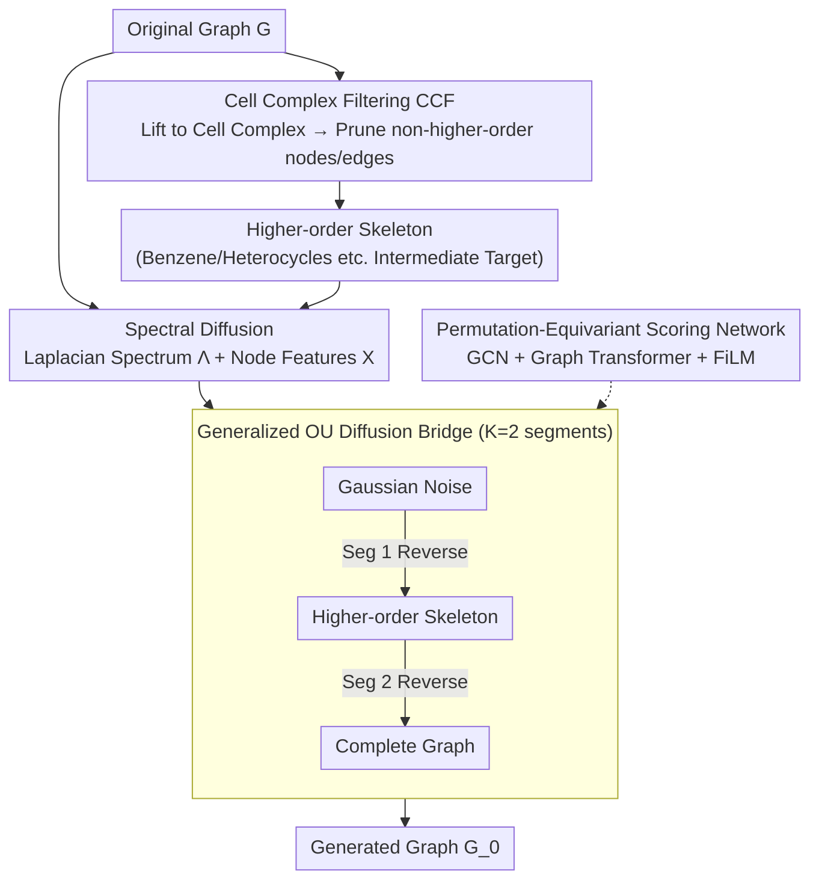

# HOG-Diff: Higher-Order Guided Diffusion for Graph Generation

**Conference**: ICLR 2026  
**arXiv**: [2502.04308](https://arxiv.org/abs/2502.04308)  
**Code**: None  
**Area**: Image Generation  
**Keywords**: Graph generation, diffusion models, higher-order topology, cell complexes, diffusion bridges  

## TL;DR

This paper proposes HOG-Diff, a graph diffusion framework that utilizes higher-order topological structures (e.g., rings, triangles, motifs) as generation guidance. By extracting higher-order skeletons via Cell Complex Filtering (CCF) combined with generalized OU diffusion bridges, it achieves "coarse-to-fine" progressive graph generation, reaching SOTA performance on 8 benchmarks for molecule and general graph generation.

## Background & Motivation

1.  **Existing graph diffusion models ignore higher-order topology**: Current mainstream graph generation methods (e.g., GDSS, DiGress, DeFoG) operate directly at the adjacency matrix or edge level, treating graphs as collections of pairwise edges while completely ignoring higher-order structures like triangles, rings, and cliques. However, these structures are critical in chemical molecules (e.g., benzene rings, heterocycles) and biological networks.

2.  **Intermediate states degenerate into structureless noise**: The forward process of classical diffusion models gradually adds noise to data until it reaches a Gaussian distribution. The intermediate states are meaningless noisy adjacency matrices that neither preserve topological properties nor provide useful structural guidance.

3.  **Importance of ring systems in molecular generation**: Approved drug molecules contain only a few hundred distinct ring systems, far fewer than the astronomical chemical space ($10^{23}$–$10^{60}$), indicating that higher-order topological structures are core constraints of real molecular distributions.

4.  **Inspirations from Topological Deep Learning (TDL)**: TDL research has demonstrated that explicitly modeling complex topological structures (simplicial complexes, cell complexes) can enhance the expressiveness and stability of graph representation learning, but this has not yet been introduced into generative models.

5.  **Defects of adjacency matrix domain diffusion**: Injecting Gaussian noise directly into adjacency matrices faces permutation ambiguity, signal degradation due to sparsity, and poor scalability. Spectral domain diffusion provides a more robust alternative.

6.  **Lack of topology-aware quality evaluation**: Existing evaluation metrics (e.g., Validity, FCD) mainly focus on chemical validity and distributional distance, rarely assessing the topology-preservation capability of generated graphs. Evaluations based on TDA methods like curvature filtering are needed.

## Method

### Overall Architecture

HOG-Diff addresses the issue where existing graph diffusion treats graphs as sets of pairwise edges, causing intermediate states to degenerate into meaningless noise, and crucial higher-order structures like rings are neither preserved nor used to guide generation. Its strategy transforms "single-step whole-graph generation" into "coarse-to-fine relay generation": first sketching the higher-order skeleton and then completing the details. It uses Cell Complex Filtering to extract skeletons composed of rings and faces from the original graph to serve as intermediate target states. A sequence of diffusion bridges then links "Gaussian noise → Higher-order skeleton → Complete graph" into a hierarchical generation. Formally, the generative distribution is decomposed into a conditional probability chain passing through $K-1$ intermediate states $p(\bm{G}_0) = p(\bm{G}_0|\bm{G}_{\tau_1}) \cdot p(\bm{G}_{\tau_1}|\bm{G}_{\tau_2}) \cdots p(\bm{G}_{\tau_{K-1}}|\bm{G}_T)$, where each segment is handled by an independent bridge process; the paper defaults to $K=2$, i.e., "noise → skeleton → complete graph". The entire pipeline runs in the Laplacian spectral domain, driven by a permutation-equivariant scoring network for reverse denoising in each segment.

### Key Designs

**1. Cell Complex Filtering (CCF): Explicitly extracting higher-order skeletons as intermediate targets**

Intermediate states in classical diffusion are meaningless noisy adjacency matrices. HOG-Diff first lifts the original graph $\bm{G}$ to a cell complex $\mathcal{S}$—constructing 2-cells by attaching 2D closed disks to simple cycles in the graph, thereby explicitly encoding higher-order structures like rings and faces. It then defines a $p$-cell filtering operation to retain only nodes and edges belonging to higher-order cells, obtaining the higher-order skeleton $\bm{G}_{[p]}$. This skeleton strips away fragmented peripheral edges, leaving the core structures (like benzene or heterocyclic rings in molecules) that truly define the architecture, serving as an intermediate target for the diffusion process so the model can generate the skeleton correctly before filling in peripheral details. CCF performs filtering rather than enumerating full lifting to avoid expensive combinatorial explosion; the paper uses 2-cell filtering for skeleton extraction.

**2. Generalized OU Diffusion Bridge: Closed-form, simulation-free transitions for each relay**

After splitting generation into $K$ segments, a diffusion path with a "fixed endpoint" is needed between adjacent intermediate states. HOG-Diff uses a generalized Ornstein-Uhlenbeck (GOU) bridge within each time window $[\tau_{k-1}, \tau_k]$, controlled by the SDE $\mathrm{d}\bm{G}_t = \theta_t(\bm{\mu} - \bm{G}_t)\mathrm{d}t + g_t\mathrm{d}\bm{W}_t$. Through Doob's $h$-transform, the mean of the drift term is pinned to the terminal state $\bm{\mu} = \bm{G}_{\tau_k}$. The resulting bridge has closed-form transition probabilities $p(\bm{G}_t|\bm{G}_{\tau_{k-1}}, \bm{G}_{\tau_k})$, allowing any state to be sampled in one step during training without sequential trajectory simulation (simulation-free training). Zero terminal variance ensures each segment lands smoothly on the predefined intermediate skeleton. The common Brownian bridge is a special case where $\theta_t \to 0$, while the mean-reversion term in the GOU bridge makes transitions more controllable.

**3. Spectral Domain Diffusion: Diffusing on the Laplacian spectrum to bypass sparsity and permutation ambiguity**

Directly injecting Gaussian noise into adjacency matrices faces issues like permutation ambiguity, sparse signal degradation, and poor scalability. HOG-Diff instead diffuses in the spectral domain of the graph Laplacian $\bm{L} = \bm{D} - \bm{A}$. After decomposing $\bm{L} = \bm{U}\bm{\Lambda}\bm{U}^\top$, diffusion processes are established for eigenvalues $\bm{\Lambda}$ and node features $\bm{X}$ separately. The Laplacian spectrum is inherently permutation-invariant, resolving ambiguities from node reordering. Eigenvalue diffusion captures global topology, while node feature diffusion handles local properties, allowing both global structure and fine details to be modeled.

**4. Permutation-Equivariant Scoring Network: Combining local aggregation and global interaction**

Each reverse denoising step in spectral diffusion requires predicting the score function for nodes and spectra, which needs a network that is both permutation-equivariant and capable of balancing local and global information. HOG-Diff uses GCN for local neighborhood feature aggregation and Graph Transformer for global interaction, with a FiLM layer to inject diffusion time $t$ into both branches. Finally, MLPs output the scores for nodes and spectra. The entire network maintains permutation equivariance, consistent with the permutation invariance of spectral diffusion, avoiding dependence on node ordering.

## Main Results

### Molecular Generation (QM9, ZINC250k, MOSES, GuacaMol)

| Method | QM9 FCD↓ | QM9 NSPDK↓ | ZINC FCD↓ | ZINC NSPDK↓ | MOSES Val.↑ | GuacaMol FCD↑ |
|------|----------|------------|-----------|-------------|-------------|--------------|
| GDSS | 2.900 | 0.003 | 14.656 | 0.019 | — | — |
| DiGress | 0.360 | 0.0005 | 23.060 | 0.082 | 85.7 | 68.0 |
| Cometh | 0.248 | 0.0005 | — | — | 90.5 | 72.7 |
| DeFoG | 0.268 | 0.0005 | 2.030 | 0.002 | 92.8 | 73.8 |
| **HOG-Diff** | **0.172** | **0.0003** | **1.633** | **0.001** | **99.7** | **78.5** |

HOG-Diff leads significantly in FCD and NSPDK, indicating that generated molecular distributions are closer to real molecules in both chemical and graph spaces. On the large-scale MOSES dataset, Validity reaches 99.7%, far exceeding other methods.

### General Graph Generation + Topology Preservation Analysis

| Method | Community-small Avg.↓ | Enzymes Avg.↓ | QM9 $\kappa_{FR}$↓ | ZINC $\kappa_{FR}$↓ |
|------|-----------------------|---------------|---------------------|---------------------|
| GDSS | 0.046 | 0.032 | 0.925 | 1.781 |
| DiGress | 0.038 | 0.030 | 0.251 | — |
| DeFoG | — | — | 0.177 | 0.728 |
| **HOG-Diff** | **0.010** | **0.027** | **0.077** | **0.190** |

In topological evaluation based on Curvature Filtration, HOG-Diff achieves the lowest distance scores across all datasets, with a particularly significant advantage on complex molecule datasets ($\kappa_{FR}$ on QM9 is 56% lower than the second-best method).

### Ablation Study: Importance of Topological Guidance

| Guidance Type | QM9 Val.↑ | QM9 FCD↓ | QM9 NSPDK↓ |
|---------|-----------|----------|------------|
| Noise (Classical Diffusion) | 91.52 | 0.829 | 0.0015 |
| Peripheral (Peripheral Structure) | 97.58 | 0.305 | 0.0009 |
| **Cell (Higher-order Skeleton)** | **98.74** | **0.172** | **0.0003** |

Higher-order skeleton guidance is far superior to noise guidance (classical diffusion) and peripheral structure guidance, validating the effectiveness of higher-order topology as a generative signal. Training curves also confirm that HOG-Diff converges faster than classical methods (consistent with Theorem 3).

## Highlights & Insights

- **First to use higher-order topology as explicit guidance for graph generation**: Unlike previous works that treat topology as a posterior evaluation metric, HOG-Diff embeds it into the core of the generative process.
- **Elegant design of Cell Complex Filtering**: The CCF operation avoids expensive full lifting enumeration, efficiently extracting higher-order skeletons as intermediate targets.
- **Unity of theory and practice**: Proved that HOG-Diff strictly outperforms classical diffusion models in score matching convergence speed and reconstruction error bounds (Theorem 3 & 4), verified by experiments.
- **Comprehensive evaluation system**: Covers 8 benchmarks, 4 molecular datasets, and introduces Curvature Filtration as a topology preservation metric.

## Limitations & Future Work

- CCF depends on the quality of lifting operations; different lifting strategies (2-cell vs. simplicial complex) may vary in effectiveness across datasets, requiring manual selection.
- Advantages are less significant on datasets with sparse higher-order structures (e.g., Ego-small), showing that gains are strongly correlated with the topological richness of the data.
- Spectral domain diffusion requires choosing a fixed eigenvector basis $\hat{\bm{U}}_0$ (sampled from the training set), which introduces additional sampling bias.
- The two-stage method ($K=2$) increases hyperparameters (time window partitioning $\tau_k$, coefficients $c_1, c_2$), increasing the tuning burden compared to classical methods.
- The effects of even higher-dimensional (3-cell and above) topological guidance have not yet been explored.

## Related Work & Insights

| Dimension | HOG-Diff | DiGress (Vignac et al. 2023) | DeFoG (Qin et al. 2025) |
|------|----------|------------------------------|------------------------|
| Diffusion Domain | Spectral (Laplacian Eigenvalues) | Discrete space (categorical) | Flow matching |
| Higher-order Topology | Explicit guidance (CCF) | None | None |
| Intermediate State | Meaningful topological skeleton | Noise | Optimal transport path |
| Bridge Process | GOU Bridge (Closed-form) | None | None |
| Theory Guarantee | Convergence speed + Error bound | None | None |
| MOSES Val. | 99.7% | 85.7% | 92.8% |

| Dimension | HOG-Diff | GDSS (Jo et al. 2022) | MiCaM (Geng et al. 2023) |
|------|----------|----------------------|--------------------------|
| Generation Paradigm | One-shot (Spectral diffusion) | One-shot (Adj. matrix diffusion) | Autoregressive (Motif merging) |
| Higher-order Info | Generation guidance | None | Implicit (Motif vocabulary) |
| Topology Preservation | Excellent (Lowest $\kappa_{FR}$) | Poor (High $\kappa_{FR}$) | Moderate |
| Scalability | Large-scale (MOSES/GuacaMol) | Moderate | Limited by motif vocabulary |
| Interpretability | Analyzable guidance impact | None | Limited |

## Rating

- ⭐⭐⭐⭐⭐ Novelty: First to systematically introduce higher-order topology into graph diffusion frameworks; the combination of CCF + GOU bridge is elegant and theoretically supported.
- ⭐⭐⭐⭐⭐ Experimental Thoroughness: 8 benchmarks, comprehensive baseline comparisons, topological evaluation, ablation studies, and theoretical validation provide full coverage.
- ⭐⭐⭐⭐ Writing Quality: Clear overall structure and rigorous mathematical derivation, though symbols are numerous and preliminaries are somewhat long.
- ⭐⭐⭐⭐ Value: Direct application value for molecule generation and drug discovery; topological guidance ideas can be extended to more scenarios.

<!-- RELATED:START -->

## Related Papers

- [\[ICLR 2026\] PolyGraph Discrepancy: a classifier-based metric for graph generation](polygraph_discrepancy_a_classifier-based_metric_for_graph_generation.md)
- [\[ICLR 2026\] Any-Order Flexible Length Masked Diffusion](any-order_flexible_length_masked_diffusion.md)
- [\[ICLR 2026\] GGBall: Graph Generative Model on Poincaré Ball](ggball_graph_generative_model_on_poincaré_ball.md)
- [\[CVPR 2026\] GrOCE: Graph-Guided Online Concept Erasure for Text-to-Image Diffusion Models](../../CVPR2026/image_generation/groce_graph-guided_online_concept_erasure_for_text-to-image_diffusion_models.md)
- [\[CVPR 2026\] Semantic Derivative Flow: Graph-Guided Diffusion for Controllable Instance Interactions](../../CVPR2026/image_generation/semantic_derivative_flow_graph-guided_diffusion_for_controllable_instance_intera.md)

<!-- RELATED:END -->
