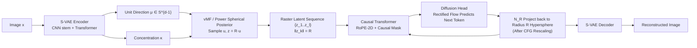

# Hyperspherical Latents Improve Continuous-Token Autoregressive Generation

**Conference**: ICLR 2026  
**OpenReview**: [https://openreview.net/forum?id=H13wHRiL3i](https://openreview.net/forum?id=H13wHRiL3i)  
**Code**: [https://github.com/guolinke/SphereAR](https://github.com/guolinke/SphereAR)  
**Area**: Image Generation / Autoregressive Generation / Continuous Token Tokenizer  
**Keywords**: Autoregressive Image Generation, Hyperspherical VAE, Continuous Tokens, vMF / Power Spherical, Variance Collapse, Classifier-free Guidance

## TL;DR
All inputs and outputs (including predictions after CFG) of continuous-token autoregressive (AR) image generation are constrained to a hypersphere of fixed radius. By replacing the diagonal Gaussian VAE with a Hyperspherical VAE, the scale degree of freedom that causes variance collapse is eliminated. This allows pure next-token raster-order AR to outperform diffusion and masked generative models for the first time at equivalent parameter scales (SphereAR-H 943M achieves FID 1.34 on ImageNet 256×256).

## Background & Motivation
- **Background**: Continuous-token AR (where VAE outputs token-level latents + AR predicts the next latent with a diffusion head) naturally aligns with language modeling and is highly favorable for unified multimodal systems. However, at equivalent parameter counts, it has long lagged behind latent diffusion (DiT/SiT), masked generation (MAR/MaskGIT), and next-scale (VAR) methods. Interestingly, **AR outperforms masked generation when using discrete tokens** (LlamaGen-L 343M FID 3.07 vs. MaskGIT 207M 4.02), yet the situation reverses completely when switching to continuous tokens.
- **Limitations of Prior Work**: The root cause is that the latent **variance of diagonal Gaussian VAEs is severely non-uniform across dimensions and tokens (scale heterogeneity)**. During step-by-step AR decoding, exposure bias and classifier-free guidance (CFG) progressively amplify this scale drift, eventually triggering **variance collapse** and catastrophic generation quality.
- **Key Challenge**: Previous remedies (e.g., GIVT increasing KL weight, LatentLM using fixed-variance $\sigma$-VAE) only alleviate instability without addressing the **scale degree of freedom itself**. Scale remains a redundant dimension prone to drift, especially under CFG.
- **Goal**: Eliminate the scale degree of freedom at the source, ensuring every signal fed into or out of the AR model is **scale-invariant**.
- **Core Idea**: **[Scale-Invariant Latents]** Discrete tokens are stable under AR because they lie on a probability simplex (summing to 1), making them inherently scale-invariant. This work makes continuous latents "scale-invariant" by constraining each latent token to a **hypersphere of fixed radius** (constant $\ell_2$ norm). A **Hyperspherical VAE (S-VAE)** is used to model only direction, not scale, and predictions are projected back onto this hypersphere during inference (including after CFG rescaling).

## Method

### Overall Architecture
SphereAR consists of two coupled components: (1) A **Hyperspherical VAE (S-VAE)** that encodes images into a sequence of latent tokens constrained to a hypersphere $S^{d-1}$ of radius $R$, where each token is parameterized only by a unit direction $\mu$ and a scalar concentration $\kappa$; (2) A **Causal Transformer + token-level diffusion head** that autoregressively models the distribution of the next hyperspherical token in raster order. During training, hyperspherical latents are fed via teacher forcing. During inference, AR predictions (after CFG rescaling) are projected back to the hypersphere of radius $R$ to remove the radial component before the VAE decoder reconstructs the image.

### Key Designs

**1. Hyperspherical VAE (S-VAE): Removing the Scale Degree of Freedom.** Standard VAEs use a diagonal Gaussian posterior $z = \mu_\phi(x) + \sigma_\phi(x)\odot\epsilon$, where the dimension-wise data-dependent variance $\sigma_\phi(x)$ is the source of heterogeneous scaling. S-VAE instead models only the direction on a unit sphere: the encoder outputs a unit mean direction $\mu\in S^{d-1}$ (via $\ell_2$ normalization) and a non-negative concentration $\kappa$. The directional posterior follows a von Mises–Fisher distribution $q_\phi(u\mid x)=C_d(\kappa)\exp(\kappa\,\mu^\top u)$, with a uniform spherical prior $\mathrm{Unif}(S^{d-1})$. The direction is then scaled by a fixed radius $R$ ($z=Ru$) for the decoder. The ELBO becomes $\mathcal{L}_{\text{S-VAE}}=\mathbb{E}_{q_\phi(u\mid x)}[\log p_\psi(x\mid z{=}Ru)]-D_{\mathrm{KL}}(q_\phi(u\mid x)\,\|\,p(u))$. Consequently, every token has a constant norm $\|z\|_2=R$, and the AR model receives pure directional signals.

**2. Power Spherical Posterior: Re-parameterizable and No Rejection Sampling.** While vMF is theoretically sound, its sampling requires rejection sampling, which is inefficient. The authors adopt the Power Spherical posterior $q_\phi(u\mid x)\propto(1+\mu^\top u)^\kappa$, which maintains spherical support and rotational symmetry while being **fully re-parameterizable**. Specifically: let the axial projection (cosine similarity) be $c=\mu^\top u$. By an affine transformation $C=(c+1)/2$, $C$ follows a $\mathrm{Beta}(\alpha{=}\frac{d-1}{2}{+}\kappa,\ \beta{=}\frac{d-1}{2})$ distribution. Sampling $C$ from the Beta distribution yields $c=2C-1$. A unit vector $v_\perp$ is then sampled uniformly from the orthogonal tangent space of $\mu$, and the sample is synthesized as $u=c\,\mu+\sqrt{1-c^2}\,v_\perp$ (using Householder transformations to align bases). This inverse-CDF construction provides low-variance, numerically stable re-parameterization gradients. Theoretical analysis shows that compared to "Gaussian posterior + post-normalization" (Gaussian+norm), S-VAE optimizes a tighter variational bound.

**3. AR Output Projection $N_R$: Preventing Cumulative Scale Errors.** This is the key to stability. A radius projection $N_R(z)=R\,z/\|z\|_2$ is applied to the temporary prediction of each token. At a spherical reference point, the derivative of $N_R$ is exactly the orthogonal projection operator onto the tangent space. In a first-order approximation, normalization removes radial (scale) perturbations while preserving tangential (directional) perturbations. By composing the normalization after the next-token predictor, the **radial component of single-step errors is removed before re-feeding**, preventing scale errors from accumulating across autoregressive steps. Ablations in Table 2 confirm that applying normalization to the AR input/output is more critical than only normalizing the VAE decoder input.

**4. Token-level Rectified Flow Diffusion Head: Distribution Modeling for Continuous Tokens.** Following the logic of MAR, an MLP diffusion head models the next token distribution conditioned on the causal Transformer hidden state $h_{k-1}$. The training objective uses Rectified Flow: given prior $z_k^0\sim N(0,I)$, target $z_k^1=z_k$, and linear interpolation $z_k^t=(1-t)z_k^0+t z_k^1$, the head predicts the velocity $v_\omega(z_k^t,t,h_{k-1})$ with loss $\mathcal{L}_{\text{RF}}=\mathbb{E}\big[\|z_k^1-z_k^0-v_\omega(z_k^t,t,h_{k-1})\|_2^2\big]$. During inference, Euler integration is performed from $N(0,I)$ for 100 steps. **No intermediate normalization is performed; the radius projection is applied only once after $N$ steps.** Similarly, CFG is applied to the guided combination first, with a single final projection to maximize the expressive power of diffusion sampling while locking the norm. The AR backbone uses a modern causal Transformer (pre-norm + RMSNorm + FlashAttention + SwiGLU + 2D RoPE), and the VAE uses a hybrid CNN stem + Transformer backbone.

## Key Experimental Results

### Main Results
ImageNet 256×256 class-conditional generation, with FID as the primary metric (50k samples, ADM evaluation):

| Model | Type | Order | Params | Epochs | FID↓ | IS↑ | Pre.↑ | Rec.↑ |
|---|---|---|---|---|---|---|---|---|
| VAR-d30 | next-scale | - | 2B | 350 | 1.92 | 323.1 | 0.82 | 0.59 |
| DiT-XL/2 | diffusion | - | 675M | 400 | 2.27 | 278.2 | 0.83 | 0.57 |
| SiT-XL/2 | diffusion | - | 675M | 400 | 2.06 | 277.5 | 0.83 | 0.59 |
| LatentLM-L | AR raster | raster | 479M | 400 | 2.24 | 253.8 | - | - |
| MAR-L | masked | random | 479M | 800 | 1.78 | 296.0 | 0.81 | 0.60 |
| MAR-H | masked | random | 943M | 800 | 1.55 | 303.7 | 0.81 | 0.62 |
| **SphereAR-B (ours)** | AR raster | raster | 208M | 400 | **1.92** | 277.8 | 0.81 | 0.61 |
| **SphereAR-L (ours)** | AR raster | raster | 479M | 400 | **1.54** | 295.9 | 0.80 | 0.63 |
| **SphereAR-H (ours)** | AR raster | raster | 943M | 400 | **1.34** | 300.0 | 0.80 | 0.64 |

Key takeaways: SphereAR-H (943M) achieves an FID of 1.34, setting a new SOTA for AR models and outperforming VAR-d30 (2B, 1.92) and MAR-H (943M, 1.55). SphereAR-L (479M) matches MAR-H with roughly half the parameters. SphereAR-B (208M) achieves an FID of 1.92, surpassing the much larger 2B VAR-d30 and 479M LatentLM-L. The significant gap between SphereAR-L and LatentLM (1.54 vs. 2.24) highlights that **constant-norm directional latents are the critical factor**.

### Ablation Study
Interface of normalization and posterior families (SphereAR-L backbone, VAE/AR each trained for 50 epochs):

| No. | VAE Decoder Norm | AR Norm | Posterior | FID↓ | IS↑ |
|---|---|---|---|---|---|
| 1 | ✗ | ✗ | Gaussian | 2.97 | 240.2 |
| 2 | ✓ | ✗ | Gaussian | 2.89 | 254.3 |
| 3 | ✓ | ✓ | Gaussian | 2.68 | 257.3 |
| 4 | ✓ | ✓ | Spherical | **2.52** | 258.4 |

### Key Findings
- **S-VAE is consistently optimal and stable**: On the FID-vs-CFG curve, S-0.4 is lowest, followed by S-0.8. Diagonal Gaussian models with increased KL (β-VAE) or fixed variance (σ-VAE) become unstable under large CFG and consistently underperform S-VAE. Fixed variance shows no advantage over standard Gaussian.
- **Post-normalization helps but is insufficient**: Applying $\ell_2$ normalization to diagonal Gaussian latents (N-x) outperforms corresponding Gaussian (G-x) models and is more stable at high CFG, validating the "scale-invariant stable AR" motivation. However, the best N-0.8 still loses to S-0.4, consistent with the theory that Gaussian+norm creates a looser variational bound.
- **AR-side normalization is most critical**: Normalizing only the VAE decoder input improves FID from 2.97 to 2.89. Adding AR-side normalization drops it further to 2.68, and switching to a hyperspherical posterior achieves 2.52.

## Highlights & Insights
- **Precise Diagnosis**: The root cause of continuous-token AR backwardness is identified as "scale degrees of freedom + scale drift/variance collapse under CFG." The intuition is clarified via a comparison with discrete tokens (which are naturally scale-invariant).
- **Elegant Solution with Theoretical Support**: Rather than stacking tricks, the redundant scale dimension is removed from the representation geometry. Spherical posteriors are proven to be strictly superior to post-normalized Gaussians (tighter variational bound + axisymmetric directional distribution).
- **Milestone Conclusion**: This work demonstrates for the first time that pure next-token, raster-order AR image generators can outperform diffusion and masked generation at the same parameter scale, which is highly promising for unified multimodal modeling.
- **Engineering Practicality**: Power Spherical sampling is re-parameterizable without rejection; the hybrid VAE backbone is 2.6× faster; and inference involves only one projection at the end of diffusion sampling, preserving maximum expressivity.

## Limitations & Future Work
- Validated only on ImageNet-1K 256×256 class-conditional generation; text-to-image, high resolution, video, or true unified multimodal training were not explored. The benefits of hyperspherical constraints in more complex conditions/modalities remain to be proven.
- Fixed radius $R=\sqrt{d}$ and latent dimension $d=16$ are hyperparameters. The trade-off between radius/dimension and token expressivity has not been fully scanned, and whether hyperspherical constraints limit high-frequency detail reconstruction requires systematic analysis.
- Dependence on a token-level diffusion head with 100-step Euler sampling still incurs inference overhead compared to one-step generators. The approximation of single-step final projection for CFG lacks characterization under extreme guidance strengths.
- Theoretical analysis is based on first-order (linearized) errors and tangent space projections; a rigorous bound for multi-step cumulative non-linear errors remains an open problem.

## Related Work & Insights
- **Continuous-Token AR & Tokenizers**: GIVT, LatentLM (σ-VAE), and NextStep-1 (constant norm on Gaussian latents) all attempt to stabilize variance. This work proves theoretically and experimentally that hyperspherical posteriors are superior to post-normalization. It shares the diffusion head approach with MAR but switches the backbone to strict causal next-token.
- **Spherical/Normalization Geometry**: ViT-VQGAN normalizes features before calculating codebook distances; BSQ binarizes spherical latents. This work extends spherical geometry from quantizers to continuous latent posteriors, emphasizing its role in AR stability.
- **Hyperspherical VAE Heritage**: vMF S-VAE (Davidson 2018) and Power Spherical (De Cao & Aziz 2020) provided the foundations for re-parameterizable directional posteriors; this work applies them to large-scale image AR generation.
- **Insight**: When a representation is unstable under sequential decoding, rather than adding regularizers to "suppress" redundant degrees of freedom, it is better to "remove" them geometrically. Scale invariance is the bridge for transferring discrete token stability to continuous tokens.

## Rating
- Novelty: ⭐⭐⭐⭐ — Systematically transfers the "scale-invariant latent" intuition from discrete tokens to continuous AR, solving variance collapse at the root with theoretical justification over post-normalization.
- Experimental Thoroughness: ⭐⭐⭐⭐ — Refines AR SOTA across three scales, providing comprehensive comparisons with diffusion, masked, and next-scale models. Ablations isolate normalization interfaces and posterior families; however, testing is limited to ImageNet 256.
- Writing Quality: ⭐⭐⭐⭐ — The motivation is clearly introduced via discrete-vs-continuous comparisons; methods are well-connected to theory, and charts are intuitive.
- Value: ⭐⭐⭐⭐ — First to prove pure next-token raster AR can beat diffusion/masked models at scale, offering direct implications for unified multimodal autoregressive generation. Open-sourced.

<!-- RELATED:START -->

## Related Papers

- [\[ICLR 2026\] NextStep-1: Toward Autoregressive Image Generation with Continuous Tokens at Scale](nextstep-1_toward_autoregressive_image_generation_with_continuous_tokens_at_scal.md)
- [\[ICLR 2026\] Group Critical-token Policy Optimization for Autoregressive Image Generation](group_critical-token_policy_optimization_for_autoregressive_image_generation.md)
- [\[ICLR 2026\] MADFormer: Mixed Autoregressive and Diffusion Transformers for Continuous Image Generation](textitmadformer_mixed_autoregressive_and_diffusion_transformers_for_continuous_i.md)
- [\[ICLR 2026\] Autoregressive Image Generation with Randomized Parallel Decoding](autoregressive_image_generation_with_randomized_parallel_decoding.md)
- [\[ICLR 2026\] From Prediction to Perfection: Introducing Refinement to Autoregressive Image Generation](from_prediction_to_perfection_introducing_refinement_to_autoregressive_image_gen.md)

<!-- RELATED:END -->
