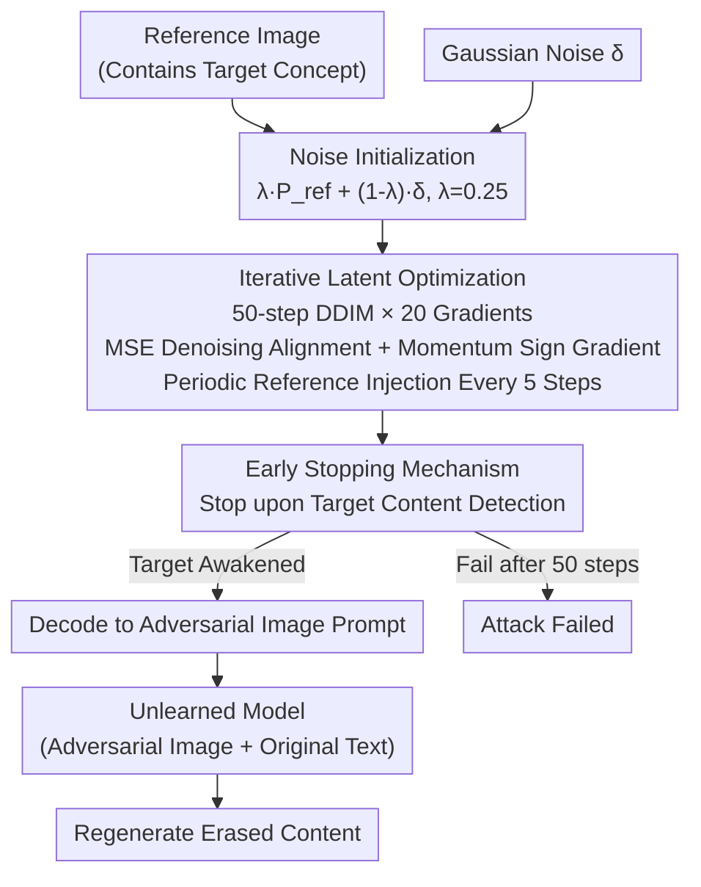

# Image Can Bring Your Memory Back: A Novel Multi-Modal Guided Attack against Image Generation Model Unlearning

**Conference**: ICLR 2026  
**arXiv**: [2507.07139](https://arxiv.org/abs/2507.07139)  
**Code**: [GitHub](https://github.com/ryliu68/RECALL)  
**Area**: Diffusion Models / Unlearning / Security  
**Keywords**: Machine unlearning attack, multi-modal adversarial, image prompt, diffusion model safety, robustness auditing  

## TL;DR

Recall proposes the first multi-modal guided attack framework. By optimizing adversarial image prompts in the latent space (requiring only one reference image) and combining them with original text prompts to exploit the image-conditioning channel of diffusion models, it achieves an average ASR of 65%~97% across 10 SOTA unlearning methods. This significantly outperforms text-only attack methods and reveals the vulnerability of current unlearning mechanisms to image-modality attacks.

## Background & Motivation

**Background**: Machine Unlearning for diffusion models has become a key technology for mitigating the generation of harmful or infringing content, with over ten methods proposed such as ESD, UCE, and AdvUnlearn.

**Limitations of Prior Work**: Existing attack methods (P4D, UnlearnDiffAtk, CCE) only perturb text prompts, facing four major issues: ① Text perturbations destroy semantic alignment; ② Dependence on external classifiers or the original model increases overhead; ③ Effectiveness drops sharply against adversarial-enhanced unlearning methods (AdvUnlearn); ④ Pure multi-modal conditioning capabilities of diffusion models are completely ignored.

**Key Challenge**: Unlearning methods primarily defend against the text modality, but Stable Diffusion naturally supports multi-modal conditional inputs like image+text (e.g., img2img). This channel is rarely explored as an attack vector.

**Goal**: Utilize the image-modality attack channel to bypass unlearning protections while maintaining the original text semantics.

**Key Insight**: Without modifying the text prompt (preserving semantics), optimize only an adversarial image prompt to make the unlearned model regenerate erased content. The optimization process is conducted directly within the latent space of the unlearned model, requiring no external models.

**Core Idea**: Use latent space adversarial optimization guided by a reference image to generate adversarial image prompts, "awakening" residual concept memories in the unlearned model through multi-modal channels.

## Method

### Overall Architecture

Recall aims to solve the problem where unlearned diffusion models erase concepts like "nudity" or "Van Gogh style" from the text channel, yet the native image-conditioning (img2img) channel remains, which is seldom considered an attack surface. The mechanism involves leaving the text prompt untouched (preserving semantics) while specifically optimizing an adversarial **image** prompt to "awaken" residual concept memories via the image channel.

The pipeline consists of three steps: first, a reference image containing the target concept and a noise-initialized image are encoded into the latent space of the unlearned model; second, the adversarial latent variable $z_{adv}$ is iteratively optimized in the latent space to align its denoising predictions with the reference image; finally, the optimized latent variable is decoded into an adversarial image prompt and fed back into the unlearned model along with the original text prompt for generation. The entire optimization is performed **internally** within the unlearned model without the aid of external classifiers or the original pre-unlearned model.

### Key Designs

**1. Noise Initialization: Expanding sampling space then planting a concept seed**

If the reference image is used directly as the image prompt for optimization, the generation results are often simple transformations of the reference image, lacking diversity and failing to follow the text prompt. Recall constructs the initial image prompt as a linear mixture of the reference signal and Gaussian noise: $P_{img}^{init} = \lambda \cdot P_{ref} + (1-\lambda) \cdot \delta$, where $\delta \sim \mathcal{N}(0, I)$ and $\lambda = 0.25$. By retaining only 25% of the reference signal and incorporating 75% noise, the large amount of noise expands the sampling space to ensure diversity, while the small reference signal acts as a "concept seed" providing a starting point for convergence toward the target concept.

**2. Iterative Latent Optimization: Using reference denoising predictions as alignment targets**

This is the core of the attack. Recall progresses through 50 DDIM timesteps, performing 20 gradient iterations on $z_{adv}$ at each step. The optimization goal is to minimize the MSE between the noise predictions of the adversarial latent and the reference latent under the same text condition:

$$\mathcal{L}_{adv} = \|\hat{\epsilon}_{ref,t} - \hat{\epsilon}_{adv,t}\|_2^2$$

This step forces the unlearned model to "reproduce" the erased concept represented by the reference image within the latent space. Gradient updates use the momentum sign gradient: $v_i = \beta \cdot v_{i-1} + \frac{\nabla_{z_{adv}} \mathcal{L}_{adv}}{\|\nabla_{z_{adv}} \mathcal{L}_{adv}\|_1 + \omega}$, followed by $z_{adv} \leftarrow z_{adv} + \eta \cdot \text{sign}(v_i)$. Momentum stabilizes the direction and helps escape local minima. To prevent losing semantic alignment, periodic reference injection is performed every 5 steps, mixing a small amount of $z_{ref}$ ($\gamma=0.05$) back into $z_{adv}$.

**3. Early Stopping: Ceasing once target content emerges**

The attack does not need to run for all 50 steps. Recall continuously monitors whether the target content reappears during optimization and stops immediately once detected, saving unnecessary iterations—one reason why it averages only ~64s. Conversely, if the target concept is not awakened after all 50 steps, the attack is deemed a failure.

### Loss & Training

The sole optimization goal is the latent space denoising alignment loss:

$$\mathcal{L}_{adv} = \|\hat{\epsilon}_{ref,t} - \hat{\epsilon}_{adv,t}\|_2^2$$

The three cost advantages of this design stem from its structure: since the text prompt is never modified, the CLIP Score remains high and semantic alignment is optimal; since optimization happens internally without external classifiers, a single attack takes only ~64s (vs. ~238s for P4D); and because it relies on a single reference image (obtainable from the web), it requires no batch reference data or original model access.

## Key Experimental Results

### Main Results (Average ASR across 10 unlearning methods)

| Task | P4D-N | CCE | UnlearnDiffAtk | WACE-C | **Recall** |
|------|-------|-----|----------------|--------|------------|
| Nudity-I2P | 57.61 | 50.42 | 63.87 | 57.04 | **80.77** |
| Nudity-MMA | 69.51 | 55.70 | 76.52 | 66.25 | **88.20** |
| Van Gogh | 92.00 | 77.20 | 97.20 | 48.00 | **97.40** |
| Object-Church | 49.80 | 55.80 | 62.40 | 41.40 | **73.40** |
| Object-Parachute | 38.20 | 60.40 | 59.80 | 38.80 | **97.00** |

### Semantic Alignment (CLIP Score, I2P Task)

| Method | ESD | MACE | RECE | UCE | Receler | DoCo |
|------|-----|------|------|-----|---------|------|
| P4D | 24.09 | 23.20 | 24.99 | 24.90 | 25.64 | 23.70 |
| UnlearnDiffAtk | 29.61 | 23.11 | 29.25 | 29.17 | 29.00 | 31.18 |
| **Recall** | **32.13** | **24.79** | **30.66** | **31.31** | **31.12** | **31.95** |

### Key Findings

- **Attack on strongest defense AdvUnlearn**: Recall ASR reaches 60.56% (I2P), 82.81% (MMA), and 92% (Van Gogh), far exceeding the single-digit to 25% rates of other methods.
- **Efficiency**: Averaging ~64s, it is 3.5× faster than P4D-N (~238s) and UnlearnDiffAtk (~232s).
- **Reference Image Independence**: ASR and diversity metrics remain stable across different reference images.
- **Cross-model Generalization**: Equally effective on SD 2.0 and SD 2.1.
- **Diversity**: Generated images' LPIPS/IS are comparable to text-only methods and far superior to image-only methods.

## Highlights & Insights

- **First systematic exploitation of image modality for unlearning attacks**: Reveals a "modality blind spot" in current unlearning methods—protecting text while ignoring images.
- **Single reference image + latent optimization = Lightweight and efficient**: No need for the original model, external classifiers, or batch reference data.
- **Attack as Auditing**: Recall serves as a robustness auditing tool for model owners, allowing systematic evaluation of unlearning quality before deployment.
- **Semantic-preserving adversarial design**: Through the triple mechanism of no-text-modification, noise initialization, and reference injection, generated content restores target concepts while aligning closely with prompt semantics.

## Limitations & Future Work

- White-box setting (requires model weights); applicability to black-box scenarios remains to be verified.
- Lower ASR on MACE for certain tasks (e.g., Church at 50%), possibly related to MACE's LoRA mechanism.
- Evaluated only on the SD architecture series; newer architectures like Flux/DiT were not tested.
- Still requires a reference image containing the target concept (though requirements are loose); purely zero-reference scenarios are not feasible.

## Related Work & Insights

- **vs P4D**: Text optimization attack with poor semantic alignment (CLIP Score lower by 6+ points) and only 2-8% ASR against AdvUnlearn.
- **vs UnlearnDiffAtk**: Also white-box but text-only; Avg. ASR on I2P is 63.87% vs Recall's 80.77%.
- **vs CCE**: Recovers concepts via placeholders using textual inversion, but has the lowest CLIP Score (~19) and severe semantic deviation.
- **vs WACE**: Noise-probing based method with limited effectiveness against strong defenses.
- **Insight**: The logic of multi-modal attacks can be extended to safety auditing for video models and large multi-modal models.

## Rating

- Novelty: ⭐⭐⭐⭐⭐ First multi-modal unlearning attack framework, opening a new attack surface.
- Experimental Thoroughness: ⭐⭐⭐⭐⭐ 10 unlearning methods × 4 task types × 6 datasets × multiple baselines; extremely comprehensive.
- Writing Quality: ⭐⭐⭐⭐ Clear problem exposition and easy-to-follow method pipeline.
- Value: ⭐⭐⭐⭐⭐ Significant warning for the unlearning security field and provides a practical auditing tool.

<!-- RELATED:START -->

## Related Papers

- [\[ICLR 2026\] ColorCtrl: Training-Free Text-Guided Color Editing Based on Multi-Modal Diffusion Transformer](training-free_text-guided_color_editing_with_multi-modal_diffusion_transformer.md)
- [\[ICLR 2026\] SIGMA-GEN: Structure and Identity Guided Multi-Subject Assembly for Image Generation](sigma-gen_structure_and_identity_guided_multi-subject_assembly_for_image_generat.md)
- [\[ICLR 2026\] Follow-Your-Shape: Shape-Aware Image Editing via Trajectory-Guided Region Control](follow-your-shape_shape-aware_image_editing_via_trajectory-guided_region_control.md)
- [\[ICLR 2026\] ImageRAG: Dynamic Image Retrieval for Reference-Guided Image Generation](imagerag_dynamic_image_retrieval_for_reference-guided_image_generation.md)
- [\[ICLR 2026\] There and Back Again: On the Relation between Noise and Image Inversions in Diffusion Models](there_and_back_again_on_the_relation_between_noise_and_image_inversions_in_diffu.md)

<!-- RELATED:END -->
