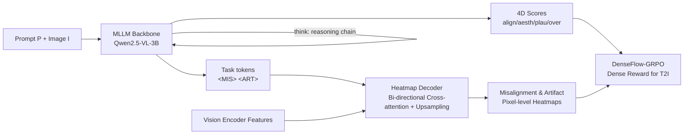

# ImageDoctor: Diagnosing Text-to-Image Generation via Grounded Image Reasoning

**Conference**: ICLR 2026  
**OpenReview**: [https://openreview.net/forum?id=04HwYGgp2w](https://openreview.net/forum?id=04HwYGgp2w)  
**Project Page**: [https://image-doctor.github.io/](https://image-doctor.github.io/)  
**Area**: Image Generation / T2I Evaluation / Preference Modeling  
**Keywords**: Text-to-Image Evaluation, Human Preference Model, Multi-dimensional Scoring, Defect Heatmap, GRPO, Dense Reward  

## TL;DR
ImageDoctor upgrades text-to-image (T2I) quality evaluation from "providing a single score" to "clinical diagnosis." Built on a Multimodal Large Language Model (MLLM), it follows a "look-think-predict" workflow to locate defect regions, perform reasoning, and output four-dimensional scores (alignment, aesthetics, plausibility, overall) along with pixel-level defect heatmaps. This dense feedback is integrated into DenseFlow-GRPO as a reward, improving T2I model preference alignment by approximately 10% compared to scalar rewards.

## Background & Motivation
**Background**: As diffusion and flow models elevate T2I quality to high levels, evaluators (reward models/verifiers) have become critical—serving both as benchmarks for quality measurement and as feedback sources for RLHF and test-time scaling. Mainstream human preference models like HPS, ImageReward, and PickScore essentially compress an image into a **single scalar score**.

**Limitations of Prior Work**: Single scalar evaluation suffers from two major flaws. First is **information collapse**—two images might receive the same score despite one being aesthetic but misaligned with the prompt, while the other is aligned but contains strange artifacts. Scalar scores cannot decouple these dimensions, leading to poor explainability. Second is the **lack of spatial grounding**—evaluators provide judgments for the whole image without specifying "where the problem is." In reality, many T2I failures are "localized": most of the prompt is satisfied, but specific fine-grained details are missing or incorrect. Without localization, actionable feedback cannot be provided.

**Key Challenge**: When evaluators are used as reward functions for RLHF (e.g., Flow-GRPO), **sparse image-level scalar rewards** distribute rewards uniformly across all pixels. High-quality and low-quality regions are treated equally, failing to penalize local low-quality areas effectively, resulting in coarse training signals.

**Goal**: To create a unified "diagnostic" evaluation framework that provides multi-dimensional scores and localized defect heatmaps, enabling this dense feedback to drive improvements in T2I models.

**Key Insight**: **"Diagnostic Evaluation"**—leveraging the reasoning and common-sense capabilities of MLLMs to perform grounded image reasoning via a **"look-think-predict"** paradigm (locate defect boxes → reason with local evidence → output 4D scores and heatmaps). **DenseFlow-GRPO** is designed to transform heatmaps into pixel-level dense rewards for closed-loop optimization of generative models.

## Method

### Overall Architecture
ImageDoctor utilizes a fine-tuned MLLM (Qwen2.5-VL-3B) as its backbone. Given a prompt $P$ and image $I$, the backbone outputs four scalar scores $s_d, d \in \{\text{align, aesth, plau, over}\}$ and two special task tokens `<MIS>`/`<ART>` following the "look-think-predict" process. These tokens, along with image features and heatmap tokens, are fed into a lightweight **Heatmap Decoder** to generate two pixel-level heatmaps $H_d \in \mathbb{R}^{H \times W}$ for misalignment and artifacts. Training involves two stages (Cold-start SFT + GRPO reinforcement fine-tuning). Finally, the dense feedback is integrated into the downstream DenseFlow-GRPO to improve the generative model.

### Key Designs

**1. Unified Architecture + SAM-style Heatmap Decoder**: Enabling a single model to output both "textual scores" and "pixel heatmaps." While scalar scores are directly output as text, pixel-level heatmaps require image output capabilities. The authors designed a lightweight decoder that takes three inputs: image features from the vision encoder, a learnable heatmap token, and task tokens $t \in \{\texttt{<ART>}, \texttt{<MIS>}\}$ generated by the MLLM. Since the task tokens are produced after the MLLM integrates the image, prompt, and reasoning chain, they compress high-level "where to look" judgments to guide the decoding. Borrowing from the SAM mask decoder, the decoder uses **bi-directional cross-attention** to fuse tokens with image embeddings, followed by convolutional upsampling. Ablations show that removing task tokens drops artifact/misalignment CC by 0.024/0.042, respectively, proving that these "reasoning-driven tokens" are crucial for localization accuracy.

**2. look-think-predict: Explicitly modeling the human diagnostic process as grounded image reasoning**. Instead of directly outputting conclusions, ImageDoctor first **looks** (predicts bounding boxes for defect regions to lock onto focus areas), then **thinks** (combines local visual evidence with contextual understanding to generate structured reasoning across dimensions), and finally **predicts** (outputs 4D scores and localization tokens). This paradigm makes evaluation traceable: ablations indicate "think" is more critical for score accuracy (PLCC 0.720 $\to$ 0.708), while "look" is more critical for heatmap localization (misalignment CC 0.224 $\to$ 0.160).

**3. Two-stage Training: Cold-start SFT for format, GRPO for reasoning incentive**. Cold-start SFT first teaches the MLLM to predict 4D scores and then the "look-think-predict" format using CoT data. CoT data is constructed by detecting highlight regions from ground-truth heatmaps to generate defect boxes, then using Gemini 2.5 Flash to generate detailed reasoning. The cold-start loss optimizes both text CoT and heatmap $L_2$:
$$L = -\sum_i \log p_\theta(z_i \mid z_{<i}, I, P) + \sum_d \|H_d - \tilde{H}_d\|_2^2$$
The second stage uses GRPO to estimate advantages within a group of $N$ candidate responses, further incentivizing reasoning diversity and generalization.

**4. Triplet Verifiable Rewards: Grounding, Score, and Heatmap**. During the RFT stage, three verifiable rewards are designed. **Grounding reward** $R_G$ encourages "few but accurate" boxes covering defect areas using three components: Completeness (union of boxes must cover heatmap highlights), Compactness (boxes should minimize non-defect areas), and Uniqueness (penalizing redundant IoU between boxes). **Score reward** $R_S = \sum_d (1 - \|s_d - \tilde{s}_d\|_1)$ minimizes the $\ell_1$ distance to human scores. **Heatmap reward** $R_H = \sum_d (1 - \|H_d - \tilde{H}_d\|_2^2)$ encourages sharp and precise localization. Total reward $R = R_G + R_S + R_H$.

**5. DenseFlow-GRPO: Transforming heatmaps into pixel-level dense rewards**. Standard Flow-GRPO uses an image-level scalar reward $R(x_0^i, c)$, where all pixels share the same advantage $\hat{A}_t^i$. DenseFlow-GRPO rewrites the likelihood ratio for each step, utilizing stop-gradient to allow pixel-level advantages to backpropagate to local regions:
$$s_t^i(\phi, h, w) = \text{sg}\big(r_t^i(\phi)\big) \cdot \frac{p_\phi(x_{t-1}^i \mid x_t^i, c)_{h,w}}{\text{sg}\big(p_\phi(x_{t-1}^i \mid x_t^i, c)_{h,w}\big)}$$
Image-level reward $R$ and pixel-level reward $R_P$ are combined into a dense reward $R_D(x_0^i, c, h, w) = R(x_0^i, c) \cdot (1 - R_P(x_0^i, c, h, w))$, used to calculate pixel-wise normalized advantages $\hat{A}_t^i(h,w)$. This allows T2I models to learn both "what makes a good image globally" and "how to refine local regions."

## Key Experimental Results

### Main Results (RichHF-18K Score Prediction, PLCC↑ / SRCC↑)

| Method | Plausibility | Aesthetics | Semantic Align. | Overall | Avg PLCC | Avg SRCC |
|---|---|---|---|---|---|---|
| ResNet-50 | 0.495 | 0.370 | 0.108 | 0.337 | 0.328 | 0.319 |
| CLIP | 0.390 | 0.357 | 0.398 | 0.353 | 0.374 | 0.370 |
| PickScore | 0.010 | 0.131 | 0.346 | 0.202 | 0.172 | 0.183 |
| RichHF | 0.693 | 0.600 | 0.474 | 0.580 | 0.586 | 0.582 |
| **ImageDoctor** | **0.727** | **0.681** | **0.808** | **0.745** | **0.741** | **0.724** |

The semantic alignment dimension saw the largest improvement (PLCC 0.474 $\to$ 0.808), with average PLCC increasing from 0.586 to 0.741. Heatmap prediction also outperformed RichHF across all metrics (MSE, CC, KLD, SIM).

Cross-dataset generalization (trained on RichHF-18K, zero-shot): GenAI-Bench RichHF-PLCC 0.514 (Second best EvalMuse 0.498), TIFA PLCC 0.808 / SRCC 0.799, outperforming CLIPScore, ImageReward, PickScore, HPSv2/v3, VQAScore, and EvalMuse.

### Ablation Study (RichHF-18K)

| Setting | Avg PLCC↑ | Avg SRCC↑ | Artifact CC↑ | Misalign CC↑ |
|---|---|---|---|---|
| Cold Start Stage 1 | 0.660 | 0.656 | - | - |
| + Heatmap | 0.655 | 0.650 | 0.532 | 0.165 |
| + Heatmap w/o task token | 0.653 | 0.645 | 0.508 | 0.123 |
| Cold Start Stage 2 | 0.720 | 0.707 | 0.558 | 0.224 |
| w/o "look" | 0.714 | 0.705 | 0.534 | 0.160 |
| w/o "think" | 0.708 | 0.698 | 0.542 | 0.190 |
| Reinforcement Finetuning | **0.741** | **0.724** | **0.571** | **0.225** |

### Key Findings
- **Task tokens are crucial for localization**: Removing them causes artifact/misalignment CC to drop by 0.024/0.042.
- **"look" handles localization, "think" handles scoring**: Removing "think" impact PLCC significantly, while removing "look" impacts misalignment CC.
- **Downstream Gains (DrawBench, SD3.5-medium)**: As a reward, Flow-GRPO using ImageDoctor (ImageReward 1.029) outperforms PickScore (1.002) and RichHF (0.879). DenseFlow-GRPO with dense rewards achieves the best results (ImageReward 1.100 / UnifiedReward 3.000), a ~10% improvement over scalar rewards.
- **As a verifier**: In Flux-dev 1024×1024 Best-of-16 sampling, it more reliably selects images with faithful prompts and reasonable object scales compared to PickScore/ImageReward.
- **Low training cost**: Utilizes only 4 AMD MI250 GPUs, 3B backbone, and RFT takes only 400 steps.

## Highlights & Insights
- **Redefining "Evaluation" as "Diagnosis"**: Moving from single scalar $\to$ 4D scores + pixel heatmaps provides both high explainability and actionable feedback.
- **Heatmaps as feedback, not just visualization**: DenseFlow-GRPO ensures that specialized spatial feedback is closed-loop into generative model training.
- **Task Token design**: Injecting high-level MLLM reasoning into the decoder via tokens bridges "linguistic reasoning" and "pixel-level localization" rather than treating them as independent branches.
- **Rigorous Verifiable Reward Engineering**: Decomposing the grounding reward into completeness, compactness, and uniqueness components effectively quantifies spatial accuracy.

## Limitations & Future Work
- **Heavy dependence on RichHF-18K**: Defect types and styles are tied to this specific dataset (Pick-a-Pic subset), though zero-shot generalization on GenAI-Bench/TIFA is promising.
- **CoT data synthesis**: Reasoning chains are generated by Gemini 2.5 Flash, which may introduce teacher model bias and is limited by prompt design.
- **Backbone size**: The authors did not report scaling curves for larger backbones; whether stronger MLLMs provide more detailed diagnosis remains an open question.
- **Framework validation**: DenseFlow-GRPO was only verified on SD3.5-medium/Flow models; applicability to other paradigms like auto-regressive T2I is not explored.

## Related Work & Insights
- **Human Preference Models**: From CLIPScore and PickScore to HPSv3 (MLLM backbone + uncertainty ranking), this work follows the trend of MLLM-based evaluation but addresses the lack of multi-dimensionality and localization.
- **Multidimensional Evaluation**: Following RichHF and HELM, ImageDoctor adds reasoning paradigms and dense reward loops.
- **Architecture Inspiration**: The heatmap decoder leverages the SAM mask decoder; dense likelihood ratios utilize stabilization techniques from GSPO-token.
- **Insight**: Transitioning evaluators from "scalar referees" to "explainable diagnostic sources" provides significant value for any generative task requiring RLHF (video, 3D, audio)—dense supervision of "where it is bad" is more effective than "overall scoring" for driving local refinement.

## Rating
- **Novelty**: ⭐⭐⭐⭐ — While multi-dimensional scoring exists (RichHF), the combination of look-think-predict, task token decoders, and DenseFlow-GRPO dense rewards creates a high-innovation closed-loop system.
- **Experimental Thoroughness**: ⭐⭐⭐⭐ — Comprehensive validation across three datasets, zero-shot generalization, detailed ablations, and two downstream applications (verifier/reward). Only lacking backbone scaling and more generation paradigms.
- **Writing Quality**: ⭐⭐⭐⭐ — The "doctor diagnosis" analogy is consistent, charts are clear, and the transition from motivation to method is logical.
- **Value**: ⭐⭐⭐⭐ — Explainable evaluators + dense rewards provide a 10% gain for T2I RLHF with low training costs (4×MI250), making it highly practical and replicable.

<!-- RELATED:START -->

## Related Papers

- [\[ICLR 2026\] RePrompt: Reasoning-Augmented Reprompting for Text-to-Image Generation via Reinforcement Learning](reprompt_reasoning-augmented_reprompting_for_text-to-image_generation_via_reinfo.md)
- [\[ICLR 2026\] MILR: Improving Multimodal Image Generation via Test-Time Latent Reasoning](milr_improving_multimodal_image_generation_via_test-time_latent_reasoning.md)
- [\[ICML 2026\] OcclusionFormer: Arranging Z-Order for Layout-Grounded Image Generation](../../ICML2026/image_generation/occlusionformer_arranging_z-order_for_layout-grounded_image_generation.md)
- [\[ICLR 2026\] Guidance Matters: Rethinking the Evaluation Pitfall for Text-to-Image Generation](guidance_matters_rethinking_the_evaluation_pitfall_for_text-to-image_generation.md)
- [\[ICLR 2026\] FLUX-Reason-6M & PRISM-Bench: A Million-Scale Text-to-Image Reasoning Dataset and Comprehensive Benchmark](flux-reason-6m_prism-bench_a_million-scale_text-to-image_reasoning_dataset_and_c.md)

<!-- RELATED:END -->
