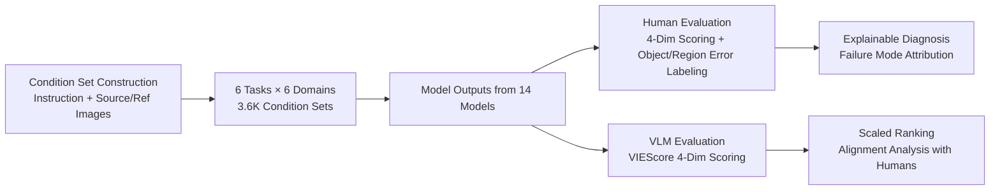

# ImagenWorld: Stress-Testing Image Generation Models with Explainable Human Evaluation on Open-ended Real-World Tasks

**Conference**: ICLR 2026  
**OpenReview**: [https://openreview.net/forum?id=bld9g6jFh9](https://openreview.net/forum?id=bld9g6jFh9)  
**Project Page**: [https://tiger-ai-lab.github.io/ImagenWorld/](https://tiger-ai-lab.github.io/ImagenWorld/)  
**Code**: To be confirmed  
**Area**: Image Generation / Evaluation Benchmarks  
**Keywords**: Image Generation Benchmark, Explainable Human Evaluation, Image Editing, Unified Generative Models, VLM-as-a-judge  

## TL;DR
ImagenWorld constructs an explainable image generation benchmark capable of "locating which object or region the model failed on" using 3.6K condition sets × 6 tasks × 6 domains and 20,000 fine-grained human annotations. It systematically reveals common failure patterns in local editing and text-dense content across 14 generative and editing models.

## Background & Motivation
**Background**: Diffusion, autoregressive, and hybrid architectures have pushed text-to-image, editing, and reference-guided synthesis to high-quality levels. Recently, "unified models" (GPT-Image-1, Gemini, BAGEL, OmniGen2, etc.) that perform both generation and editing within a single framework have emerged.

**Limitations of Prior Work**: Evaluation protocols have not kept pace with modeling progress. Existing benchmarks either cover isolated tasks (pure T2I, pure editing, or pure personalization), focus on narrow domains (artistic or text-only images), or provide only scalar scores without explaining specific model failures. This leaves a core question unanswered: how well these unified models generalize across the full spectrum of real-world use cases.

**Key Challenge**: Scalar scores (FID, CLIPScore, VLM-based scoring) allow for ranking but lack explainability. Conversely, fine-grained judgments that can locate failure modes (e.g., missing objects or regional distortions) rely on human labor and are difficult to scale. Creating a unified protocol that covers task and domain diversity while providing explainable error attribution remains a critical gap.

**Goal**: To build a rigorous diagnostic tool—a benchmark covering six tasks and six domains, paired with structured human evaluation. This benchmark not only provides scores but also identifies specific failure patterns, incorporating VLM-as-a-judge for scaled comparisons.

**Core Idea**: **Unified Framework**: Generation and editing are unified as conditional tasks defined by "instruction + optional source/reference images." **Explainable Schema**: Annotators use text to mark object-level errors and Set-of-Mark masks to label region-level errors, answering "why the model failed" beyond simple scores.

## Method

### Overall Architecture
ImagenWorld unifies all tasks under an instruction-driven framework. Each task is conditioned on a natural language instruction $t_{ins}$, with optional source images $I_{src}$ or reference image sets $I_R$. These are categorized into "instruction-driven generation" and "instruction-driven editing" across six specific tasks. The data comprises human-written prompts and images refined through an automated pipeline, covering six domains with 100 samples per task-domain combination (3.6K sets total). Each model output is assessed by three human annotators (using the explainable schema) and a VLM (scoring only), resulting in 20,000 annotations.

### Key Designs

**1. Unified Formalization of Six Tasks**: The authors categorize user-system interactions into a common conditional interface, expanded along two axes: "Presence of Source Image" and "Number of Reference Images." Generation tasks include Text-Informed Generation (TIG: $y=f(t_{ins})$), Single-Reference Generation (SRIG: $y=f(I_{ref},t_{ins})$), and Multi-Reference Generation (MRIG: $y=f(I_R,t_{ins})$). Mapping symmetrically, editing tasks include TIE ($y=f(t_{ins},I_{src})$), SRIE ($y=f(I_{ref},t_{ins},I_{src})$), and MRIE ($y=f(I_R,t_{ins},I_{src})$). This structure allows for direct comparison of "Generation vs. Editing" difficulty and complexity within the same coordinate system.

**2. Six Domains × Fine-grained Sub-topics**: The dataset spans Artistic (A), Photography (P), Infographic (I), Text-rich (T), Computer Graphics (CG), and Screenshot (S). This design specifically includes "symbol-dense" content. While traditional benchmarks favor "aesthetic" domains, infographics and screenshots require precise text rendering and layout alignment—areas where current models are weakest and most neglected.

**3. Four-dimensional Scoring + Explainable Error Labeling**: Evaluation uses four complementary dimensions scored on a 5-point Likert scale (normalized to $[0,1]$): Prompt Relevance, Aesthetic Quality, Content Coherence (logical consistency), and Artifacts (distortions). The innovation lies in two attribution taxonomies: **Object-level errors**, where annotators mark missing or distorted items from a "target object list" generated by Gemini-2.5-Flash, and **Region-level errors**, where Set-of-Mark (SoM) masks allow annotators to select specific areas with visual defects.

**4. Dual Human-VLM Evaluation**: Each image is independently scored by three annotators (measured via Krippendorff's $\alpha$). Simultaneously, Gemini-2.5-Flash generates 4-dimensional scores following the VIEScore paradigm. The alignment between VLM and human rankings is quantified via Spearman's $\rho_s$ and Kendall accuracy, testing whether VLMs can replace humans for relative ranking while exposing their limitations in fine-grained explainability.

## Key Experimental Results

### Main Results
- **Scale**: 3.6K condition sets, 6 tasks × 6 domains; 20,000 fine-grained human annotations.
- **Models**: 14 models, including 4 unified models (GPT-Image-1, Gemini 2.0 Flash, BAGEL, OmniGen2) and 10 specialized models (SDXL, InstructPix2Pix, Flux.1-Krea-dev, etc.) covering Diffusion, Autoregressive, and Hybrid architectures.
- **Evaluation**: Three-annotator human consensus + VLM (Gemini-2.5-Flash) 4-dimensional scoring + error labeling.

### Key Findings by Task and Domain

| Dimension | Observation |
|------|------|
| Closed-source vs. Open-source | GPT-Image-1 is the strongest overall, outperforming Gemini 2.0 Flash by 0.1–0.2; the gap is larger in editing tasks. |
| Generation vs. Editing | All models perform systematically lower on editing tasks (TIE/SRIE/MRIE) compared to generation tasks, with an average gap of ~0.1. |
| Domain Difficulty | Artistic/Photography are easiest (mean $\approx 0.78$); Text-rich/CG are moderate ($\approx 0.68$); Screenshots/Infographics are hardest ($\approx 0.55$). |
| Scale $\neq$ Success | Some open-source models (e.g., Flux-Krea-dev) outperform Gemini in T2I, but no open-source unified model matches the performance of closed-source counterparts. |

### Key Findings
- **Two Failure Modes in Editing**: Models tend to either "regenerate a completely new image" or "return the input unchanged." This indicates a lack of fine-grained control mechanisms for local regions in current architectures.
- **Text-dense Content is a Universal Weakness**: However, Qwen-Image is an exception, leading significantly in text-rich domains due to its specialized synthetic data curation pipeline, suggesting that data design is as crucial as architecture.
- **VLM as a Scaled Ranker, not an Explainer**: VLM metrics reach a Kendall accuracy of up to 0.79, making them reliable for relative ranking. However, they struggle with fine-grained failure labeling, where human judgment remains indispensable.

## Highlights & Insights
- **From Scoring to Diagnosis**: The dual taxonomy of object and region-level errors allows every score to be traced back to a specific failure source, distinguishing ImagenWorld from benchmarks like ImagenHub or GenAI-Arena.
- **Unified Formalization Dividends**: Symmetric tasks allow for the first-ever quantification of the "generation-editing difficulty gap" within a single comparable framework.
- **Data-centric Insights**: The performance of Qwen-Image shifts the narrative from purely architectural improvements to targeted data curation as a path to overcoming current model limitations.

## Limitations & Future Work
- **High Human Evaluation Cost**: The explainable schema relies on triple annotation and SoM segmentation, making it expensive to scale or update continuously.
- **VLM Bias**: VIEScore metrics inherit the biases of the proprietary models (e.g., Gemini) used for automated scoring.
- **Snapshot Limitation**: The evaluation of 14 models represents a point-in-time snapshot; the benchmark will require continuous updates as generative models evolve rapidly.
- **Future Work**: The authors aim to use this dataset to train the next generation of "Explainable VLM Evaluators" by distilling fine-grained human judgment into automated metrics.

## Related Work & Insights
- **Metric Taxonomy**: Progresses from FID/LPIPS (fidelity) and CLIPScore (alignment) to VIEScore (VLM semantics) and ImagenWorld's explainable approach.
- **Benchmark Comparison**: Unlike DrawBench (T2I only) or Gecko (alignment), ImagenWorld focuses on the intersection of unified tasks, multiple domains, and structured explainability.

## Rating
- **Novelty**: ⭐⭐⭐⭐ — The object and region-level error attribution schema is a distinctive contribution that moves image generation evaluation toward diagnostic mapping.
- **Experimental Thoroughness**: ⭐⭐⭐⭐⭐ — Solid scale with 3.6K sets, 20K annotations, 14 diverse models, and rigorous statistical alignment tests.
- **Writing Quality**: ⭐⭐⭐⭐ — Clear motivation-gap-contribution logic; well-structured insights and intuitive visualizations.
- **Value**: ⭐⭐⭐⭐⭐ — Provides a "failure map" for model developers and identifies clear boundaries for VLM-as-a-judge, offering long-term reference value for both modeling and evaluation research.

<!-- RELATED:START -->

## Related Papers

- [\[ICLR 2026\] WorldEdit: Towards Open-World Image Editing with a Knowledge-Informed Benchmark](worldedit_towards_open-world_image_editing_with_a_knowledge-informed_benchmark.md)
- [\[ICLR 2026\] Many-for-Many: Unify the Training of Multiple Video and Image Generation and Manipulation Tasks](many-for-many_unify_the_training_of_multiple_video_and_image_generation_and_mani.md)
- [\[ICML 2026\] WISE: A World Knowledge-Informed Semantic Evaluation for Text-to-Image Generation](../../ICML2026/image_generation/wise_a_world_knowledge-informed_semantic_evaluation_for_text-to-image_generation.md)
- [\[CVPR 2025\] UniReal: Universal Image Generation and Editing via Learning Real-world Dynamics](../../CVPR2025/image_generation/unireal_universal_image_generation_and_editing_via_learning_real-world_dynamics.md)
- [\[ICLR 2026\] Guidance Matters: Rethinking the Evaluation Pitfall for Text-to-Image Generation](guidance_matters_rethinking_the_evaluation_pitfall_for_text-to-image_generation.md)

<!-- RELATED:END -->
## Related Papers

- [\[ICLR 2026\] WorldEdit: Towards Open-World Image Editing with a Knowledge-Informed Benchmark](worldedit_towards_open-world_image_editing_with_a_knowledge-informed_benchmark.md)
- [\[ICML 2026\] WISE: A World Knowledge-Informed Semantic Evaluation for Text-to-Image Generation](../../ICML2026/image_generation/wise_a_world_knowledge-informed_semantic_evaluation_for_text-to-image_generation.md)
- [\[CVPR 2025\] UniReal: Universal Image Generation and Editing via Learning Real-world Dynamics](../../CVPR2025/image_generation/unireal_universal_image_generation_and_editing_via_learning_real-world_dynamics.md)
- [\[ICLR 2026\] Guidance Matters: Rethinking the Evaluation Pitfall for Text-to-Image Generation](guidance_matters_rethinking_the_evaluation_pitfall_for_text-to-image_generation.md)
- [\[ICLR 2026\] ChronoEdit: Towards Temporal Reasoning for In-Context Image Editing and World Simulation](chronoedit_towards_temporal_reasoning_for_in-context_image_editing_and_world_sim.md)

<!-- RELATED:END -->
