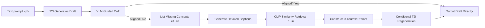

# ImageRAG: Dynamic Image Retrieval for Reference-Guided Image Generation

**Conference**: ICLR 2026  
**OpenReview**: [https://openreview.net/forum?id=VT3tTfXrDi](https://openreview.net/forum?id=VT3tTfXrDi)  
**Code**: [https://rotem-shalev.github.io/ImageRAG](https://rotem-shalev.github.io/ImageRAG)  
**Area**: Image Generation / Retrieval-Augmented Generation (RAG)  
**Keywords**: Retrieval-Augmented Generation, Rare Concept Generation, Vision-Language Model, Training-free, Reference-guided Generation  

## TL;DR
ImageRAG translates the RAG concept from LLMs to image generation: it first produces a draft using a T2I model, then uses a VLM's guided Chain-of-Thought to identify "incorrectly drawn or missing" concepts, retrieves reference images as needed, and feeds them back into the model. This process significantly improves the generation of rare and fine-grained concepts without requiring any additional training.

## Background & Motivation
**Background**: Diffusion-based T2I models (SDXL, FLUX, OmniGen, etc.) are capable of producing high-quality, diverse images for common concepts and have enabled various tasks such as layout generation, image editing, and style transfer.

**Limitations of Prior Work**: These models are limited by their training data and often fail on rare concepts, user-specific concepts, or fine-grained categories (e.g., a specific bird like *Cyanocitta cristata*). They may even "hallucinate" content unrelated to the text when failing to understand the prompt. Existing methods for personalization or rare concept generation almost always require training or optimization for each new concept. A few retrieval-augmented generation works (RDM, knn-diffusion, ReImagen, etc.) either train a retrieval-generation model from scratch or require training a specific retrieval module for each base model, lacking universality.

**Key Challenge**: While RAG in the text domain can fit all retrieved information into the context, the context window for image generation is extremely limited—it is impossible to provide reference images for every concept in a prompt. Therefore, three questions must be answered: **which images to use, how to retrieve them, and how to use them.**

**Goal**: Propose a **training-free**, **backbone-agnostic**, and **condition-agnostic** method to dynamically retrieve reference images during the sampling stage to enhance the rare/fine-grained concept generation capabilities of existing T2I models.

**Core Idea**: **Only supplement concepts that the model cannot draw.** Utilizing the fact that T2I models can already generate many concepts, the method first generates a draft. A VLM's guided Chain-of-Thought is used to locate the "generation gap." Reference images are retrieved only for missing concepts and fed back into the model as in-context examples via off-the-shelf image conditioning tools (IP-Adapter, OminiControl, or OmniGen's native image input).

## Method

### Overall Architecture
Given a text prompt `
`, ImageRAG first generates a draft using a T2I model. Then, a VLM executes a guided Chain-of-Thought to determine if the draft aligns with the prompt. If not, it lists the missing concepts and generates a "retrieval caption" for each. These captions are used to retrieve reference images from an external database. Finally, the reference images are concatenated into an in-context template to regenerate the image. The entire pipeline is training-free and can optionally iterate until the VLM determines alignment.

### Key Designs

**1. Guided Multimodal Chain-of-Thought: Splitting "gap detection" into three steps.** Asking a VLM "what is wrong with this image" often yields vague or over-diversified answers. The authors explicitly split the diagnosis into three serial questions: first, `Q: Does this image match the prompt?` (Decision); if not, `Q: Which concepts are missing?` (Focusing on visually communicable dimensions like content and style); finally, `Q: Write a retrieval caption for each missing concept.` A key engineering detail involves using a few-shot example to constrain the VLM to return **short, general** concepts, preventing overthinking from causing retrieval drift. This step ensures retrieval only for truly missing concepts (saving context) and provides interpretability.

**2. Retrieval: Using detailed captions instead of raw keywords; CLIP cosine is sufficient.** An intuitive finding is that retrieving with a concept keyword (e.g., "calculus class setting") performs worse than using a detailed caption (see Ablation Tab.3). Thus, the final CoT step expands concepts into detailed captions. Retrieval uses text-image similarity: the authors compared CLIP, SigLIP cosine, and re-ranking strategies, finding that re-ranking is occasionally better but not significantly so. For simplicity, CLIP embedding cosine similarity is used: $\text{sim}(c, i) = \cos(\phi_{\text{text}}(c), \phi_{\text{img}}(i))$. This reveals a paradox: if SDXL uses CLIP as a text encoder, why does it fail to generate concepts that the same CLIP can retrieve? The authors hypothesize that **retrieval is easier than generation**—concepts the model cannot generate can still be "understood and learned" from real images retrieved via CLIP.

**3. In-context Reference Injection: Reusing off-the-shelf conditioning tools with template-based concatenation.** After retrieval, no weights are modified. The reference images are treated as in-context examples. Given prompt $p$, $n$ missing concepts, and a reference image for each, the template is: *"According to these examples of `<c1>:<img1>, ..., <cn>:<imgn>`, generate `
`"*, where $c_i$ is the caption of $\text{img}_i$. This template allows OmniGen (native image support), SDXL + IP-Adapter, and FLUX + OminiControl to consume the reference images directly, achieving **backbone and condition-agnosticism**.

**4. Optional Thresholds and Iteration.** The method naturally supports quality control: a similarity threshold can be set so that only "high-quality" references are used. After generation, the VLM can judge alignment again, iterating the "diagnose-retrieve-generate" loop until alignment is reached or a limit is hit. This allows for a tunable trade-off between "aggressive completion" and "robustness against degradation."

## Key Experimental Results

Backbones: OmniGen, SDXL+IP-Adapter, FLUX+OminiControl; VLM: GPT series; Retrieval: CLIP; Database: 350K subset of LAION; Datasets: ImageNet / iNaturalist / CUB (focused on long-tail/fine-grained classes).

### Main Results (GPTScore, higher is better, Tab.1)

| Dataset | OmniGen | ImageRAG-O | FLUX | ImageRAG-F | SDXL | ImageRAG-SD |
|---|---|---|---|---|---|---|
| ImageNet | 0.68 | **0.88** | 0.84 | **0.90** | 0.86 | **0.92** |
| iNaturalist | 0.06 | **0.56** | 0.07 | **0.31** | 0.51 | **0.70** |
| CUB | 0.45 | **0.73** | 0.79 | **0.85** | 0.94 | **0.97** |

The addition of ImageRAG consistently improved GPTScore across all three backbones. The most significant gains were observed in difficult fine-grained datasets like iNaturalist (OmniGen 0.06 → 0.56). CLIP/SigLIP/DINO similarity (Tab.2) also showed consistent improvements.

### Ablation Study (OmniGen, Tab.3)

| Variant | ImageNet CLIP↑ | ImageNet DINO↑ | CUB CLIP↑ | CUB DINO↑ |
|---|---|---|---|---|
| OmniGen Baseline | 0.247 | 0.692 | 0.231 | 0.747 |
| Prompt Rewriting Only (No Images) | 0.248 | 0.696 | 0.230 | 0.750 |
| Concept Word Retrieval | 0.258 | 0.694 | 0.240 | 0.719 |
| Original Prompt Retrieval | 0.258 | 0.691 | 0.246 | 0.736 |
| **ImageRAG (Detailed Caption Retrieval)** | **0.264** | **0.708** | **0.253** | **0.760** |

Rewriting the prompt alone yielded almost no gain, indicating that benefits stem from **real reference images** rather than text paraphrasing. Detailed caption retrieval outperformed short concept or original prompt retrieval.

### Key Findings
- **User Study (67 participants, 977 comparisons, 231 absolute ratings)**: All three backbones with ImageRAG were significantly preferred in text alignment, visual quality, and overall preference. ImageRAG also outperformed specialized trained retrieval-generation models (RDM, knn-diffusion, ReImagen).
- **Absolute Study**: In samples where the VLM judged the "initial draft as non-aligned," ImageRAG results contained the target rare concepts in 92% (OmniGen) / 90% (SDXL) / 84% (FLUX) of cases, whereas baselines mostly failed—proving that VLM diagnosis of missing concepts is accurate.

## Highlights & Insights
- **Clean Paradigm Shift**: Successfully maps the mature RAG concept from NLP to image generation, identifying the unique constraint of "limited image context" and providing a "supplementing the gap" solution.
- **Training-free + Triple Agnostic**: Backbone-agnostic, condition-agnostic, and concept-agnostic. It reuses existing VLMs and conditioning tools, making it "plug-and-play" with a very low barrier to adoption.
- **"Retrieval is easier than generation" Insight**: The observation that the same CLIP model can retrieve what it cannot help generate suggests that the bottleneck for rare concepts lies in the generation end rather than the semantic representation end.
- **Explainable + Tunable**: The CoT reveals "what the model thinks is missing," and the threshold/iterative loop provides knobs for quality versus aggressiveness.

## Limitations & Future Work
- **Strong Dependency on VLM Diagnostic Quality**: The pipeline relies on the VLM accurately judging alignment and locating missing concepts. A weak VLM can cause the method to degrade.
- **Limited by Condition Capability Ceiling**: The amount of information injected depends on the backbone's conditioning mechanism (IP-Adapter / OminiControl), which may still be limited in complex multi-concept interaction scenarios.
- **Retrieval Coverage Floor**: When the external library lacks good samples for a target concept, retrieval quality drops, and gains are limited.
- **Metric Distortion**: CLIP/SigLIP/DINO are insensitive to fine-grained differences, making automated improvements "look modest." Evaluation relies heavily on costly GPTScores and human studies.

## Related Work & Insights
- **RAG (Lewis et al., 2020)**: The conceptual ancestor. ImageRAG is the first training-free implementation in the image generation domain.
- **Retrieval-Augmented Image Generation (RDM / knn-diffusion / ReImagen / Lyu et al. 2025)**: These require training specific modules for each backbone/task, which this work surpasses in flexibility.
- **Rare Concept Generation (Samuel et al. 2024, Pan et al. 2025)**: These depend on per-concept optimization or full fine-tuning; ImageRAG sidesteps this using in-context retrieval.
- **Yuan et al. (2025)**: Proposed prompt decomposition + layout which retrieves all concepts. However, it ignores existing model knowledge and can break interactions between concepts. ImageRAG only fills gaps, preserving interactions.

## Rating
- **Novelty**: ⭐⭐⭐⭐
- **Experimental Thoroughness**: ⭐⭐⭐⭐
- **Writing Quality**: ⭐⭐⭐⭐
- **Value**: ⭐⭐⭐⭐

<!-- RELATED:START -->

## Related Papers

- [\[ICLR 2026\] SketchEvo: Enhancing Sketch-Guided Image Generation with Dynamic Drawing Processes](sketchevo_leveraging_drawing_dynamics_for_enhanced_image_synthesis.md)
- [\[ICLR 2026\] Training-Free Reward-Guided Image Editing via Trajectory Optimal Control](training-free_reward-guided_image_editing_via_trajectory_optimal_control.md)
- [\[CVPR 2026\] CAST: Context-Aware Dynamic Latent Space Transformation for Interactive Text-to-Image Retrieval](../../CVPR2026/image_generation/cast_context-aware_dynamic_latent_space_transformation_for_interactive_text-to-i.md)
- [\[ICLR 2026\] Follow-Your-Shape: Shape-Aware Image Editing via Trajectory-Guided Region Control](follow-your-shape_shape-aware_image_editing_via_trajectory-guided_region_control.md)
- [\[CVPR 2026\] ImageRAGTurbo: Towards One-step Text-to-Image Generation with Retrieval-Augmented Diffusion Models](../../CVPR2026/image_generation/imageragturbo_towards_one-step_text-to-image_generation_with_retrieval-augmented.md)

<!-- RELATED:END -->
