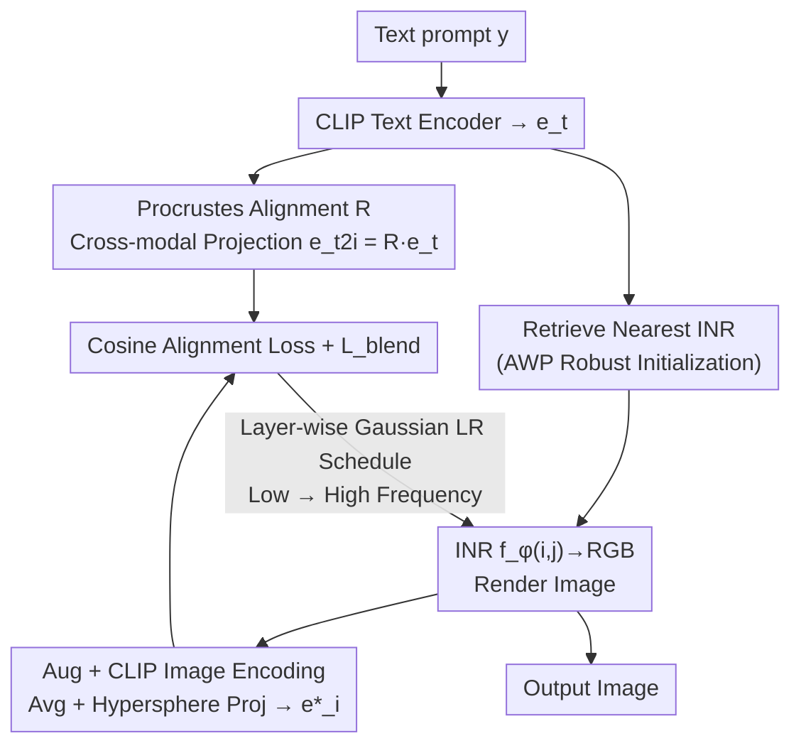

# Implicit Inversion turns CLIP into a Decoder

**Conference**: ICLR 2026  
**Code**: [https://github.com/OmnAI-Lab/implicit-inversion](https://github.com/OmnAI-Lab/implicit-inversion)  
**Area**: Image Generation / Text-to-Image  
**Keywords**: CLIP Inversion, Implicit Neural Representation (INR), Text-to-Image, Modality Gap, Frequency-Aware, Generative Capability of Discriminative Models  

## TL;DR
Without training any generative decoder or fine-tuning CLIP, this work achieves text-to-image generation, style transfer, and image reconstruction by "inverting" a **frozen CLIP image encoder**. By utilizing frequency-aware Implicit Neural Representations (INR) to back-project images from text embeddings, the authors reveal significant untapped generative capabilities within discriminative models.

## Background & Motivation

**Background**: Modern text-to-image systems (DALL-E 3, GLIDE, Latent Diffusion) almost exclusively adopt an "encoder-decoder" architecture. CLIP is frequently utilized as a **text encoder**, but the actual **decoder** that maps latent space back to pixels (typically a diffusion model) is a computational bottleneck—either requiring tens of billions of parameters or an exhaustive training pipeline.

**Limitations of Prior Work**: Previous attempts to "invert CLIP" to eliminate the decoder have faced several issues:
- **Direct Optimization in Pixel Space** (CLIP-Inv, Kazemi et al. 2024): Optimizing from random pixels by minimizing CLIP cosine distance results in structural artifacts and a high FID of 140.
- **Fine-tuning CLIP** (CLIPAG / EB-CLIP, Ganz & Elad): While quality improves, this violates the "frozen CLIP" premise and requires additional adversarial training.
- **Concurrent Work DAS** (Fort & Whitaker 2025): Uses coarse-to-fine optimization in pixel space without a decoder or fine-tuning, but direct pixel manipulation still yields limited quality (FID 161.8).

**Key Challenge**: The goal of "generating clean images without training a decoder or modifying CLIP" is hindered by high-frequency artifacts in pixel-space optimization and the **modality gap** in CLIP (text and image embeddings reside in slightly offset sub-manifolds, leading to "textual hallucinations" and unrealistic visuals when using raw text embeddings as targets).

**Goal**: To prove that a **frozen CLIP model alone can generate images** without a pre-trained decoder or fine-tuning.

**Key Insight**: **Replace pixels with Implicit Neural Representations (INR) as optimization variables**. Instead of optimizing a pixel grid, the method optimizes the weights of an MLP (INR) that maps coordinates $(i,j)$ to RGB. Utilizing the inherent "shallow-to-low, deep-to-high" frequency property of INRs enables coarse-to-fine generation. Combined with adversarial robust initialization, orthogonal Procrustes cross-modal alignment, and natural image prior blending, this ill-posed inversion problem is transformed into a functional generator.

## Method

### Overall Architecture

The CLIP$^{-1}$ pipeline consists of three stages: (i) **Offline Data Preparation** (one-time; training INRs for blurred images and indexing CLIP embeddings in FAISS); (ii) **Initialization** (retrieving the nearest-neighbor INR given a prompt and projecting the text embedding into the image modality via Procrustes); (iii) **Optimization** (iteratively updating INR weights $\phi$ while freezing CLIP, using frequency scheduling until the rendered image embedding approximates the target). Gradients flow from the frozen CLIP back to the INR parameters $\phi$.

### Key Designs

**1. Frequency-aware INR + Layer-wise Frequency Scheduling: Suppressing high-frequency artifacts via coarse-to-fine optimization**

This is the foundation of the method, addressing structural artifacts found in pixel-space optimization. The authors use a FINER-type INR, which introduces a dynamic local frequency coefficient $\alpha_i = |W_i z_{i-1}+b_i| + 1$ to the standard SIREN activation, resulting in $z_i = \sin(\omega \alpha_i (W_i z_{i-1}+b_i))$. FINER’s bias initialization naturally **stratifies** frequencies: shallow layers handle low frequencies (structure), and deep layers handle high frequencies (detail). 

The authors use a **Gaussian learning rate schedule** to drive coarse-to-fine optimization. In each iteration, a peak learning rate is assigned to a specific layer, with adjacent layers decaying according to a Gaussian curve. The focus shifts from low-frequency to high-frequency layers as iterations progress, forcing the network to stabilize coarse layouts before adding details. Ablations show that removing this (variant ii) leads to stripe-like artifacts and a surge in FID from 107 to 185.

**2. Adversarial Weight Perturbation (AWP): Anchoring the starting point on a robust manifold**

INR weights are sensitive; minor changes can drastically alter the reconstructed image. Drawing from AWP, the authors **perturb weights rather than inputs** during offline INR training by solving a min-max problem:

$$\min_{\phi}\ \max_{\Delta\phi\in\Omega}\ \mathcal{L}\big(f_{\phi+\Delta\phi},\ \text{blur}(x)\big),\qquad \Omega=\{\Delta:\|\Delta\|\le \gamma\|\phi\|\}$$

This forces the INR to reconstruct a **blurred** version of the target image even under adversarial weight perturbations $\Delta\phi$. This flattens the loss landscape and anchors the initial INR to a stable low-frequency manifold, preventing weights from drifting during early inversion updates. Without AWP (variant iii), neural artifacts appear, and FID rises from 107 to 121.

**3. Orthogonal Procrustes Cross-modal Alignment: "Translating" text embeddings to image embeddings**

Despite being in the same hypersphere, CLIP exhibits a local modality gap: text embeddings are abstract/semantic, while image embeddings are visual/concrete. Direct inversion toward text embeddings causes "textual hallucinations." The authors calculate a local alignment for **each prompt** by taking $k$ nearest neighbors to form text/image embedding matrices $E_T$ and $E_I$, solving the orthogonal Procrustes problem:

$$\min_{R}\ \|R E_T - E_I\|_F\quad \text{s.t.}\quad R^\top R = I$$

The target is then projected: $e_{t2i} = R\,\theta_T(y)$. This replaces a "malformed" target with a "well-behaved" one on the image sub-manifold. Removing Procrustes (variant iv) pushes optimization toward the raw text embedding; while CLIPSIM increases to 46.4 (fake win), the visual quality drops due to cluttered and hyper-sharp elements.

**4. Natural Image Prior Blending + Augmentation: Regularizing output toward real-world statistics**

To ensure images look realistic, two constraints are introduced. First, **Augmentation Averaging**: applying color/scale/shear augmentations to the INR output and averaging their CLIP embeddings: $e^\star_i = \frac{1}{n}\sum_{k=1}^{n}\theta_I(\text{augment}(f_{\phi_k}))$. Second, **Blending Loss**: pulling the output toward a weighted sum of $k$ retrieved real image embeddings $e^\star_{img}$ using softmax similarity. The full update is:

$$\phi_n = \phi_{n-1} - \nabla_\phi\Big[\mathcal{L}(e^\star_i, e_{t2i}) + \beta L_{blend}(e^\star_i, e^\star_{img})\Big]$$

Removing the blending loss (variant v) yields harsh colors and double-exposure artifacts on small objects.

## Key Experimental Results

### Main Results (MS-COCO 10k Text-to-Image)

| Method | Inversion-based | Tuning-free | Params (M) | FID↓ | CLIPSIM↑ | IS↑ |
|------|:---:|:---:|:---:|------|------|------|
| LDM-KL-8 (Rombach 2022) | ✗ | ✗ | 1450 | **23.3** | – | 20.0 |
| CLIPAG (Ganz 2023, FT) | ✓ | ✗ | 88 | 42.3 | 34.7 | 18.7 |
| CLIP-Inv (Kazemi 2024) | ✓ | ✓ | 0 | 140.1 | **61.4**¹ | 4.8 |
| DAS-ViT (Fort 2025) | ✓ | ✓ | 0 | 161.8 | 22.7 | 5.7 |
| DAS-Ensemble (3×150M) | ✓ | ✓ | 0 | 121.6 | 36.9 | 8.4 |
| **CLIP$^{-1}$ (Ours)** | ✓ | ✓ | **0** | **72.5** | 38.6 | **9.5** |

¹CLIP-Inv's high CLIPSIM stems from target overfitting (confirmed by extremely poor FID/IS), not visual quality.

**Mechanism**: In the tuning-free and decoder-free category, CLIP$^{-1}$ reduces FID from 161.8 (DAS-ViT) to 72.5 (**half**) and nearly doubles IS (5.7 to 9.5). While diffusion models still hold lower FID, they require orders of magnitude more parameters and full training, whereas this method uses a frozen backbone + light INR.

### Ablation Study (1000 MS-COCO captions)

| Variant | FID↓ | CLIPSIM↑ | IS↑ | Note |
|------|------|------|------|------|
| i. CLIP$^{-1}$ Full | **107.1** | 38.8 | 7.7 | Full model |
| ii. w/o Freq Scheduling | 185.1 | 30.5 | 7.8 | High-freq overfitting, stripe artifacts (Worst FID) |
| iii. w/o AWP | 121.0 | 43.0 | 7.3 | Weights drift from anchors, neural artifacts |
| iv. w/o Freq & Procrustes | 111.3 | 46.4 | 9.1 | Overfits text embedding, cluttered/duplicate visuals |
| v. w/o Freq & Blending | 119.7 | 49.5 | 7.9 | Harsh colors, ghosting on small objects |

OOD Evaluation (Table 3a): Even **Plain CLIP$^{-1}$** (random initialization, no Procrustes/Blending) outperforms DAS on MS-COCO/Flickr30k (92.7/119.2 vs 121.6/161.1), proving that initialization serves as an "optimization accelerator" rather than a performance crutch.

### Key Findings
- **Frequency scheduling is the primary contributor**: Removing it nearly doubles FID (107 to 185), confirming that coarse-to-fine is central to suppressing high-frequency artifacts.
- **Systematic inverse relationship between CLIPSIM and FID**: Removing AWP/Procrustes/Blending often increases CLIPSIM while degrading FID. Relaxing "realism constraints" allows the optimizer to match the caption embedding closer at the cost of visual integrity, suggesting **CLIPSIM alone is a misleading metric**.
- **Iteration Trade-off**: At 40 steps, FID is 107; at 400 steps, FID improves to 72.5, though IS drops slightly from 10.6 to 9.5 (better quality, slightly lower diversity).
- **Zero-shot Transfer**: The same frozen model performs image reconstruction, prompt-driven editing (adding weather effects while maintaining geometry), and neural style transfer (color/stroke transfer while maintaining layout) without modification.

## Highlights & Insights
- **The paradigm shift from pixel variables to INR weights is the deciding factor**: The natural frequency stratification of INRs provides "free" coarse-to-fine priors, explaining why this method fundamentally outperforms pixel-space approaches like DAS or CLIP-Inv.
- **The orthogonal Procrustes approach for modality gaps is highly transferable**: Any task using CLIP text embeddings as image targets (CLIP-guided generation/editing/retrieval) can use this per-prompt local alignment to mitigate textual hallucinations with minimal cost (low-dimensional SVD).
- **Weight-only AWP** provides a stabilization framework for "weights as image representations," revealing that robustly trained models encode stronger generative priors.
- **The Framing**: The work unearths "hidden" generative power in the discriminative CLIP model. The goal isn't to compete with Diffusion in fidelity, but to quantify how much visual structure is already encoded in frozen CLIP latents—a dual tool for generation and interpretability.

## Limitations & Future Work
- **Fidelity Ceiling**: The FID of 72.5 remains far behind Diffusion (23.3). Fine-grained spatial details like faces or architecture still exhibit distortion.
- **Reconstruction Ambiguity**: While high-level semantics (identity, composition) are preserved, specific structured regional details may fail to reconstruct perfectly, reflecting the information bottleneck in CLIP embeddings.
- **Reliance on Offline Database**: Initialization and blending priors depend on a LAION-Aesthetics index, constituting a dependency on an external reference set.
- **Metric Misalignment**: The inverse correlation between CLIPSIM and quality means evaluation requires caution; metrics can easily be "gamed."
- **Future Directions**: Exploring stronger frequency-aware INRs, adaptive scheduling for FID/diversity balance, and extending Procrustes alignment to broader OOD scenarios.

## Related Work & Insights
- **Comparison to "Big Four" Generative Models**: Unlike GAN/Diffusion/Flow/AR, which require trained decoders, this work defines a "fifth way": inverting a frozen discriminative encoder.
- **CLIP Inversion Lineage**: Evolution from CLIP-Inv (pixels) → CLIPAG (fine-tuning) → DAS (multi-res pixels) → Ours (INR + Frequency-aware).
- **Interpretability Value**: This inversion technique serves as a probe for model biases and errors, allowing one to visualize CLIP's internal reaction to negations ("not a dog") or OOD concepts before they propagate into downstream pipelines.

## Rating
- **Novelty**: ⭐⭐⭐⭐⭐ — The framing of "Frozen CLIP + INR Inversion = Generator" is counter-intuitive yet consistent. The combination of FINER, AWP, and Procrustes is highly creative.
- **Experimental Thoroughness**: ⭐⭐⭐⭐ — Covers three categories of baselines, performs component-wise ablation, and OOD testing. However, it lacks human evaluation and scaling beyond ViT-B/32.
- **Writing Quality**: ⭐⭐⭐⭐ — Logical progression; clear explanations for complex phenomena (e.g., CLIPSIM/FID trade-off); clear diagrams.
- **Value**: ⭐⭐⭐⭐ — High value as a "zero-parameter generator" and an interpretability probe, revealing the latent generative potential of discriminative models.

<!-- RELATED:START -->

## Related Papers

- [\[ICLR 2026\] Verification of the Implicit World Model in a Generative Model via Adversarial Sequences](verification_of_the_implicit_world_model_in_a_generative_model_via_adversarial_s.md)
- [\[ICLR 2026\] Free Lunch for Stabilizing Rectified Flow Inversion](free_lunch_for_stabilizing_rectified_flow_inversion.md)
- [\[ICML 2026\] Visual Implicit Autoregressive Modeling](../../ICML2026/image_generation/visual_implicit_autoregressive_modeling.md)
- [\[ICLR 2026\] Directional Textual Inversion for Personalized Text-to-Image Generation](directional_textual_inversion_for_personalized_text-to-image_generation.md)
- [\[ICLR 2026\] UniEdit-Flow: Unleashing Inversion and Editing in the Era of Flow Models](uniedit-flow_unleashing_inversion_and_editing_in_the_era_of_flow_models.md)

<!-- RELATED:END -->
