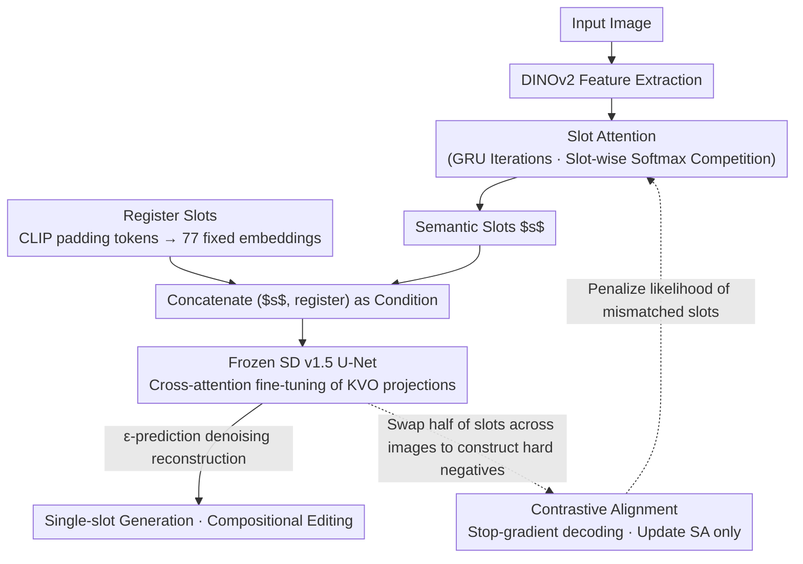

# Improved Object-Centric Diffusion Learning with Registers and Contrastive Alignment (CODA)

**Conference**: ICLR 2026  
**arXiv**: [2601.01224](https://arxiv.org/abs/2601.01224)  
**Code**: [GitHub](https://github.com/sony/coda)  
**Area**: Object-Centric Learning / Diffusion Models  
**Keywords**: Object-Centric Learning, Slot Attention, Register Slots, contrastive learning, compositional generation

## TL;DR

The CODA framework is proposed to address slot entanglement and weak alignment in diffusion-based object-centric learning by introducing register slots to absorb residual attention, fine-tuning cross-attention projections, and incorporating a contrastive alignment loss. It significantly improves object discovery and compositional generation quality on both synthetic and real-world datasets.

## Background & Motivation

Object-centric learning (OCL) aims to decompose complex scenes into structured, compositional object representations to support downstream tasks such as visual reasoning, causal inference, world models, and compositional generation. Slot Attention (SA) is a fully unsupervised method but shows limited performance in real-world scenes. While recent methods combining SA with pre-trained diffusion models (e.g., Stable-LSD, SlotAdapt) have made progress, they still face two core problems:

**Slot Entanglement**: A single slot encodes features of multiple objects, leading to image distortion or semantic inconsistency during single-slot generation. The fundamental cause is that softmax normalization forces attention weights to sum to 1 across all slots. When certain queries in the U-Net do not strongly match any semantic slot, the attention is scattered across multiple slots.

**Weak Alignment**: Slots fail to correspond consistently to distinct image regions, resulting in over-segmentation (one object split into multiple slots) or under-segmentation (multiple objects merged into one slot).

These two issues severely impact the accuracy of object-centric representations and the utility of compositional scene generation.

## Method

### Overall Architecture

CODA uses DINOv2 to extract image features and Slot Attention to extract a set of slots, followed by a frozen Stable Diffusion v1.5 as a slot decoder for image reconstruction. Around this backbone, three components are added at the interface between the slots and the diffusion decoder: a set of register slots to absorb residual attention, fine-tuning of cross-attention projections, and a contrastive alignment loss to address slot entanglement and weak alignment. The main attention path (solid line) follows "Image $\rightarrow$ Features $\rightarrow$ Slots $\rightarrow$ Concatenated Condition $\rightarrow$ Denoising Reconstruction $\rightarrow$ Single-slot Generation/Compositional Editing," while contrastive alignment is a side branch (dashed line) that only propagates gradients back to Slot Attention.

### Key Designs

**1. Register Slots: Absorbing residual attention to mitigate slot entanglement**

Slot entanglement stems from softmax: cross-attention requires the attention weights for each U-Net query to sum to 1 across all slots. Consequently, queries that do not strongly match any semantic slot are forced to distribute weights across several semantic slots, mixing multiple object features into one slot. CODA introduces a set of input-independent register slots: pure padding tokens are fed into the frozen CLIP ViT-L/14 text encoder of SD to obtain a fixed embedding sequence $\bar{\mathbf{r}}$, which participates in cross-attention alongside semantic slots. These register slots act as "attention sinks," allowing unassigned attention to flow to them naturally without contaminating semantic slots. SD v1.5 has 77 padding tokens, yielding 77 register slots; experiments show the fixed version is more stable than a trainable one. This design is inspired by the attention sink phenomenon in LLMs, adding nearly zero computational overhead while providing the largest performance boost in ablations (approx. 10 points in mBO).

**2. Cross-Attention Fine-tuning: Stripping text-conditioning bias from SD**

SD is pre-trained on image-text pairs. Using it directly as a slot decoder retains text-conditioning bias, biasing the model towards language-driven semantics rather than reconstruction conditioned purely on slots. CODA does not add adapters or new layers; instead, it only fine-tunes the key, value, and output projection matrices $\boldsymbol{\theta}$ in the cross-attention, using minimal modifications to shift the conditioning signal from "text-flavored" to "slot-flavored." The corresponding denoising objective is standard $\epsilon$-prediction:

$$\mathcal{L}_{\mathrm{dm}}(\phi, \boldsymbol{\theta}) = \mathbb{E}_{(\mathbf{z}, \mathbf{s}), \epsilon, \gamma} \left[\|\epsilon - \epsilon_{\boldsymbol{\theta}}(\mathbf{z}_\gamma, \gamma, \mathbf{s}, \bar{\mathbf{r}})\|_2^2\right]$$

where slots $\mathbf{s}$ and registers $\bar{\mathbf{r}}$ are used together as conditioning inputs.

**3. Contrastive Alignment Objective: Forcing slots to capture existing concepts**

Denoising loss alone does not guarantee that slots correspond to objects actually present in the image—the model could bypass this by using averaged slots. CODA introduces a contrastive term to close this shortcut: hard negatives $\tilde{\dots}$ are constructed by randomly swapping half of the slots across different images (shared initialization ensures semantic plausibility). The model is then required to assign high likelihood to matched slots and low likelihood to swapped slots by maximizing the denoising error on these negatives:

$$\mathcal{L}_{\mathrm{cl}}(\phi) = -\mathbb{E}_{(\mathbf{z}, \tilde{\mathbf{s}}), \epsilon, \gamma} \left[\|\epsilon - \epsilon_{\bar{\boldsymbol{\theta}}}(\mathbf{z}_\gamma, \gamma, \tilde{\mathbf{s}}, \bar{\mathbf{r}})\|_2^2\right]$$

Here, $\bar{\boldsymbol{\theta}}$ denotes the decoder parameters with gradients stopped. This is the most critical design choice: the contrastive loss only updates Slot Attention and never the diffusion decoder. Otherwise, the decoder might "learn to be bad" (intentionally decoding negative samples poorly) as a shortcut, as evidenced by the "no stop-gradient" ablation where FG-ARI collapses from 32.23 to 10.54.

### Loss & Training

The total loss is a weighted sum of the denoising and contrastive terms:

$$\mathcal{L}(\phi, \boldsymbol{\theta}) = \mathcal{L}_{\mathrm{dm}}(\phi, \boldsymbol{\theta}) + \lambda_{\mathrm{cl}} \mathcal{L}_{\mathrm{cl}}(\phi)$$

The paper further proves that this objective is equivalent to maximizing an operational proxy for mutual information between slots and the image (Theorem 1), where the difference in denoising error $\Delta$ serves as a practical approximation of mutual information—unifying the two losses under a single theoretical framework.

## Key Experimental Results

### Main Results: Object Discovery

| Dataset | Metric | CODA (Ours) | SlotAdapt (Prev. SOTA) | Gain |
|---------|--------|------|----------|------|
| MOVi-C  | FG-ARI | 59.19 | 51.98 (LSD) | +7.21 |
| MOVi-E  | FG-ARI | 59.04 | 56.45 | +2.59 |
| VOC     | FG-ARI | 32.23 | 29.6 | +2.63 |
| VOC     | mBOi   | 55.38 | 51.5 | +3.88 |
| VOC     | mIoUc  | 56.30 | 49.3 (SlotDiff) | +7.00 |
| COCO    | FG-ARI | 47.54 | 41.4 | +6.14 |

### Ablation Study

| Configuration | FG-ARI | mBOi | mBOc | mIoUi | mIoUc |
|------|--------|------|------|-------|-------|
| Baseline (Frozen SD) | 12.27 | 47.21 | 54.20 | 48.72 | 55.71 |
| + Register Slots | 19.21 | 55.76 | 64.02 | 49.93 | 57.14 |
| + CA Finetuning | 15.44 | 47.03 | 52.63 | 49.75 | 55.63 |
| + Contrastive | 11.96 | 47.16 | 54.17 | 49.40 | 56.56 |
| Reg + CA | 19.62 | 56.27 | 65.05 | 50.40 | 58.02 |
| Reg + CA + CO (No Stop-Grad) | 10.54 | 30.64 | 35.86 | 37.74 | 43.61 |
| **Reg + CA + CO (CODA)** | **32.23** | **55.38** | **61.32** | **50.77** | **56.30** |

### Key Findings

- **Register Slots** is the most significant single component for improvement (approx. 10 point mBO increase), effectively mitigating slot entanglement.
- Gradients must be stopped for the diffusion decoder during contrastive loss; otherwise, training becomes unstable and performance drops sharply.
- In compositional generation, CODA reduces the FID from 40.57 (SlotAdapt) to 31.03.
- Category classification accuracy in attribute prediction increases from 43.92% to 78.06% (MOVi-E).

## Highlights & Insights

- The design of **Register Slots** is inspired by the "attention sink" phenomenon in LLMs, providing a conceptually simple solution with near-zero computational overhead.
- Unifies denoising and contrastive losses from the theoretical perspective of mutual information maximization.
- Eliminates text-conditioning bias by fine-tuning only the KVO projections of cross-attention, avoiding additional architectural changes.
- Supports fine-grained compositional editing (deleting objects, swapping objects) with high practical utility.

## Limitations & Future Work

- 3D bounding box prediction remains a challenge, as DINOv2 features lack fine-grained geometric details.
- Currently only validated on SD v1.5; scalability to larger models (SDXL, SD3) remains unknown.
- Segmentation quality in extremely dense or occluded scenes still has room for improvement.
- The number of register slots (77) is determined by the SD text encoder; changing models requires re-designing this component.

## Related Work & Insights

- Methods like DINOSAUR and SPOT improve OCL starting from self-supervised features, whereas CODA improves OCL from the diffusion model decoder side.
- The idea of register tokens in ViT can be transferred to more scenarios requiring attention competition.
- The design logic of the contrastive alignment objective can be generalized to other slot-based generative tasks (e.g., video object-centric learning).

## Rating

- **Novelty**: ⭐⭐⭐⭐ The combined design of Register Slots and contrastive alignment is novel, although individual techniques have precursors.
- **Experimental Thoroughness**: ⭐⭐⭐⭐⭐ Very comprehensive, covering synthetic and real-world datasets, object discovery, attribute prediction, compositional generation, and ablations.
- **Writing Quality**: ⭐⭐⭐⭐⭐ Clear theoretical derivations, thorough experimental presentation, and highly informative figures.
- **Value**: ⭐⭐⭐⭐ Makes a substantial contribution to the OCL community with a simple, efficient method that is easy to reproduce in existing frameworks.

<!-- RELATED:START -->

## Related Papers

- [\[CVPR 2025\] GLASS: Guided Latent Slot Diffusion for Object-Centric Learning](../../CVPR2025/image_generation/glass_guided_latent_slot_diffusion_for_object-centric_learning.md)
- [\[ICLR 2026\] Hierarchical Entity-centric Reinforcement Learning with Factored Subgoal Diffusion](hierarchical_entity-centric_reinforcement_learning_with_factored_subgoal_diffusi.md)
- [\[CVPR 2025\] CTRL-O: Language-Controllable Object-Centric Visual Representation Learning](../../CVPR2025/image_generation/ctrl-o_language-controllable_object-centric_visual_representation_learning.md)
- [\[ICLR 2026\] Diverse Text-to-Image Generation via Contrastive Noise Optimization](diverse_text-to-image_generation_via_contrastive_noise_optimization.md)
- [\[ICLR 2026\] Contrastive Diffusion Guidance for Spatial Inverse Problems](contrastive_diffusion_guidance_for_spatial_inverse_problems.md)

<!-- RELATED:END -->
