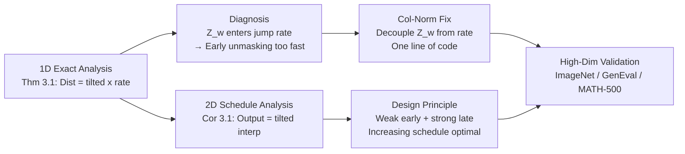

# Improving Classifier-Free Guidance in Masked Diffusion: Low-Dim Theoretical Insights with High-Dim Impact

**Conference**: ICLR 2026  
**OpenReview**: [https://openreview.net/forum?id=mMK9pvQJxf](https://openreview.net/forum?id=mMK9pvQJxf)  
**Code**: To be confirmed  
**Area**: Discrete Diffusion / Image Generation / Classifier-Free Guidance  
**Keywords**: masked diffusion, classifier-free guidance, guidance schedule, column normalization, discrete diffusion  

## TL;DR
This paper derives the exact effects of CFG on 1D/2D masked diffusion toy models that allow for analytical solutions. It discovers that the partition function $Z_w$ in existing discrete CFG is erroneously coupled into the jump rates, leading to premature unmasking and quality degradation. The authors propose a "column normalization" fix (one line of code) and theoretically demonstrate that an increasing guidance schedule ("weak early, strong late") is the optimal approach for discrete diffusion.

## Background & Motivation
**Background**: Classifier-Free Guidance (CFG) is a standard tool for enhancing conditional generation fidelity in continuous diffusion. Recently, it has been ported to discrete/masked diffusion (through two main routes: Unlocking Guidance and Simple Guidance), achieving empirical gains. Simultaneously, "dynamic guidance schedules" in continuous diffusion (e.g., guidance intervals, gradually increasing weights) have been repeatedly proven to significantly improve quality and have become standard practice.

**Limitations of Prior Work**: (1) These scheduling techniques have currently **only been validated in continuous state spaces**; what schedules to use in discrete diffusion and why they are effective remain open questions. (2) Both existing implementations of discrete CFG (Nisonoff’s rate matrix interpolation and Schiff’s transition probability interpolation) lack theoretical characterization, with no clear explanation of how guidance strength reshapes the generative distribution.

**Key Challenge**: Unmasking in discrete diffusion is a Continuous-Time Markov Chain (CTMC). Guidance not only changes the distribution of "which token to jump to" but may also **unintentionally alter the "how often to jump" rate**. Practitioners have treated CFG purely as distribution re-weighting, ignoring this rate perturbation, which serves as a hidden culprit for sampling quality collapse at high guidance scales.

**Goal**: To answer two questions—How does the guidance schedule affect the shape of the generative distribution? What constitutes a good schedule? To this end, the authors deliberately revert to minimalist 1D and 2D settings (single and double token) where closed-form solutions can be derived for precise analysis.

**Core Idea**: **[Theory-Driven Low-Dim Analysis]** By solving the guided process distribution exactly for $d=1$, it is found that the partition function $Z_w$ appears in the exponent of the unmasking rate, causing unintended acceleration. **[Column Normalization Fix]** By normalizing the rate matrix by columns, the "rate" and "jump distribution" are decoupled, eliminating this pathology with one line of code. **[Increasing Schedule Principle]** Solving for $d=2$ reveals that the induced distribution is an interpolation of several tilted distributions, proving that the final output is dominated by "late-stage guidance," thus early guidance should be weak and later guidance strong. These elements are interconnected: low-dim analysis diagnoses the issue and derives the fix, while simultaneously answering the open question of schedule design.

## Method

### Overall Architecture
The paper does not propose an entirely new model but rather a pipeline of "low-dim analysis → pathology diagnosis → one-line fix → high-dim validation." Masked diffusion is characterized as a CTMC $\frac{dp_t}{dt}=R_t p_t$, where each token remains clean with probability $e^{-\sigma_t}$ or is otherwise masked. Generation starts from a fully masked state and proceeds via a reverse CTMC. The authors first solve the exact distribution of the guided CTMC in a single-token setting to locate the $Z_w$ coupling bug. They then use a "rate $\times$ jump distribution" decomposition to isolate $Z_w$ from the rate term (column normalization). Finally, they derive the closed-form interpolation structure of guidance schedules in a two-token setting to establish the "increasing schedule is optimal" design principle.

### Key Designs
**1. 1D Exact Solution revealing guidance "accelerates" unmasking**: In the simplest single-token ($d=1$) setting, evolving from a fully masked state along the guided reverse CTMC, the authors solve the distribution at time $t$ as $p_t=\left(1-\left(\frac{1-e^{-\sigma_t}}{1-e^{-\sigma_T}}\right)^{Z_w}\right)\cdot p^{(w)}$. This is the "tilted target distribution $p^{(w)}$" multiplied by an unmasking progress factor where the partition function $Z_w$ resides in the exponent. Crucially, as $w$ changes, $Z_w$ causes the unmasking rate to shift drastically (Figure 2 shows that larger $Z_w$ leads to faster decay of the masked state $p_t(M)$). Excessive unmasking speed makes numerical solvers "stiff," causing error spikes in finite-step sampling—theoretically explaining why discrete CFG collapses at high guidance scales.

**2. Decomposing "Rate" and "Jump Distribution" to locate $Z_w$ abuse**: To fix the bug, one must locate its source. The authors decompose the rate matrix into "jump frequency $r_{t,p}(x)$" and "jump destination $p_t(y\mid x)$." Substituting the existing guided rate matrix yields $R^{(w)}_t(y,x)=\underbrace{r^w_{t,p}(x)r^{1-w}_{t,p}(x)Z_w}_{\text{rate}}\cdot\underbrace{Z_w^{-1}p^w_t(y\mid x)q^{1-w}(y\mid x)}_{\text{distribution}}$. $Z_w$, which should only be a normalization constant, appears in the rate term, magnifying the total jump frequency by $Z_w$ times. Lemma 3.1 further writes out the transition rates between masked and unmasked states, confirming $Z_w$ as a multiplicative factor and noting that when $w=1$ (pure conditional), $Z_w=1$ and the pathology vanishes, explaining why this was never seen in standard conditional diffusion.

**3. Column Normalization: One line of code to strip $Z_w$ from the rate**: Since the analysis indicates $Z_w$ should not affect jump frequency, the fix is to **normalize the guided rate matrix by column**, ensuring the rate term does not contain $Z_w$: $R^{(w)}_t(y,x)=\underbrace{r^w_{t,p}(x)r^{1-w}_{t,p}(x)}_{\text{rate}}\cdot\underbrace{Z_w^{-1}p^w_t(y\mid x)q^{1-w}(y\mid x)}_{\text{distribution}}$. In masked diffusion, this simplifies to passing logits through a **Softmax** instead of a raw `exp`: $R^{(w)}_{\text{nor},t}(\hat x,x)\propto\text{Softmax}\big(w\log p_0(\hat x^i\mid x_{UM})+(1-w)\log q_0(\hat x^i\mid x_{UM})\big)$. Intuitively, normalization smoothes the transport from the masked distribution to the data distribution, stabilizing sampling. In code, this replaces `logits.exp()` with `logits.softmax(dim=-1)`. The authors contrast three mechanisms: Unlocking's $w$-dependency is exponential, Simple's is linear, and the proposed normalization maintains smooth transitions approximating the original convergence rate.

**4. 2D Schedule Analysis: Output as an interpolation of tilted distributions**: Switching to double tokens ($d=2$) and dividing time into three segments with different strengths $w_0, w_1, w_2$, Corollary 3.1 solves the final distribution as a weighted sum of six tilted distributions. The weights are determined solely by time segment ratios (e.g., $(\frac{t_3-t_2}{t_3})^2$ terms). Two conclusions emerge: (a) the synthesized distribution is dominated by guidance applied at the end of generation ($t \to 0$); thus, **early strong guidance is wasteful or even harmful**; (b) using three stages with moderate mid-points (e.g., $t_2=0.75$) results in a balanced output, making the schedule easier to tune. This yields the design principle: **Increasing schedules** (Ramp-Up / Right Interval) are optimal, while decreasing ones are harmful—aligning with empirical observations in continuous diffusion and providing a theoretical explanation.

## Key Experimental Results

### Main Results: Normalization Effects on ImageNet-256 (MaskGIT, 50 Steps, FID↓)

| Guidance Strength $w$ | Our Method (Col-Norm) | Unlocking Guidance | Simple Guidance |
|---|---|---|---|
| $w=1$ | 8.45 | 11.21 | 3.72* (Minimal Guidance) |
| $w=2$ | **2.90** | 17.77 | 19.31 |
| $w=3$ | **3.61** | 18.74 | 23.54 |
| $w\geq 4$ | Still Stable | 25.31 / 25.06 (Collapse) | 17.04 etc. |

> Existing mechanisms rapidly deteriorate when $w \geq 2$ due to numerical stiffness. Ours keeps FID at ~2.9 under moderate guidance, validating the "unmasking too fast" theory.

### Ablation Study / Analysis

| Experiment | Setting | Key Findings |
|---|---|---|
| Fidelity-Diversity Trade-off | ImageNet, Precision/Recall vs $w$ | Only Ours improves precision while maintaining recall; others see precision drops as $w$ increases (trading diversity for fidelity). |
| Schedule Comparison | ImageNet-256, 10K samples | Increasing (Ramp-Up / Right Interval) significantly lowers FID (min ~5.89); Decreasing (Left Interval / Ramp-Down) consistently harms generation (FID up to ~22.97). |
| T2I GenEval | Show-O / Meissonic | Adding normalization improves Overall / Counting / Color / Position scores across the board (gains of +10 to +48 points), especially at high $w$. |
| Text Gen MATH-500 | LLaDA-8B-Instruct | Normalization outperforms the baseline across all guidance strengths. |

### Key Findings
- **Low-dim insights migrate to high-dim**: Predictions from 1D/2D toy models (Normalization is beneficial, Increasing Schedule is optimal) hold true across ImageNet, T2I, and Math text generation.
- **Pathology appears only at $w \neq 1$**: Since $Z_w=1$ at $w=1$, standard conditional diffusion never exposed this issue.
- **Ramp-Up > Right Interval**: Smoothly increasing schedules outperform abrupt step changes, showing a monotonic trend toward lower FID.
- **Wait-and-See Scheduling**: Theoretical analysis shows that using three stages with $t_2=0.75$ makes the schedule robust to $t_1$ choices, simplifying the tuning process.

## Highlights & Insights
- **The "Low-Dim Truth" Methodology**: While CFG is a black-box empirical trick in high dimensions, the authors use 1D/2D settings to write explicit formulas for guidance dynamics, uncovering a multi-year bug in rate coupling.
- **Fidelity and Diversity aren't always a zero-sum game**: Conventional wisdom suggests CFG trades diversity for fidelity, but this method improves both precision and recall at moderate $w$, suggesting previous trade-offs were partially artifacts of implementation bugs.
- **Clean Diagnosis-Fix Loop**: The issue ( $Z_w$ in rate) and the fix (col-norm to move it to distribution) are two sides of the same formula. It is theoretically consistent and carries nearly zero implementation cost (`exp` → `softmax`).
- **First Discrete-Side Explanation for Schedules**: Provides the first theoretical justification for why increasing schedules work in discrete diffusion, a phenomenon previously only observed empirically in continuous models.

## Limitations & Future Work
- **Theory limited to Masked Diffusion**: Careful analysis is restricted to 1D/2D masked processes. While the method works high-dim, the theory does not yet cover other discrete forms like uniform diffusion.
- **Ignoring Score Estimation Errors**: The analysis assumes known concrete scores; how network estimation errors interact with guidance dynamics is left for future work.
- **Parameter Tuning**: While "Increasing" is a clear direction, specific endpoints still require manual tuning.
- **High-$w$ Limits**: Even with normalization, performance eventually drops at extreme $w$, suggesting that while unmasking speed is addressed, other factors in the fidelity-diversity collapse remain.

## Related Work & Insights
- **Prior Discrete CFG**: Contrast with Unlocking Guidance (rate matrix interpolation) and Simple Guidance (transition probability interpolation). This work unifies them under the "Rate $\times$ Distribution" framework.
- **Continuous Diffusion Schedules**: Links to guidance interval (Kynkäänniemi) and increasing schedules (Xi), providing theoretical grounding for these observations in the discrete domain.
- **Numerical Solvers**: Premature unmasking makes the CTMC "stiff," hindering the accuracy of $\tau$-leaping or higher-order solvers; this fix effectively reduces the numerical burden on all samplers.

## Rating
- **Novelty**: ⭐⭐⭐⭐ — Identifying the $Z_w$ bug through low-dim closed-form solutions is highly original; the fix is derived from first principles.
- **Experimental Thoroughness**: ⭐⭐⭐⭐ — Covers ImageNet, T2I (GenEval), and Text (LLaDA), validating theory across modalities.
- **Writing Quality**: ⭐⭐⭐⭐ — Clear logical flow from diagnosis to fix to validation; well-integrated formulas and diagrams.
- **Value**: ⭐⭐⭐⭐ — One-line implementation with direct benefits for current discrete models (MaskGIT, Show-O, LLaDA); elevates empirical tricks to theoretical principles.

> **Note**: The greatest takeaway is the research paradigm of "deconstructing black-box tricks using the simplest solvable models"—a strategy worth applying to any empirically tuned generative technique.

<!-- RELATED:START -->

## Related Papers

- [\[ICLR 2026\] Overshoot and Shrinkage in Classifier-Free Guidance: From Theory to Practice](overshoot_and_shrinkage_in_classifier-free_guidance_from_theory_to_practice.md)
- [\[ICLR 2026\] Stage-wise Dynamics of Classifier-Free Guidance in Diffusion Models](stage-wise_dynamics_of_classifier-free_guidance_in_diffusion_models.md)
- [\[CVPR 2026\] C$^2$FG: Control Classifier-Free Guidance via Score Discrepancy Analysis](../../CVPR2026/image_generation/c2fg_control_classifier-free_guidance_via_score_discrepancy_analysis.md)
- [\[CVPR 2026\] CFG-Ctrl: Control-Based Classifier-Free Diffusion Guidance](../../CVPR2026/image_generation/cfg-ctrl_control-based_classifier-free_diffusion_guidance.md)
- [\[ICLR 2026\] What Exactly Does Guidance Do in Masked Discrete Diffusion Models](what_exactly_does_guidance_do_in_masked_discrete_diffusion_models.md)

<!-- RELATED:END -->
