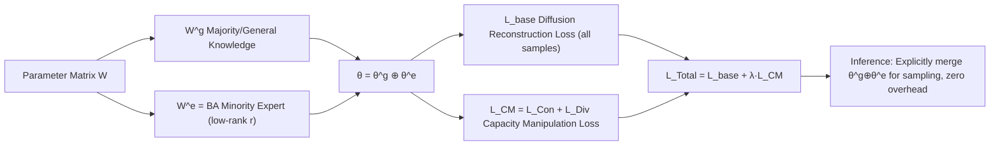

# Improving Diffusion Models for Class-imbalanced Training Data via Capacity Manipulation

**Conference**: ICLR 2026  
**Code**: [https://github.com/Feng-Hong/ImbDiff-CM](https://github.com/Feng-Hong/ImbDiff-CM)  
**Area**: Image Generation / Diffusion Models / Long-tail Imbalanced Learning  
**Keywords**: Diffusion Models, Class Imbalance, Model Capacity Allocation, Low-rank Decomposition, Minority Classes  

## TL;DR
This paper identifies that the root cause of minority class collapse in diffusion models trained on long-tail data is "model capacity being monopolized by majority classes." It proposes Capacity Manipulation (CM): using LoRA-like low-rank decomposition to explicitly split parameters into "general/majority" and "minority expert" components, then employing consistency and diversity losses to force minority class knowledge into the reserved capacity. It incurs no additional inference overhead and is orthogonal to existing methods.

## Background & Motivation
- **Background**: While diffusion models possess strong generative capabilities, real-world data is typically long-tailed. Imbalanced learning methods for discriminative models (re-sampling, focal loss, etc.) cannot be directly migrated due to differences in architecture, training, and inference paradigms. Existing works in generative diffusion, such as CBDM and OC, focus on **modifying loss functions** to facilitate knowledge transfer from majority to minority classes.
- **Limitations of Prior Work**: These methods only patch the "objective function" level without addressing a more fundamental issue: how parameter capacity is actually allocated. On Imb. CelebA-HQ (100:1), DDPM achieves an FID of 7.1 for the majority class (female) but a much higher FID of 16.4 for the minority class (male), showing a steep drop in visual quality.
- **Key Challenge**: The authors discovered a counter-intuitive phenomenon—the **training loss of minority classes is similar to that of majority classes**. However, after pruning parameters with the smallest L1 norms, the relative loss change for minority classes is significantly larger. This indicates that minority knowledge is squeezed into "unimportant" (low L1 norm), fragile parameters; the **capacity is occupied by majority classes**. Accompanying theoretical gradient analysis (Theorem 2.1) further proves that majority classes drive the update direction for the vast majority of parameter matrices, and the more extreme the imbalance, the more severe the capacity monopoly.
- **Goal**: From the novel and **orthogonal** perspective of "model capacity allocation," the goal is to **reserve** dedicated capacity for minority classes to prevent encroachment by majority classes.
- **Core Idea**: **Capacity Reservation + Capacity Allocation**—first, use low-rank decomposition to explicitly partition parameters into two parts ($\theta^g$ for majority/general knowledge and $\theta^e$ for minority experts), then design a capacity manipulation loss to guide the "allocation" of corresponding knowledge into respective parameter blocks during training. Note that CM does not increase the model size; it merely **reallocates existing capacity** with zero additional inference cost.

## Method

### Overall Architecture
CM consists of two steps: **(1) Capacity Reservation**—inspired by LoRA's low-rank decomposition, each parameter matrix $W$ is split into $W^g$ (reserved for majority/general knowledge) and a low-rank $W^e=BA$ (reserved for minority experts), effectively partitioning all model parameters $\theta$ into $\theta^g\oplus\theta^e$ (element-wise addition); **(2) Capacity Allocation**—a capacity manipulation loss $L_{CM}$ is added on top of the standard diffusion base loss, adaptively "forcing" $\theta^g$ to learn majority/general knowledge and $\theta^e$ to learn minority expert knowledge based on class sample sizes. During inference, the two blocks are explicitly merged back into $\theta$ for sampling, resulting in zero additional latency.

### Key Designs

**1. Capacity Reservation: Explicitly partitioning parameters via low-rank decomposition, turning "who gets what" into a controllable knob.** For each parameter matrix $W\in\mathbb{R}^{d\times k}$ in the network, decomposition is performed as $W = W^g + BA = W^g + W^e$, where $B\in\mathbb{R}^{d\times r}$, $A\in\mathbb{R}^{r\times k}$, and rank $r<\min(d,k)$. $W^g$ carries majority and general knowledge, while the low-rank $W^e$ is "pre-fenced" for minority experts. This step resembles LoRA in form but has a entirely different goal—LoRA is for efficient fine-tuning without increasing capacity, whereas CM **reserves capacity before training**. Theorem 3.1 provides theoretical support: under this decomposition, the dominance ratio of majority classes is constrained by $\Pi_{maj}<\Phi\big(\frac{(1-\alpha_r)\mu\sqrt{2N(1-\cos\angle(\mu_1,\mu_2))}}{2\sigma}\big)$, where $\alpha_r$ is a monotonically increasing function of rank $r$ ($\alpha_r=0$ when $r=0$, and $\alpha_r=1$ when $W^e$ is full rank). In other words, **adjusting the rank $r$ of $W^e$ directly controls the capacity allocation ratio between majority and minority classes**, thereby alleviating "capacity collapse" in standard training.

**2. Capacity Manipulation Loss: Using consistency + diversity dual losses to "drive" knowledge into the correct parameter blocks.** Simply partitioning parameters is insufficient; $\theta^g$ must be made to learn only majority knowledge, and $\theta^e$ must learn minority knowledge. The authors design $L_{CM}=L_{Con}+L_{Div}$, both built on the "output difference between the full model $\theta^g\oplus\theta^e$ and the model using only $\theta^g$":

$$L_{Con}=\omega^y_{Con}\,\mathbb{E}_t\|\epsilon_{\theta^g\oplus\theta^e}(x_t,t,y)-\epsilon_{\theta^g}(x_t,t,y)\|^2_2,\quad L_{Div}=-\omega^y_{Div}\,\mathbb{E}_t\|\epsilon_{\theta^g\oplus\theta^e}(x_t,t,y)-\epsilon_{\theta^g}(x_t,t,y)\|^2_2$$

The intuition is: for **majority classes**, it is desired that $\theta^g$ performs well on its own, so its output is made **consistent** with the full model (pulled closer by $L_{Con}$); for **minority classes**, it is desired that $\theta^g$ intentionally performs poorly to force minority knowledge into $\theta^e$, so their outputs are made to **diverge** (pushed apart by $L_{Div}$, note the negative sign).

**3. Adaptive class weights based on sample size, eliminating manual majority/minority partitioning.** The weight design is a highlight: $\omega^y_{Con}=\frac{C N_y}{\sum_c N_c}$ **increases linearly** with the number of class samples (high consistency weight for majority), and $\omega^y_{Div}=\frac{C}{N_y\sum_c 1/N_c}$ **increases inversely** with the number of samples (high diversity weight for minority). These weights exactly yield $\omega_{Con}=\omega_{Div}=1$ and $L_{CM}=0$ on balanced datasets, automatically degenerating into normal training and avoiding manual "majority/minority" thresholds. The authors emphasize that while this **resembles re-weighting, it is fundamentally different**—re-weighting weights the single-sample loss, while CM allocates **model capacity** by modulating the "output distance tied to different parameter blocks."

**4. Joint Optimization and Orthogonal Additivity.** The total loss is $L_{Total}=L_{base}(D,\theta)+\lambda\sum_{(x,y)}\frac{1}{N}L_{CM}$, where $L_{base}$ can be a standard diffusion loss or replaced with imbalance-specific losses like CBDM/OC—this is the source of CM's "orthogonality": it only handles the capacity allocation dimension and can be plugged into any objective function. It can also be extended to LoRA fine-tuning by changing Equation (1) to $W=W^f+B^gA^g+B^eA^e$ (freezing pre-trained $W^f$ and reserving two sets of trainable low-rank parameters for majority/minority respectively).

## Key Experimental Results

### Main Results
Imb. CIFAR-10 / CIFAR-100 (FID↓, IR=100/50):

| Method | CIFAR-10 IR=100 | CIFAR-10 IR=50 | CIFAR-100 IR=100 | CIFAR-100 IR=50 |
|---|---|---|---|---|
| DDPM | 10.697 | 10.216 | 10.163 | 9.363 |
| CBDM | 8.233 | 7.933 | 10.051 | 8.946 |
| OC | 8.390 | 8.034 | 8.309 | 7.188 |
| **CM** | **7.727** | **7.372** | **7.519** | **6.732** |

CM achieved the best performance in 14 out of 16 metrics across 4 settings (only 2 IS scores were slightly lower). FID improved by 2.5~2.8 compared to DDPM and by 0.46~0.79 compared to the strongest baseline.

Imb. CelebA-HQ (IR=100, Per-class FID↓): DDPM minority Male FID 16.425 → **CM 12.788** (Gain 3.637), Overall 8.727 → **7.538**. On ImageNet-LT and iNaturalist (thousands of classes, IR up to 256/500), CM also leads comprehensively, whereas CBDM performs worse than DDPM at that scale. On ArtBench-10 using LoRA fine-tuning for Stable Diffusion, CM won across all 8 metrics (IR=100 FID 27.083 → 22.776).

### Ablation Study
Imb. CIFAR-100 (IR=100, Per-split FID↓) and Loss Ablation:

| Method | Many | Medium | Few | Overall |
|---|---|---|---|---|
| DDPM | 14.068 | 15.660 | 22.188 | 10.163 |
| CM (θg only) | 11.923 | 14.872 | 29.357 | 13.712 |
| **CM (θg⊕θe)** | 11.713 | 13.043 | **18.729** | **7.519** |

| Ablation | FID↓ | KID↓ |
|---|---|---|
| CM Full | **7.519** | **0.0017** |
| CM w/o $L_{Con}$ | 8.412 | 0.0029 |
| CM w/o $L_{Div}$ | 8.073 | 0.0025 |

Comparison with low-rank variants: CBDM($\theta^g\oplus\theta^e$) 10.231, CBDM(LoRA) 11.424, MoE-style Group-Expert LoRA 10.06—none showed improvement, except for **CM at 7.519**. This proves gains come from explicit capacity manipulation rather than adding parameters or dynamic routing.

### Key Findings
- **Using only θg causes Few classes to collapse** (FID 18.7 → 29.4), proving minority expert knowledge is successfully allocated to θe.
- $L_{Con}$ and $L_{Div}$ manage majority and minority knowledge allocation respectively; removing either significantly degrades performance.
- Performance is optimal when hyperparameter $\lambda \approx 1.0$ and rank ratio $r/\min(d,k) \approx 0.1$, remaining stably superior to OC across a wide range.
- Gains are primarily concentrated in Medium and Few classes, with almost no performance loss for majority classes.

## Highlights & Insights
- **Novel Diagnostic Perspective**: Through the clever experiment showing "the relative loss change for minority classes is larger after pruning parameters with the smallest L1 norms," abstract "capacity monopoly" is transformed into an observable and provable phenomenon—a perspective entirely orthogonal to the mainstream focus on modifying loss functions.
- **Zero Inference Overhead**: LoRA-style decomposition allows parameters to be explicitly merged back into the original network size during inference, adding no latency—crucial for deployment.
- **Theory-Method Alignment**: Theorem 2.1/3.1 are not merely decorative; they directly lead to the operational conclusion that "rank r controls the capacity allocation ratio" and guided the rank ablation studies.
- **Plug-and-play**: As an orthogonal framework, it can be stacked on top of DDPM/CBDM/OC to consistently improve points; future improved objective functions can continue to benefit from it.

## Limitations & Future Work
- **Additional Training Overhead**: During training, both $\epsilon_{\theta^g}$ and $\epsilon_{\theta^g\oplus\theta^e}$ forward passes are required, increasing training costs (not quantified in the paper).
- **Hyperparameter Sensitivity**: It relies on two hyperparameters, $\lambda$ and rank $r$; while stable, they still require tuning, and optimal values may drift with different data scales.
- **Unmodeled Difficulty Variation**: The authors observed that on CIFAR-10, Medium classes are actually harder than Few classes, suggesting "intrinsic difficulty imbalance" exists alongside "quantity imbalance." CM only handles the latter; integrating both is a clear future direction.
- **Theoretical Simplifications**: Theorem assumptions—where minority classes contribute to both $W^g,W^e$ and majority classes only to $W^g$—are idealized; capacity flow in actual training is more complex.

## Related Work & Insights
- **Imbalanced Diffusion Generation**: CBDM (balanced prior regularization), OC (directional calibration for knowledge transfer), Overlap Optimization—all focus on objective functions, to which CM is orthogonal and additive.
- **Imbalanced Learning in Discriminative Models**: Re-sampling, focal loss, ADA, etc., have limited effectiveness when migrated to diffusion due to architectural differences.
- **Parameter-Efficient Fine-Tuning / MoE**: CM borrows the low-rank form of LoRA but has the opposite goal (reserving capacity vs. saving parameters), and through experiments, explicitly distinguishes itself from LoRA and MoE-style adapters.
- **Insight**: The perspective of "model capacity as a scarce resource that can be competed for or reserved/allocated" could potentially be generalized to other capacity-competition scenarios like long-tail classification, multi-task learning, or continual learning—anywhere "strong distributions crowd out weak distribution representations."

## Rating
- **Novelty**: ⭐⭐⭐⭐⭐ Re-attributing imbalanced diffusion issues to "capacity allocation" with pruning experiments + gradient theory is a truly orthogonal perspective to existing research.
- **Experimental Thoroughness**: ⭐⭐⭐⭐⭐ 6 datasets (including large-scale ImageNet-LT/iNaturalist and 256-res ArtBench), multiple architectures, multiple IRs, comparisons with LoRA/MoE variants, and full ablations make for a very solid evaluation.
- **Writing Quality**: ⭐⭐⭐⭐ The logic loop of motivation—method—theory—experiment is closed, and illustrations are clear; the theoretical section may be slightly heavy for non-specialist readers.
- **Value**: ⭐⭐⭐⭐ Plug-and-play, zero inference overhead, and additivity to existing methods provide direct practical value for deploying generation in long-tail scenarios.

<!-- RELATED:START -->

## Related Papers

- [\[ICLR 2026\] OmniText: A Training-Free Generalist for Controllable Text-Image Manipulation](omnitext_a_training-free_generalist_for_controllable_text-image_manipulation.md)
- [\[ICLR 2026\] Quantization-Aware Diffusion Models for Maximum Likelihood Training](quantization-aware_diffusion_models_for_maximum_likelihood_training.md)
- [\[ICML 2026\] GUDA: Counterfactual Group-wise Training Data Attribution for Diffusion Models via Unlearning](../../ICML2026/image_generation/guda_counterfactual_group-wise_training_data_attribution_for_diffusion_models_vi.md)
- [\[ICLR 2026\] Steer Away From Mode Collisions: Improving Composition In Diffusion Models](steer_away_from_mode_collisions_improving_composition_in_diffusion_models.md)
- [\[ICLR 2026\] AEGIS: Adversarial Target-Guided Retention-Data-Free Robust Concept Erasure from Diffusion Models](aegis_adversarial_target-guided_retention-data-free_robust_concept_erasure_from_.md)

<!-- RELATED:END -->
