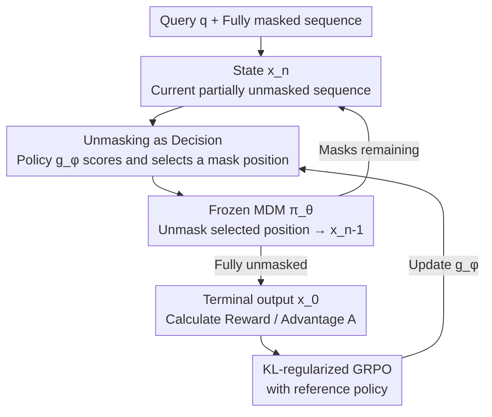

# Improving Discrete Diffusion Unmasking Policies Beyond Explicit Reference Policies (UPO)

**Conference**: ICLR 2026  
**arXiv**: [2510.05725](https://arxiv.org/abs/2510.05725)  
**Code**: [GitHub](https://github.com/chunsanHong/UPO)  
**Area**: Discrete Diffusion Models / Language Modeling  
**Keywords**: Masked Diffusion Models, Unmasking Policy, reinforcement-learning, KL-regularized MDP, GRPO

## TL;DR

This paper proposes Unmasking Policy Optimization (UPO), which models the denoising process of Masked Diffusion Models as a KL-regularized MDP. By training a lightweight unmasking policy model using reinforcement learning to replace heuristic schedulers like max-confidence, the study demonstrates theoretically and experimentally that the learned policy generates samples closer to the true data distribution.

## Background & Motivation

Masked Diffusion Models (MDMs) achieve generation in discrete spaces through iterative unmasking and have shown competitive performance with autoregressive models (e.g., LLaDA, Dream-7B). During the inference phase, deciding **which position to unmask first** is critical for generation quality:

**Background**: Kim et al. (2025) proved that polynomial-time algorithms cannot precisely recover the data distribution on all masked sentences, identifying "hard sub-problems." However, empirical evidence suggests that a max-confidence strategy can bypass these difficult instances.

**Limitations of Prior Work**: Current large-scale MDMs (LLaDA, Dream-7B) rely on rule-based schedulers (max-confidence, max-margin, entropy), which are heuristics lacking theoretical optimality. Pass@N experiments reveal that random and Top-5 strategies can outperform the single-path accuracy of max-confidence when sampling $N$ trajectories, indicating the existence of superior unmasking paths.

**Core Problem**: How to learn an unmasking policy superior to heuristics while maintaining training stability and theoretical guarantees?

## Method

### Overall Architecture

UPO addresses the decision of "which mask position to remove first" during MDM inference—a process previously reliant on manual rules like max-confidence without optimality guarantees. The approach models the entire denoising process as a finite-step Markov Decision Process (MDP): the base MDM $\pi_\theta$ is completely frozen, while a lightweight unmasking policy $g_\phi$ is specifically trained to "select positions." During inference, the two alternate: the policy scores and selects one from all current masked positions, and the frozen MDM unmasks that position to transition to the next state until the sequence is fully generated. Once the terminal output is obtained, advantages are calculated via rewards, and the policy is updated using a KL-regularized GRPO with a reference anchor. The policy network consists of only ~134M parameters (less than 2% of an 8B base model), reuses MDM intermediate features, and adds negligible inference overhead without compromising the original language capabilities. Furthermore, UPO provides two theorems theoretically ensuring the learned sequences are indeed superior.

### Key Designs

**1. Unmasking as Decision: Modeling the Denoising Sequence as a Learnable MDP**

To make the unmasking order learnable, it is first formalized as an optimizable object. UPO defines the state as the currently partially unmasked sequence $\mathbf{x}_n$, and the action space as the set of indices for all remaining masked positions $\mathcal{A}_{\mathbf{x}_n}$. The policy $g_\phi(a^i | \mathbf{x}_n)$ uses a softmax to score these candidate positions for selection. Once a position is selected, the environment transition is determined entirely by the frozen MDM, allowing the single-step dynamics to be expressed as the product of the policy and the MDM:

$$p_{g_\phi}(\mathbf{x}_{n-1} | \mathbf{x}_n) = g_\phi(a_n | \mathbf{x}_n) \cdot \pi_\theta(\mathbf{x}_{n-1} | \mathbf{x}_n, a_n)$$

The policy network is a single Transformer layer with a 3-layer MLP attached to MDM features. This transforms the "position selection" from a heuristic rule into an end-to-end trainable decision-making process.

**2. KL-regularized GRPO with Reference Policy: Surpassing Heuristics without Collapse**

Pure RL optimization of unmasking policies can easily collapse into a single path early in training. UPO avoids learning from scratch by introducing a strong reference policy $g_{\mathrm{ref}}$ (e.g., max-confidence) as an anchor, optimizing a KL-regularized output-level GRPO objective:

$$\max_\phi \mathbb{E}\left[\frac{p_{g_\phi}(\mathbf{x}_0|\mathbf{q})}{p_{g_{\phi_{\mathrm{old}}}}(\mathbf{x}_0|\mathbf{q})} A(\mathbf{q}, \mathbf{x}_0) - \beta D_{\mathrm{KL}}(p_{g_\phi} \| p_{g_{\mathrm{ref}}})\right]$$

Here, $A$ represents the terminal output advantage, and $\beta D_{\mathrm{KL}}$ constrains $g_\phi$ within a trust region near $g_{\mathrm{ref}}$. This provides a stable starting point and optimization boundary while allowing the policy to explore paths superior to the heuristic. Ablation studies show that removing this term leads to "early path collapse" and a performance drop of 2-3%.

**3. Dual Theoretical Guarantees: Learned Policies are Closer to True Distribution**

Two theorems justify this optimization approach. Theorem 1 establishes convergence: under iterative optimization, the policy’s expected reward converges to a fixed point strictly higher than the reference policy $r_{g^*} > r_{g_{\mathrm{ref}}}$. Theorem 2 provides a stronger distributional conclusion: the KL divergence between the terminal distribution of the optimized policy and the true data distribution is strictly smaller than that of the reference policy:

$$D_{\mathrm{KL}}(p_{\mathrm{data}} \| p_{g_{\phi^*}}) < D_{\mathrm{KL}}(p_{\mathrm{data}} \| p_{g_{\mathrm{ref}}})$$

This indicates that the learned unmasking order not only achieves higher rewards but also generates samples that are more representative of the actual data distribution.

### Loss & Training

The output-level objective $p_{g_\phi}(\mathbf{x}_0|\mathbf{q})$ requires marginalizing over all possible trajectories, which is computationally intractable. UPO utilizes Proposition 1 to prove that the gradient of a token-level surrogate loss is approximately equal to the gradient of the output-level loss, enabling practical training with a clipped token-level GRPO:

$$\mathcal{L}_{\mathrm{UPO}} = \frac{1}{G}\sum_g \left(\frac{1}{L}\sum_n \min\left(\frac{g_\phi(a_n^{(g)}|\mathbf{x}_n^{(g)})}{g_{\phi_{\mathrm{old}}}(a_n^{(g)}|\mathbf{x}_n^{(g)})} A_g, \mathrm{clip}(\cdot, 1-\epsilon, 1+\epsilon) A_g\right) - \beta D(p_{g_\phi} \| p_{g_{\mathrm{ref}}})\right)$$

The implementation provides three reference policies: max-confidence (with CE regularization), softmax-confidence (with KL regularization), and Top-K (with KL regularization). The Top-K variant supports random initialization, allowing training without pre-training the policy network.

<h2>Key Experimental Results</h2>

### Main Results

| Dataset | Metric | Ours (UPO) | Max-Confidence | Random | Gain (vs conf) |
| :--- | :--- | :--- | :--- | :--- | :--- |
| Sudoku | Accuracy | **0.817** | 0.705 | 0.616 | +11.2% |
| Zebra | Accuracy | **0.362** | 0.337 | 0.339 | +2.5% |
| GSM8K | Accuracy | **0.703** | 0.684 | 0.612 | +1.9% |
| Math500 | Accuracy | **0.284** | 0.272 | 0.196 | +1.2% |

### Ablation Study

| Configuration | GSM8K Acc | Description |
| :--- | :--- | :--- |
| diffu-GRPO + Random | 0.638 | Baseline MDM post-training |
| diffu-GRPO + Max-Confidence | 0.751 | Heuristic scheduler |
| diffu-GRPO + **Ours** | **0.764** | UPO on top of post-trained MDM, +1.3% |
| KL Reg (Top-K, GSM8K) | 0.703 | With KL divergence term |
| No KL Reg (GSM8K) | ~0.68 | Performance drop, early path collapse |
| Random Init No Reg (≈DColT) | ~0.67 | 2-3% worse than with reference policy |

### Key Findings

- In structured tasks like Sudoku, the unmasking order is vital; UPO shows the largest gain (+20.1% vs random).
- Regularization terms prevent early path collapse and maintain higher group reward variance.
- UPO and diffu-GRPO are complementary; the former optimizes the scheduler while the latter optimizes the MDM itself.
- The optimal reference policy varies by task: Sudoku prefers max-confidence, while GSM8K performs better with Top-K.

## Highlights & Insights

- Decouples unmasking policy learning from MDM training; the policy model is extremely lightweight (134M params, 1.7% of 8B MDM), leading to low training costs.
- Provides a complete link from theory to practice: Theoretical guarantees (Theorem 1&2) → Surrogate loss (Proposition 1) → Actionable training objective.
- Pass@N experiments intuitively demonstrate the sub-optimality of heuristics, providing strong motivation for learned policies.
- The KL-regularized trust region design ensures training stability while permitting the policy to surpass the reference.

## Limitations & Future Work

- Gains are relatively limited in mathematical reasoning tasks like GSM8K/Math500, possibly due to less distinct sequence signals in long text compared to Sudoku.
- The policy model reuses MDM intermediate features, resulting in architectural coupling with the MDM.
- Currently unmasks only one position per step; extending to multi-position parallel unmasking is a critical future direction.
- Generalization experiments are limited, as training and testing sets share the same task distribution.

## Related Work & Insights

- Comparison with DColT (Huang et al., 2025): UPO introduces an explicit reference policy and KL regularization, offering better stability and performance.
- While diffu-GRPO uses RL to post-train the MDM itself, UPO trains the scheduling policy, making them complementary.
- This logic could be extended to learning sampling schedules (e.g., ODE solver step sizes) for continuous diffusion models.

## Rating

- Novelty: ⭐⭐⭐⭐⭐ First to model MDM unmasking as a KL-regularized MDP with full theoretical guarantees.
- Experimental Thoroughness: ⭐⭐⭐⭐ Covers 4 benchmarks across logic and math; extensive ablation, though lacks open-ended text generation evaluation.
- Writing Quality: ⭐⭐⭐⭐⭐ Rigorous theoretical derivation, clear experimental design, and strong motivation.
- Value: ⭐⭐⭐⭐ Introduces a new paradigm for discrete diffusion model inference with significant improvements in structured tasks.

<!-- RELATED:START -->

## Related Papers

- [\[ICLR 2026\] Compose Your Policies! Improving Diffusion-based or Flow-based Robot Policies via Test-time Distribution-level Composition](compose_your_policies_improving_diffusion-based_or_flow-based_robot_policies_via.md)
- [\[ICML 2026\] Recovering Hidden Reward in Diffusion-Based Policies](../../ICML2026/image_generation/recovering_hidden_reward_in_diffusion-based_policies.md)
- [\[AAAI 2026\] PADiff: Predictive and Adaptive Diffusion Policies for Ad Hoc Teamwork](../../AAAI2026/image_generation/padiff_predictive_and_adaptive_diffusion_policies_for_ad_hoc_teamwork.md)
- [\[ICLR 2026\] Multiplicative Diffusion Models: Beyond Gaussian Latents](multiplicative_diffusion_models_beyond_gaussian_latents.md)
- [\[ICLR 2026\] Improving Diffusion Models for Class-imbalanced Training Data via Capacity Manipulation](improving_diffusion_models_for_class-imbalanced_training_data_via_capacity_manip.md)

<!-- RELATED:END -->
