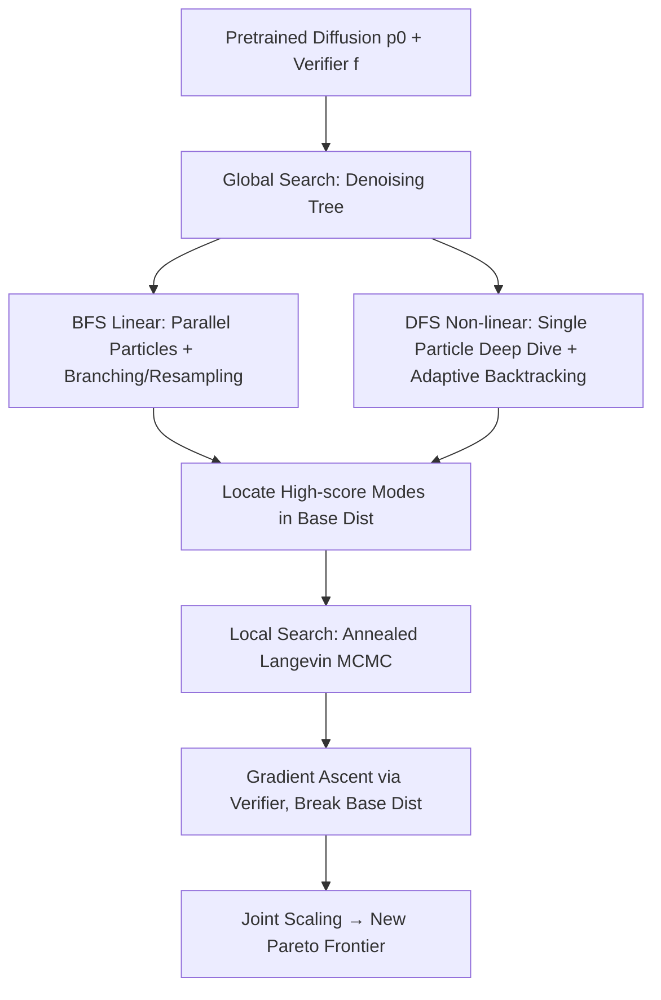

# Inference-Time Scaling of Diffusion Models Through Classical Search

**Conference**: ICLR 2026  
**OpenReview**: [https://openreview.net/forum?id=b7Ftp6U78i](https://openreview.net/forum?id=b7Ftp6U78i)  
**Code**: TBD  
**Area**: Image Generation / Diffusion Inference-Time Scaling / Decision Planning  
**Keywords**: inference-time scaling, diffusion models, tree search (BFS/DFS), Langevin MCMC, verifier guidance  

## TL;DR
This work systematically transfers classical AI search (BFS/DFS global tree search + annealed Langevin MCMC local search) to the diffusion model inference stage, jointly scaling "local search" and "global search" for the first time to refresh the efficiency-performance Pareto frontier across image generation, long-horizon planning, and offline RL.

## Background & Motivation
**Background**: Diffusion models exhibit strong performance in generating images, videos, and robotic actions. However, generated samples may not always satisfy specific test-time objectives (physical constraints, human preferences, high-value actions). The vast generation space often requires repeated sampling to achieve satisfactory results. Recent inference-time scaling work follows two paths: particle-based SMC filtering (FK-steering, DAS, SVDD) and tree-search-based methods (TreeG, DSearch), both of which search the denoising process along a fixed schedule.

**Limitations of Prior Work**: ① The design choices of these BFS-style methods (resampling, scoring, temperature) are fragmented and lack a unified characterization, making it unclear which is superior. ② They all use **fixed exploration schedules**, failing to allocate compute adaptively based on sample difficulty (wasting compute on simple instances while providing insufficient compute for difficult ones). ③ Global search can only select from "modes" already present in the base model, failing to generate higher-quality samples that exceed the base model's capabilities. ④ Training-free guidance is prone to over-optimizing the verifier, producing OOD/adversarial samples (reward hacking), and its theoretical foundation remains unclear.

**Key Challenge**: Global search efficiently finds good modes but is trapped within the base distribution; local search can break through the base distribution but is prone to local optima when used alone. Previously, these were always scaled **in isolation**, with no unified framework to scale them jointly.

**Goal**: Unify inference-time scaling using the language of classical search to provide both a stronger global tree search baseline and a theoretically guaranteed local search, while **jointly scaling** both for the first time.

**Core Idea**: **[Search as Sampling]** Treat the denoising process as a search tree of fixed depth. Globally, use BFS/DFS for best-first branching and backtracking; locally, use annealed Langevin MCMC to climb gradients along the verifier. The combination ensures the model is neither trapped in the base distribution nor in local optima.

## Method

### Overall Architecture
Given a pretrained diffusion model $\epsilon_\theta(x_t,t)$ and a verifier $f(x_0)$, the goal is to sample from the combined distribution $\tilde p_0(x_0)\propto p_0(x_0)f(x_0)^\lambda$ (where $\lambda$ controls the verifier weight). The method decomposes this goal into two layers of search: **Global Search** uses tree search to efficiently locate high-scoring modes within the base distribution, and **Local Search** uses Langevin MCMC to break through the base distribution in the sample neighborhood to approach the combined distribution, finally scaling both layers jointly.

### Key Designs

**1. Unified BFS Linear Search: Integrating fragmented baselines into a single design space.** The authors abstract parallel particle denoising as a layer-by-layer BFS expansion. Each layer scores intermediate particles using denoising estimates $f(x^k_{0|t})$ and allocates child nodes based on scores. Three orthogonal dimensions are explicitly parameterized: **Temperature** (Constant/Increase/Inf, to mitigate early scoring bias), **Scoring** (Current/Difference/Max, using the reward trajectory along the path rather than just the current reward), and **Resampling** (Multinomial vs. lower-variance SSP). Resampling determines child node counts $(n^1_t,\dots,n^N_t)=\mathrm{Resample}(N;w^1_t,\dots,w^N_t)$ based on $w^k_t=\mathrm{softmax}\,\hat f(x^k_t)$. This design space subsumes SVDD = BFS(Inf, Current, Multinomial), DAS = BFS(Increase, Difference, SSP), and FK-steering = BFS(Constant, Max, Multinomial). Ablations reveal that SSP resampling is key, leading to the stronger **BFS(Increase, Max, SSP)** baseline.

**2. DFS Non-linear Search: Adaptive backtracking driven by verifier scores.** While BFS uses a fixed schedule, DFS explores as deeply as possible along a single branch. If $f(x_{0|t})\le\delta_t$ (a user-defined quality threshold), it backtracks by injecting noise via forward diffusion $q(x_{t_{\text{next}}}|x_t)$ to jump to a higher noise level $t_{\text{next}}=t+\Delta T$ and restart from a different region of the manifold. Unlike the fixed noise injection in SoP, the backtracking noise level in DFS is determined by the particle score: difficult prompts and low-quality trajectories naturally trigger more backtracking and exploration, while simple instances are resolved quickly—allocating compute adaptively **without prior knowledge of difficulty**. The threshold serves as a knob for users to trade off quality and compute. In experiments, DFS saves up to 30% compute compared to BFS at equivalent quality.

**3. Local Search via Annealed Langevin MCMC: Theoretical unification of guidance and recurrence.** To break through the base distribution, the authors view sampling as constrained optimization in measure space, taking Langevin steps along the KL divergence gradient flow: $x^{i+1}_t=x^i_t+\eta\nabla_x\log\tilde q_t(x^i_t)+\sqrt{2\eta}\,\epsilon^i$. The score of the combined distribution can be directly added: $\nabla_x\log\tilde q_t=\nabla_x\log q_t+\nabla_x\log \hat q_t$, **requiring no additional training**. A key theoretical contribution (Proposition 1) shows that in the continuous limit as denoising steps $T\to\infty$, "training-free guidance + recurrence" is exactly equivalent to running Langevin MCMC on a sequence of annealed distributions. Recurrence steps correspond to Langevin sampling from the base distribution, while the guidance term $\Delta_t$ defines the annealing path biasing the sampling toward high-reward regions. This unifies two previously unrelated lines of work (guidance vs. MCMC), explains why recurrence avoids adversarial samples, and provides a principled basis for "scaling local search steps."

**4. Dual Verifiers to suppress reward hacking.** Gradient-based guidance is prone to over-optimizing the verifier, resulting in OOD adversarial samples. Inspired by double-Q learning, the authors assign **different verifiers** to local and global search, using one to evaluate the optimization results of the other, thereby suppressing overestimation and mitigating reward hacking.

The synergy of these four designs: BFS/DFS is responsible for "finding the right mode," Langevin local search for "refining the mode," and dual verifiers for "not being deceived by the verifier." Both DFS and local search embody the core philosophy of "allocating compute on demand"—the former by prompt difficulty and the latter by the distance from the sample to the combined distribution.

## Key Experimental Results

### Main Results Table (Text-to-Image, higher ImageReward is better)

| Model | N | BoN | FK | DAS(w/o grad) | TreeG | SVDD | SoP | DSearch | **BFS(ours)** |
|---|---|---|---|---|---|---|---|---|---|
| SD v1.5 | 4 | 0.702 | 0.743 | 0.878 | 0.860 | 0.667 | 0.688 | 0.836 | **0.882** |
| SD v1.5 | 8 | 0.891 | 0.926 | 1.052 | 1.023 | 0.775 | 0.884 | 1.011 | **1.087** |
| SD XL | 8 | 1.198 | 1.251 | 1.265 | 1.261 | 1.225 | 1.185 | 1.252 | **1.291** |
| FLUX.1 | 4 | 1.113 | 1.145 | 1.194 | 1.178 | 1.069 | 1.104 | 1.169 | **1.203** |

The improved BFS consistently outperforms previous methods across all models and compute budgets. DAS (w/o grad) has the smallest gap due to its use of SSP resampling, while SoP is less efficient due to uniform compute allocation.

### Ablation Study Table (BFS Design Choices, SD v1.5)

| N | Resampling: BoN / Multinomial / **SSP** | Scoring: Current / Diff / **Max** | Tempering: **Increase** / Inf / Constant |
|---|---|---|---|
| 4 | 0.702 / 0.743 / **0.834** | 0.812 / 0.823 / **0.834** | **0.882** / 0.667 / 0.834 |
| 8 | 0.896 / 0.926 / **1.032** | 0.996 / 1.013 / **1.032** | **1.087** / 0.775 / 1.032 |

SSP resampling provides the largest gain, with Max scoring and Increase temperature providing further modest improvements.

### Key Findings
- **DFS Adaptation**: On CompBench, DFS outperforms BoN and improved BFS across different compute budgets, saving up to 30% compute; difficult prompts automatically consume more compute without needing prior labels.
- **Offline RL (D4RL Locomotion)**: TTS (Ours) achieves an average score of 86.1, comparable to SOTA methods requiring joint training (D-QL 86.3, QGPO 86.6), and far exceeding gradient-based methods without recurrent local search like DAS (80.2) and TFG (82.1), while being **completely training-free**.
- **Inference Scaling Self-Distillation**: Using actions generated by TTS for offline distillation, single-step sampling performance surpasses online RL models like DPPO (Hopper 98.8 vs 92.8). This is the first work to achieve self-improvement in diffusion models via inference scaling with a pretrained verifier.
- **Joint Scaling**: In PointMaze long-horizon planning, scaling local search alone (TFG) is efficient at low budgets but fails to scale and gets trapped in local optima; combining BFS/DFS + local search establishes a new Pareto frontier.

## Highlights & Insights
- **Interpretability via Unified Perspective**: Using classical search language to unify fragmented SMC/tree search methods as special cases of the BFS design space explains previous designs while providing a stronger baseline.
- **Adaptivity as the Key to Inference Scaling**: DFS uses verifier scores rather than fixed schedules to determine backtracking depth, spending compute where it matters, echoing the trend that "test-time compute should be allocated by difficulty" without requiring difficulty priors.
- **Suture of Theory and Practice**: Proposition 1 proves that training-free guidance + recurrence is a special case of Langevin MCMC, resolving the long-standing question of why recurrence works.
- **Joint Scaling = A New Dimension**: Local search steps were rarely considered a scalable dimension. This work systematically amplifies it and combines it with global search, validating universality across image, planning, and RL domains.

## Limitations & Future Work
- Verifier quality is the ceiling: Local search climbs the verifier gradient; if the verifier is biased, even dual verifiers only mitigate rather than cure reward hacking.
- Langevin steps in local search introduce additional NFE overhead; while trading "compute for quality," the cost-benefit ratio may need careful balancing in compute-constrained scenarios.
- Many targets (Offline RL Q-functions, ImageReward) assume an existing differentiable verifier; applicability to goals where differentiable verifiers are hard to define (e.g., complex semantic constraints) remains to be verified.
- DFS thresholds $\delta_t$, temperature, and scoring have many hyperparameters; while cross-task transfer is shown, human tuning may still be required.

## Related Work & Insights
- **Particle-based scaling** (FK-steering, DAS, SVDD) and **tree-search scaling** (TreeG, DSearch) are unified as BFS variants; SoP’s fixed noise injection is surpassed by DFS’s adaptive backtracking. Concurrent works like MCTS value backup (Jain et al.) and full denoising backtracking (Lee et al.) also follow adaptive paths; this work differentiates itself by using "scores to determine backtracking levels."
- **Training-free guidance** (TFG, classifier guidance) relies on a biased first-order approximation of $f(x_{0|t})$; this work uses annealed Langevin MCMC for asymptotically exact sampling.
- Insight: Transferring mature "classical search + measure space optimization" theories to generative model inference is a low-cost, high-reward path; "inference scaling → distillation back to base model" may become a new paradigm for self-improvement without online RL.

## Rating
- **Novelty**: ⭐⭐⭐⭐ — Unified characterization and joint scaling of local/global search using classical search; Proposition 1's theoretical unification and "inference scaling self-distillation" are firsts.
- **Experimental Thoroughness**: ⭐⭐⭐⭐ — Covers images (SD1.5/SDXL/FLUX), long-horizon planning, and offline RL with complete design space ablations and multi-baseline comparisons.
- **Writing Quality**: ⭐⭐⭐⭐ — Logical progression from classical search motivation to a unified framework and theoretical propositions, with clear diagrams.
- **Value**: ⭐⭐⭐⭐ — Provides a stronger, ready-to-use BFS baseline and opens the new dimension of "local search scaling + self-distillation," offering significant practical and methodological value for diffusion model control.

<!-- RELATED:START -->

## Related Papers

- [\[ICLR 2026\] Compositional Visual Planning via Inference-Time Diffusion Scaling](compositional_visual_planning_via_inference-time_diffusion_scaling.md)
- [\[ICLR 2026\] RNE: plug-and-play diffusion inference-time control and energy-based training](rne_plug-and-play_diffusion_inference-time_control_and_energy-based_training.md)
- [\[ICML 2025\] Performance Plateaus in Inference-Time Scaling for Text-to-Image Diffusion Without External Models](../../ICML2025/image_generation/performance_plateaus_in_inference-time_scaling_for_text-to-image_diffusion_witho.md)
- [\[ICLR 2026\] Diffusion Blend: Inference-Time Multi-Preference Alignment for Diffusion Models](diffusion_blend_inference-time_multi-preference_alignment_for_diffusion_models.md)
- [\[CVPR 2026\] Rethinking Prompt Design for Inference-time Scaling in Text-to-Visual Generation](../../CVPR2026/image_generation/rethinking_prompt_design_for_inference-time_scaling_in_text-to-visual_generation.md)

<!-- RELATED:END -->
