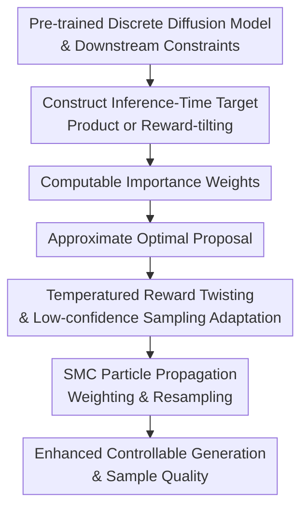

# Inference-Time Scaling of Discrete Diffusion Models via Importance Weighting and Optimal Proposal Design

**Conference**: ICLR 2026  
**OpenReview**: [https://openreview.net/forum?id=7wbrFQvfdH](https://openreview.net/forum?id=7wbrFQvfdH)  
**Code**: Not publicly available  
**Area**: Diffusion Models / Inference-Time Scaling / Controllable Generation  
**Keywords**: Discrete Diffusion Models, Sequential Monte Carlo, Importance Weighting, Optimal Proposal, Inference-Time Alignment  

## TL;DR
This paper introduces Sequential Monte Carlo (SMC) into the inference stage of discrete diffusion models. Through computable importance weights and near-optimal proposal designs, it enhances reward alignment, CFG sampling, and controllable generation for cross-modal, biological, and image tasks without retraining the base model.

## Background & Motivation
**Background**: Discrete diffusion models are expanding from early discrete state space modeling to masked diffusion language models, discrete image generators like MaskGit/Meissonic, and scientific design tasks such as DNA/protein sequences. They share a commonality: the generation process iteratively denoises discrete tokens, mask tokens, or categorical states. The base model typically learns a broad data distribution $p_\theta$, and downstream constraints are applied at inference time to select or guide samples.

**Limitations of Prior Work**: Real-world applications rarely require samples that are merely "like the training data"; they must also satisfy constraints such as preferences, attributes, toxicity, functional activity, or text-image alignment. Fine-tuning or RL-based methods can push rewards but often suffer from reward over-optimization, sacrificing quality and diversity. Pure guidance or sampling methods are easier to deploy but often lead to reward under-optimization, failing to push samples truly toward the target distribution under complex constraints.

**Key Challenge**: Controllable generation aims to sample from a constrained target distribution rather than simply maximizing a reward. If the reward is treated only as a local scorer, two problems arise: particles may collapse early into a few high-reward but low-quality modes, and the proposal (often following the pre-trained reverse diffusion kernel) mismatches the target distribution. This results in high variance in importance weights and a low effective sample size, undermining the theoretical advantages of SMC.

**Goal**: The authors aim to solve three sub-problems: first, how to construct inference-time target distributions for discrete diffusion (including product targets for CFG and reward-tilting targets for alignment); second, how to derive computable importance weights when the target distribution is not directly normalizable; third, how to design better proposals so that SMC does more than just "sampling more candidates" but stays stably near the constrained target distribution at each step.

**Key Insight**: Starting from Sequential Monte Carlo, the reverse denoising path of a diffusion model is viewed as a trajectory from noise to sample, approximated via particles, weights, and resampling. This approach is promising because SMC is naturally suited for scenarios where the "target is hard to sample, proposal is easy to sample, and weights are computable." While the target marginal distribution of discrete diffusion is difficult to obtain, the pre-trained reverse kernel and forward noise kernel provide enough structure to cancel out or approximate intractable ratios.

**Core Idea**: Use SMC to reformulate discrete diffusion inference-time control as a particle sampling path with importance weighting. Utilize first-order approximate proposals or amortized proposals to reduce weight variance, converting increased inference-time compute into stronger alignment and higher sample quality.

## Method
### Overall Architecture
The overall workflow can be understood as follows: given a pre-trained discrete diffusion model $p_\theta$, an inference-time target distribution $\pi(x_t)$ is defined based on the task. $N$ particles are maintained along the reverse denoising axis. At each step, a proposal $q(x_{t-1}\mid x_t)$ generates candidate particles, and importance weights are calculated based on the target ratio, the forward kernel, and the proposal. Finally, resampling is performed according to normalized weights to push the particle set toward the target distribution warped by CFG or rewards.

The key design focuses aren't on "more sampling" itself but on two pillars: making importance weights computable in discrete diffusion to go beyond formalism, and designing proposals closer to the local optimal distribution to prevent particle degradation. For reward-tilting, a time-varying reward twisting mechanism is introduced to gradually introduce reward influence.

### Key Designs
**1. Computable Importance Weights: Converting Intractable Target Ratios to Diffusion Kernel Ratios**

SMC requires incremental weights $w_{t-1}=\frac{\pi(x_{t-1})}{\pi(x_t)}\frac{\gamma(x_t\mid x_{t-1})}{q(x_{t-1}\mid x_t)}w_t$. The problem is that the intermediate marginal distribution $\pi(x_t)$ is usually unknown, especially when warped by a reward. The authors leverage the pre-trained reverse diffusion model to approximate detailed balance, rewriting the ratio of the base model distributions as a ratio of the reverse denoising kernel and the forward noise kernel.

For product targets ($\pi(x_t)\propto p_{\theta_1}(x_t)^\alpha p_{\theta_2}(x_t)^\beta$), weights are composed of multiple reverse and forward kernels. For reward-tilting ($\pi(x_t)\propto p_\theta(x_t)\exp(r(x_t))$), choosing the forward kernel $\gamma(x_t\mid x_{t-1})=p(x_t\mid x_{t-1})$ cancels out the forward noise terms, simplifying the weight to $\frac{\exp(r(x_{t-1}))}{\exp(r(x_t))}\frac{p_\theta(x_{t-1}\mid x_t)}{q(x_{t-1}\mid x_t)}$. This step is critical as it transforms reward control from "heuristic logit modification" into a particle weighting process with a target distribution interpretation.

**2. Approximate Optimal Proposal: Replacing Blind Reverse Kernels with Low-Variance Proposals**

SMC performance depends heavily on the proposal. If the proposal deviates from the target, weights collapse toward zero, leaving few paths after resampling. The authors provide the form for a locally optimal proposal $q^*(x_{t-1}\mid x_t)\propto \pi(x_{t-1})\gamma(x_t\mid x_{t-1})$, which for reward-tilting becomes $q^*(x_{t-1}\mid x_t)\propto \exp(r(x_{t-1}))p_\theta(x_{t-1}\mid x_t)$.

This optimality explains why the pre-trained reverse kernel (which only knows how to look like data, not the reward) is insufficient. However, computing $q^*$ exactly is costly. Two approximations are proposed: SMCgrad uses a first-order Taylor expansion of the reward $r(x_{t-1})$ to get $q(x_{t-1}\mid x_t)\propto p_\theta(x_{t-1}\mid x_t)\exp(x_{t-1}^\top\nabla_x r(x_t))$; SMCamot trains an amortized proposal $q_\phi$ to minimize the log-variance of importance weights, using an auxiliary network $F_\psi(t)$ to estimate the mean log-weight and reduce training variance. SMCgrad is lightweight for differentiable rewards, while SMCamot is more stable once trained.

**3. Temperatured Reward Twisting and Low-confidence Sampling Adaptation**

Forcing rewards on high-noise $x_t$ states causes weight variance to explode since token or pixel categories are uncertain. This is mitigated by a time-varying target $\pi(x_t)\propto p_\theta(x_t)\exp(\lambda_t r(x_t)/\alpha)$, where $\lambda_t$ scales from 0 to 1. This allows particles to stay in the base model's manifold early on and emphasize rewards later.

Since many rewards are defined only on clean $x_0$, the authors estimate intermediate rewards using $\hat r(x_t)=\frac{1}{M}\sum_m r(x_0^{(m)})$ where $x_0^{(m)}\sim p_\theta(x_0\mid x_t)$. To enable gradients for discrete sampling, Gumbel-Softmax relaxation is used. For low-confidence sampling, $p_\theta$ and $q_\phi$ share the same position selection rules to prevent weight degradation.

### Loss & Training
The base model is trained using standard objectives like cross-entropy for predicting $x_0$. This paper additionally trains the amortized proposal $q_\phi$ and auxiliary network $F_\psi(t)$ to minimize the upper bound of the path log-weight variance:

$$
L(\phi,\psi)=\mathbb{E}_{t,q_{ref}(x_{t-1},x_t)}\left[\log\frac{\exp(r(x_{t-1}))p_\theta(x_{t-1}\mid x_t)}{\exp(r(x_t))q_\phi(x_{t-1}\mid x_t)}-F_\psi(t)\right]^2.
$$

If $q_\phi$ is sufficiently close to the optimal proposal, the weights across particles approach a constant, maximizing the effective sample size. For text-to-image (Meissonic), LoRA is used to train the amortized proposal.

## Key Experimental Results

### Main Results

| Task / Setting | Method | Particles ($N$) | Primary Alignment Metric | Quality / Diversity Metric | Conclusion |
|--------|------|------|------|------|------|
| Toxic text generation | Pretrained MDLM | 1 | Toxic 0.8%, Holdout 5.2% | PPL 121.1, Dist 56/92/96 | Base model rarely generates toxicity |
| Toxic text generation | Propgrad | 1 | Toxic 58.0%, Holdout 58.3% | PPL 216.7, Dist 58/93/96 | First-order proposal pushes reward but hurts quality |
| Toxic text generation | Propamot | 1 | Toxic 63.7%, Holdout 75.7% | PPL 131.9, Dist 53/89/94 | Log-variance training stabilizes single particle |
| Toxic text generation | SMCbase | 8 | Toxic 26.7%, Holdout 40.0% | PPL 132.3, Dist 57/92/96 | SMC alone helps but alignment is weak |
| Toxic text generation | SMCgrad | 8 | Toxic 95.0%, Holdout 86.3% | PPL 132.1, Dist 57/92/96 | SMC + gradient proposal significantly boosts reward |
| Toxic text generation | SMCamot | 8 | Toxic 100.0%, Holdout 100.0% | PPL 127.0, Dist 43/81/91 | Strongest alignment |

| ImageNet256 / MaskGit + ReMDM | CFG | Steps | $N=1$ FID / IS | $N=8$ FID / IS | $N=16$ FID / IS |
|--------|------|------|------|------|------|
| Image Generation | 1.25 | 8 | 24.64 / 62.8 | 16.26 / 96.4 | 14.56 / 107.4 |
| Image Generation | 1.25 | 32 | 12.02 / 107.5 | 8.98 / 159.8 | 8.76 / 170.7 |
| Image Generation | 1.50 | 8 | 15.67 / 97.6 | 9.98 / 152.7 | 9.74 / 166.3 |

### Key Findings
- The value of SMC lies in "reallocating compute budget during generation" rather than post-hoc selection.
- The proposal is the most critical lever. SMCbase benefits from particles, but SMCgrad/amot show much larger gains, proving weight variance is the primary bottleneck.
- SMCamot often achieve the best rewards but can be mode-seeking; diversity metrics (Dist-1/2/3) showed slight drops.
- In text-to-image generation, SMCamot continuously improves HPSv2 and Aesthetic scores as $N$ increases, with stronger prompt adherence.

## Highlights & Insights
- The paper elevates discrete diffusion control from empirical logit-tuning to a formal sampling paradigm (target + proposal + weight).
- Identifying proposal variance as the core optimization target is highly insightful. Many scaling works focus on width or search depth, while this paper argues that without a good proposal, extra particles are just expensive, inefficient samples.
- Product targets (CFG) and reward-tilting are unified under the same SMC framework, showing they are varied instances of warping a target distribution.

## Limitations & Future Work
- **Computational Cost**: SMC requires multiple particles, iterative reward evaluations, and resampling. SMCgrad is particularly slow due to gradients.
- **Reward Quality Dependence**: SMC efficiently optimizes the reward provided; if the reward model is biased, SMC will amplify that bias.
- **Mode-seeking**: Strong alignment can reduce diversity. Future work needs to integrate diversity or entropy constraints into the proposal training.

## Related Work & Insights
- **vs CFG**: CFG is a special case of a product target; SMC adds an outer layer of particle weighting to improve FID/IS at low step counts.
- **vs RL / Fine-tuning**: Unlike methods that modify the base model, this approach scales at inference time, staying closer to the sampling theory than point-wise reward maximization.
- **vs BoN / Reranking**: BoN cannot correct bad paths mid-generation; SMC reallocates budget at every denoising step toward promising trajectories.

## Rating
- Novelty: ⭐⭐⭐⭐⭐ 
- Experimental Thoroughness: ⭐⭐⭐⭐⭐ 
- Writing Quality: ⭐⭐⭐⭐ 
- Value: ⭐⭐⭐⭐⭐ 

<!-- RELATED:START -->

## Related Papers

- [\[ICLR 2026\] Inference-Time Scaling of Diffusion Models Through Classical Search](inference-time_scaling_of_diffusion_models_through_classical_search.md)
- [\[ICLR 2026\] Entering the Era of Discrete Diffusion Models: A Benchmark for Schrödinger Bridges and Entropic Optimal Transport](entering_the_era_of_discrete_diffusion_models_a_benchmark_for_schrödinger_bridge.md)
- [\[ICLR 2026\] Compositional Visual Planning via Inference-Time Diffusion Scaling](compositional_visual_planning_via_inference-time_diffusion_scaling.md)
- [\[CVPR 2026\] Rethinking Prompt Design for Inference-time Scaling in Text-to-Visual Generation](../../CVPR2026/image_generation/rethinking_prompt_design_for_inference-time_scaling_in_text-to-visual_generation.md)
- [\[ICLR 2026\] Diffusion Blend: Inference-Time Multi-Preference Alignment for Diffusion Models](diffusion_blend_inference-time_multi-preference_alignment_for_diffusion_models.md)

<!-- RELATED:END -->
