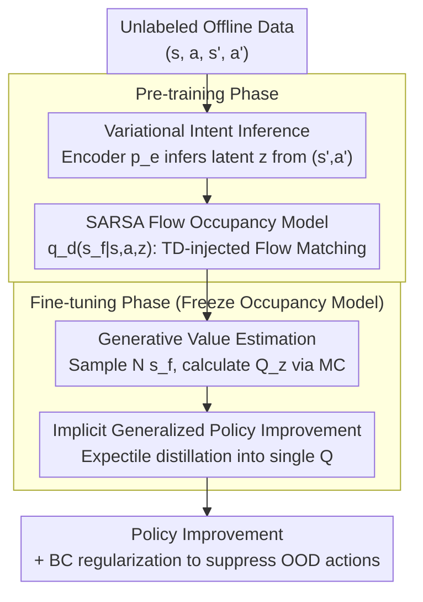

# Intention-Conditioned Flow Occupancy Models

## TL;DR

InFOM is proposed to construct an intention-conditioned occupancy model using flow matching. By inferring latent intentions from data via variational inference, it enables RL pre-training on unlabeled data. It achieves a $1.8\times$ median return gain and a $36\%$ success rate improvement across 36 state-based and 4 visual tasks.

## Background & Motivation

The large-scale pre-training and fine-tuning paradigm has achieved great success in NLP and CV, but remains an open problem in Reinforcement Learning (RL). The core difficulties in RL include:

**Temporal Reasoning**: Agents must reason about the long-term effects of current actions, while world models are limited by cumulative errors and have constrained long-range reasoning capabilities.

**Intention Reasoning**: Large-scale offline datasets are typically collected by multiple users performing different tasks, where these implicit "intentions" are not explicitly labeled.

**Limitations of Prior Work**: Behavior Cloning (BC) only mimics actions without capturing intentions; discriminative occupancy models are difficult to train; successor features methods often ignore user intentions.

Ours proposes InFOM (Intention-conditioned Flow Occupancy Models), which simultaneously learns a probabilistic model to capture both temporal and intentional information. This enables the pre-trained model to perceive the purposes of different users, thereby achieving more efficient policy learning during downstream task fine-tuning.

## Method

### Overall Architecture

InFOM consists of two phases: pre-training and fine-tuning. During pre-training, latent intentions $z$ are extracted from unlabeled data using variational inference, and an intention-conditioned occupancy model $q_d(s_f|s,a,z)$ is learned via flow matching with TD principles to characterize "which future states will be reached from the current state driven by intention $z$." During fine-tuning, this generative model serves as a future-state sampler to estimate Q-values via Monte Carlo integration, which are then distilled into a single value function for policy improvement through implicit GPI.

### Key Designs

**1. Variational Intention Inference: Explicitly extracting unlabeled "user purposes" from data**

Offline datasets $D=\{(s,a,s',a')\}$ are often collected by multiple users performing various tasks, where implicit intentions are never labeled. Methods like BC can only replicate actions without perceiving the underlying purpose. InFOM treats intention as a latent variable $z$ and infers it from transitions via variational inference. An intention encoder $p_e(z|s',a')$ infers intention from the next transition $(s',a')$, based on the "consistency assumption" — that a sequence of continuous transitions shares the same intention. The training objective is to maximize the ELBO $\mathbb{E}[\log q_d(s_f|s,a,z)] - \lambda D_{\mathrm{KL}}(p_e(z|s',a') \,\|\, p(z))$, with a standard Gaussian prior $p(z)=\mathcal{N}(0,I)$. The coefficient $\lambda$ controls the strength of KL regularization, pulling the posterior toward the prior to prevent intention encoding from degenerating into meaningless noise. This allows the occupancy model to model the future according to different intentions, enabling the perception of user purposes during downstream fine-tuning.

**2. SARSA Flow Occupancy Model: Learning the "future occupancy distribution" as a samplable generative model with Dynamic Programming**

The occupancy measure describes the future state distribution starting from $(s,a)$ weighted by a discount factor $\gamma$. Since discriminative modeling is difficult to train, InFOM uses flow matching to learn a generative occupancy model $q_d(s_f|s,a,z)$ for direct future state sampling. However, vanilla flow matching only fits trajectories present in the data and lacks stitching and combinatorial generalization capabilities. Therefore, the authors inject Temporal Difference (TD) principles into the flow matching loss: the occupancy loss is split into current and future terms $(1-\gamma)\mathcal{L}_{\text{current}} + \gamma \mathcal{L}_{\text{future}}$. The former fits the "actual next state reached," while the latter uses bootstrapping to pass the occupancy flow of the next state back to the current state, effectively performing dynamic programming in the flow space. A SARSA variant is chosen over a Q-learning variant because it bootstraps along actual transitions $(s',a')$ in the data without introducing OOD actions, making it simpler, more stable, and better performing on large datasets.

**3. Generative Value Estimation: Using the trained occupancy model as a sampler for Monte Carlo Q-value calculation**

During fine-tuning, the occupancy model is frozen, and value estimation no longer requires a separate critic network. For each $(s,a)$, $N=16$ future states $s_f^{(i)}$ are sampled directly from $q_d(s_f|s,a,z)$. The intention-conditioned Q-function is obtained by averaging the rewards: $Q_z(s,a)=\frac{1}{(1-\gamma)N}\sum_i r(s_f^{(i)})$. Here, intention $z$ is sampled from the prior $p(z)$ rather than the posterior, as the true intention of the downstream task is unknown. Sampling from the prior is equivalent to enumerating "what the value would be if the user had various possible intentions," providing a set of candidate $Q_z$ for subsequent policy improvement.

**4. Implicit Generalized Policy Improvement: Using expectile loss to distill a family of $Q_z$ into a single Q, bypassing ODE backpropagation**

Naive GPI requires taking the max over a set of intentions to select the optimal value. However, as intention is a continuous latent space and only a finite number of $z$ can be sampled, a hard max is limited by the sample set and requires differentiating through $Q_z$ via an ODE solver, which is highly unstable. InFOM instead uses an upper expectile loss to implicitly distill this family of $Q_z$ into a single scalar function $Q$: $\mathcal{L}(Q)=\mathbb{E}[L_2^\mu(Q_z(s,a)-Q(s,a))]$, where the asymmetric weight $\mu>0.5$ forces $Q$ to approximate the upper expectiles of the $Q_z$ distribution, approximating the max effect without explicit enumeration or ODE backpropagation. Policy extraction is then performed with an additional BC regularization term to suppress OOD actions. Ablations show this implicit approach yields a $44\%$ higher return and $8\times$ lower variance than naive GPI.

## Key Experimental Results

### Main Results: ExORL and OGBench Benchmarks

Compared against 8 baseline methods on 36 state-based tasks and 4 visual tasks:

| Task Domain | InFOM | Best Baseline | Gain |
|--------|-------|----------|------|
| walker (4 tasks avg) | **380.9** | 327.6 (MBPO+ReBRAC) | ~16% |
| jaco (4 tasks avg) | **727.4** | 67.7 (IQL) | ~20× |
| cube single (5 tasks) | **92.5** | 77.8 (MBPO+ReBRAC) | ~19% |
| visual tasks (4 tasks) | — | — | +31% over best |

- Matches or exceeds all baselines in 7 out of 9 domains.
- Most significant improvement in the jaco domain (~20×), attributed to the high-dimensional state space and sparse rewards.
- 31% higher performance than the strongest baseline on image-based tasks.
- Overall median return improvement of $1.8\times$ and success rate improvement of $36\%$.

### Ablation Study: Implicit GPI

| Policy Extraction Method | quadruped jump Return | scene task 1 Success Rate |
|-------------|---------------------|---------------------|
| InFOM (implicit GPI) | **Highest** | **Highest** |
| InFOM + GPI (naive max) | 44% Lower | Lower, 8× Variance |
| FOM + one-step PI | Significantly Lower | Significantly Lower |

- Implicit GPI outperforms naive GPI by $44\%$ with $8\times$ lower variance.
- Removing the intention encoder (FOM + one-step PI) leads to a significant performance drop, validating the importance of intention reasoning.

## Highlights & Insights

- **Unified Framework**: First to combine intention inference with flow matching occupancy models, capturing both temporal and intentional information within a single framework.
- **Implicit GPI**: Replaces explicit max operations with expectile loss, avoiding ODE backpropagation stability issues and the limitations of finite intention sets.
- **Strong Empirical Performance**: Outperforms 8 baselines across 36+4 tasks, with a 20× improvement in the jaco domain.
- **Intention Visualization**: t-SNE visualizations demonstrate that InFOM discovers cluster structures aligned with true intentions, whereas representations in FB and HILP are entangled.

## Limitations & Future Work

1. The simplification of inferring intentions from continuous state-action pairs may not accurately capture original intentions at the full trajectory level.
2. MC Q-estimation introduces variance (large standard deviations across seeds in some tasks).
3. Requires simultaneous pre-training of the encoder and flow model, resulting in higher computational overhead than pure BC methods.
4. The consistency assumption (continuous transitions sharing the same intention) may not hold in complex real-world scenarios.

## Related Work & Insights

- **Offline Unsupervised RL**: FB (Touati & Ollivier, 2021) and HILP (Park et al., 2024) learn skills/representations but typically do not model occupancy measures simultaneously.
- **Occupancy Models / Successor Representations**: Dayan (1993), Janner et al. (2020), and TD flows (Farebrother et al., 2025) use flow matching to model occupancy measures but do not model intention.
- **Generative RL**: Decision Transformer and Diffuser use generative models for trajectories/policies but typically do not explicitly predict long-term state distributions.
- **Representation Learning**: Contrastive learning and MAE learn general representations but do not guarantee benefits for policy adaptation.
- **Novelty of InFOM**: Compared to the most related TD flows, InFOM introduces variational latent variables for intention modeling and replaces explicit GPI on finite sets with implicit GPI.

## Rating

⭐⭐⭐⭐ (4/5)

- Clear theoretical motivation combining variational inference with flow matching occupancy models.
- Extensive experimental coverage and sufficient baselines (36+4 tasks × 8 baselines × 8 seeds).
- Implicit GPI provides an elegant engineering and theoretical contribution.
- Cons: Strong intention consistency assumption; MC estimation variance issues are not fully resolved.

<!-- RELATED:START -->

## Related Papers

- [\[ICCV 2025\] SCFlow: Implicitly Learning Style and Content Disentanglement with Flow Models](../../ICCV2025/image_generation/scflow_implicitly_learning_style_and_content_disentanglement_with_flow_models.md)
- [\[ICCV 2025\] MAVFlow: Preserving Paralinguistic Elements with Conditional Flow Matching for Zero-Shot AV2AV Multilingual Translation](../../ICCV2025/image_generation/mavflow_preserving_paralinguistic_elements_with_conditional_flow_matching_for_ze.md)
- [\[ICCV 2025\] Joint Diffusion Models in Continual Learning](../../ICCV2025/image_generation/joint_diffusion_models_in_continual_learning.md)
- [\[ICLR 2026\] ToProVAR: Efficient Visual Autoregressive Modeling via Tri-Dimensional Entropy-Aware Semantic Analysis and Sparsity Optimization](toprovar_efficient_visual_autoregressive_modeling_via_tri-dimensional_entropy-aw.md)
- [\[NeurIPS 2025\] Emergence and Evolution of Interpretable Concepts in Diffusion Models](../../NeurIPS2025/image_generation/emergence_and_evolution_of_interpretable_concepts_in_diffusi.md)

<!-- RELATED:END -->
