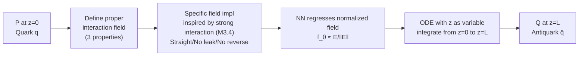

# Interaction Field Matching: Overcoming Limitations of Electrostatic Models

**Conference**: ICLR 2026  
**OpenReview**: [https://openreview.net/forum?id=GEsTLuJy1q](https://openreview.net/forum?id=GEsTLuJy1q)  
**Code**: [https://github.com/justkolesov/InteractionFieldMatching](https://github.com/justkolesov/InteractionFieldMatching)  
**Area**: Generative Models / Distribution Shift  
**Keywords**: Electrostatic Field Matching, Strong Interaction, Physics-inspired Generative Models, Distribution Shift, Optimal Transport  

## TL;DR
The authors generalize Electrostatic Field Matching (EFM) into a framework of "arbitrary pairwise interaction fields" (IFM). By designing a specific field inspired by strong interaction between quarks, they ensure field lines are straight, non-leaking, and non-reversing, fundamentally solving EFM's issues of reverse field lines, out-of-bounds termination, and uncontrollable training volume.

## Background & Motivation
- **Background**: While Diffusion Models and Flow Matching dominate generative modeling, a "Coulomb Electrostatics" branch has emerged. This includes PFGM, which treats noise as negative charges and data as positive charges for generation, and EFM (Kolesov et al., 2025), which generalizes this to a capacitor model for direct data-to-data translation (image-to-image translation).
- **Limitations of Prior Work**: EFM treats two distributions as positive and negative charges on capacitor plates, performing migration along electric field lines. Despite its elegance, it faces practical hurdles: **(1) Reverse field lines**: Each plate emits lines both toward the opposite plate and toward the back; the back-facing lines are essential for covering the target distribution but are highly curved and extend into the entire space, making them difficult to model. **(2) Out-of-bounds termination**: Even forward lines can cross the $z=L$ boundary into the $z>L$ region, requiring additional stopping criteria for recovery. **(3) Uncontrollable training volume**: These issues force the neural network to sample and learn the field in massive regions both between and outside the plates, the extent of which is unknown a priori.
- **Key Challenge**: The physical properties of electrostatic fields (where lines necessarily diverge in all directions under Coulomb's law) inherently conflict with the engineering requirement of "a bundle of straight, bounded lines to smoothly transport distributions." One cannot retain the electric field while eliminating leakage and reversal.
- **Goal**: To break free from the "must use electrostatic field" constraint, identify the minimal properties required for a "field capable of distribution migration," and select a field within this larger design space that lacks the aforementioned defects.
- **Core Idea**: **[Abstraction]** First, prove that as long as a field satisfies three physical properties (lines start/end at quark pairs, flux conservation, and generalized superposition over a transport plan), motion along field lines can provably migrate $P$ to $Q$. The electrostatic field is merely a special case. **[Implementation]** Second, design a specific field modeled after quark-antiquark strong interactions (where field lines "straighten into strings" at a distance), which naturally satisfies "no $z>L$ leakage" and "no reverse lines."

## Method

### Overall Architecture
IFM retains the EFM setting where two distributions are capacitor plates: two $D$-dimensional distributions $P$ and $Q$ are placed on two hyperplanes $z=0$ and $z=L$ in $\mathbb{R}^{D+1}$, treated as quarks $q$ and antiquarks $\bar q$. The mechanism consists of two layers: abstracting the requirements for a "migration field" into three properties (satisfied by any valid field, including EFM's), and then using a strong-interaction-inspired field to eliminate EFM's flaws. Training involves regressing a neural network to the normalized field direction, while inference uses an ODE with $z$ as the integration variable to move from $z=0$ to $z=L$.

### Key Designs

**1. Proper interaction field: Abstracting the requirements to liberate the design space.** This is the theoretical foundation. The authors no longer mandate an electrostatic field but ask: what must an interaction field $E(\tilde x)$ satisfy to guarantee distribution migration? The answer comprises three points: **(Prop 1) Line Endpoints**: Field lines for equal-charge quark pairs must start at the quark and end at the antiquark, $\frac{d\tilde x(\tau)}{d\tau}=n(\tilde x(\tau))$ with $\tilde x(\tau_s)=\tilde x_q, \tilde x(\tau_f)=\tilde x_{\bar q}$; **(Prop 2) Flux Conservation**: $E(\tilde x)\cdot dS = \text{const}$ along a stream tube, meaning the number of lines through a surface is constant and the total flux is proportional to the quark charge, independent of pair positions; **(Prop 3) Generalized Superposition**: For a given transport plan $\pi(x_q, x_{\bar q})$ between $P$ and $Q$, the global field is a weighted average of pairwise fields:
$$E_\pi(\tilde x)=\iint \pi(x_q,x_{\bar q})\,E_{x_q,x_{\bar q}}(\tilde x)\,dx_q\,dx_{\bar q}.$$
The authors prove (Lemma 3.1) that if Props 1-2 are satisfied pairwise, the total field for continuous/discrete systems will still start at supp(P), end at supp(Q), and conserve flux. The electrostatic field is a special case (Example 3.2, where Prop 3 becomes independent of $\pi$). This abstraction allows picking a "better-behaved" field.

**2. Strong interaction inspired field: Straightening lines and eliminating leakage.** Within the new design space, the authors seek inspiration from physics: quark pairs interact like charges at short distances but their field lines "straighten into a string" when pulled apart. The constructed field (M3.4) curves toward quarks at the ends ($z\in[0, d]$ and $z\in[L-d, L]$) but remains perfectly straight in the middle ($z\in[d, L-d]$). The string has an effective width $\sigma_0$ beyond which the field strength decays exponentially. Theorem 3.4 proves this field not only satisfies the three basic properties but also guarantees **field lines never cross $z>L$** and **no reverse field lines exist**—fixing M2.3's defects.

**3. Training scheme with transport plan as a knob and inter-plate noise interpolation.** Prop 3 explicitly incorporates the transport plan $\pi$ into the field, making $\pi$ an adjustable parameter: using an independent plan $\pi=P\times Q$ is the default, while using a minibatch Optimal Transport plan (IFM-MB) enables better shape preservation during migration. Sampling for training no longer needs to cover infinite space outside the plates; instead, it uses noise added to the linear interpolation between endpoints:
$$\tilde x=\left(1-\tfrac{z}{L}\right)\tilde x_q+\tfrac{z}{L}\tilde x_{\bar q}+\tilde\epsilon(z),$$
where $z\sim r(z)$ is a distribution over $[0, L]$, and $\tilde\epsilon(z)$ has zero variance at the ends and maximum variance at the midpoint $z=L/2$ ($\sigma^2(z)=\frac{L}{2}-|\frac{L}{2}-z|$). The ground truth field is estimated via Monte Carlo, and the network regresses the normalized direction: $E_{\tilde x}\|f_\theta(\tilde x)-\frac{E(\tilde x)}{\|E(\tilde x)\|_2}\|_2^2\to\min_\theta$.

**4. Deterministic ODE inference with z as the physical variable.** EFM inference requires guessing when to stop integration for different lines, which is cumbersome and unreliable. IFM replaces the time variable $t$ with $z$, setting explicit start ($z=0$) and end ($z=L$) points:
$$d\tilde x=\left(\frac{E_x(\tilde x)}{E_z(\tilde x)},\,1\right)dz\approx\left(\frac{f_\theta(\tilde x)_x}{f_\theta(\tilde x)_z},\,1\right)dz.$$
Since the IFM field guarantees lines neither leak nor reverse, solving the ODE from $z=0$ to $z=L$ via Euler integration provably transports $P$ to $Q$ (Theorem 3.3), completely removing the need for EFM's stopping criteria.

## Key Experimental Results

### Main Results (Image Generation, FID↓)

| Dataset / Method | IFM (ours) | EFM | PFGM++ | PFGM | FM | DDPM | StyleGAN |
|---|---|---|---|---|---|---|---|
| CIFAR-10 (32×32) | 2.28 | 2.62 | **2.15** | 2.76 | 2.99 | 3.12 | 2.48 |
| CelebA (64×64) | 3.07 | >100 | **2.89** | 3.95 | 14.45 | 12.26 | 3.68 |

> IFM out-performs its direct predecessor EFM and the related PFGM on CIFAR-10, trailing slightly behind PFGM++. On 64x64 CelebA, **EFM fails (FID > 100) while IFM achieves 3.07**, putting it in the same tier as top-performing methods.

### Ablation Study

**Image-to-Image Translation (CMMD↓)**

| Dataset / Method | IFM-MB (ours) | IFM (ours) | EFM | FM | CycleGAN | DDIB |
|---|---|---|---|---|---|---|
| '2'→'3' (32×32) | **0.87** | 0.95 | 0.93 | 1.06 | 0.90 | 0.96 |
| W→S (64×64) | **1.13** | 1.25 | ≫1 | ≫1 | 1.33 | 1.39 |

**Inference Time (Seconds, IFM generation, same arch/100 steps as EFM/FM/DDPM)**

| Dataset / Batch | 256 | 128 | 64 | 16 | 1 |
|---|---|---|---|---|---|
| CIFAR-10 (32×32) | 10.93 | 5.74 | 1.63 | 0.82 | 0.7 |
| CelebA (64×64) | 36.81 | 18.45 | 8.5 | 2.93 | 0.97 |

### Key Findings
- **Robustness to plate distance L**: On Gaussian→Swiss Roll, results are nearly identical for $L=6$ and $L=40$, with field lines remaining straight; EFM fails at large $L$ due to severe curvature.
- **Minibatch OT plan benefit**: IFM-MB outperforms the independent plan version on both translation tasks, validating the utility of the "transport plan as a knob."
- **Zero additional overhead**: Under fair comparison (same network, Euler solver, 100 steps), IFM's speed and memory usage (peak ~8/10/16 GB for 32/64/128 res) are identical to EFM/PFGM/FM, with gains derived from better formulation rather than computation.
- **Efficiency**: Training on a single A100 (30 GB) takes <10h for 32x32/64x64 and <30h for 128x128.

## Highlights & Insights
- **"Abstracting minimal conditions before selecting a special case" is a powerful methodology**: Rather than brute-force fixing the electrostatic field, the authors ask what is truly required for migration. Relegating the Coulomb field to a special case of three properties immediately unlocks a vast design space.
- **Perfect application of physical intuition**: The image of quark strong interaction strings perfectly matches the engineering need for "straight mid-sections, tapered ends, and bounded width," translating an abstract need into a computable field.
- **Explicit transport plan integration**: Including $\pi$ in the superposition principle allows structural constraints like minibatch OT to be naturally embedded, providing an interface for shape-preserving migration.

## Limitations & Future Work
- **Proof-of-concept scale**: Experiments stop at 128x128 CelebA. There is a lack of high-resolution or large-scale (e.g., ImageNet) validation to see if it can compete with modern SOTA Diffusion/Flow Matching.
- **Lags behind PFGM++**: CIFAR-10 and 64x64 CelebA FIDs still slightly trail PFGM++, indicating that fixing EFM's flaws does not automatically equal overall dominance in the physics-inspired field.
- **Manual field design hyperparameters**: Parameters like the curved region width $d$ and string width $\sigma_0$ are manually set. While sensitivity is addressed in the appendix, the main text lacks deep discussion on these trade-offs.
- **Strong interaction as "inspiration"**: Real strong fields require complex quantum calculations; the paper uses a modified physical interaction, making the quark physics an effective metaphor rather than a rigorous derivation.

## Related Work & Insights
- **EFM** (Kolesov et al., 2025): The direct predecessor that extended electrostatics to data-to-data tasks; IFM is its rigorous generalization and fixes its three major flaws.
- **PFGM / PFGM++** (Xu et al., 2022; 2023): Pioneers of field-inspired generation for noise-to-data; IFM clarifies their position as special cases within the "three property" framework.
- **Flow Matching / Bridge Matching / Diffusion**: Note that IFM's inter-plate interpolation training does not have a direct equivalent in these methods, representing a distinct "physical field" trajectory.
- **Related Work**: Minibatch OT plans are used as instances of Prop 3 to enhance shape preservation, similar to recent trends in Optimal Transport-based generative models.

## Rating
- **Novelty**: ⭐⭐⭐⭐ High. Abstracting electrostatic matching into a "proper interaction field" is a theoretically sound generalization, and the strong-interaction implementation is highly creative.
- **Experimental Thoroughness**: ⭐⭐⭐ Good tasks (toy, generation, translation) and baselines, but scale is limited to 128x128 and does not reach SOTA on all metrics.
- **Writing Quality**: ⭐⭐⭐⭐ Very clean. The logic from pain points to properties to implementation is strong, and the physical analogies are accessible.
- **Value**: ⭐⭐⭐⭐ Clears major engineering hurdles for field-inspired generation and provides a reusable framework and open-source code for future research.

<!-- RELATED:START -->

## Related Papers

- [\[ICLR 2026\] PixNerd: Pixel Neural Field Diffusion](pixnerd_pixel_neural_field_diffusion.md)
- [\[ICLR 2026\] Any-step Generation via N-th Order Recursive Consistent Velocity Field Estimation](any-step_generation_via_n-th_order_recursive_consistent_velocity_field_estimatio.md)
- [\[ICLR 2026\] Source-Guided Flow Matching](source-guided_flow_matching.md)
- [\[ICLR 2026\] Flow Matching with Semidiscrete Couplings](flow_matching_with_semidiscrete_couplings.md)
- [\[ICLR 2026\] Arbitrary-Shaped Image Generation via Spherical Neural Field Diffusion](arbitrary-shaped_image_generation_via_spherical_neural_field_diffusion.md)

<!-- RELATED:END -->
## Related Papers

- [\[ICLR 2026\] PixNerd: Pixel Neural Field Diffusion](pixnerd_pixel_neural_field_diffusion.md)
- [\[ICLR 2026\] Any-step Generation via N-th Order Recursive Consistent Velocity Field Estimation](any-step_generation_via_n-th_order_recursive_consistent_velocity_field_estimatio.md)
- [\[ICLR 2026\] Arbitrary-Shaped Image Generation via Spherical Neural Field Diffusion](arbitrary-shaped_image_generation_via_spherical_neural_field_diffusion.md)
- [\[ICLR 2026\] Branched Schrödinger Bridge Matching](branched_schrödinger_bridge_matching.md)
- [\[ICLR 2026\] Discrete Adjoint Matching](discrete_adjoint_matching.md)

<!-- RELATED:END -->
