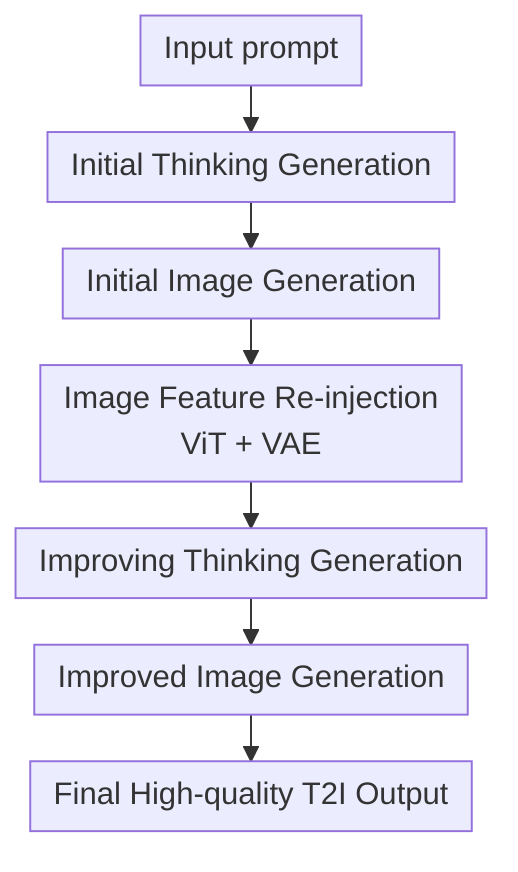

# Interleaving Reasoning for Better Text-to-Image Generation

**Conference**: ICLR2026  
**OpenReview**: [https://openreview.net/forum?id=lLNNzBQPas](https://openreview.net/forum?id=lLNNzBQPas)  
**Code**: https://github.com/Osilly/Interleaving-Reasoning-Generation  
**Area**: Image Generation / Reasoning-Enhanced Text-to-Image Generation  
**Keywords**: Interleaved Reasoning, Text-to-Image Generation, Unified Multimodal Models, Reflective Generation, Fine-grained Fidelity  

## TL;DR
This paper proposes Interleaving Reasoning Generation, which enables unified multimodal models to generate images following a trajectory of "text thinking $\rightarrow$ initial image $\rightarrow$ text reflection $\rightarrow$ improved image." By training this process with six decomposed learning tasks in the IRGL-300K dataset, the model outperforms BAGEL self-CoT and other unified models on multiple T2I benchmarks, particularly improving instruction following, world knowledge, and detail quality.

## Background & Motivation
**Background**: Text-to-image generation is shifting from pure diffusion/autoregressive generators toward unified multimodal foundation models. Models like BAGEL, Show-o, Janus, and Emu3 process text prompts and image inputs/outputs, possessing the inherent potential to transfer understanding capabilities into the generation process. Simultaneously, systems like GPT-4o demonstrate superior instruction following, prompting the community to reconsider if image generation should involve reasoning before action.

**Limitations of Prior Work**: Existing T2I efforts attempt to incorporate self-CoT or text reasoning before generation, rewriting prompts into detailed plans. While this alleviates the difficulty of generating from short prompts, most only produce a single auxiliary signal for one-shot generation. High-quality images depend not just on semantic alignment but also on textures, shadows, and subtle structures that are often only identifiable after observing an initial output.

**Key Challenge**: Single-round reasoning helps prompt understanding but lacks a closed loop for "observing self-generated results and correcting." Conversely, existing reflection-based T2I methods often use reflection to fix obvious semantic errors or rely on external LLMs/reward models, making it difficult to stably integrate reflection into unified models for fine-grained quality improvement.

**Goal**: The authors decompose the goal into two levels. First, the model should generate useful "thinking" before the first image to establish core content. Second, the model should encode its initial image to write "improving thinking" and execute refinements for a better second-round image. This process aims to occur end-to-end within a unified model rather than across disjointed modules.

**Key Insight**: Leveraging unified multimodal models like BAGEL allows for processing interleaved text-image inputs. Since these models exchange text representations, image ViT/VAE features, and generation states within the same transformer, the reasoning process can transition from purely text-based to cross-modal information fusion across rounds.

**Core Idea**: Transforming T2I from one-shot `prompt -> image` to two-round interleaved reasoning: `prompt -> thinking -> image` for a semantically correct initial result, followed by initial image encoding to generate reflection text and a refined image. Six decomposed tasks are used to strengthen each stage of the trajectory.

## Method

### Overall Architecture
The IRG reasoning trajectory is summarized as `text-image-text-image`. Given an input prompt $T_{in}$, the model generates initial thinking $T_{out}^{(1)}$, followed by an initial image $I_{out}^{(1)}$. This image is then encoded into ViT/VAE features $I_f^{(1)}$, which, along with the prompt and first-round thinking, guide the generation of improving thinking $T_{out}^{(2)}$ and the final refined image $I_{out}^{(2)}$.

The training framework, Interleaving Reasoning Generation Learning (IRGL), utilizes the IRGL-300K dataset containing six learning modes: four focused on text reasoning and two on full thinking-image trajectories. Training involves two stages: Stage 1 establishes basic thinking/reflection capabilities across all tasks, and Stage 2 focuses on full-trajectory optimization.

### Key Designs
**1. Interleaved Reasoning Generation: Integrating Reflection into the Unified Trajectory**

Unlike standard self-CoT T2I ($T_{in} \rightarrow T_{out}^{(1)} \rightarrow I_{out}^{(1)}$), IRG incorporates the first image into the loop: $T_{in} \rightarrow T_{out}^{(1)} \rightarrow I_{out}^{(1)} \xrightarrow{enc} I_f^{(1)} \rightarrow T_{out}^{(2)} \rightarrow I_{out}^{(2)}$. The $enc$ process provides ViT and VAE features directly to the model, allowing subsequent generation to observe both textual and visual states. This addresses the "one-shot blindness" problem, enabling second-round thinking to target specific defects like unnatural textures or structural flaws.

**2. Six Decomposed Learning Modes: Alleviating Data Scarcity**

Since complete IRG trajectories are difficult to obtain at scale, the process is split into six supervised forms. The initial stage includes Initial Thinking Understanding, Generation, and Full Learning. The improvement stage includes Improving Thinking Understanding, Generation, and Full Learning. This allows the model to learn the same capability under different information conditions (e.g., generating thinking with or without visual reference).

**3. IRGL-300K Data Construction: Distillation for Quality and Reflection**

Data for initial thinking is generated by Qwen2.5-VL based on prompt-image pairs. For Initial Full Learning, GPT-4o generates high-quality images. The improvement data is constructed by using the base BAGEL model to generate "weak" initial images and prompts, then using high-quality images as refinement targets. MLLMs are used to analyze the differences and write structured "improvement guidance."

**4. CFG Condition Design for the Improvement Stage**

The second generation round involves complex conditions: original prompt, initial thinking, image features, and improving thinking. The authors designed two complementary CFG conditions: one comparing the presence/absence of initial image information, and another for reflection text. Both guidance scales are set to 2.0 to ensure the model retains initial layout while executing specific modifications.

### Loss & Training
The model is initialized with BAGEL.  
**Stage 1**: Trained for 2K steps on all six decomposed modes using cross-entropy loss for tokens and mean squared error loss for image generation.  
**Stage 2**: Trained for 30K steps focusing on Full Learning modes to bridge the gap between reasoning and pixel generation. The full trajectory requires longer convergence to learn fine-grained fidelity changes.

## Key Experimental Results

### Main Results
IRG is compared against generation-only models and self-CoT variants on benchmarks like GenEval and WISE.

| Dataset | Metric | IRG | Strong Baseline | Gain |
|--------|------|-----|--------|------|
| GenEval | Overall | 0.85 | BAGEL w/ self-CoT 0.79 / GPT-4o 0.84 | +0.06 vs self-CoT |
| WISE | Overall | 0.77 | BAGEL w/ self-CoT 0.70 / Show-o2 0.61 | +0.07 vs self-CoT |
| TIIF testmini | Short / Long | 76.00 / 73.77 | BAGEL w/ self-CoT 68.06 / 68.78 | +7.94 / +4.99 |
| OneIG-EN | Overall | 0.415 | BAGEL 0.361 / FLUX.1-dev 0.434 | Leader in unified models |

On GenEval, IRG excels in counting (0.83) and spatial positioning (0.74). On WISE, it outperforms baselines in domains requiring world knowledge (e.g., Biology 0.81, Physics 0.82).

### Ablation Study
The ablation compares high-quality training, IRG trajectories, and decomposed learning modes.

| Configuration | WISE | TIIF | GenAI-Bench | Note |
|------|------|------|-------------|------|
| BAGEL w/ self-CoT | 0.70 | 68.06 / 68.78 | 0.81 | Base self-CoT |
| + High-quality Images | 0.73 | 70.69 / 69.85 | 0.80 | Unstable gain |
| + IRG Trajectory | 0.76 | 73.90 / 71.37 | 0.83 | Clear trajectory benefit |
| + Decomposed Modes | 0.77 | 76.00 / 73.77 | 0.84 | Best performance |

### Key Findings
- Decomposed learning modes are essential; training purely on high-quality images is less stable across different benchmarks.
- The second round acts as visual quality optimization. While standard benchmark scores between Step 1 and Step 2 are close, human/MLLM preference for Step 2 is significantly higher (74% preference), indicating improvements in textures and aesthetics that current metrics struggle to capture.
- CFG design is critical for stability; removing either text or image caches during the second round drops quality.
- Reasoning steps exhibit diminishing returns; extending to 3 or 4 steps leads to slight performance degradation due to error accumulation.

## Highlights & Insights
- Moving reasoning from "pre-generation planning" to "in-generation cross-modal loops" allows the model to treat its own output as a reasoning subject.
- The six-task learning strategy effectively uses reasoning as a data-efficient proxy for expensive full trajectories.
- The distinction between benchmark performance and perceived visual quality is crucial; Step 2 prioritizes local fidelity and aesthetic coherence.

## Limitations & Future Work
- Data construction depends on strong teacher models (GPT-4o), raising questions about scale and cost.
- The model is currently optimized for two rounds; arbitrary-length refinement requires better stop-strategies or RL-based constraints.
- Inference latency doubles (from ~30s to ~60s), necessitating a trade-off between quality and speed.
- Over-refinement can introduce artifacts, such as over-smoothing or disrupting global layout in complex scenes.

## Related Work & Insights
- **vs BAGEL self-CoT**: IRG adds post-image reflection, utilizing visual feedback for correction.
- **vs T2I-R1**: While T2I-R1 emphasizes step-by-step semantic alignment, IRG focuses on the cross-modal `text-image-text-image` loop.
- **vs Reflection-based T2I**: Most existing methods use external components; IRG achieves this end-to-end within a single unified model.

## Rating
- Novelty: ⭐⭐⭐⭐⭐ 
- Experimental Thoroughness: ⭐⭐⭐⭐☆
- Writing Quality: ⭐⭐⭐⭐☆ 
- Value: ⭐⭐⭐⭐⭐ 

<!-- RELATED:START -->

## Related Papers

- [\[CVPR 2026\] Thinking-while-Generating: Interleaving Textual Reasoning throughout Visual Generation](../../CVPR2026/image_generation/thinking-while-generating_interleaving_textual_reasoning_throughout_visual_gener.md)
- [\[ICLR 2026\] ImageDoctor: Diagnosing Text-to-Image Generation via Grounded Image Reasoning](imagedoctor_diagnosing_text-to-image_generation_via_grounded_image_reasoning.md)
- [\[ICLR 2026\] RePrompt: Reasoning-Augmented Reprompting for Text-to-Image Generation via Reinforcement Learning](reprompt_reasoning-augmented_reprompting_for_text-to-image_generation_via_reinfo.md)
- [\[ECCV 2024\] Textual-Visual Logic Challenge: Understanding and Reasoning in Text-to-Image Generation](../../ECCV2024/image_generation/textual-visual_logic_challenge_understanding_and_reasoning_in_text-to-image_gene.md)
- [\[ICLR 2026\] MILR: Improving Multimodal Image Generation via Test-Time Latent Reasoning](milr_improving_multimodal_image_generation_via_test-time_latent_reasoning.md)

<!-- RELATED:END -->
## Related Papers

- [\[CVPR 2026\] Thinking-while-Generating: Interleaving Textual Reasoning throughout Visual Generation](../../CVPR2026/image_generation/thinking-while-generating_interleaving_textual_reasoning_throughout_visual_gener.md)
- [\[ICLR 2026\] ImageDoctor: Diagnosing Text-to-Image Generation via Grounded Image Reasoning](imagedoctor_diagnosing_text-to-image_generation_via_grounded_image_reasoning.md)
- [\[ICLR 2026\] RePrompt: Reasoning-Augmented Reprompting for Text-to-Image Generation via Reinforcement Learning](reprompt_reasoning-augmented_reprompting_for_text-to-image_generation_via_reinfo.md)
- [\[ECCV 2024\] Textual-Visual Logic Challenge: Understanding and Reasoning in Text-to-Image Generation](../../ECCV2024/image_generation/textual-visual_logic_challenge_understanding_and_reasoning_in_text-to-image_gene.md)
- [\[ICLR 2026\] MILR: Improving Multimodal Image Generation via Test-Time Latent Reasoning](milr_improving_multimodal_image_generation_via_test-time_latent_reasoning.md)

<!-- RELATED:END -->
