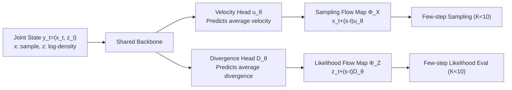

# Joint Distillation for Fast Likelihood Evaluation and Sampling in Flow-based Models

**Conference**: ICLR 2026  
**OpenReview**: [https://openreview.net/forum?id=8uZ5UdIul2](https://openreview.net/forum?id=8uZ5UdIul2)  
**Code**: TBD  
**Area**: Image Generation / Flow Model Acceleration  
**Keywords**: Flow Matching, Likelihood Evaluation, Distillation, Flow Map, MeanFlow, Few-step Sampling  

## TL;DR
By coupling the "sampling trajectory" and "log-likelihood (cumulative divergence)" into the same flow map for joint distillation, F2D2 reduces the NFE for both sampling and likelihood evaluation in flow matching models from thousands to just a few steps. This achieves **few-step exact likelihood evaluation** for CNF/diffusion-type models for the first time.

## Background & Motivation

**Background**: Diffusion and Flow Matching are current workhorses for image/video generation. Log-likelihood is fundamental for model comparison, RL/preference optimization (PPO, DPO, GRPO), and avoiding mode collapse. A key advantage of Continuous Normalizing Flows (CNF) is the ability to compute exact likelihood via probability flow ODEs.

**Limitations of Prior Work**: Exact likelihood requires integrating the divergence term $\int_0^1 \mathrm{div}(v_\theta(\hat x_t,t))\,dt$ along the ODE trajectory, which typically requires 100–1000 NFEs—significantly more expensive than sampling. While the field of few-step sampling (Consistency Models, Shortcut, MeanFlow, etc.) has been successful, these methods either **completely abandon likelihood calculation** or (like CTM) still require hundreds of integration steps across the trajectory. **Fast likelihood evaluation remains a gap**.

**Key Challenge**: Sampling can be distilled into few steps, whereas likelihood evaluation is constrained by the requirement of "integrating divergence along the full trajectory." The two objectives seem mutually exclusive.

**Goal**: To enable a single model to possess both few-step ($K<10$) sampling and few-step ($K<10$) likelihood evaluation capabilities.

**Key Insight**: The authors observe that the sampling trajectory $\frac{d}{dt}x_t=v_\theta$ and log-density evolution $\frac{d}{dt}\log p_t=-\mathrm{div}(v_\theta)$ in CNFs are a set of **coupled ODEs sharing the same velocity field**. Divergence is simply another output derived from the same velocity model. Therefore, a **single flow map can be used to jointly distill both the sampling trajectory and cumulative divergence**, allowing both to learn to "skip steps."

## Method

### Overall Architecture

F2D2 (fast flow joint distillation) treats likelihood calculation as a "by-product" of the velocity field. Since both sampling and likelihood originate from the same velocity $v_\theta$, a network with a shared backbone and dual prediction heads is used to learn a **joint flow map** $\Phi_Y$, which simultaneously predicts state displacement and log-density increments. The framework is modular—it can be integrated into existing few-step flow map models (Shortcut, MeanFlow, LSD) by simply adding a "divergence prediction head" and two corresponding likelihood losses.

### Key Designs

**1. Joint Flow Map Parameterization: Embedding likelihood into the Z-component**. The flow map $\Phi(\hat x_t,t,s)=\hat x_t+(s-t)u_\theta(\hat x_t,t,s)$ directly predicts the integration result from $t$ to $s$, where $u_\theta$ approximates the interval average velocity $\frac{1}{s-t}\int_t^s v\,d\tau$, bypassing explicit numerical integration. The authors formulate log-likelihood $z_t=\log p_t$ in the same manner: $\Phi_Z(\hat x_t,\hat z_t,t,s)=\hat z_t+(s-t)D_\theta(\hat x_t,t,s)$, where $D_\theta\approx-\frac{1}{s-t}\int_t^s\mathrm{div}(v)\,d\tau$ is the **average divergence**. A key observation is that average divergence only depends on $x_t$ and not $z_t$ (due to the coupled ODE structure), allowing the joint state $y_t=(x_t,z_t)^\top$ flow map to be written as $\Phi_Y=\hat y_t+(s-t)f_\theta$, where $f_\theta=(u_\theta,D_\theta)^\top$ uses a shared backbone with separate heads. Proposition 3.3 proves that under the tangential condition $f(x,s,s)=(v,-\mathrm{div}(v))^\top$, $\Phi_Y$ is a valid joint flow map if it satisfies any of the Lagrangian / Eulerian / semi-group properties.

**2. Four-term Joint Distillation Loss**. The general objective $L_{\text{F2D2}}=L_{\text{VM}}+L_u+L_{\text{div}}+L_D$ is split into two pairs: the first two govern the sampling sub-system ($L_{\text{VM}}$ uses flow matching loss to enforce instantaneous velocity matching, i.e., the tangential condition; $L_u$ enforces specific conditions on the sampling flow map), and the latter two govern the likelihood sub-system ($L_{\text{div}}$ matches instantaneous divergence; $L_D$ ensures $\Phi_Z$ satisfies the skip-step consistency required by the joint flow map). In the Shortcut instance, $L_D$ imposes semi-group self-consistency on the Z-component: $D_\theta(x_t,t,s)\approx\frac12\mathrm{sg}(D_\theta(x_t,t,r)+D_\theta(\Phi_X(x_t,t,r),r,s))$. In the MeanFlow instance, the divergence loss is reformulated into the MeanFlow identity, using JVP to compute $\frac{d}{dt}D_\theta$, thereby absorbing explicit $L_{\text{div}}$. Supervision for instantaneous divergence $\mathrm{div}(u_\theta(x_t,t,t))$ uses **Hutchinson trace estimation** $\mathrm{div}(v)\approx\mathbb{E}_{\epsilon}[\epsilon^\top\nabla_x v\,\epsilon]$ to achieve $O(1)$ overhead instead of $O(d)$.

**3. Phased Training + Shortcut-Distill Teacher**. Since divergence supervision depends on accurate velocity predictions, a warm-start phased training approach is used: the velocity component $u_\theta$ is first pre-trained using established flow map distillation techniques, followed by joint training with the divergence head. Optionally, a pre-trained flow matching teacher $v_\phi$ can be used to replace noisy $\mathrm{div}(u_\theta)$ with cleaner $\mathrm{div}(v_\phi)$. The authors also propose a **Shortcut-Distill** three-stage pipeline (Teacher pre-training → Teacher velocity supervision instead of $L_{\text{div-SC}}$ → Joint distillation with divergence head) to enhance stability. Since Shortcut/MeanFlow pre-trained checkpoints are **unidirectional** ($t\le s$), the backward likelihood integration reuses the forward model via a first-order approximation $\Delta x(x_t,t,t-\Delta t)\approx-\Delta x(x_t,t,t+\Delta t)$, maintaining plug-and-play compatibility.

**4. Maximum Likelihood Self-Guidance (Application)**. With one-step divergence prediction, $-\log p_0(x_0)-D_\theta(x_0,0,1)$ can be treated as a pseudo-likelihood objective to optimize the initial noise $x_0$ via one step of Adam before sampling. This is a form of **self-guidance without an external reward model**—the guidance signal comes from the model's own likelihood head, significantly improving sample quality with only one additional forward+backward NFE.

## Key Experimental Results

Datasets: CIFAR-10, ImageNet 64×64, CelebA-64; Metrics: FID (50K images, lower is better), NLL (BPD, closer to teacher value is better); Sampling/Likelihood via 1/2/4/8-step Euler.

### Main Results (CIFAR-10, Teacher Flow Matching 1024 steps BPD=3.12 / FID=2.60)

| Method | 8-step NLL | 8-step FID | 2-step NLL | 2-step FID | 1-step NLL | 1-step FID |
|---|---|---|---|---|---|---|
| Flow Matching | -9.93 (Inv.) | 20.63 | -52.85 (Inv.) | 146.24 | -111.19 (Inv.) | 313.54 |
| Shortcut Model | -12.07 (Inv.) | 7.10 | -60.01 (Inv.) | 16.04 | -124.15 (Inv.) | 27.28 |
| MeanFlow | -9.00 (Inv.) | 4.34 | -46.63 (Inv.) | 2.84 | -97.59 (Inv.) | 2.80 |
| Shortcut-F2D2 (Ours) | **3.07** | 8.78 | **2.73** | 15.58 | 0.20 | 27.35 |
| Shortcut-Distill-F2D2 (Ours) | **3.12** | 5.68 | 2.38 | 7.35 | 1.62 | 13.76 |
| MeanFlow-F2D2 (Ours) | 2.38 | **3.78** | 1.63 | **2.59** | 3.51 | **3.02** |

Key Point: All baseline NLLs are **invalid negative values** (grayed out), while the F2D2 series brings NLL back into a reasonable range near the teacher's 3.12 BPD with almost no FID loss. MeanFlow-F2D2 even **decreases** FID while producing valid NLLs.

### Ablation Study (ImageNet 64×64, Teacher 1024 steps BPD=3.34)

| Method | 8-step NLL | 8-step FID | 1-step NLL | 1-step FID |
|---|---|---|---|---|
| Flow Matching | -6.41 (Inv.) | 31.60 | -74.54 (Inv.) | 363.39 |
| Shortcut-Distill (Ours) | -9.03 (Inv.) | 19.47 | -102.07 (Inv.) | 42.72 |
| Shortcut-Distill-F2D2 (Ours) | 3.51 | 21.91 | 1.54 | 44.02 |

On CelebA-64, LSD-F2D2 similarly achieves valid calibrated likelihood in few steps with superior image quality. This demonstrates that F2D2's effectiveness holds across datasets and flow map instances (Shortcut/MeanFlow/LSD).

### Key Findings
- **Likelihood validity is a qualitative change**: Baselines produce meaningless, diverging negative NLLs in few steps; F2D2 makes them usable calibrated values for the first time.
- **Sampling quality is largely preserved**, and MeanFlow-F2D2 actually Gains in FID by using the likelihood signal as complementary supervision—joint training benefits both sub-tasks.
- **Self-guidance is highly effective**: 2-step MeanFlow + F2D2 + self-guidance achieves a lower FID than the 1024-step flow matching model of the same size with only one extra backward NFE.

## Highlights & Insights
- **Conceptual Unification**: Reinterpreting "likelihood evaluation" as "another derivative output of the velocity field" allows distillation of likelihood using the same flow map mechanism as sampling, providing a clean and generalizable perspective.
- **Truly Plug-and-Play**: Adding a divergence head and two losses enables fast likelihood capabilities in existing few-step models like Shortcut/MeanFlow/LSD while reusing pre-trained checkpoints.
- **First-of-its-Kind**: According to the authors, this is the first method capable of few-step **exact** likelihood evaluation within the diffusion/CNF framework, filling a long-standing gap in the few-step generation field.
- **Self-Guidance without External Rewards**: Test-time optimization using the model's own likelihood head demonstrates a new algorithmic space opened by "fast likelihood."

## Limitations & Future Work
- **Unidirectional Forward Approximation**: To maintain compatibility with existing checkpoints, backward likelihood integration using the $-\Delta x$ first-order approximation is only accurate for small-to-medium step sizes. OOD inputs near $t=1$ rely on network generalization, which is theoretically less clean.
- **Dependency on Teacher and Phased Training**: Optimal results (Shortcut-Distill-F2D2) require a pre-trained teacher and a multi-stage warm-start process, making the training pipeline somewhat complex.
- **Likelihood Still Not Perfectly Exact**: NLL is "close" to the teacher BPD but not strictly identical, and Hutchinson estimation introduces variance.
- **Scale Limitations**: Experiments are limited to low-resolution unconditional generation (CIFAR/ImageNet64/CelebA64); scalability to text-to-image, high-resolution, or conditional generation is not yet verified.

## Related Work & Insights
- **Likelihood Computation**: Continuous forms via probability flow ODEs (Song 2020) yield exact likelihood but require 100–1000 NFEs; Normalizing Flows (Rezende 2015) use specialized architectures and the change-of-variables formula—F2D2 takes the new path of "distilling the integral."
- **Few-step Sampling**: Consistency Models (Song 2023), CTM (Kim 2023), Shortcut (Frans 2024), and MeanFlow (Geng 2025) serve as direct foundations. F2D2 upgrades them from "sampling-only" to "sampling and likelihood."
- **Flow Map Framework** (Boffi 2025) is the core theoretical tool—modeling the ODE solution operator directly as a skip-step mapping. F2D2’s contribution is extending this from a single $x$-ODE to a joint $(x,\log p)$ ODE.
- **Insight**: When an expensive quantity (likelihood) shares underlying dynamics with an already accelerated quantity (sampling), "joint distillation into a skip-step operator" is a universal paradigm that could potentially be transferred to other path-integral physical quantities (e.g., entropy, transport cost).

## Rating
- **Novelty**: ⭐⭐⭐⭐⭐ Reformulating likelihood evaluation as a derivative component of a flow map and jointly distilling it fills a long-standing gap with a unified and generalizable approach.
- **Experimental Thoroughness**: ⭐⭐⭐⭐ Covers three datasets and three flow map instances across the 1–8 step spectrum, including main experiments, ablations, and self-guidance applications. However, it is limited to low-resolution unconditional generation.
- **Writing Quality**: ⭐⭐⭐⭐ Progresses logically from motivation and insight to method and application, with clear theoretical (propositions/lemmas) and practical designs (Hutchinson/phased training/forward approximation).
- **Value**: ⭐⭐⭐⭐⭐ Provides the missing likelihood capability for few-step generative models, directly benefiting downstream tasks like RL, preference optimization, and model comparison. Self-guidance demonstrates high practical utility.

<!-- RELATED:START -->

## Related Papers

- [\[ICLR 2026\] Decoupled MeanFlow: Turning Flow Models into Flow Maps for Accelerated Sampling](decoupled_meanflow_turning_flow_models_into_flow_maps_for_accelerated_sampling.md)
- [\[ICLR 2026\] Flow Straight and Fast in Hilbert Space: Functional Rectified Flow](flow_straight_and_fast_in_hilbert_space_functional_rectified_flow.md)
- [\[ICLR 2026\] Motion Prior Distillation in Time Reversal Sampling for Generative Inbetweening](motion_prior_distillation_in_time_reversal_sampling_for_generative_inbetweening.md)
- [\[ICLR 2026\] Quantization-Aware Diffusion Models for Maximum Likelihood Training](quantization-aware_diffusion_models_for_maximum_likelihood_training.md)
- [\[ICLR 2026\] UniEdit-Flow: Unleashing Inversion and Editing in the Era of Flow Models](uniedit-flow_unleashing_inversion_and_editing_in_the_era_of_flow_models.md)

<!-- RELATED:END -->
