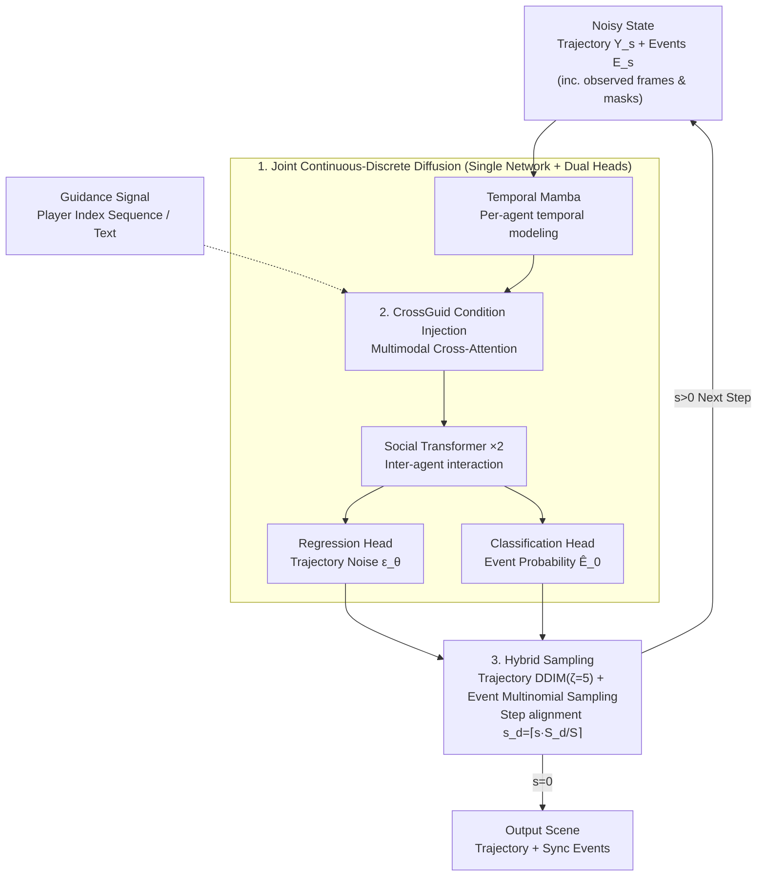

# JointDiff: Bridging Continuous and Discrete in Multi-Agent Trajectory Generation

**Conference**: ICLR 2026  
**arXiv**: [2509.22522](https://arxiv.org/abs/2509.22522)  
**Code**: [GitHub](https://github.com/kognia/JointDiff) (Mentioned on project page)  
**Area**: Diffusion Models / Multi-Agent Trajectory Generation  
**Keywords**: Joint Diffusion, Continuous-Discrete Unification, Multi-Agent, Trajectory Generation, Controllable Generation

## TL;DR

Proposes JointDiff, a joint continuous-discrete diffusion framework that unifies Gaussian diffusion (for trajectories) and multinomial diffusion (for possession events) for the first time. It introduces the CrossGuid module to support Weak Possession Guidance (WPG) and text-guided semantic controllable generation, achieving SOTA performance in multi-agent trajectory generation for sports.

## Background & Motivation

In multi-agent systems such as team sports, continuous movement trajectories are tightly coupled and synchronized with discrete state-change events (e.g., passing, possession). Existing generative models face the following issues:

**Disconnection between Continuous and Discrete**: Most methods only model continuous trajectories while ignoring discrete events, leading to unrealistic behaviors such as illogical passing paths or distorted player-ball interactions.

**Lack of Semantic Controllability**: Existing trajectory diffusion models primarily control individual-level attributes (waypoints, speed) and lack the ability to control scene-level semantics (e.g., "who has possession," "match momentum").

**Insufficient Evaluation Metrics**: Individual-level ADE/FDE metrics inherited from pedestrian trajectory prediction fail to capture scene-level consistency and are inadequate for sports scene evaluation.

**Key Insight**: Only by jointly modeling continuous trajectories and discrete events can realistic, consistent, and controllable multi-agent scenes be generated.

## Method

### Overall Architecture

JointDiff addresses the generation of sports multi-agent scenes where continuous trajectories and discrete possession events should occur synchronously. The method packs the scene state into a tuple $\mathbf{X} = (\mathbf{Y}, \mathbf{E})$ for joint denoising—$\mathbf{Y} \in \mathbb{R}^{T \times N \times 2}$ represents continuous trajectory coordinates, and $\mathbf{E} \in \{0,1\}^{T \times N}$ represents discrete one-hot possession events. In the forward process, the two modalities are diffused independently: trajectories follow Gaussian diffusion, while events follow multinomial diffusion (gradually merging toward a uniform distribution). The reverse process is key: a single denoising network (following the dual-layer Social-Temporal Block of U2Diff, with Temporal Mamba for single-agent temporal modeling and Social Transformer for multi-agent interaction) takes the complete noisy state. It branches into a regression head and a classification head to output trajectory noise and event probabilities respectively, learning cross-modal dependencies in a shared representation. For controllable generation, a CrossGuid module is inserted into the blocks to inject guidance signals. During inference, each modality uses its respective sampler with synchronized time steps.

### Key Designs

**1. Joint Continuous-Discrete Diffusion: Mutual Correction in a Shared Reverse Network**

The forward process adds noise to both modalities independently but shares the same variance schedule $\{\beta_s\}$: trajectories follow standard Gaussian diffusion $q(\mathbf{Y}_s | \mathbf{Y}_0) = \mathcal{N}(\mathbf{Y}_s; \sqrt{\bar{\alpha}_s} \mathbf{Y}_0, (1-\bar{\alpha}_s)\mathbf{I})$, while discrete events follow multinomial diffusion $q(\mathbf{E}_s | \mathbf{E}_0) = \mathrm{Cat}(\mathbf{E}_s; \bar{\alpha}_s \mathbf{E}_0 + (1-\bar{\alpha}_s)/N)$. Crucially, the reverse network $p_\theta$ is conditioned on the full state $(\mathbf{Y}_s, \mathbf{E}_s)$, utilizing a regression head for trajectory noise $\epsilon_\theta$ and a classification head for the original event probability $\hat{\mathbf{E}}_0$. This forces the model to learn cross-modal dependencies, such as "who possesses the ball determines where others should run." The Choice of multinomial diffusion over absorbing state diffusion allows discrete variables to be refined throughout the denoising process, whereas absorbing states are frozen once unmasked, which is sub-optimal for temporal scenes where events evolve with trajectories.

**2. CrossGuid Condition Injection: Lightweight Cross-Attention for Semantic Guidance**

Embedded between Temporal Mamba and Social Transformer within the Social-Temporal Block, this module provides two levels of granularity. Weak Possession Guidance (WPG) requires only a player index sequence $[n_1, n_2, ..., n_L]$, encoded via learnable agent embeddings to serve as K/V, while intermediate ball representations serve as Q. This updates only the ball's trajectory representation and overlays agent embeddings on each player to preserve social reasoning. Text guidance uses a frozen T5-Base to encode natural language descriptions, which are projected and processed via MHA for all agents, with agent embeddings added to the Query side to distinguish agents and respond to scene-level semantics like "who has the ball" or "game flow."

**3. Hybrid Sampling: Accelerated Continuous Modality and Stable Discrete Modality Alignment**

During inference, different samplers are used: trajectories utilize DDIM acceleration (jump interval $\zeta=5$), while discrete events use a standard stochastic sampler for categorical consistency. The difference in steps (continuous $S=50$, discrete $S^d=10$) is resolved by aligning discrete steps to the continuous timeline via $s^d = \lceil s \cdot S^d / S \rceil$, ensuring synchronized states throughout denoising.

### Loss & Training

The joint training objective is a weighted sum of the simplified continuous loss and the exact variational discrete loss:

$$\mathcal{L}_{\mathrm{joint}} = \mathcal{L}_{\mathrm{simple}}^{\mathbf{Y}} + \lambda \mathcal{L}_{\mathrm{vb}}^{\mathbf{E}}$$

where $\lambda = 0.1$ balances the modalities. Importance sampling is used instead of uniform time-step sampling. For controllable generation, Classifier-Free Guidance training is performed by dropping conditional signals with a 25% probability.

## Key Experimental Results

### Main Results: Future Trajectory Generation (min / avg, 20 modes)

| Dataset | Metric | JointDiff (Ours) | U2Diff (Prev. SOTA) | Gain |
|--------|------|-----------|----------|------|
| NFL | SADE↓ | **2.36/3.40** | 2.59/3.74 | -0.23/-0.34 |
| NFL | SFDE↓ | **5.53/8.40** | 5.97/9.02 | -0.44/-0.62 |
| Bundesliga | SADE↓ | **2.47/3.66** | 2.69/4.21 | -0.22/-0.55 |
| NBA | SADE↓ | **1.39/2.01** | 1.48/2.12 | -0.09/-0.11 |
| NBA | SFDE↓ | **2.53/3.95** | 2.68/4.14 | -0.15/-0.19 |

### Ablation Study: Effect of Joint Modeling (Controllable Tasks)

| Configuration | NFL SADE↓ | NFL Acc↑ | Bundesliga SADE↓ | Bundesliga Acc↑ |
|------|-----------|----------|------------------|-----------------|
| w/o joint + w/o $\mathcal{G}$ | 2.42/3.57 | .76/.52 | 2.60/3.99 | .67/.44 |
| w/o joint + w $\mathcal{G}_{\text{WPG}}$ | 2.37/3.49 | .80/.59 | 2.20/3.07 | .73/.50 |
| JointDiff + w/o $\mathcal{G}$ | 2.36/3.40 | .78/.54 | 2.47/3.66 | .68/.39 |
| **JointDiff + w $\mathcal{G}_{\text{text}}$** | **2.19/3.09** | **.86/.74** | **2.08/2.72** | **.80/.59** |

### Key Findings

- Joint modeling (JointDiff) outperforms variants modeling only continuous trajectories in both controllable and uncontrollable tasks.
- Performance follows: Text Guidance > Weak Possession Guidance > No Guidance; finer guidance yields larger gains.
- Consistency (matching between events and trajectories) of multinomial diffusion is significantly better than absorbing state diffusion (e.g., Bundesliga avg Acc: 0.80 vs 0.70).
- In human evaluation, JointDiff wins over MoFlow with an 80% rate, and in 24% of cases, it was rated indistinguishable from the ground truth.
- Even under IID sampling conditions, JointDiff remains competitive with non-IID methods on "min" metrics.

## Highlights & Insights

- First application of joint continuous-discrete diffusion to temporal dynamic systems, filling the gap left by previous works limited to static tasks (layout design, CAD).
- The WPG mode of CrossGuid is elegantly designed—controlling game flow by simply providing a player list, offering low entry barriers with high semantic control.
- The comparative analysis of multinomial vs. absorbing state diffusion provides broad reference value, indicating that continuous correction mechanisms are superior for temporal modeling.
- Provides a unified sports benchmark (NFL + Bundesliga with text descriptions), benefiting future community research.

## Limitations & Future Work

- Assumes possession events exist at every time step (dense event mode); extending to sparse events (e.g., fouls, shots) is a future direction.
- Currently validated only in sports scenes; adaptation to broader multi-agent systems (autonomous driving, robot collaboration) is required.
- Discrete event categories are limited to possession (N classes); exploring hierarchical discrete spaces for multiple event types is necessary.
- Text guidance relies on the T5 encoder, which may have limited understanding of non-English descriptions or complex tactical language.

## Related Work & Insights

- U2Diff is the primary continuous trajectory baseline; JointDiff extends the Social-Temporal Block architecture with joint modeling capabilities.
- Levi et al. (2023) and Li et al. (2025) utilized joint diffusion in static layouts/vision-language; JointDiff generalizes this to dynamic temporal scenes.
- The design of CrossGuid can be applied to other tasks requiring condition injection into structured multi-agent embeddings.

## Rating

- Novelty: ⭐⭐⭐⭐⭐ First joint continuous-discrete diffusion for dynamic multi-agent systems; WPG task definition is novel.
- Experimental Thoroughness: ⭐⭐⭐⭐ Three datasets + multi-task + human eval + consistency analysis; comprehensive and rigorous.
- Writing Quality: ⭐⭐⭐⭐ Clear methodology, complete mathematical derivation, and intuitive diagrams.
- Value: ⭐⭐⭐⭐ Significant contribution to multi-agent generation and sports analytics; the joint diffusion approach is generalizable.

<!-- RELATED:START -->

## Related Papers

- [\[CVPR 2025\] Unified Uncertainty-Aware Diffusion for Multi-Agent Trajectory Modeling](../../CVPR2025/image_generation/unified_uncertainty-aware_diffusion_for_multi-agent_trajectory_modeling.md)
- [\[ICLR 2026\] Bridging Degradation Discrimination and Generation for Universal Image Restoration](bridging_degradation_discrimination_and_generation_for_universal_image_restorati.md)
- [\[ICLR 2026\] NextStep-1: Toward Autoregressive Image Generation with Continuous Tokens at Scale](nextstep-1_toward_autoregressive_image_generation_with_continuous_tokens_at_scal.md)
- [\[ICLR 2026\] ReDDiT: Rehashing Noise for Discrete Visual Generation](reddit_rehashing_noise_for_discrete_visual_generation.md)
- [\[ICLR 2026\] Hyperspherical Latents Improve Continuous-Token Autoregressive Generation](hyperspherical_latents_improve_continuous-token_autoregressive_generation.md)

<!-- RELATED:END -->
