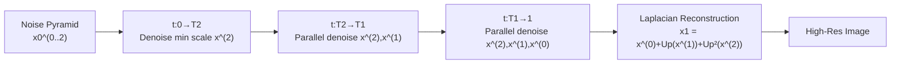

# LapFlow: Laplacian Multi-scale Flow Matching for Generative Modeling

**Conference**: ICLR 2026  
**OpenReview**: [https://openreview.net/forum?id=kdrc4o6okz](https://openreview.net/forum?id=kdrc4o6okz)  
**Code**: [https://github.com/sjtuytc/gen](https://github.com/sjtuytc/gen)  
**Area**: Image Generation / Flow Matching  
**Keywords**: flow matching, Laplacian pyramid, multi-scale generation, mixture-of-transformers, causal attention  

## TL;DR
LapFlow decomposes images into Laplacian pyramid residuals and utilizes a unified Mixture-of-Transformers (MoT) with causal attention to generate all scales in parallel. It eliminates the explicit renoising bridges required by cascaded methods, achieving superior FID on CelebA-HQ and ImageNet with lower GFLOPs and faster inference.

## Background & Motivation
**Background**: Diffusion models and Flow Matching have become dominant in image generation. However, they typically generate the entire image at full resolution in a single pass. As resolution and content complexity increase, the computational overhead for training and inference expands rapidly, making scalability a significant bottleneck.

**Limitations of Prior Work**: Multi-scale generation (generating progressively from low to high resolution) is a promising direction for scalability, but existing solutions face challenges. Cascaded Diffusion requires training and maintaining separate networks for each resolution, increasing complexity. EdifyImage models in pixel space, leading to significantly slower inference. Pyramidal Flow performs well in video fine-tuning but requires explicit "renoising" bridges to connect adjacent resolutions, and its effectiveness for training image generation from scratch lacks sufficient validation.

**Key Challenge**: While multi-scale approaches should theoretically save computation, the requirement for "separate models per scale or complex bridging mechanisms" increases system complexity and ignores the natural causal dependence between scales (where coarse structures should guide fine details), hindering their competitiveness against single-scale DiT models.

**Goal**: To model all scales in parallel using a **single unified model**, removing the inter-scale bridging process while explicitly encoding "coarse-to-fine" causal relationships into the network to improve quality and reduce computational cost.

**Key Insight**: **[Laplacian Parallel Multi-scale]** Decompose images into multiple residuals using a Laplacian pyramid, allowing a single MoT model to denoise all scales in parallel across specific time intervals. **[Causal Attention Bridge]** Use block causal masks to force information to flow only from low resolution to high resolution, replacing explicit renoising bridges with the attention mechanism itself.

## Method

### Overall Architecture
LapFlow follows a "coarse-to-fine" pyramidal generation strategy. The clean image $x_1$ is decomposed into multiple Laplacian residuals (e.g., three scales: $x_1^{(2)}=\text{Down}(\text{Down}(x_1))$, $x_1^{(1)}=\text{Down}(x_1)-\text{Up}(x_1^{(2)})$, $x_1^{(0)}=x_1-\text{Up}(\text{Down}(x_1))$). During training, a unified multi-scale DiT-MoT model learns the velocity fields for each scale within their respective time segments. During sampling, the ODE is solved sequentially across time segments (but in parallel within each segment), and the full-resolution image is reconstructed via $x_1=x_1^{(0)}+\text{Up}(x_1^{(1)})+\text{Up}(\text{Up}(x_1^{(2)}))$.

### Key Designs
**1. Multi-scale different-speed noising: Allowing scales to "mature" at different intervals.** Since coarse scales contain less information than fine scales, they should not be denoised at the same speed across the entire interval $[0,1]$. Critical time points $T_1, T_2$ are set ($0=T_3<T_2<T_1<1$), such that the $k$-th scale is only trained during $t\in[T_{k+1},1]$. Larger scales (higher resolution, smaller $k$) have shorter training intervals. The noisy sample for each scale is $x_t^{(k)}=\alpha_t^{(k)}x_1^{(k)}+\sigma_t^{(k)}x_0^{(k)}$, where $\alpha_t^{(k)}=\frac{t-T_{k+1}}{1-T_{k+1}}$ and $\sigma_t^{(k)}=1-t$. This ensures that at $t=T_{k+1}$, the scale consists of pure noise, and at $t=1$, it converges to the clean residual. The velocity target $u_t^{(k)}=\dot\alpha_t^{(k)}x_1^{(k)}+\dot\sigma_t^{(k)}x_0^{(k)}$ is the regression objective for each scale.

**2. Progressive multi-stage training: Allocating computation by scale contribution.** During training, a stage $s\sim U\{0,1,2\}$ is sampled at each step. All scales satisfies $k\ge s$ are trained (i.e., the current and all smaller scales), and time $t$ is sampled from $[T_{s+1},1]$. Consequently, the smallest scale $k=2$ is trained across $[0,1]$, while the largest scale is only trained in $[T_1,1]$. The loss is a weighted sum of velocity regressions: $L_{mv}=\sum_{k=s}^{2}w_k\,\mathbb{E}\,\lVert v_t^{(k)}-u_t^{(k)}\rVert^2$ (with $w_k=1$ in practice). This "more training for low-res, less for high-res" allocation assigns more optimization budget to coarse scales that carry global structure.

**3. Global MoT Attention with Causal Mask: Replacing cascading and bridging with a single model.** The network is a multi-scale DiT with Mixture-of-Transformers. Each scale is patchified into tokens and augmented with positional embeddings. Time $t$ and labels $y$ are included as in-context conditions. Within each MoT block, scales use individual PreAttnMod and **scale-specific QKV projections** (e.g., $Q^{(k)}=z^{(k)}W_Q^{(k)}$). However, attention is computed **globally** by concatenating QKVs from all scales: $\text{Attn}=\text{Softmax}\!\big(\frac{QK^\top}{\sqrt d}+M_c\big)V$. The key is the **block causal mask** $M_c$, which restricts scale $k$ to only attend to scales with equal or lower resolution ($k'\ge k$). This forces unidirectional information flow from coarse to fine, enabling parallel generation in a single forward pass without explicit renoising.

**4. Multi-scale Parallel Sampling: Segmented ODE relay.** Sampling starts from a noise pyramid. The `ODEINT` solver runs in three segments: first in $[0, T_2]$ solving only for the smallest scale $\hat x_{T_2}^{(2)}$; then in $[T_2, T_1]$ solving for both medium and small scales simultaneously; and finally in $[T_1, 1]$ solving all three scales in parallel. This segment-based relay avoids the serial renoising of cascaded models and is more efficient than full-resolution single-scale solvers.

## Key Experimental Results

### Main Results (CelebA-HQ, DiT-L/2)

| Method | Resolution | Space | FID↓ | NFE | Time(s) | GFLOPs |
|------|--------|------|------|-----|---------|--------|
| LDM | 256 | Latent | 5.11 | 50 | 2.90 | 10.2 |
| LFM | 256 | Latent | 5.26 | 89 | 1.70 | 22.1 |
| Pyramidal Flow | 256 | Latent | 11.20 | 90 | 1.85 | 14.2 |
| EdifyImage | 256 | Image | 7.62 | 95 | 2.10 | 28.9 |
| **Ours** | 256 | Latent | **3.53** | 80 | 1.51 | 16.5 |
| LFM | 1024 | Latent | 8.12 | 100 | 4.20 | 154.8 |
| **Ours** | 1024 | Latent | **5.51** | 94 | 3.30 | 148.2 |

For ImageNet 256 (class-conditional), under DiT-XL/2 with 600K steps, Ours achieved an FID of 14.38 (vs. DiT 19.50 / LFM 28.37 / Pyramidal 17.10) with 20.5 vs. 29.1 GFLOPs. At 7M steps with DiT-B/2 and CFG=1.5, Ours reached 4.12 (vs. LFM 4.46) with a faster 1.25s inference.

### Ablation Study (CelebA-HQ 256, FID-50K)

| Dimension | Settings and Results |
|------|-----------|
| VAE (a) | LFM(EQVAE)=7.77 (deteriorated); Ours(SDVAE)=4.37 → **Ours(EQVAE)=3.53** |
| MoT (b) | Separate=3.60/38.9 GFLOPs → **MoT=3.53/16.5 GFLOPs** (Half computation) |
| Mask (c) | None=3.91 / Self=5.19 / **Causal=3.53** |
| Threshold T (d) | 0.1=5.12 / 0.2=4.37 / **0.5=3.53** / 0.9=4.92 |
| Noise Schedule (f) | Ours(GVP)=4.10 / **Ours(Linear)=3.53** |
| # of Scales (g) | 1(LFM)=5.26 / **2=3.53** / 3=3.59 / 4=5.12 |
| Space (h) | Ours(Image)=8.63 / **Ours(Latent)=3.53** |

### Key Findings
- **MoT achieves "quality preservation with half computation"**: Compared to independent models per scale, MoT reduces GFLOPs from 38.9 to 16.5 while slightly improving FID (3.60 to 3.53).
- **Causal mask is indispensable**: Removing the mask (global attention) or restricting it to self-attention leads to significant performance drops, confirming the "low-to-high unidirectional flow" as core.
- **Scale count is tied to resolution**: At 256 resolution, two scales are optimal. Adding more scales results in latent grids (e.g., 8x8) too small to provide reliable semantic guidance. Larger latent grids in 512/1024 resolutions benefit from more levels.
- **EQVAE equivariance specifically benefits multi-scale**: It provides equivalent representations across scales, which benefits multi-scale LapFlow but surprisingly harms single-scale LFM.

## Highlights & Insights
- Replacing explicit bridges with **causal masks in attention** is the most elegant contribution of this work. It transforms the engineering problem of "inter-scale renoising" into an internal inductive bias of the network, unifying the model and streamlining the process.
- **Laplacian residuals combined with different-speed noising** naturally distributes computation by scale contribution—coarse scales have longer training intervals while fine scales have shorter ones, matching their relative information density.
- The paper provides a time-weighted complexity analysis, demonstrating that progressive multi-scale attention overhead is theoretically lower than that of full-resolution DiT throughout the sampling process.

## Limitations & Future Work
- **Manual tuning of scales**: The optimal number of scales and threshold $T$ are highly dependent on the latent grid size, requiring manual search when changing datasets or resolutions.
- **Reversion to SDVAE for high-res**: EQVAE was only trained at 256 resolution. For 512/1024, the model reverts to SDVAE, meaning the gains from equivariance may not be fully realized at higher resolutions.
- **Limited evaluation domains**: Primarily validated on CelebA-HQ and ImageNet. The effectiveness for complex text-to-image or video generation remains to be tested.
- Compared to pixel-space methods (e.g., Relay Diffusion FID 3.15), the FID is slightly higher, though the authors highlight the trade-off (1221 GFLOPs vs. 16.5 GFLOPs).

## Related Work & Insights
- **Multi-scale Genealogy**: From the pyramid ideas of LapGAN to renoising bridges in Cascaded Diffusion, Relay Diffusion, and Pyramidal Flow. LapFlow eliminates the technical debt of "separate models" and "explicit bridging" using a single model with causal attention.
- **Contrast with Autoregressive (AR) Generation**: While AR methods (VAR/LlamaGen) use causal modeling for sequential generation, they are limited by serial execution. LapFlow borrows causal mask ideas but maintains parallel sampling via ODEs.
- **Insight for Practitioners**: When a system becomes bloated due to "explicit coupling between modules," consider whether that coupling can be encoded as an internal bias (attention/mask). This principle of implicit bridging is likely applicable to other multi-modal or multi-resolution tasks.

## Rating
- **Novelty**: ⭐⭐⭐⭐ The combination of Laplacian parallel multi-scale and causal mask MoT addresses real pain points in cascaded methods. The shift from "explicit bridging" to "internal inductive bias" is insightful.
- **Experimental Thoroughness**: ⭐⭐⭐⭐ Covers two datasets and three resolutions with eight ablation groups (VAE, MoT, Mask, etc.). Efficiency metrics (NFE/Time/GFLOPs) are comprehensive.
- **Writing Quality**: ⭐⭐⭐⭐ Clear formulas and algorithms (training/sampling pseudocode). Figures 1 and 2 effectively explain the generation pipeline and MoT blocks.
- **Value**: ⭐⭐⭐⭐ Substantially reduces inference computation while scaling to 1024x1024, providing direct value for high-resolution efficient generation.

<!-- RELATED:START -->

## Related Papers

- [\[ICLR 2026\] Mirror Flow Matching with Heavy-Tailed Priors for Generative Modeling on Convex Domains](mirror_flow_matching_with_heavy-tailed_priors_for_generative_modeling_on_convex_.md)
- [\[ICLR 2026\] Flow Along the $K$-Amplitude for Generative Modeling](flow_along_the_k-amplitude_for_generative_modeling.md)
- [\[ICLR 2026\] Gauge Flow Matching: Efficient Constrained Generative Modeling over General Convex Set and Beyond](gauge_flow_matching_efficient_constrained_generative_modeling_over_general_conve.md)
- [\[ICLR 2026\] Delay Flow Matching](delay_flow_matching.md)
- [\[ICLR 2026\] Partition Generative Modeling: Masked Modeling Without Masks](partition_generative_modeling_masked_modeling_without_masks.md)

<!-- RELATED:END -->
