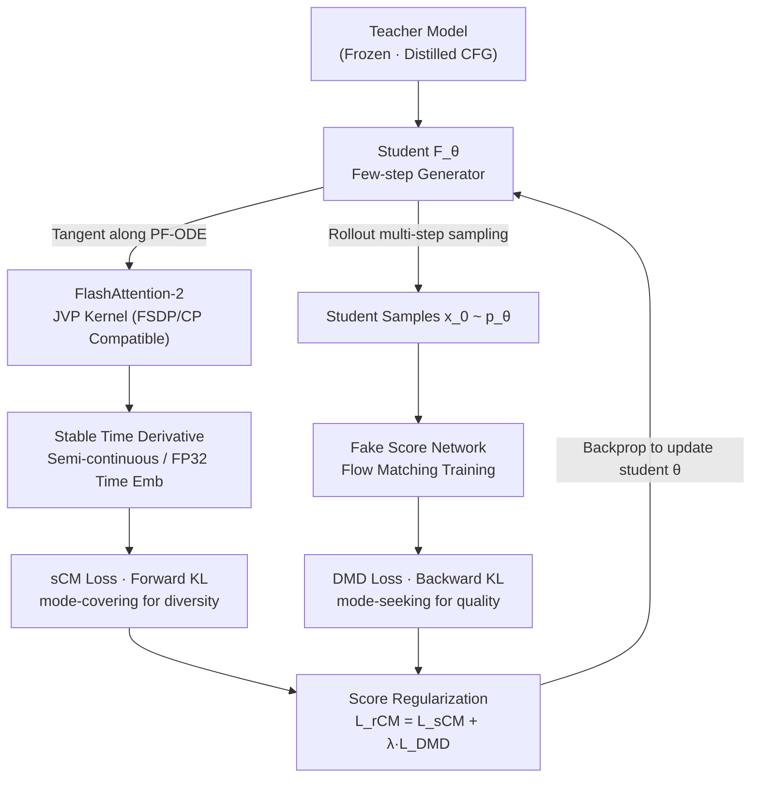

# Large Scale Diffusion Distillation via Score-Regularized Continuous-Time Consistency

**Conference**: ICLR 2026  
**arXiv**: [2510.08431](https://arxiv.org/abs/2510.08431)  
**Code**: [Project Page](https://research.nvidia.com/labs/dir/rcm)  
**Area**: Image Generation  
**Keywords**: Continuous-time Consistency Models, Score Distillation, Large-scale Distillation, JVP, Few-step Generation

## TL;DR
The authors propose rCM (score-regularized continuous-time consistency model), which extends continuous-time consistency distillation to 14B parameter text-to-image/video models for the first time. By combining forward divergence (consistency) and backward divergence (score distillation), the method matches the quality of DMD2 while preserving diversity, achieving 15-50× acceleration.

## Background & Motivation
- **Limitations of Prior Work**: While sCM (continuous-time consistency model) is theoretically elegant, its applicability to large-scale text-to-image/video models remains unclear—JVP computation is incompatible with FlashAttention and parallel training frameworks.
- **Key Challenge**: sCM faces quality issues in detail generation (error accumulation + the mode-covering nature of forward divergence leading to quality diffusion).
- **Core Problem**: Score/adversarial distillation methods (e.g., DMD2) lead in quality but suffer from mode collapse and insufficient diversity.
- **Key Insight**: Forward divergence (consistency models) and backward divergence (score distillation) possess complementary properties.

## Method

### Overall Architecture
The core goal of rCM is to make theoretically elegant continuous-time consistency distillation (sCM) functional for 14B-scale text-to-image/video models while addressing its deficiencies in fine-grained image quality. The mechanism uses a frozen teacher model as the supervision source; the student network simultaneously processes two complementary signals: forward KL from sCM (mode-covering, responsible for covering all modes and preserving diversity) and backward KL from DMD (mode-seeking, responsible for shifting the distribution toward high-density regions to sharpen details). These are weighted into a unified rCM objective. Both paths have engineering prerequisites: the sCM path depends on a JVP kernel capable of calculating gradients on large models with numerical stabilization, while the DMD path depends on feeding current student samples into a fake score network to estimate the backward score. During training, the networks are updated alternately—the student is updated with the combined rCM objective, and the fake score network is trained on the latest student-generated data using a flow matching loss.

### Key Designs

**1. FlashAttention-2 JVP Kernel: Enabling Consistency Gradients for Large Models**

The training of sCM relies on Jacobian-Vector Products (JVP) to estimate the teacher's tangent along the probability flow ODE. However, standard FlashAttention only exposes forward outputs and does not return JVP, making sCM incompatible with mainstream attention implementations and parallel training at the 10B scale. The authors implemented a custom Triton kernel that embeds JVP computation directly into the FlashAttention-2 forward pass, covering both self-attention and cross-attention. This kernel is compatible with FSDP and Context Parallelism, allowing JVP-based sCM training to scale to 14B parameters for the first time.

**2. Score Regularization: Compensating sCM Quality with Backward KL DMD Terms**

The forward divergence of pure sCM is naturally mode-covering, which, combined with error accumulation in few-step generation, leads to quality defects in fine-grained scenarios like text rendering. The authors add the DMD loss as a "long-jump" regularizer to sCM, resulting in the combined objective $\mathcal{L}_{\text{rCM}}(\theta) = \mathcal{L}_{\text{sCM}}(\theta) + \lambda \mathcal{L}_{\text{DMD}}(\theta)$. While sCM provides mode-covering diversity, the backward KL of DMD improves quality by shifting the distribution towards high-density areas in a mode-seeking manner. A weight of $\lambda=0.01$ proved effective across all models and tasks without per-task tuning or adversarial optimization.

**3. Stable Time Derivative Calculation: Suppressing Numerical Instability**

Directly calculating the time component of JVP on large models is prone to numerical divergence. The authors propose two additive stabilization schemes: first, semi-continuous time, using exact JVP for the spatial part while using finite difference approximation with step size $\Delta t = 10^{-4}$ for the temporal direction; second, high-precision time, forcing FP32 precision for the time embedding layer to prevent temporal derivatives from being lost to rounding errors in half-precision.

**4. Rollout Multi-step Sampling: Supporting Variable NFE and Stable Backprop**

The student is trained to support sampling with an arbitrary number of steps. During training, a step count $N \in [1, N_{\max}]$ is randomly sampled for rollout, and the DMD loss is backpropagated only through the final step. Random time steps ensure coverage of the entire $[0,1]$ range. This allows single-step and multi-step inference to share the same parameters, enabling users to trade off quality and speed by selecting the NFE at inference time.

### Loss & Training
The sCM term uses a tangent-normalized form $\mathcal{L}_{\text{sCM}} = \mathbb{E}\left[\left\|\mathbf{F}_\theta - \mathbf{F}_{\theta^-} - \frac{\mathbf{g}}{\|\mathbf{g}\|_2^2 + c}\right\|_2^2\right]$, where $\mathbf{F}_{\theta^-}$ is the EMA target network, $\mathbf{g}$ is the tangent, and $c$ is a numerical stability constant. The DMD term pulls the student distribution toward the true distribution based on the difference between the fake score network and the teacher score. The fake score network is trained alternately using flow matching loss on the student's current generations.

## Key Experimental Results

### Main Results (GenEval T2I)

| Model | Parameters | NFE | Overall | Counting | Position |
|------|------|-----|---------|----------|----------|
| FLUX.1-dev | 12B | 50 | 0.66 | 0.74 | 0.22 |
| Cosmos-Predict2 14B (teacher) | 14B | 70 | 0.84 | 0.79 | 0.64 |
| Cosmos-Predict2 + DMD2 | 2B | 4 | 0.80 | 0.70 | 0.57 |
| **Cosmos-Predict2 + rCM** | **2B** | **4** | **0.81** | **0.73** | **0.58** |
| **Cosmos-Predict2 + rCM** | **14B** | **4** | **0.83** | **0.80** | **0.59** |
| **Cosmos-Predict2 + rCM** | **14B** | **1** | **0.82** | **0.84** | **0.49** |

### VBench Video Results

| Model | Parameters | NFE | Total Score | Throughput(FPS) |
|------|------|-----|-------------|-----------------|
| Wan2.1 14B (teacher) | 14B | 100 | 83.58 | 0.18 |
| Wan2.1 + DMD2 | 1.3B | 4 | 84.56 | 14.6 |
| **Wan2.1 + rCM** | **1.3B** | **4** | **84.43** | **14.6** |
| **Wan2.1 + rCM** | **14B** | **2** | **85.05** | **8.3** |

### Key Findings
- rCM matches or exceeds DMD2 in quality while significantly outperforming it in diversity (as shown in Figure 1 where DMD2 samples converge in object pose/position).
- 14B rCM with 4 steps achieves a GenEval score of 0.83, nearly reaching the teacher's 70-step score of 0.84.
- In video tasks, rCM reaches VBench scores comparable to the teacher in just 2 steps.
- $\lambda=0.01$ achieves the optimal balance between quality and diversity.
- Pure sCM exhibits noticeable quality defects in fine-grained scenes like text rendering, which rCM successfully fixes.

## Highlights & Insights
- First extension of JVP-based continuous-time consistency to 14B parameters and 5-second videos.
- A unified framework for distillation methods via the complementarity of forward and backward divergences.
- No requirement for GAN-style tuning or extensive hyperparameter search; $\lambda=0.01$ is robust across tasks.
- rCM's diversity advantage is particularly valuable for scenarios requiring varied responses, such as interactive world models.

## Limitations & Future Work
- Requires an additional fake score network, increasing memory overhead during training.
- JVP computation remains slower than standard forward passes, leading to high training costs.
- 1-step video generation quality still shows a noticeable drop (VBench score decreases from 85.05 to 83.02).
- Extension to autoregressive video diffusion remains a future prospect.

## Related Work & Insights
- sCM and MeanFlow provide the theoretical foundations.
- DMD/DMD2 provide practical solutions for backward divergence distillation.
- The philosophy of joint forward and backward divergence from DDO and DDRL serves as the foundation for rCM.
- Provides a practical acceleration solution for deploying large-scale visual generative models.

## Technical Details
- TrigFlow noise schedule: $\alpha_t = \cos(t), \sigma_t = \sin(t)$, interconvertible with rectified flow via SNR matching.
- Fake score network trained via flow matching on student data with alternating optimization.
- Selective Activation Checkpointing (SAC) used to reduce memory consumption.
- Teacher utilizes CFG, which is simultaneously distilled into the student.
- Full-parameter finetuning (rather than LoRA) is used to emphasize rCM stability.
- Experiments cover Cosmos-Predict2 (0.6B/2B/14B T2I) and Wan2.1 (1.3B/14B T2V).
- Wan2.1 14B 2-step acceleration reaches 8.3 FPS vs. the teacher's 0.18 FPS (~46× speedup).

## Rating
- **Novelty**: ⭐⭐⭐⭐ Valuable theoretical insight into combining forward/backward divergence, although individual components are known.
- **Experimental Thoroughness**: ⭐⭐⭐⭐⭐ Unprecedented scale of validation (14B parameters, T2I+T2V, multi-step ablation).
- **Writing Quality**: ⭐⭐⭐⭐⭐ Clear theoretical analysis and detailed engineering implementation.
- **Value**: ⭐⭐⭐⭐⭐ Highly practical, solving core acceleration problems for large-scale diffusion models.

<!-- RELATED:START -->

## Related Papers

- [\[ICCV 2025\] SANA-Sprint: One-Step Diffusion with Continuous-Time Consistency Distillation](../../ICCV2025/image_generation/sana-sprint_one-step_diffusion_with_continuous-time_consistency_distillation.md)
- [\[ICLR 2026\] Scale-wise Distillation of Diffusion Models](scale-wise_distillation_of_diffusion_models.md)
- [\[ICLR 2026\] FACM: Flow-Anchored Consistency Models](facm_flow-anchored_consistency_models.md)
- [\[ICLR 2026\] NextStep-1: Toward Autoregressive Image Generation with Continuous Tokens at Scale](nextstep-1_toward_autoregressive_image_generation_with_continuous_tokens_at_scal.md)
- [\[ICLR 2026\] Motion Prior Distillation in Time Reversal Sampling for Generative Inbetweening](motion_prior_distillation_in_time_reversal_sampling_for_generative_inbetweening.md)

<!-- RELATED:END -->
