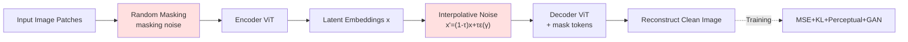

# Latent Denoising Makes Good Tokenizers

**Conference**: ICLR 2026  
**OpenReview**: [https://openreview.net/forum?id=1jBsi98fVe](https://openreview.net/forum?id=1jBsi98fVe)  
**Code**: [https://github.com/Jiawei-Yang/DeTok](https://github.com/Jiawei-Yang/DeTok)  
**Area**: Image Generation / Visual Tokenizer  
**Keywords**: visual tokenizer, latent denoising, generative modeling, diffusion, autoregressive  

## TL;DR
This paper points out that modern generative models are essentially performing "reconstruction from destruction" (denoising). It proposes l-DeTok: during tokenizer training, interpolative noise and random masks are injected into the latent space, and the decoder is tasked with reconstructing the original image from the heavily corrupted latent. This ensures the produced latents are naturally aligned with downstream denoising objectives, consistently improving generation quality across six different generative models without requiring any semantic distillation.

## Background & Motivation
- **Background**: Modern visual generative models (diffusion, flow matching, autoregressive) generally do not model in pixel space; instead, they use a tokenizer (usually a VAE) to compress images into compact latents. However, tokenizer design has long lagged behind the rapid evolution of generative model architectures.
- **Limitations of Prior Work**: Mainstream tokenizers only optimize for "pixel reconstruction + KL regularization," without a clear definition of what latent properties are "generation-friendly." Recent works improve latents by **distilling semantics** from large-scale pre-trained visual encoders like DINOv2/CLIP. However, this creates a heavy dependency and lacks available strong encoders for many modalities (video, audio, 3D/4D).
- **Key Challenge**: There is a **disconnect** between the tokenizer's training objective (pixel reconstruction) and the downstream generative model's training objective (recovering signals from noise/masks). Tokenizers focus on reconstruction fidelity but do not ensure that latents can be recovered after heavy corruption—a task the generative model performs at every step.
- **Goal**: To find a universal tokenizer design principle for generation that does not rely on external pre-trained encoders.
- **Core Idea**: **Unified Denoising Perspective** — The authors observe that diffusion models remove Gaussian noise and autoregressive models fill "mask noise"; both are "reconstructing signals from corrupted ones." Since downstream tasks are all about denoising, the **tokenizer training should also include denoising**: by injecting heavy corruption directly into the latent and requiring reconstruction, the model is forced to produce robust latents that align naturally with downstream denoising targets.

## Method

### Overall Architecture
l-DeTok adopts a ViT-based encoder-decoder architecture. During training, two complementary types of "destruction"—interpolative Gaussian noise and random masking—are applied to the latent. The decoder then reconstructs the clean original image (pixel space) from the corrupted latent. During inference (when used as a standard tokenizer), both destruction mechanisms are turned off. In essence, it transforms the tokenizer from a "standard autoencoder" into a "latent denoising autoencoder," making the reconstruction task harder to force the emergence of robust, easy-to-denoise latents.

### Key Designs

**1. Interpolative latent noise: Ensuring "true destruction" via interpolation.** This is the core design. Given a latent $x$ from the encoder, instead of standard VAE additive noise $x' = x + \tau\varepsilon$, the authors **interpolate** the latent with Gaussian noise: $x' = (1-\tau)x + \tau\varepsilon(\gamma)$, where $\varepsilon(\gamma)\sim\gamma\cdot\mathcal{N}(0,I)$, noise level $\tau\sim\mathcal{U}(0,1)$, and $\gamma$ controls the standard deviation. The key difference is that with additive noise at high $\tau$, the original signal might still dominate, allowing the model to bypass the noise. With interpolative noise, as $\tau\to1$, the signal is completely replaced by noise, ensuring **heavy** corruption. Experiments confirm that interpolative noise significantly outperforms additive noise on SiT and MAR, and generally, **stronger noise leads to better downstream generation** (optimal near $\gamma=3.0$).

**2. Masking as deconstruction: Treating MAE-style masking as another latent corruption.** The "unified denoising perspective" is extended to masking. Similar to MAE, some image patches are randomly masked. Unlike MAE's fixed mask rate, the mask rate $m$ is sampled from a uniform distribution slightly biased toward zero: $m = \max(0, \mathcal{U}(-0.1, M))$. Setting the lower bound to $-0.1$ (truncated to 0) allows for "no masking" occasionally during training, reducing the gap between training and inference. The encoder only sees visible patches, while masked patches are replaced by a learnable `[MASK]` token at the decoder. High mask rates (70%–90%) perform best. Masking is **optional** but provides additional gains alongside latent noise.

**3. Joint denoising + standard reconstruction targets.** Interpolative noise ($\gamma=3.0$) and masking ($M=0.7$) are applied simultaneously. The training objective follows established industry recipes without adding new loss terms: $L_{\text{total}} = L_{\text{MSE}} + \lambda_{\text{KL}}L_{\text{KL}} + \lambda_{\text{percep}}L_{\text{percep}} + \lambda_{\text{GAN}}L_{\text{GAN}}$. All "magic" resides in the input-side corruption, making l-DeTok simple to integrate into existing training pipelines.

## Key Experimental Results

### Main Results: Generalization across Tokenizers (ImageNet 256×256, base model 100 epochs, optimal CFG)

| Tokenizer | rFID↓ | MAR FID↓ | RandomAR FID↓ | RasterAR FID↓ | SiT FID↓ | DiT FID↓ | Light.DiT FID↓ |
|---|---|---|---|---|---|---|---|
| **w/o Semantic Distill** | | | | | | | |
| SD-VAE | 0.61 | 4.64 | 13.11 | 8.26 | 7.66 | 8.33 | 4.24 |
| MAR-VAE (Strong baseline) | 0.53 | 3.71 | 11.78 | 7.99 | 6.26 | 8.20 | 3.98 |
| **Our l-DeTok** | 0.68 | **2.43** | **5.22** | **4.46** | **5.13** | 6.58 | 3.63 |
| **w/ Semantic Distill** | | | | | | | |
| VA-VAE | 0.28 | 16.66 | 38.13 | 15.88 | 4.33 | 4.91 | 2.86 |
| MAETok | 0.48 | 6.99 | 24.83 | 15.92 | 4.77 | 5.24 | 3.92 |
| **Our l-DeTok + Distill** | 0.85 | **2.52** | **5.57** | **11.99** | **3.40** | **3.91** | **2.18** |

**Key Observation**: Existing semantic distillation tokenizers (VA-VAE/MAETok) perform well on non-autoregressive models but **collapse significantly** on autoregressive models (MAR FID 16.66 vs l-DeTok 2.43). This reveals a previously overlooked gap where tokenizer gains in one paradigm do not necessarily transfer to another.

### Ablation Study: Deconstruction Strategies (FID@50k, with CFG)

| Setup | MAR-B FID↓ | MAR-B IS↑ | SiT-B FID↓ | SiT-B IS↑ |
|---|---|---|---|---|
| Baseline (No noise) | 3.31 | 247.6 | 6.97 | 181.6 |
| Masking only | 2.90 | 243.0 | 6.43 | 189.2 |
| Latent noise only | 2.77 | 249.0 | 5.56 | 193.5 |
| Joint noise | 2.65 | 263.0 | 5.50 | 195.1 |
| +Extended (Large Enc/200ep/GAN) | **2.43** | 266.5 | **5.13** | 207.4 |

### Key Findings
- **Stronger Destruction → Better Generation**: Higher noise levels and mask rates are preferred, confirming that "harder denoising tasks force better latents."
- **Latent noise is the primary driver, masking is optional**; interpolative noise is significantly better than additive noise.
- **l-DeTok is architecture-agnostic**: It works effectively on CNN-based tokenizers as well (MAR-B 3.32 $\to$ 2.82).
- **Scalability**: Improvements are consistent across model sizes (B, L, XL) and paradigms (SiT, MAR).

## Highlights & Insights
- **Conceptual Unification**: Unifying diffusion "Gaussian denoising" and AR "mask filling" under a single denoising framework to align training is a clean and powerful perspective.
- **Simplicity & Plug-and-Play**: No architectural changes or new losses are required. Adding corruption at the input is all it takes to integrate into existing workflows.
- **Busting Hidden Assumptions**: Systematically reveals that tokenizer gains do not translate across all generative paradigms, and provides a unified evaluation across six models.
- **Independence from External Models**: Achieves state-of-the-art performance without relying on DINOv2/CLIP distillation, which is vital for modalities lacking strong pre-trained encoders.

## Limitations & Future Work
- **Image-only Validation**: While the authors emphasize potential for video/audio/3D, experiments are limited to ImageNet and MS-COCO.
- **Limited Gain from Masking**: Joint denoising shows minimal extra benefit for SiT over latent noise alone; the synergy between the two paths needs more exploration.
- **Noise Configuration Tuning**: $\gamma$, $M$, and $\tau$ distributions still require tuning for downstream models; there is no adaptive or theoretical guidance for optimal destruction intensity.
- **Integration with Distillation**: The relationship between "denoising alignment" and "semantic alignment" is complex; combining them leads to mixed results depending on the model paradigm.

## Related Work & Insights
- **Generative Paradigms**: Unifies the training objectives of Diffusion/Flow Matching ($X_t=a(t)X_0+b(t)\varepsilon_t$) and Autoregressive (sequence reconstruction) frameworks.
- **Representation Learning**: Inherits the "pretext task for downstream alignment" philosophy from MAE and self-distillation, applying it to tokenizer design.
- **Insight**: When the essence of the downstream task (denoising) is explicitly injected into upstream representation learning, the "downstream alignment" provides significant "free" gains.

## Rating
- **Novelty**: ⭐⭐⭐⭐ — The unified denoising perspective and interpolative latent corruption are insightful.
- **Experimental Thoroughness**: ⭐⭐⭐⭐⭐ — Large scale evaluation across 6 models, multiple sizes, architectures, and datasets, with detailed ablations.
- **Writing Quality**: ⭐⭐⭐⭐ — Clear motivation, logical flow, and well-supported hypotheses.
- **Value**: ⭐⭐⭐⭐ — Offers a simple, universal, and independent path for tokenizer improvement with high practical utility.

<!-- RELATED:START -->

## Related Papers

- [\[CVPR 2026\] VFM-VAE: Vision Foundation Models Can Be Good Tokenizers for Latent Diffusion Models](../../CVPR2026/image_generation/vfm-vae_vision_foundation_models_can_be_good_tokenizers_for_latent_diffusion_mod.md)
- [\[ICLR 2026\] DeRaDiff: Denoising Time Realignment of Diffusion Models](deradiff_denoising_time_realignment_of_diffusion_models.md)
- [\[ICLR 2026\] Mitigating Noise Shift in Denoising Generative Models with Noise Awareness Guidance](mitigating_noise_shift_in_denoising_generative_models_with_noise_awareness_guida.md)
- [\[ICLR 2026\] LVTINO: LAtent Video consisTency INverse sOlver for High Definition Video Restoration](lvtino_latent_video_consistency_inverse_solver_for_high_definition_video_restora.md)
- [\[ICLR 2026\] Asynchronous Denoising Diffusion Models for Aligning Text-to-Image Generation](asynchronous_denoising_diffusion_models_for_aligning_text-to-image_generation.md)

<!-- RELATED:END -->
