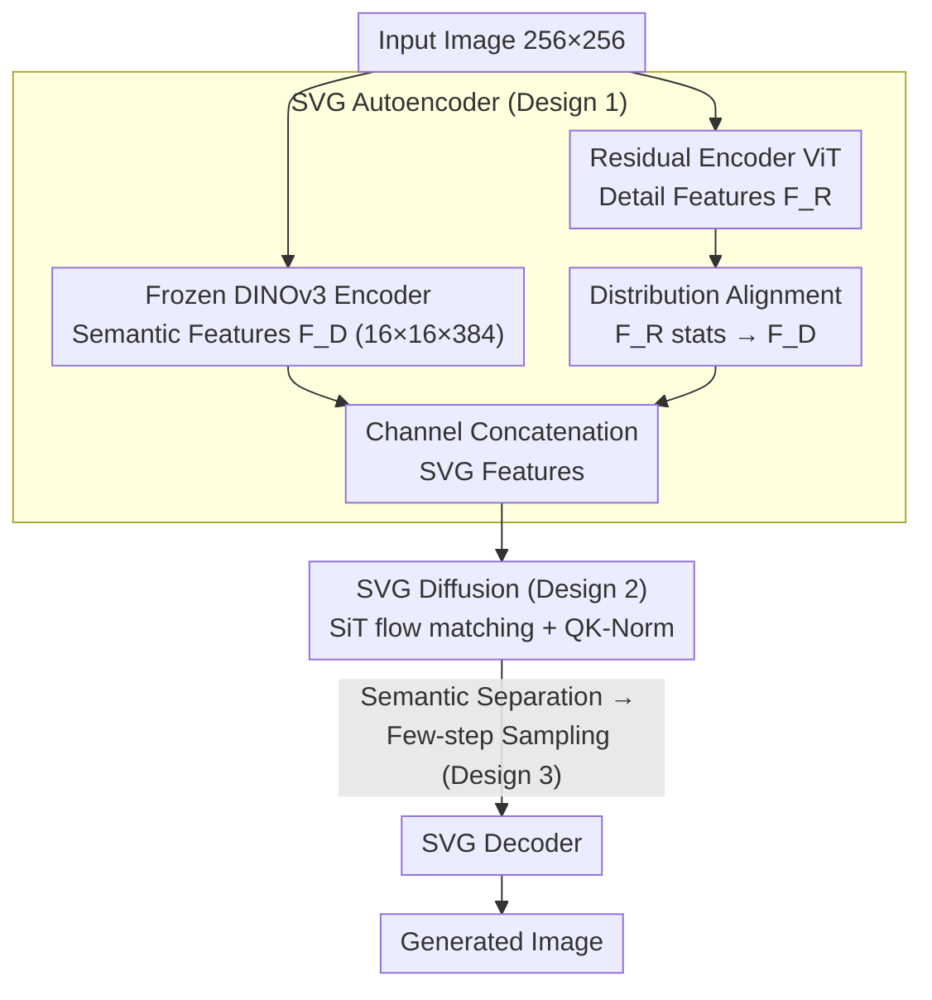

# Latent Diffusion Model without Variational Autoencoder

**Conference**: ICLR 2026  
**arXiv**: [2510.15301](https://arxiv.org/abs/2510.15301)  
**Code**: [GitHub](https://github.com/shiml20/SVG)  
**Area**: Diffusion Models / Visual Representation  
**Keywords**: Self-supervised representation, DINOv3, VAE-free Latent Diffusion, Unified Feature Space, Few-step Generation  

## TL;DR
SVG is proposed to replace the VAE latent space with frozen DINOv3 self-supervised features for building diffusion models. By supplementing fine-grained details via a lightweight residual encoder, it achieves faster training, more efficient inference, and cross-task universal visual representations.

## Background & Motivation
- The VAE+Diffusion paradigm faces three major limitations: inefficient training/inference, poor quality in few-step sampling, and VAE features lacking semantic discriminatability.
- The VAE latent space suffers from severe semantic entanglement (t-SNE visualizations show high mixing of different classes), leading to contradictory velocity field directions that necessitate more sampling steps.
- Existing acceleration methods (REPA, VA-VAE) improve performance by aligning with VFM features but only treat symptoms without fundamentally changing the latent space structure.
- Hypothesis: A latent space with clear semantic discriminatability can significantly accelerate diffusion training.

## Method

### Overall Architecture
SVG aims to address the long-standing issues of slow training and poor few-step sampling in the VAE+Diffusion paradigm by migrating the diffusion model entirely from the VAE latent space to a self-supervised feature space. An image is first passed through a frozen DINOv3 encoder to obtain backbone features that are semantically discriminative but high-level and lacking detail. Simultaneously, the same image passes through a lightweight residual encoder to recover color and high-frequency textures lost by DINO. These two sets of features are concatenated along the channel dimension to form the SVG features. The diffusion model directly learns the velocity field on this semantically clear SVG feature space. During sampling, the generated features are mapped back to pixel images by the SVG Decoder. The core design is predicated on the idea that a naturally semantically separable latent space makes the velocity field smoother, enabling faster training convergence and fewer sampling steps.

### Key Designs

**1. SVG Autoencoder: Recovering Details Lost by DINO via Residuals**

Directly using DINOv3 features for generation fails at reconstruction—while semantically strong, they are high-level discriminative features that lose color and high-frequency textures, leading to blurry decoded images. SVG's solution is to parallelize a ViT residual encoder alongside the frozen DINOv3-ViT-S/16+ backbone (which produces a $16 \times 16 \times 384$ feature map for 256x256 images). This residual encoder specifically captures the missing fine-grained information. The two features are then concatenated to form the complete SVG feature, which is decoded back to an image by the SVG Decoder (following the VA-VAE design). A critical pitfall: if residual features are concatenated directly, the numerical range discrepancy with the DINO backbone would unbalance the distribution and destroy DINO's original semantic separability (gFID deteriorates from 6.12 to 9.03 in ablations). Consequently, SVG performs distribution alignment on the residual features $F_R$, normalizing its batch statistics to those of the backbone features $F_D$:

$$\hat{F}_R = \frac{F_R - \mu(F_R)}{\sigma(F_R)} \cdot \sigma(F_D) + \mu(F_D)$$

This ensures statistical consistency in the concatenated feature space, preserving DINO's semantic structure while providing the details necessary for reconstruction, which is a prerequisite for stable diffusion.

**2. Diffusion on High-Dimensional Semantic Features: Maintaining Stability via Semantic Separability**

While the VAE latent space is only $16 \times 16 \times 4$, SVG trains diffusion directly on high-dimensional $16 \times 16 \times 384$ features—conventionally, such high dimensions risk divergence. SVG succeeds because DINO features possess inherent semantic separability: different classes are distinct in the feature space, meaning velocity field directions no longer contradict each other. Thus, high dimensionality becomes a semantic advantage rather than a burden. Training follows the flow matching objective of SiT, utilizing QK-Norm and per-channel normalization to stabilize high-dimensional optimization. Notably, since the hidden state dimensions of diffusion backbones are already much larger than 384 (e.g., 1152 in DiT), replacing the patch embedding with a linear projection avoids extra inference overhead.

**3. Semantic Separability: Explaining the Capability for Few-step Sampling**

This point addresses "why a semantically clear latent space accelerates generation," serving as the core argument of the paper. Through t-SNE visualizations and toy examples, it is shown that in a semantically separated feature space, velocity directions within the same semantic component and across different spatial locations are highly consistent, while average velocity directions for different classes are distinct. A smoother velocity field results in smaller discretization errors during sampling, allowing the model to reach the target in fewer steps. This is the fundamental reason SVG can generate images in 5 steps, whereas SiT requires 250 steps to reach a similar level. Unlike REPA and VA-VAE, which only improve symptoms by aligning VFM features, SVG solves the structural problem by replacing the latent space with semantically separable features.

### Loss & Training
Training is decoupled into two stages to prevent interference between the feature space and the diffusion objective. In Phase 1, DINOv3 is frozen, and the residual encoder and SVG decoder are jointly trained using reconstruction loss and distribution alignment to establish a high-quality, statistically consistent SVG feature space. In Phase 2, SVG Diffusion is trained on this fixed feature space using SiT settings with QK-Norm and per-channel normalization enabled. This sequence—fixing features before learning generation—is key to ensuring semantic separability is not compromised by the generative task.

## Key Experimental Results

### Main Results (ImageNet 256×256)

| Method | Tokenizer | Training Epoch | Steps | gFID w/o CFG | gFID w/ CFG |
|------|-----------|-----------|-------|-------------|-------------|
| DiT-XL | SD-VAE | 1400 | 250 | 9.62 | 2.27 |
| SiT-XL | SD-VAE | 1400 | 250 | 9.35 | 2.15 |
| REPA-XL | SD-VAE | 800 | 250 | 5.90 | 1.42 |
| SiT-XL (SD-VAE) | SD-VAE | 80 | **25** | 22.58 | 6.06 |
| SiT-XL (VA-VAE) | VA-VAE | 80 | **25** | 7.29 | 4.13 |
| **Ours (SVG-XL)** | **SVGTok** | **80** | **25** | **6.57** | **3.54** |
| **Ours (SVG-XL)** | **SVGTok** | **500** | **25** | **3.94** | **2.10** |

### Few-step Generation Comparison

| Method | Steps | FID w/o CFG | FID w/ CFG |
|------|-------|-------------|------------|
| SiT-XL (SD-VAE) | 5 | 69.38 | 29.48 |
| SiT-XL (VA-VAE) | 5 | 74.46 | 35.94 |
| **Ours (SVG-XL)** | **5** | **12.26** | **9.03** |
| SiT-XL (SD-VAE) | 10 | 32.81 | 10.26 |
| **Ours (SVG-XL)** | **10** | **9.39** | **6.49** |

### Key Findings
- 25-step SVG-XL (80 epochs) achieves FID=6.57, significantly outperforming SiT-XL (22.58) at the same step count.
- FID=12.26 is achieved in just 5 steps (SiT requires 250 steps for a comparable level).
- The SVG feature space retains the semantic discriminative power of DINOv3 (linear probing accuracy is close to raw DINO).
- The residual encoder is vital for reconstructing color and high-frequency details.
- DINOv3 is the most suitable across all VFMs as a unified feature space.

## Highlights & Insights
- First to demonstrate that self-supervised features can be directly used for generative modeling, breaking the convention that VAE is the only choice for latent diffusion.
- The causal analysis between semantic separability and training efficiency is insightful (demonstrated via toy examples).
- Achieved a unified feature space universal for generation, perception, and understanding tasks.
- The exceptional 5-step generation performance showcases the dimensionality reduction effect of semantically structured latent spaces.

## Limitations & Future Work
- Currently only validated on ImageNet 256x256; not yet extended to text-guided generation or high resolutions.
- SVG feature dimensions are high (384 vs. 4 for VAE), leading to higher memory overhead.
- Dependent on the specific DINOv3 model; other self-supervised methods (e.g., MAE, SigLIP) yield poorer results.
- Reconstruction quality (rFID=0.65) is slightly inferior to the best VAEs.

## Related Work & Insights
- Alignment methods like REPA and VA-VAE inspired this work, but SVG fundamentally replaces the feature space.
- Complementary to autoregressive methods like MAR: SVG provides a superior latent space for continuous diffusion.
- Insight: Future visual generation might no longer require specialized VAE training.

## Technical Details (Supplementary)
- DINOv3-ViT-S/16+ encoder produces $16 \times 16 \times 384$ features (vs. $16 \times 16 \times 4$ for SD-VAE).
- Residual encoder uses a ViT architecture (timm implementation) concatenated with DINOv3 features.
- SVG Decoder adopts the decoder architecture design from VA-VAE.
- Per-channel normalization is applied to the SVG feature space to stabilize high-dimensional diffusion training.
- Patch embedding layer in DiT is replaced by a simple linear projection (384 → model dimension).
- Hidden state channels are typically >384 (e.g., 1152 in DiT-XL), so SVG does not introduce inference inefficiency.
- Linear probing accuracy: Original DINOv3 86.4%, SVG (frozen DINO part) 85.2%, semantic capability is largely preserved.
- MAE and SigLIP encoders lack sufficient reconstruction capability for high-quality generation.
- SVG-XL at 1400 epochs and 25 steps reaches FID=3.36 (w/o CFG) / 1.92 (w/ CFG), approaching SOTA.
- Scalability supported: Effective across SVG-B (130M) to SVG-XL (675M).
- Proved SVG features are applicable to perception and understanding via representative downstream tasks.

## Rating
- Novelty: ⭐⭐⭐⭐⭐ First to remove VAE in favor of self-supervised features for diffusion; convincing approach.
- Experimental Thoroughness: ⭐⭐⭐⭐ Extensive ablations, though lacking large-scale/text-guided experiments.
- Writing Quality: ⭐⭐⭐⭐⭐ Thorough motivation analysis with strong visualizations.
- Value: ⭐⭐⭐⭐⭐ Potential to shift the design paradigm of latent diffusion models.

<!-- RELATED:START -->

## Related Papers

- [\[ICLR 2026\] Pareto Variational Autoencoder](pareto_variational_autoencoder.md)
- [\[CVPR 2026\] SRA 2: Variational Autoencoder Self-Representation Alignment for Efficient Diffusion Training](../../CVPR2026/image_generation/sra_2_variational_autoencoder_self-representation_alignment_for_efficient_diffus.md)
- [\[ICLR 2026\] Learning an Image Editing Model without Image Editing Pairs](learning_an_image_editing_model_without_image_editing_pairs.md)
- [\[ICLR 2026\] Variational Autoencoding Discrete Diffusion with Enhanced Dimensional Correlations Modeling](variational_autoencoding_discrete_diffusion_with_enhanced_dimensional_correlatio.md)
- [\[ICLR 2026\] Discrete Variational Autoencoding via Policy Search](discrete_variational_autoencoding_via_policy_search.md)

<!-- RELATED:END -->
