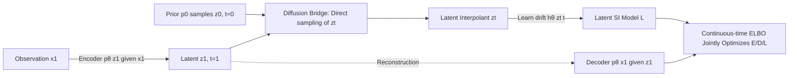

# Latent Stochastic Interpolants

**Conference**: ICLR 2026  
**OpenReview**: [https://openreview.net/forum?id=txiGUfI4yF](https://openreview.net/forum?id=txiGUfI4yF)  
**Code**: To be confirmed  
**Area**: Image Generation / Generative Models  
**Keywords**: Stochastic Interpolants, Latent space generation, Continuous-time ELBO, Diffusion bridge, Joint training  

## TL;DR
This paper proposes **Latent Stochastic Interpolants (LSI)**, which utilizes a single ELBO objective derived from continuous time to bring the Stochastic Interpolants framework into an end-to-end jointly trained latent space. By optimizing the encoder, decoder, and the latent SI generative model together, LSI achieves FIDs comparable to pixel-space SI on ImageNet with significantly lower sampling FLOPs.

## Background & Motivation
- **Background**: Stochastic Interpolants (SI) is a unified framework for diffusion-like generation that flexibly bridges any two distributions (not limited to Gaussian priors). It constructs an interpolant $x_t=(1-t)x_0+tx_1+\sqrt{t(1-t)}\,\epsilon$ to learn a velocity field and score, followed by efficient training via a simulation-free objective.
- **Limitations of Prior Work**: SI requires both the prior $p_0$ and the target $p_1$ to be fixed and directly observable. This restricts it to the observation space. To learn a generative model in a low-dimensional latent space, the target distribution becomes the aggregated posterior $p_1(z_1)=\int p_\theta(z_1|x_1)\,dx_1$, which evolves with the encoder/decoder and is unobservable. Thus, one cannot directly construct a latent interpolant that satisfies SI marginal constraints.
- **Key Challenge**: Running SI directly in a high-dimensional observation space is computationally expensive. Attempting to use a latent space to reduce cost often fails because the posterior is "dynamic and unobservable." Existing latent diffusion models often revert to simple Gaussian priors or rely on ad-hoc multi-阶段 training (pre-training an autoencoder before the generator), which might result in a misalignment between the latent representation and the generative process.
- **Goal**: To jointly learn the encoder, decoder, and SI generative model in a **continuous-time latent space** end-to-end, retaining the flexibility of SI for arbitrary priors and simulation-free training while benefiting from the efficiency of a low-dimensional latent space.
- **Core Idea**: **[Deriving Interpolants from ELBO, not vice versa]** Instead of defining an interpolant first and solving for the velocity field as in SI, the paper treats latent variables as continuous-time dynamic variables following an SDE. It formulates a continuous-time ELBO and uses a **diffusion bridge (Doob h-transform)** to construct a variational posterior that allows simulation-free sampling. This naturally derives the latent stochastic interpolant $z_t$, resulting in a unified objective.

## Method

### Overall Architecture
LSI models generation as follows: prior $z_0\sim p_0$ → latent SDE drift $h_\theta$ evolves to $z_1$ → decoder $p_\theta(x_1|z_1)$ outputs the image. For training, sampling from the posterior $p_\theta(z_t|x_1)$ is required. The authors construct a variational posterior using "encoder-provided $z_1$ + a diffusion bridge connecting $z_0$ and $z_1$." Under the assumption of a linear SDE, $z_t$ can be sampled directly without simulation. The three components (E/D/L) are jointly optimized via a single ELBO.

### Key Designs

**1. Continuous-time ELBO: Casting Latent Generation as KL Control of Path Measures**  
The foundation of the method is the evidence lower bound written for "continuous-time dynamic latent variable" models. Given a model path measure $P_\theta$ (with drift $h_\theta$) and a variational posterior path measure $Q$ (with drift $h_\phi$ and shared diffusion $\sigma$), the ELBO is defined as:
$$\ln p_\theta(x_1)\ge \mathbb{E}_Q[\ln p_\theta(x_1|z_1)] - \mathrm{KL}(Q\|P_\theta)$$
The KL term simplifies to a path integral $\tfrac12\int_0^T\|u(z_t,t)\|^2dt$, where $\sigma u = h_\phi - h_\theta$. This term penalizes the mismatch between the "variational dynamics" and the "model dynamics" as a differentiable objective, while the first term represents VAE-style reconstruction. This continuous-time form allows arbitrary priors, likelihood control, and simulation-free training to coexist.

**2. Diffusion Bridge for Simulation-free Variational Posterior: Bypassing SDE Numerical Simulation**  
The challenge is that the ELBO requires sampling $z_t\sim p_\theta(z_t|x_1)$. Using an arbitrary $h_\phi$ would require numerical integration at every training step, which is prohibitively expensive. The authors instead explicitly construct the drift: the encoder provides $z_1\sim p_\theta(z_1|x_1)$, and a diffusion bridge via Doob’s h-transform $dz_t=[h_\phi+\sigma\sigma^\top\nabla_{z_t}\ln p(z_1|z_t)]dt+\sigma dw_t$ connects the prior $p_0(z_0)$ with the aggregate posterior at the $t=1$ endpoint. By **assuming a linear SDE** $dz_t=h_t z_t dt+\sigma_t dw_t$, the transition density becomes Gaussian, yielding a closed-form $\nabla_{z_t}\ln p(z_1|z_t)$. Consequently, the bridge conditional density $p(z_t|z_1,z_0)$ is also Gaussian, allowing **one-step direct sampling** of $z_t$, recovering the simulation-free efficiency of observation-space diffusion.

**3. Latent Stochastic Interpolants: Reparameterizing $z_t$ from a Gaussian Bridge**  
Using the Gaussian bridge described above, $z_t$ is reparameterized as $z_t=\eta_t\epsilon+\kappa_t z_1+\nu_t z_0,\ \epsilon\sim\mathcal{N}(0,I)$, where the coefficients satisfy the endpoint constraints $\kappa_0=\nu_1=0,\ \kappa_1=\nu_0=1,\ \eta_0=\eta_1=0$. This is effectively the latent space version of SI interpolants. The authors **choose $\kappa_t,\nu_t$ first and then derive $h_t,\sigma_t$**. Setting $\kappa_t=t,\nu_t=1-t$ results in constant diffusion $\sigma_t=\sigma$, and the interpolant simplifies to $z_t=\sigma\sqrt{t(1-t)}\,\epsilon+t z_1+(1-t)z_0$. If the prior is chosen as a standard Gaussian, it simplifies further. When the encoder/decoder are identity mappings, LSI reduces exactly to observation-space SI.

**4. InterpFlow Parameterization to Stabilize Training Variance**  
Substituting $u(z_t,t)$ back into the ELBO leads to a naive loss containing $\sqrt{1-t}$ in the denominator, resulting in gradient variance explosion. The authors adopt the **InterpFlow** parameterization $\tfrac{\beta_t}{2}\big\|-\sigma\sqrt{t}\,\epsilon+\sqrt{1-t}(z_1-z_0)+\sqrt{t}\,z_t-\hat h_\theta(z_t,t)\big\|^2$ and use variable substitution $t(s)=1-(1-s)^c$ to make the time weight $\beta_t=\beta/(1-t)$ a constant $\beta$. The weight $\beta$ acts similarly to $\beta$ in a $\beta$-VAE: as $\beta\to0$, the model approximates a fixed pre-trained autoencoder, while larger $\beta$ values allow the encoder to adjust the representation for the generative objective. For sampling, the authors utilize the equivalent SDE family from Singh & Fischer (2024), enabling the adjustment of stochasticity via $\gamma_t$ without retraining.

## Key Experimental Results

### Main Results
Class-conditional generation on ImageNet (FID @ 2000 epochs). Comparison between latent LSI and observation-space SI (Parameters in M / FLOPs per forward pass in G; E/D/L represent Encoder/Decoder/Latent model):

| Resolution | Latent FID | Obs. FID | Params Latent (E/D/L) | Params Obs. | FLOPs Latent (E/D/L) | FLOPs Obs. |
|---|---|---|---|---|---|---|
| 64×64 | 2.62 | 2.57 | 392 (5/5/382) | 398 | 15/15/161 | 201 |
| 128×128 | **3.12** | 3.46 | 392 (5/5/382) | 400 | 59/59/327 | 466 |
| 256×256 | 3.91 | 3.87 | 393 (5/5/383) | 405 | 240/240/450 | 1288 |

LSI achieves FIDs comparable to observation-space SI across resolutions. The key advantage lies in sampling efficiency: because the encoder is not used during sampling and the decoder is run only once, whereas the latent model L runs at every step, the **FLOP savings accumulate during multi-step sampling**. At 128×128 with 100-step sampling, LSI saves **73.6%** FLOPs; at 256×256, it saves **48.6%**.

### Ablation Study
**Capacity Transfer (128×128)**: Moving $k$ convolutional blocks from the latent model L to the encoder/decoder while keeping total parameters constant significantly reduces sampling FLOPs. A comparison between joint training ($\beta>0$) and independent training ($\beta\to0$) follows:

| k | FID ($\beta>0$) | FID ($\beta\to0$) | Params (E/D/L) | FLOPs (E/D/L) |
|---|---|---|---|---|
| 0 | **3.76** | 4.31 | 392 (5/5/382) | 59/59/327 |
| 3 | 3.91 | 4.55 | 389 (9/8/372) | 68/66/313 |
| 6 | 3.96 | 4.87 | 387 (13/12/362) | 75/73/299 |
| 9 | 4.61 | 4.98 | 383 (16/16/351) | 82/80/284 |

Joint training consistently performs better and shows slower FID degradation as capacity is shifted.

### Key Findings
- **Joint Training Gains**: FID improved from 4.53 ($\beta\to0$) to 3.75 ($\beta=0.0001$), roughly a **17%** gain. Allowing the encoder to adapt latent representations for generative goals is effective.
- **Encoder Noise Scale $c$ is Crucial**: Deterministic encoders ($c=0$) performed worst. Fixing $c$ outperformed learning it.
- **Unification**: With identity mappings for the encoder/decoder, LSI reduces exactly to observation-space SI, validating it as a strict generalization.

## Highlights & Insights
- **Perspective Shift**: While SI "defines the interpolant and solves the velocity field," LSI "defines the ELBO and derives the interpolant via a diffusion bridge." This inversion is the key to bringing SI into an unobservable latent space.
- **Unified Single Objective**: The encoder, decoder, and latent generative model are optimized jointly via a single continuous-time ELBO, replacing the multi-stage pipeline and aligning the latent representation with the generative process.
- **Efficiency through Structure**: By concentrating computation in a lightweight latent model L and omitting the encoder during sampling, savings grow linearly with the number of sampling steps.
- **Interpretability of $\beta$**: $\beta$ serves as a clear knob on a spectrum between using a pre-trained autoencoder and joint adaptation, providing a clear intuition for tuning.

## Limitations & Future Work
- **Linear SDE Assumption**: Simulation-free sampling depends on the assumption of a linear $h_\phi$ and additive noise, which theoretically limits the expressivity of the variational posterior.
- **Single Observation Moment**: While the ELBO supports multiple observations $x_{t_i}$, the experiments only use $t=1$, leaving the potential for time-series data unexplored.
- **Narrow Evaluation Scope**: The experiments focus on ImageNet class-conditional generation without covering text-to-image, super-resolution, or video tasks.
- **Variance Sensitivity**: The naive ELBO loss is high-variance and necessitates the InterpFlow parameterization and specific time-variable substitutions.

## Related Work & Insights
- **Stochastic Interpolants (Albergo et al., 2023)**: The direct predecessor; LSI generalizes it to the latent space.
- **Continuous-time ELBO / Latent SDE**: Provides the lower bound formulation for dynamic latents.
- **Diffusion Bridges**: The core tool for constructing simulation-free posterior sampling.
- **Latent Diffusion**: Also performs latent generation but typically uses multi-stage training and simpler priors; LSI is end-to-end and supports arbitrary priors.
- **Insight**: When the target distribution is unobservable or evolves during training, "deriving the forward process from a variational lower bound" is a more general path than "manually constructing a fixed interpolant."

## Rating
- **Novelty**: ⭐⭐⭐⭐⭐ — Successfully brings the SI framework into a jointly trainable latent space using a principled continuous-time ELBO approach.
- **Experimental Thoroughness**: ⭐⭐⭐⭐ — Solid results on ImageNet with detailed ablations on capacity transfer and hyper-parameters, though limited to few tasks.
- **Writing Quality**: ⭐⭐⭐⭐ — Rigorous derivations and clear motivations, though technically demanding.
- **Value**: ⭐⭐⭐⭐ — Offers a principled foundation for "latent + arbitrary prior + end-to-end" generation with practical benefits in sampling efficiency.

<!-- RELATED:START -->

## Related Papers

- [\[ICLR 2026\] Generative Modeling from Black-Box Corruptions via Self-Consistent Stochastic Interpolants](generative_modeling_from_black-box_corruptions_via_self-consistent_stochastic_in.md)
- [\[NeurIPS 2025\] BoltzNCE: Learning Likelihoods for Boltzmann Generation with Stochastic Interpolants](../../NeurIPS2025/image_generation/boltznce_learning_likelihoods_for_boltzmann_generation_with_stochastic_interpola.md)
- [\[ICLR 2026\] SESaMo: Symmetry-Enforcing Stochastic Modulation for Normalizing Flows](sesamo_symmetry-enforcing_stochastic_modulation_for_normalizing_flows.md)
- [\[ICLR 2026\] Latent Denoising Makes Good Tokenizers](latent_denoising_makes_good_tokenizers.md)
- [\[ICLR 2026\] Latent Diffusion Model without Variational Autoencoder](latent_diffusion_model_without_variational_autoencoder.md)

<!-- RELATED:END -->
