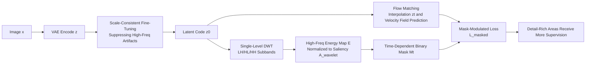

# Latent Wavelet Diffusion for Ultra-High-Resolution Image Synthesis

**Conference**: ICLR 2026  
**OpenReview**: [https://openreview.net/forum?id=5og80LMVxG](https://openreview.net/forum?id=5og80LMVxG)  
**Code**: [https://github.com/LuigiSigillo/LatentWaveletDiffusion](https://github.com/LuigiSigillo/LatentWaveletDiffusion)  
**Area**: Image Generation / Ultra-High-Resolution Diffusion Models  
**Keywords**: Ultra-High-Resolution Synthesis, Latent Diffusion, Wavelet Energy Map, Frequency-Aware Supervision, Flow Matching, VAE Fine-tuning  

## TL;DR
LWD extracts spatial saliency from latent signals via wavelet energy maps and concentrates training loss on high-frequency regions using time-dependent binary masks. Combined with scale-consistent VAE fine-tuning, it enhances 2K–4K ultra-high-definition generation quality without architectural changes or additional inference overhead.

## Background & Motivation
**Background**: Latent Diffusion Models (LDM), Diffusion Transformers (DiT), and Flow Matching have become mainstream paradigms by shifting generation to compressed latent spaces. However, directly scaling models trained at low resolutions to 2K–4K (UHR) often results in structural repetition, blurred textures, and spatial inconsistency.

**Limitations of Prior Work**: Existing paths for resolution scaling are suboptimal. Direct UHR training or fine-tuning requires massive compute and private HD datasets; cascaded generation and post-processing super-resolution often "smooth out" outputs, losing fine textures; architectural modifications for long-range dependencies often introduce performance trade-offs.

**Key Challenge**: Almost all methods **treat all spatial positions equally** during refinement, ignoring local frequency variations. This leads to a double-loss: smooth regions waste compute, while high-frequency regions rich in texture, edges, and semantic structure receive insufficient supervision, causing artifacts or detail loss. The root causes lie in both the architecture (latent representations lack structural granularity for UHR) and the algorithm (denoising targets omit spatial adaptivity).

**Goal**: Allocate more "learning signals" to visually complex areas and fewer to low-detail regions without changing the underlying architecture or increasing inference costs.

**Core Idea**: **Signal-driven spatially adaptive supervision.** Local high-frequency energy is extracted directly from the latent space using wavelet transforms as a saliency map to modulate the spatio-temporal allocation of training loss. It is non-learning, interpretable, involves zero inference overhead, and is universal across diffusion/Flow Matching model families.

## Method

### Overall Architecture
LWD consists of two serial stages. **Stage 1** fine-tunes the VAE with a scale-consistent loss to "shape" the latent space into a form with stable spectra and suppressed compression artifacts, providing a solid foundation for downstream wavelet analysis. **Stage 2** fine-tunes the diffusion model (e.g., Flux/SD3/Sana) on this clean latent space, modifying the Flow Matching objective with three tightly coupled components: extracting spatial saliency via wavelet transforms, constructing time-dependent masks, and modulating the loss to dynamically guide learning resources toward detail-rich areas. All components are model-agnostic changes at the objective level.

### Key Designs

**1. Scale-Consistent VAE Fine-Tuning: "Cleaning" the latent space before frequency analysis.** UHR generation requires latents to maintain semantic structure while ensuring spectral consistency across scales. The VAE is fine-tuned using a multi-resolution reconstruction objective comprising four terms: reconstruction $\|D(z)-x\|_2^2$, scale-consistency $\alpha\|D(E(z_{down}))-x_{down}\|_2^2$, KL regularization $\beta D_{KL}(q(z|x)\|p(z))$, and perceptual loss $\lambda L_{LPIPS}(D(z),x)$. The scale-consistency term is critical: standard VAEs generate spurious high-frequency noise in latent space that interferes with wavelet masking. Without suppression, the mask targets "noise" rather than "details." This step decouples signal regularization from generation, reserving architectural modularity.

**2. Wavelet-Derived Frequency Saliency Maps: Identifying "where the details are" directly from the signal.** For a latent tensor $z\in\mathbb{R}^{C\times H\times W}$, a single-level Discrete Wavelet Transform $\text{DWT}(z)\to\{z_{LL},z_{LH},z_{HL},z_{HH}\}$ is applied. High-frequency energy across the three detail subbands is aggregated per position:

$$E(i,j)=\frac{1}{C}\sum_c\left[(z^{c,i,j}_{LH})^2+(z^{c,i,j}_{HL})^2+(z^{c,i,j}_{HH})^2\right]$$

The map is upsampled and normalized to $A_{wavelet}\in[0,1]^{H\times W}$, acting as a proxy for local structural richness. Unlike learning-based attention, this is deterministic and requires no additional training.

**3. Adaptive Flow Matching with Frequency-Guided Mask Modulation: Optimizing spatio-temporal supervision budgets.** In continuous-time Flow Matching, a **time-dependent binary mask** is defined for each position:

$$M_t(i,j)=\begin{cases}1 & \text{if } T\cdot(A_{wavelet}(i,j)+\ell)\ge t\\0 & \text{otherwise}\end{cases}$$

Where $T$ is the total timesteps and $\ell\in(0,1)$ (typically 0.3) sets a supervision lower bound. High-frequency regions (large $A_{wavelet}$) are supervised over more timesteps, while smooth regions update during fewer steps, though all regions receive at least $\ell T$ steps of supervision to prevent total neglect. The final loss is:

$$L_{masked}=\|M_t\odot[(\epsilon-z_0)-v_\Theta(z_t,t,y)]\|_2^2$$

This mechanism is purely objective-based, compatible with any flow-based or score-based latent diffusion model, and involves zero inference overhead as the mask is not used during sampling.

## Key Experimental Results

### Main Results (2K, HPD prompts, 2048×2048)

| Model | FID ↓ | LPIPS ↓ | MAN-IQA ↑ | QualiCLIP ↑ |
|---|---|---|---|---|
| Diffusion-4K | 37.10 | 0.6920 | 0.3550 | 0.4815 |
| Sana-1.6B | 35.75 | 0.7169 | 0.3666 | 0.5796 |
| URAE | 35.25 | 0.6717 | 0.4076 | 0.5423 |
| **LWD + URAE** | **32.88** | **0.6336** | 0.4099 | 0.5356 |

LWD reduces FID by ~7% and LPIPS by ~6% on URAE while maintaining comparable semantic alignment and perceptual quality.

### Ablation Study (Diffusion4k backbone, Aesthetic 2048×2048)

| Configuration | FID ↓ | CLIPScore ↑ | Aesthetics ↑ | GLCM ↑ |
|---|---|---|---|---|
| Baseline (SD3-Diff4k-F16) | 40.18 | 34.04 | 5.96 | 0.79 |
| + VAE Scale-Consistency | 39.50 | 34.10 | 6.05 | 0.78 |
| + Wavelet Masking | 39.20 | 34.50 | 6.10 | 0.75 |
| **Full LWD** | **38.74** | **34.94** | **6.17** | 0.74 |

VAE scale-consistency alone significantly improves LPIPS (e.g., from 0.30 to 0.18 on SD3-VAE-F16-SC) and reduces rFID.

### Key Findings
- **Model Agnostic**: Consistent improvements in FID/CLIPScore/Aesthetics across SD3, PixArt-Sigma, Sana, URAE, and Flux verify plug-and-play characteristics.
- **Accelerated Convergence**: Models converge with only 10–50% of the iterations suggested in original papers.
- **High-Frequency Detail Gains**: Enhancements are most visible in fine structures like hair, leaves, and architecture, avoiding over-sharpening or texture collapse.
- **GLCM Paradox**: A slight decrease in GLCM (textural complexity) is an intentional trade-off for "more realistic details" over "raw statistical complexity."

## Highlights & Insights
- **Reintroducing Signal Processing to Deep Generative Training**: In an era of "learned attention," LWD uses deterministic wavelet energy for spatial saliency—a minimalist design philosophy that is both interpretable and cost-free.
- **The Criticality of Decoupling**: Fine-tuning the VAE for scale consistency is a necessary prerequisite; without "cleaning" the latent space, wavelet masks are misled by artifacts.
- **Temporal Mask Lower Bound**: The $\ell$ parameter effectively balances the supervision budget, ensuring high-frequency regions receive attention without "starving" low-frequency areas.
- **Zero Inference Cost**: Pure objective-level modifications allow seamless integration into existing pipelines.

## Limitations & Future Work
- **Dependency on Two-Stage Training**: Requires VAE fine-tuning before diffusion fine-tuning, which is more complex than training-free methods.
- **Single-Layer Haar DWT**: Coarse frequency decomposition; exploring multi-layer or learnable wavelets remains an open direction.
- **Evaluation Tension**: The discrepancy between GLCM and perceptual quality suggests a need for more reliable UHR evaluation metrics.
- **Fixed Lower Bound $\ell$**: Currently a hyperparameter; making it adaptive to resolution or content could be an extension.
- **Detail vs. Semantics**: LWD prioritizes high-frequency details; semantic alignment remains largely unchanged, functioning as a detail-enhancement module rather than a replacement for backbone semantic capacity.

## Related Work & Insights
- **Diffusion-4K** (Zhang et al., 2025) uses wavelet loss in latent space but **treats all spatial positions equally**. LWD transforms frequency from a "passive loss signal" into an "active spatial condition" for modulating spatio-temporal supervision.
- **Scale-Consistent VAE Regularization** provided the logic for LWD's prerequisite latent shaping.
- **FouriScale / DiffuseHigh**: These frequency-domain methods focus on global structure via filtering; LWD complements them by addressing "where" high-frequency detail should be supervised.
- **Insight**: When training resources are finite, non-uniform allocation via a cheap, interpretable signal proxy (wavelet energy) is a transferable concept for super-resolution, inpainting, and video generation.

## Rating
- **Novelty**: ⭐⭐⭐⭐ Using deterministic wavelet energy as a time-dependent mask for Flow Matching is a distinct and meaningful step beyond uniform wavelet losses.
- **Experimental Thoroughness**: ⭐⭐⭐⭐ Comprehensive coverage across backbones, metrics, and ablations, including honest discussions on metric tensions.
- **Writing Quality**: ⭐⭐⭐⭐ Logical flow from motivation to experiment, with clear causal explanations for the necessity of VAE fine-tuning.
- **Value**: ⭐⭐⭐⭐ Highly practical for engineers scaling LDMs to UHR due to zero inference overhead and faster convergence.

<!-- RELATED:START -->

## Related Papers
- Zhang et al., "Diffusion-4K: Ultra-High Resolution Image Synthesis with Wavelet Diffusion," 2025.
- Chen et al., "FouriScale: A Frequency Perspective on Training-Free High-Resolution Image Synthesis," 2024.

<!-- RELATED:END -->

## Related Papers

- [\[CVPR 2025\] Diffusion-4K: Ultra-High-Resolution Image Synthesis with Latent Diffusion Models](../../CVPR2025/image_generation/diffusion-4k_ultra-high-resolution_image_synthesis_with_latent_diffusion_models.md)
- [\[ICLR 2026\] PQGAN: Product-Quantised Image Representation for High-Quality Image Synthesis](pqgan_product-quantised_image_representation_for_high-quality_image_synthesis.md)
- [\[ICLR 2026\] W-Edit: A Wavelet-based Frequency-aware Framework for Text-driven Image Editing](w-edit_a_wavelet-based_frequency-aware_framework_for_text-driven_image_editing.md)
- [\[ICLR 2026\] Eliminating VAE for Fast and High-Resolution Generative Detail Restoration](eliminating_vae_for_fast_and_high-resolution_generative_detail_restoration.md)
- [\[CVPR 2026\] VINS-120K: Ultra High-Resolution Image Editing with A Large-Scale Dataset](../../CVPR2026/image_generation/vins-120k_ultra_high-resolution_image_editing_with_a_large-scale_dataset.md)

<!-- RELATED:END -->
