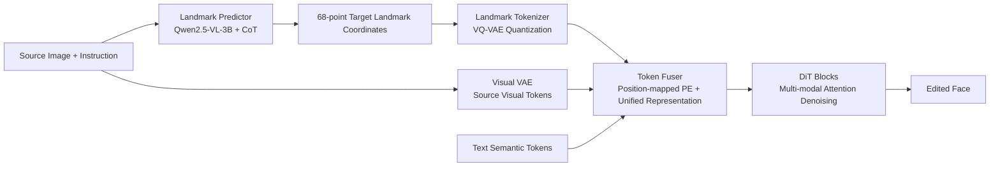

# LaTo: Landmark-tokenized Diffusion Transformer for Fine-grained Human Face Editing

**Conference**: ICLR 2026  
**OpenReview**: [https://openreview.net/forum?id=7bv3jLhlYZ](https://openreview.net/forum?id=7bv3jLhlYZ)  
**Code**: [https://github.com/alibaba/landmark-tokenized-dit](https://github.com/alibaba/landmark-tokenized-dit)  
**Area**: Image Generation / Face Editing  
**Keywords**: Face Editing, Landmark Tokenization, Diffusion Transformer, Identity Preservation, Instruction-based Editing

## TL;DR
LaTo quantizes facial landmark coordinates directly into discrete tokens using VQ-VAE for injection into a DiT (rather than rendering them as images for a VAE). Combined with position-mapped embeddings and landmark-aware CFG, it achieves instruction-driven, fine-grained controllable face editing with strong identity preservation.

## Background & Motivation
- **Background**: Instruction-based multimodal face editing (e.g., SeedEdit3, Step1X-Edit, FLUX.1-Kontext) relies on large-scale vision-language modeling for semantic manipulation. Landmarks are the most common intermediate supervision signals for structured priors like expression and pose.
- **Limitations of Prior Work**: Existing landmark-based methods treat landmarks as **rigid geometric constraints**. They are either built on GAN/UNet architectures (making them hard to migrate to modern DiTs) or, like OminiControl/OmniGen, **render landmarks as 2D images before encoding them with a VAE** into dense visual tokens. the latter induces "pixel-level template copying" rather than geometric reasoning.
- **Key Challenge**: When conditional landmarks significantly deviate from the source face (e.g., large expression/pose changes, inaccurate estimation, cross-identity driving), pixel-level alignment leads to **rigid copying of the rendered image**, resulting in identity drift. Furthermore, the quadratic self-attention complexity of dense token sequences increases VRAM and computational costs.
- **Goal**: To **decouple** geometric conditions from pixel appearance, maintaining identity consistency even under significant geometric changes without increasing computational costs.
- **Core Idea**: **[Coordinates as tokens]**. Instead of rendering landmark maps, original coordinates are directly quantized into discrete facial tokens (68 units, significantly shorter than 1024 image tokens). Position-mapped RoPE anchors each token to a physical location in the latent space grid. A VLM automatically infers target landmarks from instructions and the source image, making the pipeline both precise and user-friendly.

## Method

### Overall Architecture
LaTo is built upon Step1X-Edit and integrates three core modules into an "instruction → geometry → appearance" pipeline: **landmark predictor** (VLM infers 68 target landmarks from the source image and instruction) → **landmark tokenizer** (VQ-VAE quantizes coordinates into discrete facial tokens) → **multi-modal token fuser** (concatenates landmark tokens, source visual tokens, text semantic tokens, and noise tokens into a unified sequence for multi-modal attention denoising in DiT blocks). Landmark tokens are aligned with the dimension of image tokens and injected as context, enabling flexible and decoupled interaction between geometry, appearance, and instructions.

### Key Designs

**1. Landmark Tokenizer: Quantizing coordinates into discrete facial tokens to bypass dense pixel correspondence.** Given a landmark sequence $F=\{(X_i,Y_i)\}_{i=1}^n$, the encoder (residual blocks with convolutions) maps it to a continuous latent space $E\in\mathbb{R}^{n\times d}$. The quantizer performs nearest-neighbor search using a learnable codebook $C\in\mathbb{R}^{m\times d}$ ($m=8192$, $d=3072$ aligned with Step1X-Edit), yielding compact and expressive facial tokens. The training objective incorporates reconstruction loss and commitment loss: $L=\lVert F-\hat F\rVert_1+\beta\lVert E-\mathrm{sg}[C]\rVert_2^2$, where $\mathrm{sg}[\cdot]$ is the stop-gradient operator. Unused codewords are reset every 50 steps to prevent saturation. This step strips "geometry" from "pixels," allowing the DiT to model coordinate-attribute relationships directly.

**2. Position-mapped RoPE: Anchoring discrete landmark tokens back to physical locations.** Step1X-Edit uses 3D RoPE for image/text tokens. For an image token at position $i$, it computes $P_i=\mathrm{Concat}(R_T(0),R_H(\lfloor i/h\rfloor),R_W(i\%h))$. However, landmark tokens are **spatially discontinuous** in a sequence. Using standard image-style indexing prevents the model from learning the correspondence between landmarks and image regions. LaTo instead encodes based on the downsampled landmark coordinates $(x_i,y_i)$ directly: $P_i=\mathrm{Concat}(R_T(0),R_H(y_i),R_W(x_i))$, precisely anchoring each compressed representation to the latent grid region it guides. Ablations show that removing PE causes landmark error to spike to 58.9 with blurry results; original RoPE achieves 25.4, while position-mapped RoPE reduces it to 2.34, proving crucial for geometric fidelity.

**3. Unified Representation + Landmark-aware CFG: Decoupling geometric conditions from appearance with adjustable strength.** A trainable facial landmark adapter projects facial tokens into the same latent space as noise tokens $z_f\in\mathbb{R}^{l_f\times d}$. Text, source, facial, and noise tokens are concatenated into a unified sequence $Z=\mathrm{Concat}(z_t,z_s,z_f,z_n)$ for DiT multi-modal attention. This allows any token pair to interact directly without rigid spatial constraints; since $l_f=68\ll l_n=1024$, efficiency is comparable to the baseline. In CFG, standard practice uses null images for the unconditional branch, but **setting coordinates to zero does not represent "no geometric constraint"**; it conflicts with facial dynamics and induces source image "copying" at high CFG weights. LaTo adopts **learnable unconditional landmark tokens** to provide a meaningful null distribution, balancing quality and fidelity.

**4. Landmark Predictor: Translating instructions to coordinates using structured CoT.** Since requiring users to provide exact landmarks is impractical, LaTo fine-tunes Qwen2.5-VL-3B. Given a source image and instruction, it follows a four-step structured Chain-of-Thought: (1) analyzing pose/expression/alignment, (2) decomposing instructions into anatomical movements, (3) performing kinematic reasoning for rigid and non-rigid deformations, and (4) estimating coordinates on a normalized $512\times512$ canvas. CoT supervision is constructed for 23,145 HFL-150K triplets using a rule-guided pipeline, with 19,398 human-verified samples used for fine-tuning. Compact coordinate tokenization and fixed output syntax enhance numerical fidelity.

## Key Experimental Results

### Main Results (HFL-150K and GEdit/ICE-Bench Subsets; SC: Semantic Consistency / VQ: Visual Quality / NA: Naturalness / IP: Identity Preservation, † indicates fine-tuned on HFL-150K)

| Method | HFL SC↑ | HFL VQ↑ | HFL NA↑ | HFL IP↑ | GEdit&ICE SC↑ | IP↑ |
|------|------|------|------|------|------|------|
| Instruct-Pix2Pix | 0.518 | 0.582 | 0.675 | 0.381 | 0.573 | 0.405 |
| OmniGen | 0.737 | 0.688 | 0.731 | 0.503 | 0.755 | 0.536 |
| Bagel | 0.786 | 0.709 | 0.759 | 0.539 | 0.797 | 0.579 |
| Step1X-Edit† | 0.804 | 0.725 | 0.801 | 0.571 | 0.803 | 0.594 |
| FLUX.1-Kontext† | 0.786 | 0.737 | 0.816 | 0.593 | 0.801 | 0.609 |
| **LaTo (Ours)** | **0.832** | **0.749** | 0.805 | **0.634** | **0.829** | **0.651** |

LaTo outperforms Bagel by 4.6% in semantic consistency and FLUX.1-Kontext by 7.8% in identity preservation on HFL-150K. Compared to Step1X-Edit† (same data/base), it still gains 2.9% on average.

### Ablation Study (Conditioning Form + Position Encoding; LE is L1 distance between edited results and given landmarks)

| Conditioning Form | SC↑ | NA↑ | IP↑ | Latency(s)↓ | LE↓ |
|------|------|------|------|------|------|
| FT Baseline (No Landmark) | 0.804 | 0.801 | 0.571 | 49.6 | - |
| Rendered Map + Visual VAE | 0.821 | 0.744 | 0.584 | 83.6 | 1.76 |
| Compressed Render + Shift | 0.816 | 0.709 | 0.569 | 61.3 | 3.07 |
| Coord Tokens + w/o PE | 0.654 | 0.630 | 0.512 | 50.7 | 58.9 |
| Coord Tokens + RoPE | 0.778 | 0.786 | 0.621 | 52.1 | 25.4 |
| Coord Tokens + Learnable RoPE | 0.803 | 0.791 | 0.617 | 52.9 | 9.63 |
| **Coord Tokens + Pos-mapped RoPE (Ours)** | **0.832** | **0.805** | **0.634** | 52.1 | **2.34** |

### Key Findings
- **Coordinate tokenization exceeds rendered maps**: Compared to rendered conditions, NA increases by 6.1%, SC by 1.1%, and IP by 5.0%, with a 37% speedup (52.1s vs 83.6s), matching the efficiency of the no-landmark baseline.
- **Position encoding is the bottleneck for fidelity**: Removing PE leads to LE=58.9 and image collapse. Position-mapped RoPE reduces LE to 2.34, significantly better than standard RoPE (25.4).
- **Landmark Predictor accuracy**: Human evaluation shows 0.730 accuracy, notably higher than Gemini 2.5 Pro (0.613) and Qwen2.5-VL-72B (0.597).
- **HFL-150K data advantage**: Fine-tuning on this dataset boosts baseline SC by 5.3%~7.4%, indicating the data better reflects real-world diversity.

## Highlights & Insights
- The **paradigm shift from "render-then-encode" to "coordinates-to-tokens"** is elegant. Treating landmarks as discrete tokens rather than pixels eliminates the "template copying" tendency, naturally decoupling geometry and appearance while reducing token count from 1024 to 68.
- The insight that **zero-filling is not "unconditional"** is valuable: setting coordinates to zero introduces pseudo-conditions conflicting with facial dynamics. Using learnable null tokens reveals a hidden pitfall in CFG for geometric conditions.
- The **Rectified IP metric** is cleverly designed: $s_{rip}=\max(0,s_{arc}-((\phi_{ins}-\phi_{real})/(\phi_{ins}+\epsilon))^2)$ penalizes models that inflate ArcFace scores by failing to modify the source image.
- **HFL-150K**, with 300k real face pairs and fine-grained instructions, is currently the largest scale. The hybrid pipeline of synthesis (34K filter by expression/pose) + real videos (116K filtered for quality/identity) is highly reusable.

## Limitations & Future Work
- Evaluation of SC/VQ/NA and predictor accuracy depends on Qwen2.5-VL-72B or human scoring; the VLM-as-judge setup may contain bias.
- Scope is focused on **expression and head pose** editing (7 expressions, 30° pose units). Coverage of hair, accessories, lighting, or age is missing.
- Landmark predictor CoT supervision relies on rule-based pipelines and human verification (19,398 cases); robustness in extreme poses or cross-dataset scenarios requires further discussion. Inference latency (52s) remains high due to CoT.

## Related Work & Insights
- **Instruction Editing**: Uses InstructPix2Pix synthesis or the VLM+diffusion path (MGIE, Bagel). LaTo adds necessary geometric control.
- **DiT Editors**: Contrasts sharply with OminiControl/OmniGen, which use landmark rasterization.
- **Discrete Tokenization**: Inspired by VQ-VAE/VQGAN. The takeaway is that any structured geometric prior can be tokenized and inserted into DiT context.
- **Learnable Null Tokens**: Borrowed from video generation (MTVCrafter), suggesting that CFG should utilize semantically reasonable "empty states" instead of simple zero-filling.

## Rating
- **Novelty**: ⭐⭐⭐⭐ Coordinate tokenization + position-mapped RoPE + landmark-aware CFG forms a clear and interpretable new paradigm for face editing.
- **Experimental Thoroughness**: ⭐⭐⭐⭐ Cross-benchmark evaluation with 300k dataset size. Deducted slightly for heavy reliance on VLM-based scoring.
- **Writing Quality**: ⭐⭐⭐⭐ Logic is clear, with high-density figures explaining paradigm shifts and data pipelines.
- **Value**: ⭐⭐⭐⭐ HFL-150K + open-source code provides direct value for digital humans and controllable editing.

<!-- RELATED:START -->

## Related Papers

- [\[ICLR 2026\] EdiVal-Agent: An Object-Centric Framework for Automated, Fine-Grained Evaluation of Multi-Turn Editing](edival-agent_an_object-centric_framework_for_automated_fine-grained_evaluation_o.md)
- [\[ICLR 2026\] OmniPortrait: Fine-Grained Personalized Portrait Synthesis via Pivotal Optimization](omniportrait_fine-grained_personalized_portrait_synthesis_via_pivotal_optimizati.md)
- [\[CVPR 2026\] SliderEdit: Continuous Image Editing with Fine-Grained Instruction Control](../../CVPR2026/image_generation/slideredit_continuous_image_editing_with_fine-grained_instruction_control.md)
- [\[CVPR 2026\] CogniEdit: Dense Gradient Flow Optimization for Fine-Grained Image Editing](../../CVPR2026/image_generation/cogniedit_dense_gradient_flow_optimization_for_fine-grained_image_editing.md)
- [\[CVPR 2026\] BeautyGRPO: Aesthetic Alignment for Face Retouching via Dynamic Path Guidance and Fine-Grained Preference Modeling](../../CVPR2026/image_generation/beautygrpo_aesthetic_alignment_for_face_retouching_via_dynamic_path_guidance_and.md)

<!-- RELATED:END -->
## Related Papers

- [\[ICLR 2026\] OmniPortrait: Fine-Grained Personalized Portrait Synthesis via Pivotal Optimization](omniportrait_fine-grained_personalized_portrait_synthesis_via_pivotal_optimizati.md)
- [\[CVPR 2026\] SliderEdit: Continuous Image Editing with Fine-Grained Instruction Control](../../CVPR2026/image_generation/slideredit_continuous_image_editing_with_fine-grained_instruction_control.md)
- [\[CVPR 2026\] CogniEdit: Dense Gradient Flow Optimization for Fine-Grained Image Editing](../../CVPR2026/image_generation/cogniedit_dense_gradient_flow_optimization_for_fine-grained_image_editing.md)
- [\[ICLR 2026\] CoCoDiff: Correspondence-Consistent Diffusion Model for Fine-grained Style Transfer](cocodiff_correspondence-consistent_diffusion_model_for_fine-grained_style_transf.md)
- [\[CVPR 2026\] BeautyGRPO: Aesthetic Alignment for Face Retouching via Dynamic Path Guidance and Fine-Grained Preference Modeling](../../CVPR2026/image_generation/beautygrpo_aesthetic_alignment_for_face_retouching_via_dynamic_path_guidance_and.md)

<!-- RELATED:END -->
