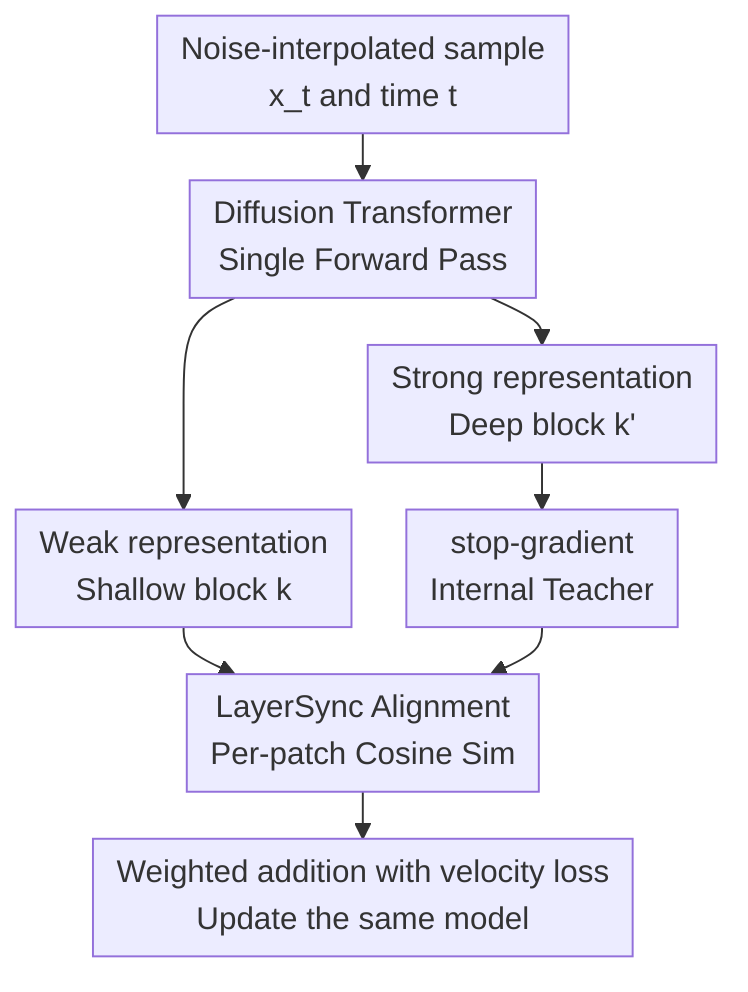

# LayerSync: Self-aligning Intermediate Layers

**Conference**: ICLR 2026  
**OpenReview**: [https://openreview.net/forum?id=4itprlvbRQ](https://openreview.net/forum?id=4itprlvbRQ)  
**Code**: https://github.com/vita-epfl/LayerSync.git  
**Area**: Image Generation / Diffusion Model Training Acceleration / Mid-layer Representation Alignment  
**Keywords**: Diffusion Models, Mid-layer Alignment, Self-supervised Regularization, Training Acceleration, Representation Learning  

## TL;DR
LayerSync discovers that deep intermediate representations of diffusion Transformers can inherently serve as semantic teachers. Through parameter-free inter-layer cosine alignment, it encourages shallower layers to align with stronger representative layers, enhancing generation quality and accelerating training without relying on external models or extra data, and generalizes to image, audio, video, and human motion generation.

## Background & Motivation

**Background**: Diffusion models and flow matching models have become the primary frameworks for image, audio, and video generation tasks. However, high-quality results typically require long training, massive models, and expensive sampling. An important trend in the past two years is: not only optimizing the denoising loss itself but also directly improving the representations learned by the intermediate layers, as there is a clear correlation between the generation quality of diffusion models and the quality of their internal representations.

**Limitations of Prior Work**: Methods like REPA and REED demonstrate that using strong semantic features from DINOv2 or VLMs to constrain the intermediate layers of diffusion models can significantly accelerate training. However, this route has an implicit cost: each training session depends on an external large model, which is expensive, has limited domain coverage, and introduces additional forward computation to the training pipeline. For domains like audio, human motion, and video where mature general-purpose semantic teachers are lacking, such external guidance is harder to reuse directly.

**Key Challenge**: Diffusion models actually contain useful internal representations, but the quality is non-uniform across layers. Early layers are more biased towards local and low-level features, middle-to-late layers are closer to semantic layers, and the final segment gradually assumes the task of decoding back to latents. Existing methods usually treat "strong semantic signals" as external resources, whereas this paper asks: Can the model's own strong layers guide its weak layers to complete semantic transfer internally?

**Goal**: The authors aim to construct a regularization term that requires no additional models, no extra data, no extra parameters, and extremely low training overhead to improve the training efficiency and generation quality of diffusion/flow models. Meanwhile, this regularization term should not be tied to an image semantic teacher, allowing it to migrate naturally to audio, human motion, and video generation.

**Key Insight**: The paper starts from two observations. First, the intermediate representations of pre-trained SiT exhibit a hierarchical structure; layers closer to the middle-late stages are usually more suitable for classification and segmentation and are closer to DINOv2 representations. Second, after a diffusion Transformer converges, it forms several groups of highly correlated blocks: local front-end, global middle-end, and decoding back-end. Thus, middle-segment blocks with stronger semantics can be treated as internal teachers, while earlier weak blocks act as students.

**Core Idea**: LayerSync uses the model's own deep intermediate representations as stop-gradient targets to align shallow patch representations, allowing the diffusion model to spontaneously organize its internal representation hierarchy while learning to generate velocity fields.

## Method

### Overall Architecture

LayerSync is essentially not a new generation architecture but an internal representation regularization term inserted into the diffusion Transformer training objective. During training, the model still receives noise-interpolated samples $x_t$ and time $t$, using the backbone to predict the velocity field or denoising direction. The additional part only reads the intermediate representations of two specified blocks, aligning the output of an earlier block with that of a deeper block patch-by-patch and maximizing their similarity.

The key point of this process is "self-sufficiency": the deep target comes from the same model and the same forward pass, and is fixed as a teacher signal via stop-gradient, thus introducing no extra teacher networks or second EMA forward passes. Shallow layers are pulled towards more semantic deep layers, and structural consistency between intermediate layers forms early, ultimately manifesting as faster training and better intermediate representations.

### Key Designs

**1. Deep Layer as Teacher: Transforming External Semantic Guidance into Internal Self-Guidance**

The core observation of LayerSync is that not all intermediate layers in a diffusion model are equally "weak." Using linear probes, semantic segmentation probes, and CKA analysis, the authors found that middle-to-late blocks often contain more stable and semantic features; these are not necessarily the final output layers but are located where the model transitions from local noise features to global structures before fully entering the decoding stage.

Therefore, LayerSync replaces external teachers like DINOv2 or Qwen2-VL with the model's own deeper layer $k'$ as a reference. The benefits are direct: reduced external model overhead in image tasks and no failure in non-visual tasks due to the lack of general-purpose teachers. More importantly, the teacher and student signals come from the same data, the same timestep, and the same network state; the regularization constrains whether the network's internal hierarchy is coordinated, rather than forcing a generative model to fit into the representation space of another model.

**2. stop-gradient Alignment: Pulling Shallow to Strong, Not Pulling Each Other**

If the similarity between two layers' representations were maximized directly, both shallow and deep layers would be updated simultaneously, and the deep reference itself might be corrupted by shallow-layer noise. LayerSync applies a stop-gradient on the deep branch, treating $f_\theta^{k'}(x)$ as a fixed target and allowing only the shallow $f_\theta^k(x)$ to receive gradients via the alignment loss. This detail clarifies the direction of "strong layer guiding weak layer": the deep layer is the teacher, and the shallow layer is the student.

The paper calculates representation similarity per patch rather than just comparing pooled tokens of the entire image. For diffusion Transformers, latents are sliced into patch tokens; alignment of local patches allows shallow layers to learn more consistent semantic organization across spatial positions. The authors adopt cosine similarity, as it focuses on directional consistency rather than forcing identical feature norms, which is suitable for bringing inter-layer semantic structures closer.

**3. Layer Selection Heuristic: Avoiding Extremes and Preserving Semantic Gaps**

LayerSync does not require an exhaustive search of all layer pairs, yet selection is not arbitrary. Based on the block structure of a converged diffusion Transformer, the authors propose three rules: avoid using the last ~20% of blocks as references because they act more like decoders; avoid using the earliest local feature layers as aligned layers because their local inductive biases are still useful; and ensure a sufficient distance between $k$ and $k'$ to guarantee a real semantic gap exists.

This heuristic avoids two types of ineffective alignment. If the layers are too close, representations are already similar, and the regularization signal is weak; if the reference layer is too late, the model might learn low-level decoding information back to latents rather than transferable semantic structures. Ablations show widespread benefits across layer pairs, but adhering to these rules yields the best acceleration, such as $8 \leftarrow 16$ for SiT-XL/2 and $8 \leftarrow 18$ for SiT-L/2.

**4. No Parameters and Zero Extra Forwards: Making Acceleration a Cheap Regularization**

The computation for LayerSync reuses two intermediate representations already generated in a single forward pass, adding no trainable parameters and requiring no additional teacher network forwards. Compared to the pairwise distance calculation in Dispersive Loss, LayerSync's complexity scales approximately linearly with batch size; compared to EMA teacher/student alignment, it avoids running the EMA model again.

This design explains why the paper emphasizes "training efficiency" rather than just "better FID." If a method reduces iterations but calls a 9B VLM at every step, the actual training cost might not decrease. LayerSync's gains come from the internal structural regularization itself, with the extra cost mainly being the normalization and similarity computation of two layers, making it more like a plug-and-play training trick.

### Loss & Training

The paper describes diffusion and flow matching from the unified perspective of stochastic interpolants. Given a data sample $x_0$, noise $\epsilon$, and time $t$, the interpolation path is $x_t = \alpha_t x_0 + \sigma_t \epsilon$. The model $v_\theta(x_t,t)$ predicts the velocity field to return from noise to data, with the main loss being the velocity prediction error:

$$
L_{velocity}(\theta)=\mathbb{E}_{x_0,\epsilon,t}\left[\lVert v_\theta(x_t,t)-(\dot{\alpha}_t x_0+\dot{\sigma}_t\epsilon)\rVert^2\right].
$$

LayerSync aligns the $k$-th and $k'$-th layers, where $k<k'$. Let $f_\theta^k(x)[n]$ denote the representation of the $n$-th patch in the $k$-th layer and $N$ be the number of patches. The regularization term is the negative similarity between the deep stop-gradient target and the shallow representation:

$$
L_{LayerSync}^{(k,k')}(\theta)=-\mathbb{E}_{x_t,t}\left[\frac{1}{N}\sum_{n=1}^{N}\mathrm{sim}\left(f_\theta^k(x)[n],\mathrm{stopgrad}(f_\theta^{k'}(x)[n])\right)\right].
$$

The final training objective is $L=L_{velocity}+\lambda L_{LayerSync}$. In main experiments, the similarity function uses cosine similarity; $\lambda$ values for SiT-B/2, L/2, and XL/2 are approximately $0.2$ to $0.3$. The authors also verify that $\lambda$ is not sensitive, clearly outperforming the baseline on SiT-B/2 across a range of $0.1$ to $0.7$.

## Key Experimental Results

### Main Results

| Task / Dataset | Model & Training Setup | Ours | Prev. SOTA / Baseline | Gain |
|--------|------|------|----------|------|
| ImageNet 256×256, no CFG | SiT-XL/2, 800 epochs, ODE Heun | FID 6.87 | SiT-XL/2 FID 8.99 | 23.6% FID reduction |
| ImageNet 256×256, no CFG | SiT-XL/2, 160 epochs, SDE Euler | FID 8.29 | SiT-XL/2 1400 epochs FID 8.30 | ~8.75× Training speedup |
| ImageNet 256×256, with CFG | SiT-XL/2, 800 epochs | FID 1.89 | SiT-XL/2 1400 epochs FID 2.06 | Better in self-supervised setup |
| Audio Gen MTG-Jamendo | SiT-XL, 650 epochs | FAD 0.199 | baseline FAD 0.251 | 20.7% FAD reduction |
| Text-cond. Motion HumanML3D | MDM, 600K iter | FID 0.4801, R-Prec 0.7454 | FID 0.5206, R-Prec 0.7202 | 7.7% FID reduction, 3.4% R-Prec gain |
| Video Gen CLEVRER | SiT-XL scratch 24K steps | FVD 120.13 | vanilla FVD 265.50 | Significant FVD reduction |

In main image experiments, LayerSync is effective across model scales. SiT-B/2 at 80 epochs drops FID from 36.19 to 30.00; SiT-L/2 from 21.41 to 14.83; SiT-XL/2 from 17.97 to 11.24. As training lengthens, LayerSync's advantage persists rather than being effective only in early training stages.

Compared to system-level methods, an FID of 1.89 might not beat every strongest model using external guidance or complex CFG schedules, but its positioning is unique: it uses no external representation models, no extra parameters, and no extra teacher forwards. With CFG scheduling, LayerSync* reaches FID 1.49, rivaling or exceeding multiple strong baselines.

### Ablation Study

| Ablation Item | Setup | Key Metric | Description |
|------|---------|------|------|
| Robustness to Layer Pairs | SiT-XL random LayerSync pairs | Mean FID 12.24, STD 0.8 | Not extremely sensitive, but following rules is better |
| $\lambda$ Sensitivity | SiT-B/2, $\lambda=0.1$ to $0.7$ | FID ~31.02 to 31.63 | All significantly better than baseline FID 36.19 |
| Timestep for Alignment | Applied at 25%/50%/75%/100% timesteps | 100% timestep FID 16.03 (Best) | All noise stages benefit from weak layer alignment |
| LR Alternative Explanation | Increased global lr or early layer lr | Still worse than LayerSync | Effect is not equivalent to simply increasing gradients or LR |
| Combo with REPA | REPA layer 10 + LayerSync 8-16 | FID 29.68 @ 50K | Internal alignment and external injection are complementary |
| SRA Comparison | SiT-XL/2 + SRA vs LayerSync | Ours FID 1.49, 0.367 sec/step | Faster and lower FLOPs than SRA |

### Key Findings

- Gains from LayerSync extend beyond generation metrics. Probing intermediate representations (Tiny ImageNet classification, PASCAL VOC segmentation, DINOv2 CKA) shows LayerSync grants more layers high-quality features, with mean classification accuracy up 32.4%, mIoU up 63.3%, and DINOv2 alignment up 88.2%.
- Deep reference layers "pull" the semantic peak toward earlier layers. Experiments with different alignment targets show that using deeper, more semantic targets not only improves early layers but matures the entire representation hierarchy sooner, supporting the "virtuous cycle" hypothesis.
- Block pruning tests revealed that LayerSync models withstand middle-block removal better than the baseline, though performance still drops. This suggests inter-layer similarity does not imply redundancy; each layer retains unique functions.
- Cross-domain experiments are critical. Audio, motion, and video tasks succeeded without image-based external teachers, proving LayerSync is a general internal structural regularization rather than a vision-specific trick for ImageNet.

## Highlights & Insights

- The biggest highlight of LayerSync is converting the "semantic teacher" from an external model to an internal layer. It does not deny the effectiveness of REPA-like methods but points out that diffusion models already possess usable semantic layers; training signals simply need to be organized between strong and weak layers.
- The design is lightweight: no parameters, no extra data, and no extra teacher forwards make it easier to deploy than many training acceleration methods. For large-scale training, an extra forward pass of a massive external model is often more expensive than a few more training epochs; LayerSync avoids this.
- Linking generation quality with representation quality is insightful. LayerSync doesn't just lower FID; it changes the "shape" of the internal representation hierarchy, suggesting regularization can influence how a model organizes its computation rather than just the final output distribution.
- The synergy with REPA is valuable. it implies that internal inter-layer coordination and external semantic injection are two different axes: the former organizes internal structure, while the latter provides external semantic coordinates—both can be scheduled together in the future.

## Limitations & Future Work

- LayerSync relies on the assumption that "strong internal layers exist." For very small, shallow models, or those in extremely early training, it may not be clear which layer is suitable as a reference.
- Although it shows cross-modal effectiveness, similarity functions for complex structures like text, time series, or 3D might not work with simple cosine similarity. The authors suggest designing specialized alignment losses for hierarchical text or temporal patterns as a future direction.
- Long-term regularization strategies could be more granular. While main experiments didn't observe the long-term degradation found in some external guidance methods, whether LayerSync needs scheduling (e.g., stronger early on, weaker later) remains to be studied systematically.
- Efficiency metrics primarily focus on epochs, steps, FID, and local wall-clock comparisons. For massive video/audio models, end-to-end GPU hours, peak VRAM, throughput drop, and costs under different implementations should be reported.
- Layer selection heuristics are robust but still require manual setting of $k,k'$ and $\lambda$. Future work could automate layer selection or dynamically adjust the synchronization scope based on CKA/similarity during training.

## Related Work & Insights

- **vs REPA / REED**: These use external models like DINOv2 or VLMs for guidance, providing strong signals but depending on external models. LayerSync uses internal deep representations, sacrificing some external semantic upper bounds for zero-extra-teacher, cross-domain usability, and lower overhead.
- **vs Dispersive Loss**: Also a self-contained, zero-extra-forward method, but it acts more like spreading representations in feature space, losing directional signal. LayerSync explicitly pulls weak layers toward strong semantic layers, making the target more directional and stronger across ImageNet scales.
- **vs EMA / SRA-type self-alignment**: EMA teachers avoid target drift but require model replicas or extra forwards, increasing training costs. LayerSync uses the same model's deep output via stop-gradient, retaining directional self-guidance while saving EMA overhead.
- **Insights for other tasks**: Many large models exhibit functional layer division and non-uniform quality. LayerSync's logic can transfer to multi-modal generation, video, speech, or even LLM intermediate layer training: instead of searching for external teachers, first ask if the model has reusable strong layers internally.

## Rating

- Novelty: ⭐⭐⭐⭐☆ Converting mid-layer self-alignment into a parameter-free regularization for generative models is a simple yet effective solution to external teacher pain points.
- Experimental Thoroughness: ⭐⭐⭐⭐⭐ Covers image main results, cross-modal transfer, representation analysis, layer selection, $\lambda$, LR alternatives, and combinations with external guidance.
- Writing Quality: ⭐⭐⭐⭐☆ Clear main narrative with solid formulas and organization; many tables in the appendix require the reader to bridge the layer selection logic to main conclusions.
- Value: ⭐⭐⭐⭐⭐ Highly practical for large-scale generative model training, especially when external teachers are missing or the cost is prohibitive.

<!-- RELATED:START -->

## Related Papers

- [\[ICLR 2026\] PCPO: Proportionate Credit Policy Optimization for Aligning Image Generation Models](pcpo_proportionate_credit_policy_optimization_for_aligning_image_generation_mode.md)
- [\[ICLR 2026\] Asynchronous Denoising Diffusion Models for Aligning Text-to-Image Generation](asynchronous_denoising_diffusion_models_for_aligning_text-to-image_generation.md)
- [\[CVPR 2026\] ShapeAR: Generating Editable Shape Layers via Autoregressive Diffusion](../../CVPR2026/image_generation/shapear_generating_editable_shape_layers_via_autoregressive_diffusion.md)
- [\[ICLR 2026\] Self-Improving Loops for Visual Robotic Planning](self-improving_loops_for_visual_robotic_planning.md)
- [\[ICLR 2026\] Aligning Visual Foundation Encoders to Tokenizers for Diffusion Models](aligning_visual_foundation_encoders_to_tokenizers_for_diffusion_models.md)

<!-- RELATED:END -->
