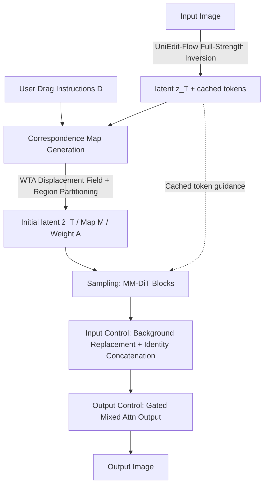

# LazyDrag: Enabling Stable Drag-Based Editing on Multi-Modal Diffusion Transformers via Explicit Correspondence

**Conference**: ICLR 2026  
**OpenReview**: [https://openreview.net/forum?id=PHipCRoSyh](https://openreview.net/forum?id=PHipCRoSyh)  
**Code**: Available on project website (provided in the paper)  
**Area**: Image Generation / Drag-based Editing  
**Keywords**: drag-based editing, MM-DiT, explicit correspondence, attention control, full-strength inversion, training-free  

## TL;DR
LazyDrag replaces the fragile implicit point-matching mechanism in previous drag-based editing methods—which relied on attention similarity—with an "explicit correspondence map" constructed directly from drag instructions. This allows MM-DiT to perform stable editing under **full-strength inversion** for the first time, completely eliminating the need for test-time optimization (TTO) while unlocking high-fidelity completion and text-guided generation.

## Background & Motivation
**Background**: Drag-based editing (a series of diffusion methods following DragGAN) allows users to specify spatial transformations using "handle point $\rightarrow$ target point" pairs. To preserve object identity during editing, mainstream approaches follow the logic of MasaCtrl—sharing key/value tokens in self-attention and relying on attention similarity for **implicit point matching**.

**Limitations of Prior Work**: Implicit matching has a fundamental flaw: attention weights tend to favor **spatial proximity** over **semantic relevance**, leading to unstable editing and progressive degradation. To mask this instability, existing methods either employ **test-time optimization (TTO)** (per-image LoRA fine-tuning + multi-step latent optimization per instruction, which is slow and expensive) or **weaken inversion strength** (low-strength inversion). The costs include unreliable completion, suppressed text guidance, and distorted edits, making complex operations (e.g., opening a dog's mouth and completing the interior, or generating a "tennis ball" from thin air) impossible.

**Key Challenge**: Under full-strength inversion, even slight misalignments in implicit matching are amplified into obvious artifacts. Consequently, previous methods had to choose between "editing precision" and "visual naturalness"—forcing precise alignment produces warping artifacts, while emphasizing naturalness sacrifices localization accuracy.

**Goal**: To address this root cause by developing the first drag-editing method built on MM-DiT that utilizes full-strength inversion across **all sampling steps**, unifying geometric precision with text guidance in a training-free and TTO-free manner.

**Key Insight**: **Replace implicit matching with an explicit correspondence map.** Drag instructions naturally define a deterministic field mapping handle points to target points. By converting this field into an explicit correspondence map and using it to drive attention control directly, editing under full-strength inversion becomes stable. This renders TTO unnecessary and releases the model's inherent generative capabilities (completion, text-guided generation).

## Method

### Overall Architecture
LazyDrag is built on MM-DiT (FLUX.1 Krea-dev) as a training-free two-stage pipeline. First, user drag instructions are converted into an **explicit correspondence map** (containing a mapping function $M$ and a weight function $A$), which is used to construct the initial latent $\hat{z}_T$. Next, this map drives a set of **input-side + output-side** attention controls within the Single-Stream Attention (SS-Attn) layers to preserve the background and identity. The entire pipeline runs under full-strength inversion without any per-image fine-tuning.

### Key Designs

**1. Explicit Correspondence Map Generation (Winner-Takes-All Displacement Field + Region Partitioning): Turning drag instructions into deterministic references.** Let the editable region sampling points be $P=\{p_j\}$ and drag instructions be $D=\{(s_i,e_i)\}$. Previous methods that **averaged** displacements from multiple instructions caused cancellation during adversarial drags (e.g., moving the upper lip up and the lower lip down to open a mouth; averaging results in zero motion at the seam). LazyDrag employs a **Winner-Takes-All (WTA)** strategy: each point $p_j$ is uniquely assigned to the nearest handle based on distance weights $\alpha_j^i=\|p_j-s_i\|_2^{-1}$, forming a Voronoi partition where the final displacement and weight are determined solely by the winning instruction ($i^\star=\arg\max_i \alpha_j^i$). This preserves the full magnitude of adversarial displacements. The displacement field then partitions the latent grid into four regions: Background $R_{bg}$ (static), Target $R_{dst}$ (content transport, identity preservation), Completion $R_{inp}$ (initialized with noise), and Transition $R_{trans}$ (smooth boundaries). The initial latent is constructed as:

$$\hat{z}_T(x)=\begin{cases} z_T(M(x)), & x\in R_{dst}\\ \epsilon(x), & x\in R_{inp}\\ z_T(x), & x\in R_{bg}\cup R_{trans}\end{cases}$$

A key point is using **Gaussian noise** $\epsilon\sim\mathcal{N}(0,I)$ for the completion region rather than BNNI interpolation as in FastDrag. Noise adheres to the diffusion prior, avoiding repetition artifacts from neighbor texture duplication and unlocking high-fidelity, text-guided completion.

**2. Input-Side Attention Control (Background Replacement + Identity Concatenation): Applying different protections via the correspondence map.** In each SS-Attn layer at every step, **hard replacement** is applied to the background region $R_{bg}$—the current tokens are directly replaced with original tokens cached during inversion ($Q, K$ are re-encoded with RoPE, $V$ remains the same), ensuring the background stays "absolutely static." For the target and transition regions $R_{dst}\cup R_{trans}$, **token concatenation** is used: a unified source map $\tilde{M}(x)$ is defined (mapping to $M(x)$ for target and $x$ for transition). The cached key/value from the source are re-encoded and concatenated to the current tokens:

$$K'_x=\text{concat}\big(K_x,\ \text{RoPE}_x(\bar{K}_{\tilde{M}(x)})\big),\quad V'_x=\text{concat}\big(V_x,\ \bar{V}_{\tilde{M}(x)}\big)$$

This provides a strong, map-driven identity signal for attention, ensuring identity preservation while smoothing transitions. This control only acts on SS-Attn layers, avoiding the need for manual layer selection required in U-Net architectures.

**3. Output-Side Gated Mixing (Attn Refine): Concentrating control precision on handle points.** After concatenation, the attention **output** is refined to emphasize handle points. For $x\in R_{dst}$, the current output $y_x$ is mixed with the cached output $\bar{y}_{M(x)}$ via a gating factor:

$$y_x\leftarrow(1-\gamma_{x,t})\,y_x+\gamma_{x,t}\,\bar{y}_{M(x)},\qquad \gamma_{x,t}=h_t\cdot A(x)$$

where $A(x)$ is the pre-computed matching weight and $h_t$ is a time-decaying factor. Since the weight is maximum at handle points, the strongest control is applied where precision is most critical, while surrounding areas relax naturally. This step also eliminates the extra denoising steps required by CharaConsist, fundamentally avoiding the instability of implicit matching under full-strength inversion and saving multi-step latent optimization.

## Key Experimental Results

### Main Results (DragBench, 205 images / 349 point pairs)

| Method | TTO-Req | MD ↓ | SC ↑ | PQ ↑ | O ↑ |
|---|---|---|---|---|---|
| GoodDrag | ✓ | 22.17 | 7.834 | 8.318 | 7.795 |
| DragText (+GoodDrag) | ✓ | 21.51 | 7.992 | 8.227 | 7.886 |
| FastDrag | ✗ | 31.84 | 7.935 | 8.278 | 7.904 |
| Inpaint4Drag | ✗ | 23.68 | 7.802 | 7.961 | 7.615 |
| **LazyDrag (Ours)** | ✗ | **21.49** | **8.205** | **8.395** | **8.210** |

MD represents Mean Distance (lower is more accurate); SC/PQ/O are VIEScore components (rated by GPT-4o, 0–10). LazyDrag achieves the best performance across all metrics **without requiring TTO**, with MD even lower than DragText which requires per-image optimization.

### Ablation Study (Cumulative Ablation, DragBench)

| Configuration | MD ↓ | SC ↑ | PQ ↑ | O ↑ |
|---|---|---|---|---|
| Full Method | 21.49 | 8.205 | 8.395 | 8.210 |
| − WTA − Latent Init | 23.69 | 8.129 | 8.060 | 7.938 |
| − BG Pres. | 24.73 | 7.998 | 8.043 | 7.863 |
| − ID Pres. − Attn Refine | 56.49 | 5.307 | 7.944 | 5.953 |

Removing WTA/Latent Init increases MD and decreases PQ/O. Removing background protection further drops SC/O due to color shifts and artifacts. Replacing map-driven protection with CharaConsist’s implicit matching causes MD to soar to 56.49 and O to collapse to 5.953—confirming that **full-strength inversion is extremely sensitive to mismatches**, and explicit correspondence is the key to stability.

### Key Findings
- **User Study**: In 32 random samples evaluated by 32 experts, LazyDrag was preferred **63.67%** of the time, significantly outperforming all baselines (the next highest was < 7%).
- **Activation Steps**: Using 40 steps for ID Pres./Attn Refine is the sweet spot for accuracy and naturalness; increasing to 50 improves precision but adds warping artifacts, while reducing to 20 causes identity/motion drift.
- **Drag vs. Move Modes**: "Move" mode preserves identity better, while "drag" mode handles 3D rotation/stretching better. Both produce reasonable results, showcasing the flexibility of the explicit map.
- **Inversion Strength**: Only full-strength inversion (strength 1) allows for text-guided generation (e.g., "a tennis ball/apple in the mouth"); lower strengths fail this task.

## Highlights & Insights
- **Precise Diagnosis**: Accurately identifies the root cause of long-standing instability in drag editing as the "unreliability of implicit attention matching." It explains why previous works had to "patch" this with TTO or weak inversion—solving the problem at the root rather than hiding it.
- **Constraints as Resources**: Drag instructions themselves define a deterministic correspondence field; the authors cleverly used this to replace expensive and fragile attention similarity matching, which is the most elegant contribution of the paper.
- **Full-Strength Inversion + Training-Free**: As the first drag method to use full-strength inversion at all sampling steps, it naturally unlocks completion and text-guided generation as "by-products," unifying geometric control and text guidance.
- **WTA replaces Averaging**: Using Voronoi-based Winner-Takes-All solves the old problem of adversarial drags canceling each other out—a simple but highly effective fix.

## Limitations & Future Work
- **Dependency on MM-DiT**: One prerequisite for the method's success is the inversion robustness brought by MM-DiT's tighter visual-textual fusion; migrating back to U-Net may not yield the same benefits (U-Net ablations are in the appendix).
- **Limited Matching Strategies**: Currently supports translation, scaling, and drag-mode elastic deformation. Richer matching like 2D rotation is not yet covered and is listed as future work.
- **Mode Trade-offs**: In "drag" mode, detailed texture preservation may slightly decrease during large geometric transforms, while "move" mode struggles with rotation/stretching, requiring users to select modes based on the scene.
- **Evaluation Dependency on MLLM**: VIEScore is rated by GPT-4o. Although the mean of three runs is taken, it still carries the inherent biases and uncertainties of MLLM evaluators.

## Related Work & Insights
- **Evolution of Implicit Matching**: MasaCtrl (sharing K/V in U-Net) $\rightarrow$ DiTCtrl (simple sharing in MM-DiT, failed) $\rightarrow$ CharaConsist (re-encoding injected alignment tokens, but relies on similarity matching and is fragile under full inversion). LazyDrag begins where CharaConsist fails, "correcting" this lineage with explicit maps.
- **TTO-free Drag**: FastDrag (displacement field + MasaCtrl-style replacement, but interpolation causes artifacts and averaging fails under adversarial drags), Inpaint4Drag (built on inpainting models, sensitive to masks and prone to warping). LazyDrag chooses an inversion-based generative route, avoiding the boundary artifacts of inpainting-based methods.
- **Insight**: When the task input inherently contains exploitable structure (here, the deterministic field defined by dragging), explicitly injecting it is often more stable, efficient, and capable of unlocking additional features than trying to learn or estimate an implicit correspondence.

## Rating
- **Novelty**: ⭐⭐⭐⭐⭐ The first MM-DiT drag editor and the first full-strength inversion drag method. Replacing implicit matching with explicit correspondence maps is a clean solution to a long-standing pain point.
- **Experimental Thoroughness**: ⭐⭐⭐⭐ DragBench SOTA + cumulative ablations + user study + multi-angle analysis of activation steps/modes/strengths. The evidence chain is complete; the only downside is the heavy reliance on GPT-4o for evaluation on a single benchmark.
- **Writing Quality**: ⭐⭐⭐⭐ Logical progression from diagnosis to motivation to method. Figure 3 provides a clear pipeline description, though some contribution claims are slightly repetitive.
- **Value**: ⭐⭐⭐⭐⭐ Unifying geometric control, text guidance, and high-fidelity completion into a single training-free and TTO-free framework represents a paradigm shift toward practical drag-based editing.

<!-- RELATED:START -->

## Related Papers

- [\[ICLR 2026\] Routing Matters in MoE: Scaling Diffusion Transformers with Explicit Routing Guidance](routing_matters_in_moe_scaling_diffusion_transformers_with_explicit_routing_guid.md)
- [\[ICLR 2026\] DragFlow: Unleashing DiT Priors with Region Based Supervision for Drag Editing](dragflow_unleashing_dit_priors_with_region_based_supervision_for_drag_editing.md)
- [\[ICLR 2026\] MOSAIC: Multi-Subject Personalized Generation via Correspondence-Aware Alignment and Disentanglement](mosaic_multi-subject_personalized_generation_via_correspondence-aware_alignment_.md)
- [\[ICLR 2026\] Multi-Subspace Multi-Modal Modeling for Diffusion Models: Estimation, Convergence and Mixture of Experts](multi-subspace_multi-modal_modeling_for_diffusion_models_estimation_convergence_.md)
- [\[ICCV 2025\] Rethinking Cross-Modal Interaction in Multimodal Diffusion Transformers](../../ICCV2025/image_generation/rethinking_cross-modal_interaction_in_multimodal_diffusion_transformers.md)

<!-- RELATED:END -->
