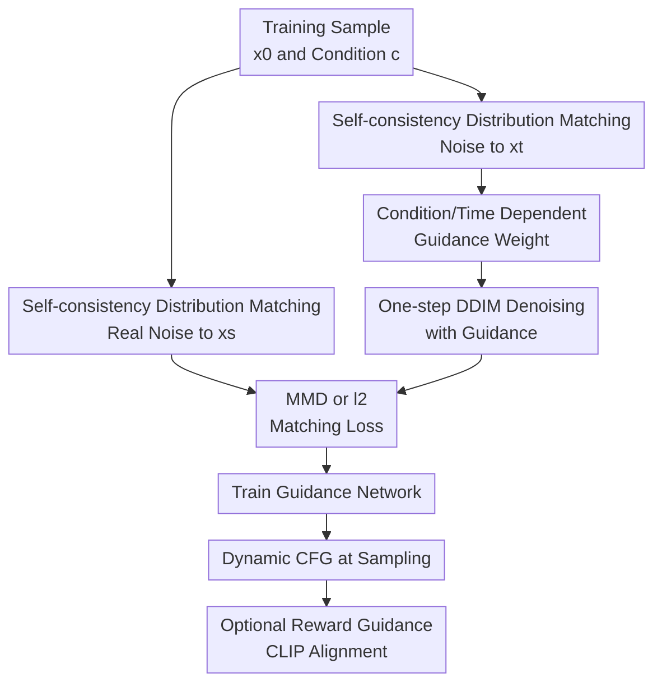

# Learn to Guide Your Diffusion Model

**Conference**: ICLR2026  
**OpenReview**: [https://openreview.net/forum?id=l8XOk4ylBH](https://openreview.net/forum?id=l8XOk4ylBH)  
**Code**: Not released  
**Area**: Diffusion Models / Image Generation  
**Keywords**: classifier-free guidance, adaptive guidance, self-consistency, MMD, text-to-image generation  

## TL;DR
This paper learns the manually set fixed guidance scale in Classifier-Free Guidance (CFG) as a function of the condition and the denoising time interval. The function is trained using self-consistency distribution matching. It achieves a better trade-off between sample quality, distribution matching, and prompt alignment in ImageNet, CelebA, and text-to-image generation compared to fixed CFG or limited interval guidance.

## Background & Motivation

**Background**: Diffusion models have become the mainstream framework for generative tasks such as images, videos, and proteins. Conditional generation typically relies on a conditional denoiser to restore target samples from noise step by step. In practical large-scale models, Classifier-Free Guidance (CFG) is almost the default tool: it multiplies the difference between the conditional and unconditional denoisers by a weight $\omega$ and adds it back to the conditional prediction to push the generation closer to the conditioning signal.

**Limitations of Prior Work**: The issue with CFG is not its effectiveness but its nature as a heuristic "tuning knob." A large fixed $\omega$ often significantly improves visual quality and condition recognizability, but it also pushes samples toward the edges of the distribution, causing over-saturation, mode shift, or inconsistency with the real conditional distribution. Existing works use inference-time correction methods like SMC or MCMC to strictly correct the distribution bias of CFG, but these are too computationally heavy for large-scale image generation and difficult to use as standard sampling components.

**Key Challenge**: Traditional theoretical interpretations of CFG often view it as sampling from a target distribution enhanced by conditional likelihood, but subsequent analysis shows that standard CFG sampling is not truly equivalent to this target distribution. Conversely, many experiments repeatedly show that moderate guidance reduces FID, suggesting that CFG in practice might be compensating for the approximation errors of pre-trained denoisers rather than strictly sampling a hand-crafted tilted distribution. This implies that what is truly needed is not a fixed-strength "enhanced condition" but a guidance strategy that corrects model errors across different conditions and time segments.

**Goal**: The authors aim to learn a guidance weight function $\omega_{c,(s,t)}$ without retraining the base diffusion model. It depends not only on the condition $c$ but also on the interval denoising from time $t$ to $s$. This allows for varying intensities at different stages of the sampling trajectory and different strategies for various categories or text prompts.

**Key Insight**: A reasonable reverse diffusion process must satisfy consistency: if a real clean sample $x_0$ is diffused to $x_t$ and then denoised back to $x_s$ via the reverse process, the resulting distribution of $x_s$ should match the distribution obtained by directly diffusing $x_0$ to $x_s$. This condition provides a supervisory signal for training guidance weights, requiring only existing training data, frozen conditional/unconditional denoisers, and a samplable noise process.

**Core Idea**: Replace the manually tuned guidance scale with self-consistency distribution matching between the "real noise distribution" and the "one-step reverse denoising distribution with learnable CFG," allowing the diffusion model to learn when, for which condition, and how much guidance to apply.

## Method

### Overall Architecture

The paper assumes a pre-trained conditional denoiser $\hat{x}_\theta(x_t,c)$ and an unconditional denoiser $\hat{x}_\theta(x_t,\emptyset)$ are available, with base model parameters kept frozen. The only component to be trained is a small guidance network that takes condition representations and a time pair $(s,t)$ as input and outputs a non-negative scalar $\omega_{c,(s,t)}$. During sampling, the original CFG formula changes from a fixed $\omega$ to a dynamic weight: $\hat{x}_\theta(x_t,c;\omega)=\hat{x}_\theta(x_t,c)+\omega_{c,(s,t)}(\hat{x}_\theta(x_t,c)-\hat{x}_\theta(x_t,\emptyset))$.

Training does not require running full reverse trajectories. For each training sample $(x_0,c)$, a real target sample $x_s\sim p_{s|0}(\cdot|x_0)$ is directly sampled via noise addition. Simultaneously, the same $x_0$ is diffused to a higher noise level $t$, and the denoiser with learnable weights performs one-step denoising from $t$ to $s$ to obtain a proposal sample $\tilde{x}_s(\omega)$. If the guidance is learned correctly, these two sets of $x_s$ should be close in distribution.

### Key Designs

**1. Self-consistency distribution matching: Learning guidance as a corrector**

The authors start from a weak marginal consistency: the marginal distribution $p_s$ of the real diffusion process at time $s$ should be obtainable by diffusing to $t$ and then correctly denoising back to $s$. While matching the guided marginal distribution $p^{t,(\theta,\omega)}_s$ to $p_s$ is theoretically sound, it requires large-scale marginalization over different samples and conditions, leading to high gradient variance and poor practical results.

Therefore, the paper adopts a stronger, lower-variance self-consistency condition. After fixing a training sample and condition $(x_0,c)$, two paths are compared: the first is direct noise addition from $x_0$ to $x_s$; the second is noise addition from $x_0$ to $x_t$ followed by using the guided denoiser to move from $t$ to $s$. The goal is to ensure:

$$
p^{t,(\theta,\omega)}_{s|0,c}(\cdot|x_0,c) \approx p_{s|0}(\cdot|x_0).
$$

This condition is stricter than marginal consistency as it requires one-step reverse transitions near each specific sample to match the real noise distribution; however, it provides a clear, local, and low-variance training signal for the guidance network. Intuitively, the model is not learning vague preferences for "making images look better," but rather learning: when the conditional and unconditional denoisers provide a specific differential direction, how much should we push along that direction to make the one-step reverse distribution more like the real diffusion chain.

**2. Condition/Time-dependent guidance weights: Replacing fixed scales**

Standard CFG uses a single global $\omega$, or at most a manual scheduler to vary it over time. This paper defines the weight as $\omega_{c,(s,t)}$, which considers condition $c$, target time $s$, and current time $t$. The key benefit is changing "all conditions on the same sampling schedule use the same intensity" to "different categories or prompts can have different trajectories." This aligns with experimental observations: in ImageNet, the "prairie chicken" class learns almost zero guidance, while "paintbrush" requires stronger guidance over longer intervals. Prompt-specific guidance curves in COCO also vary significantly.

Implementation-wise, $\omega_{c,(s,t)}$ is output by a lightweight MLP with a ReLU at the end to ensure non-negativity. For ImageNet/CelebA, time is converted to log SNR and encoded by a small MLP. For text-to-image, the network receives time embeddings, CLIP text embeddings, and T5 text embeddings. The base diffusion model is completely frozen, so training involves learning a scalar policy network outside the existing model, adding only one inexpensive MLP forward pass per sampling step.

**3. MMD objective vs simplified l2 objective: Trade-offs between distribution matching and cost**

To compare the distribution of real samples $x_s$ and guided proposals $\tilde{x}_s(\omega)$, the paper primarily uses energy-kernel MMD. The empirical loss consists of two parts: one part pulls proposal particles toward real particles, and the other uses distances between proposal particles to avoid simple collapse. Omitting terms independent of $\omega$, the core form is:

$$
\hat{L}_{\beta,\lambda}(\phi)=\frac{1}{n}\sum_i\left[\frac{1}{m^2}\sum_{j,k}\|\tilde{x}^{j}_{s_i}(\omega_\phi)-x^{k}_{s_i}\|_2^{\beta}-\frac{\lambda}{2m(m-1)}\sum_{j\ne k}\|\tilde{x}^{j}_{s_i}(\omega_\phi)-\tilde{x}^{k}_{s_i}(\omega_\phi)\|_2^{\beta}\right].
$$

The paper also investigates a cheaper special case: letting $\beta=2, \lambda=0$ leads to a simple $\ell_2$ matching $L_{\ell_2}=\mathbb{E}\|\tilde{x}_s(\omega)-x_s\|_2^2$. This objective avoids the quadratic complexity of MMD particle interactions but is more sensitive to hyperparameters in experiments. Results show that the full self-consistency MMD objective is generally the most stable, though the simplified $\ell_2$ also works, indicating that the core benefit comes from training guidance with real diffusion consistency rather than a specific loss trick.

**4. Reward-guided extension: CLIP alignment as a controllable bias**

Beyond approximating the original conditional distribution, the authors consider a practical scenario: a user provides a reward function $R(x_0,c)$ and wants the generated samples to bias toward high-reward regions. In text-to-image, the reward can be a CLIP score measuring alignment between images and prompts. Since direct reward maximization is prone to reward hacking, the paper adds a reward term to the self-consistency loss: $L_{tot}(\phi)=\hat{L}_{\beta,\lambda}(\phi)+\gamma_R L_R(\phi)$.

The significance of this extension is that it transforms CFG from a fixed prompt enhancement knob into a learnable inference-time controller. The self-consistency term constrains the trajectory from straying too far from the real diffusion process, while the reward term pushes some probability mass toward regions better aligned with external preferences. In COCO experiments, adding CLIP reward matches the CLIP score of strong CFG baselines while maintaining a lower FID than manual schedulers, suggesting this regularized reward optimization is gentler than simply increasing fixed CFG scales.

### Loss & Training

The training workflow consists of four steps. First, sample a batch of clean samples and conditions $(x_0,c)$. Second, sample target time $s\sim U[S_{min},1-\zeta-\delta]$, and then sample interval $\Delta t\sim U[\delta,1-\zeta-s]$, setting $t=s+\Delta t$. Third, for each sample, draw $m$ real particles $x_s\sim p_{s|0}(\cdot|x_0)$, while drawing $m$ particles $x_t\sim p_{t|0}(\cdot|x_0)$ and performing one-step guided DDIM denoising to obtain $\tilde{x}_s(\omega)$. Fourth, update guidance network parameters $\phi$ using MMD or $\ell_2$ loss.

A counter-intuitive but important detail is that the training time interval $\delta$ should not be too small. Although 100 or 128-step sampling in inference implies step sizes of about $0.01$, ImageNet ablations show that using larger intervals during training, such as $\delta\approx0.1$, yields better results. The authors speculate that larger $|t-s|$ provides more stable and informative gradients, which the smooth guidance network generalizes to smaller steps during inference.

## Key Experimental Results

### Main Results

| Dataset / Task | Method | Guidance Setting | FID ↓ | Other Metrics |
|--------|------|------|------|------|
| ImageNet 64×64 | Unguided | $\omega=0$ | 4.46 | IS 43.52 |
| ImageNet 64×64 | Constant guidance | $\omega=0.25$ | 2.40 | IS 66.72 |
| ImageNet 64×64 | Limited interval guidance | $\omega(t)=0.95, t\in[0.2,0.8]$ | 2.11 | IS 71.60 |
| ImageNet 64×64 | Self-consistency | $\omega^\phi_{c,(s,t)}$ | **1.99** | IS 73.62 |
| CelebA 64×64 | Unguided | $\omega=0$ | 2.44 | IS 2.94 |
| CelebA 64×64 | Limited interval guidance | $\omega(t)=0.7, t\in[0.0,0.8]$ | 2.37 | IS 2.96 |
| CelebA 64×64 | Self-consistency | $\omega^\phi_{c,(s,t)}$ | **2.10** | IS **2.98** |
| MS COCO 512×512 | Unguided | $\omega=0$ | 24.74 | CLIP 0.278 |
| MS COCO 512×512 | Constant guidance | $\omega=7.5$ | 31.20 | CLIP 0.306 |
| MS COCO 512×512 | Self-consistency | $\omega^\phi_{cCLIP,cT5,(s,t)}$ | **18.01** | CLIP 0.295 |
| MS COCO 512×512 | Self-consistency + CLIP reward | Same + reward | 28.37 | CLIP **0.306** |

### Ablation Study

| Ablation Item | Configuration | Result | Explanation |
|------|------|------|------|
| $\beta$ for ImageNet | $\beta=0.1/0.5/1.0/1.5/1.75$ | FID ~1.98–2.07 | $\beta\in[1,1.75]$ is stable; best FID at $\beta=1.0$ (1.98) |
| Particle count $m$ | $m=2/4/8/16$ | FID ~1.99–2.00 | FID insensitive for $m\ge4$ |
| T2I Conditions | CLIP+T5 / CLIP / T5 | CLIP reward FID 28.28–28.63 | Small differences; CLIP slightly better for alignment |
| T2I MLP Width | 6M small / 12M wide / 12M resid | FID 28.37 / 28.41 / 28.68 | Larger network yields no obvious gain |
| ImageNet Interval | $\delta=0.01/0.1/0.2/0.3$ | Small $\delta$ is worse | Larger denoising spans provide more stable signals |
| Stable Diffusion-v1.5 | constant vs learned | learned+reward FID 19.36 | Lowers FID on off-the-shelf SD-v1.5, though CLIP still slightly lower than strong CFG |

### Key Findings

- Learned guidance does not simply replicate Limited Interval Guidance. On ImageNet, it is often positive in middle time segments, but curve intensities and shapes vary significantly across categories, indicating condition dependence is not superficial.
- The self-consistency objective outperforms unguided, constant guidance, and LIG in FID for both ImageNet and CelebA, showing that learning $\omega_{c,(s,t)}$ improves distribution quality rather than just condition discriminability.
- On COCO, pure self-consistency yields the lowest FID (18.01) but lower CLIP scores than strong CFG; adding CLIP reward raises CLIP score to 0.306 while increasing FID to 28.37. This reveals the actual trade-off between quality and prompt alignment.
- Ablations of $m$ and MLP capacity show the method does not rely on large auxiliary networks; training and inference costs are negligible compared to the base diffusion model.
- MoG experiments explain that CFG acts as a corrector: when the base model is already accurate, learned guidance remains near 0; when the base model is under-trained, learned guidance increases to correct the mismatch between generated and data distributions.

## Highlights & Insights

- Converting CFG from an empirical hyperparameter to a learnable function is the paper's most direct contribution. It acknowledges that fixed scales are effective but coarse, then uses the diffusion process's own consistency to find supervisory signals for that scale.
- The self-consistency objective is clever in avoiding the matching of full generation distributions. Matching trajectories or full marginals is computationally heavy, whereas this method's one-step $t\rightarrow s$ local matching creates a reusable inference-time guidance network.
- Condition-dependent guidance shows that the upper limit of manual schedulers is naturally constrained because they assume all conditions share the same curve.
- The reward extension connects the method to RLHF/reward-guided generation while maintaining the regularization of diffusion distribution matching. This is more stable than using CLIP score as the sole objective and explains how to achieve controllable trade-offs.
- The framework is transferable to other guidance forms. By replacing the definition of the guided denoiser, it can theoretically be combined with CFG++, negative guidance, flow matching guidance, or other dynamic techniques.

## Limitations & Future Work

- The self-consistency condition is stricter than required for marginal consistency. While effective in experiments, it might theoretically exclude reasonable reverse processes that are only correct at the marginal level but do not match local conditions perfectly.
- Training requires access to the training data and both conditional/unconditional branches of the frozen diffusion model. It cannot be directly applied to black-box generation APIs.
- Text-to-image results show that minimum FID and maximum CLIP score do not coincide. The choice of reward term and its weight $\gamma_R$ still requires careful tuning.
- Hyperparameters for $p(s,t)$, especially $\delta$, affect results. Even with the empirical conclusions provided, these might need re-searching for different samplers, noise parameterizations, or resolutions.
- Evaluations are primarily based on FID, IS, and CLIP score. Modern T2I quality dimensions like over-saturation, local artifacts, complex prompt composition, and long-text consistency still require more granular human or automated evaluation.

## Related Work & Insights

- **vs. Original CFG**: Original CFG uses a fixed $\omega$ for linear weightings. This paper keeps the direction but makes the intensity $\omega_{c,(s,t)}$ a learned policy.
- **vs. Limited Interval Guidance (LIG)**: LIG posits that guidance should only be applied in specific intervals. Learned results naturally show similar mid-interval activation, but the curve is data-driven and category-specific rather than manually specified.
- **vs. Clamp-linear guidance schedule**: Clamp-linear uses preset functions. The learned approach requires extra training but achieves better FID on ImageNet/COCO and captures prompt-specific behaviors.
- **vs. SMC/MCMC CFG correction**: SMC/MCMC methods provide strict inference correction at high cost. This method distills correction power into a cheap scalar policy network suitable for large-scale generation.
- **Score matching for guidance**: The paper analyzes why directly putting a guided denoiser into standard denoising regression objectives fails: if the denoiser already approximates $\mathbb{E}[x_0|x_t,c]$, optimal guidance collapses to 0. Self-consistency sidesteps this by focusing on whether the guided reverse transition produces a distribution consistent with the real noise chain.

## Rating

- Novelty: ⭐⭐⭐⭐☆ Learning CFG scale as a condition/time-dependent function with self-consistency training is a clear advancement, though still built on the CFG linear difference framework.
- Experimental Thoroughness: ⭐⭐⭐⭐☆ Covers ImageNet, CelebA, COCO, SD-v1.5 and MoG with extensive ablations; human evaluation for modern T2I could be more robust.
- Writing Quality: ⭐⭐⭐⭐☆ Tight connection between theoretical motivation, algorithm, and experiments; appendix provides ample detail.
- Value: ⭐⭐⭐⭐⭐ Highly valuable for diffusion guidance engineering, providing a low-cost, reward-integrable adaptive guidance path.

<!-- RELATED:START -->

## Related Papers

- [\[ICLR 2026\] Evolutionary Caching to Accelerate Your Off-the-Shelf Diffusion Model](evolutionary_caching_to_accelerate_your_off-the-shelf_diffusion_model.md)
- [\[ICLR 2026\] One Step Further with Monte-Carlo Sampler to Guide Diffusion Better](one_step_further_with_monte-carlo_sampler_to_guide_diffusion_better.md)
- [\[ICML 2026\] Let EEG Models Learn EEG](../../ICML2026/image_generation/let_eeg_models_learn_eeg.md)
- [\[ICLR 2026\] Deconstructing Guidance: A Semantic Hierarchy for Precise Diffusion Model Editing](deconstructing_guidance_a_semantic_hierarchy_for_precise_diffusion_model_editing.md)
- [\[ICLR 2026\] When Scores Learn Geometry: Rate Separations under the Manifold Hypothesis](when_scores_learn_geometry_rate_separations_under_the_manifold_hypothesis.md)

<!-- RELATED:END -->
