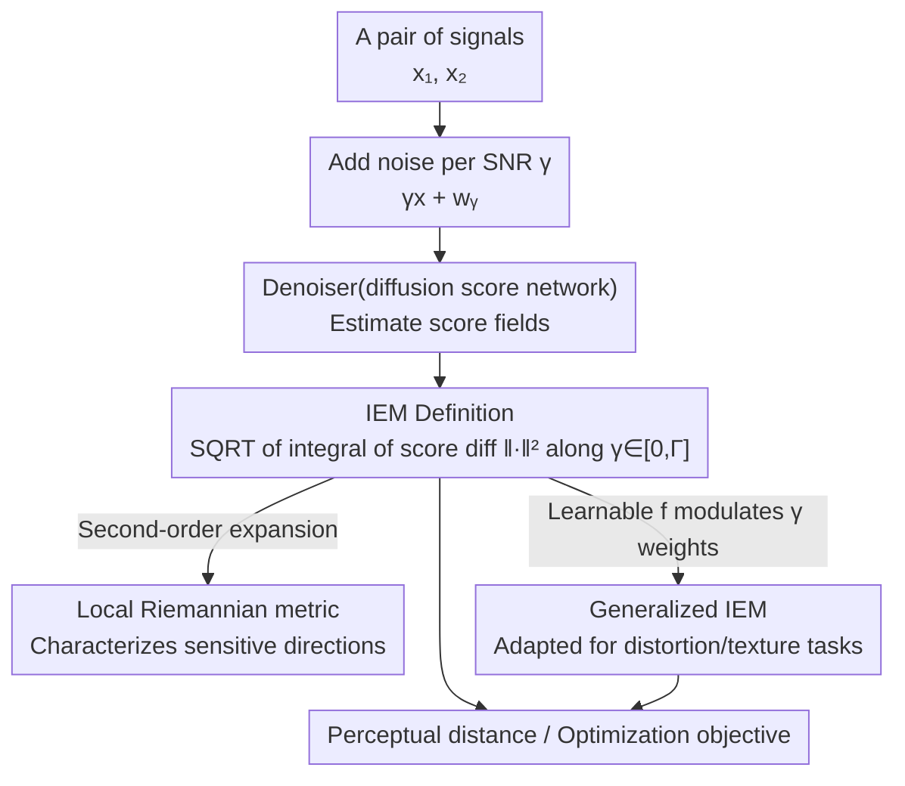

# Learning a Distance Measure from the Information-Estimation Geometry of Data

**Conference**: ICLR 2026  
**arXiv**: [2510.02514](https://arxiv.org/abs/2510.02514)  
**Code**: [GitHub](https://github.com/ohayonguy/information-estimation-metric)  
**Area**: Metric Learning / Perceptual Quality Assessment  
**Keywords**: Information estimation metric, denoising error, probability density geometry, perceptual distance, diffusion models

## TL;DR
The paper proposes the Information-Estimation Metric (IEM), a novel distance function induced by the geometry of data probability density. By comparing score vector fields across various noise levels to measure signal distance, the unsupervised IEM achieves performance comparable to supervised methods in predicting human perceptual judgments.

## Background & Motivation
- Distance functions are core tools in science and engineering, yet perceptual distance for natural signals (e.g., images) lacks a precise mathematical definition.
- Existing state-of-the-art perceptual metrics (LPIPS, DISTS) rely on expensive human-annotated data for training and suffer from poor interpretability.
- Information-theoretic quantities (e.g., mutual information) are insensitive to the global geometry of the density, whereas estimation-theoretic quantities (e.g., denoising error) are directly related to density geometry.
- The relationship between denoising error and the score function (Tweedie-Miyasawa formula) is the foundation of diffusion models—can this relationship be leveraged to construct a perceptual metric?

## Method

### Overall Architecture
The paper addresses a challenging problem: perceptual distance for natural signals (like images) has long lacked a precise mathematical definition, and the best current perceptual metrics (LPIPS, DISTS) are learned from vast amounts of human annotations. The Core Idea of IEM is to bypass the signals themselves and instead compare the "probability density geometry" where two signals reside after being blurred by noise. The computational chain involves adding noise to a pair of signals $\boldsymbol{x}_1, \boldsymbol{x}_2$ across a range of signal-to-noise ratios (SNR) $\gamma$, using a trained denoiser (i.e., the score network in a diffusion model) to estimate the score vector fields (gradients of the log-density) at both points, taking their difference, and integrating along $\gamma$ from 0 to an upper bound $\Gamma$. The square root of this integral yields the distance. Its theoretical foundation is the pointwise I-MMSE formula—the log-probability of a signal can be decomposed into the denoising errors of an optimal denoiser across different SNRs. Thus, the score network naturally computes this distance without requiring any human annotation.

### Key Designs

**1. IEM Definition: Establishing distance on density geometry rather than pixel differences**

The root cause of the difficulty in defining perceptual distance is that images close in pixel space may appear very different to the human eye, and vice versa. IEM's approach is to avoid the signals themselves and compare the difference in the score fields of the densities where two points $\boldsymbol{x}_1, \boldsymbol{x}_2$ reside at various noise levels, integrating over the SNR $\gamma$ up to a limit $\Gamma$:

$$\text{IEM}(\boldsymbol{x}_1, \boldsymbol{x}_2, \Gamma) = \left(\int_0^\Gamma \mathbb{E}\left[\|\nabla \log p_{\mathbf{y}_\gamma}(\gamma \boldsymbol{x}_1 + \mathbf{w}_\gamma) - \nabla \log p_{\mathbf{y}_\gamma}(\gamma \boldsymbol{x}_2 + \mathbf{w}_\gamma)\|^2\right] d\gamma\right)^{1/2}$$

where $\gamma$ is the SNR and $\mathbf{w}_\gamma$ is the Wiener process noise. Since the score function can be represented exactly by the denoising error (Tweedie–Miyasawa relationship), the distance can be calculated by substituting a trained denoiser and performing numerical integration over the 1D $\gamma$. Consequently, the semantics of the distance are entirely determined by the geometry of the data distribution rather than manually designed features.

**2. Metric Properties: Proving it is a mathematically valid distance**

A metric used as an optimization target must satisfy symmetry, non-negativity, positive definiteness, and the triangle inequality; otherwise, pathological cases like "A is similar to B, B is similar to C, but the distance between A and C suddenly explodes" may occur. The paper proves that for any $\Gamma > 0$, IEM satisfies all four properties. Crucially, when the prior density is Gaussian and $\Gamma \to \infty$, it degenerates into the classic Mahalanobis distance $\text{IEM} = \sqrt{(\boldsymbol{x}_1 - \boldsymbol{x}_2)^\top \Sigma^{-1} (\boldsymbol{x}_1 - \boldsymbol{x}_2)}$. This closed-form solution serves as a validation of theoretical consistency and demonstrates that IEM "relaxes" along directions of high covariance and "tightens" along directions of low covariance, matching human sensitivity patterns to natural signals.

**3. Local Riemannian Metric: Characterizing sensitive directions near each point**

By performing a second-order expansion of the squared IEM at a certain point, a local Riemannian metric tensor $\boldsymbol{G}(\boldsymbol{x}, \Gamma)$ can be derived:

$$\boldsymbol{G}(\boldsymbol{x}, \Gamma) = \int_0^\Gamma \gamma^2 \mathbb{E}\left[(\nabla^2 \log p_{\mathbf{y}_\gamma}(\gamma \boldsymbol{x} + \mathbf{w}_\gamma))^2\right] d\gamma$$

The intuition is that the metric is more sensitive in regions with the highest log-density curvature and in perturbation directions that cause significant changes in signal probability. This explains why IEM reacts strongly to perturbations deviating from the data manifold (such as unstructured noise) while being relatively tolerant of subtle changes along the manifold—it is this anisotropy that aligns it with human perception. Note that this is a one-way relationship: IEM derives $\boldsymbol{G}$ from the global distance, but IEM itself is not equivalent to the geodesic distance induced by $\boldsymbol{G}$.

**4. Generalized IEM: Adapting to different perceptual tasks with learnable weights**

A single fixed IEM struggles to excel simultaneously in distortion assessment and texture similarity, which are conflicting requirements (the former requires sensitivity to local deviations, while the latter requires sensitivity to global statistics). To address this, a second-order differentiable scalar function $f$ is introduced to modulate the weights of score differences at various SNRs, resulting in the generalized $\text{IEM}_f$. Although $\text{IEM}_f$ is generally no longer a strict metric (potentially violating symmetry or the triangle inequality), this is not a drawback for many applications. $f$ can be selected manually (e.g., the quadratic $\text{IEM}_{sq}$ favoring texture statistics) or fitted as $f_\omega$ using a small amount of annotated data, allowing the same framework to achieve strong results across all datasets.

### Loss & Training
The denoiser employs an Hourglass Diffusion Transformer (HDiT), trained on ImageNet-1k 256×256 using standard MSE denoising loss. Noise levels are sampled according to a log-uniform schedule to cover a wide SNR range. Notably, the training phase only learns denoising and does not encounter any perceptual annotations; to compute the IEM, the denoiser is substituted into the definition, and numerical integration over the 1D $\gamma$ is performed.

## Key Experimental Results

### Main Results (Correlation between SRCC and Human MOS)

| Method | Supervised? | TID2013 | LIVE | CSIQ | TQD (Texture) |
|------|---------|---------|------|------|-----------|
| PSNR | No | 0.69 | 0.87 | 0.81 | 0.34 |
| SSIM | No | 0.64 | 0.91 | 0.82 | 0.51 |
| LPIPS | Yes | 0.71 | 0.94 | 0.88 | 0.48 |
| DISTS | Yes | 0.83 | 0.95 | 0.93 | **0.83** |
| TOPIQ | Yes | **0.86** | **0.97** | **0.95** | 0.67 |
| **IEM (Unsupervised)** | **No** | **0.83** | **0.96** | **0.94** | 0.51 |
| **IEM_sq (Unsupervised)** | **No** | 0.66 | 0.82 | 0.79 | **0.79** |
| **IEM_fω (Supervised f)** | **Partial** | **0.84** | **0.96** | **0.94** | **0.77** |

### Ablation Study (Max Differentiation Competition)

| Operation | IEM Results | DISTS Results | Explanation |
|------|---------|-----------|------|
| Metric Minimization (PSNR=10dB) | High quality, no artifacts | Obvious artifacts | IEM is more robust as an optimization target |
| Metric Maximization (PSNR=10dB) | Unstructured noise | Patterned artifacts | IEM is most sensitive to perturbations deviating from data support |

### Key Findings
- Unsupervised IEM competes with the best supervised methods on TID2013/LIVE/CSIQ (SRCC 0.83-0.96).
- $\text{IEM}_{sq}$ performs excellently in texture similarity (TQD); the choice of $f$ controls sensitivity to global vs. local distortion.
- Learning $f_\omega$ allows for strong results across all datasets simultaneously.
- Images generated by IEM minimization are artifact-free, indicating it can serve as an independent optimization target.

## Highlights & Insights
- The deep connection between information theory and estimation theory provides a principled foundation for constructing perceptual metrics.
- The degeneration to the Mahalanobis distance in the Gaussian case provides an elegant theoretical anchor.
- Isocontours can be non-connected (in Gaussian mixture cases), reflecting the metric's adaptation to the global geometry of density.
- Provides a breakthrough solution for the fundamental problem of deriving perceptual metrics from unannotated data.

## Limitations & Future Work
- High computational cost: Requires running the denoiser across multiple SNR levels and performing integration, which is much slower than LPIPS.
- The choice of the hyperparameter $\Gamma$ lacks a systematic principle.
- Currently only validated on 256×256 images.
- Applications as an optimization target (e.g., image restoration, compression) remain to be explored.

## Related Work & Insights
- Built upon the I-MMSE formula (Guo et al. 2005) and the Tweedie-Miyasawa formula.
- Shares a theoretical basis with diffusion models (score function = denoising error) but serves a different purpose.
- Provides a new perspective for unsupervised feature learning and metric learning.
- Potential to be extended to other continuous signal domains such as audio.

## Technical Details
- The denoiser uses an Hourglass Diffusion Transformer (HDiT), which scales linearly with image resolution.
- Trained on ImageNet-1k 256×256 with a log-uniform noise level schedule.
- Under a Gaussian prior, IEM = Mahalanobis distance, which has a closed-form solution.
- Examples with a Laplace prior demonstrate the differentiated local sensitivity of IEM along probability density ridges.
- $\Gamma=1/4$ performs best on standard IQA benchmarks, while $\Gamma=10^6$ performs best on texture datasets.
- IEM minimization as an optimization target is artifact-free, surpassing supervised methods like DISTS.
- Mismatched IEM can be used to evaluate differences between various generative models.
- Code is open-sourced, containing full details for denoiser training, IEM calculation, and experimental reproduction.

## Rating
- Novelty: ⭐⭐⭐⭐⭐ Outstanding theoretical contribution by deriving perceptual metrics from information-estimation theory.
- Experimental Thoroughness: ⭐⭐⭐⭐ Comprehensive benchmark comparisons and visualization analysis, though large-scale applications are missing.
- Writing Quality: ⭐⭐⭐⭐⭐ Rigorous and elegant theoretical derivation, with intuitive and powerful illustrations.
- Value: ⭐⭐⭐⭐⭐ Provides a completely new theoretical framework for perceptual metric learning.

<!-- RELATED:START -->

## Related Papers

- [\[ICLR 2026\] The Spacetime of Diffusion Models: An Information Geometry Perspective](the_spacetime_of_diffusion_models_an_information_geometry_perspective.md)
- [\[NeurIPS 2025\] MMG: Mutual Information Estimation via the MMSE Gap in Diffusion](../../NeurIPS2025/image_generation/mmg_mutual_information_estimation_via_the_mmse_gap_in_diffusion.md)
- [\[AAAI 2026\] Diffusion Reconstruction-Based Data Likelihood Estimation for Core-Set Selection](../../AAAI2026/image_generation/diffusion_reconstruction-based_data_likelihood_estimation_for_core-set_selection.md)
- [\[ICLR 2026\] Efficient Sliced Wasserstein Distance Computation via Adaptive Bayesian Optimization](efficient_sliced_wasserstein_distance_computation_via_adaptive_bayesian_optimiza.md)
- [\[ICLR 2026\] Monocular Normal Estimation via Shading Sequence Estimation](monocular_normal_estimation_via_shading_sequence_estimation.md)

<!-- RELATED:END -->
