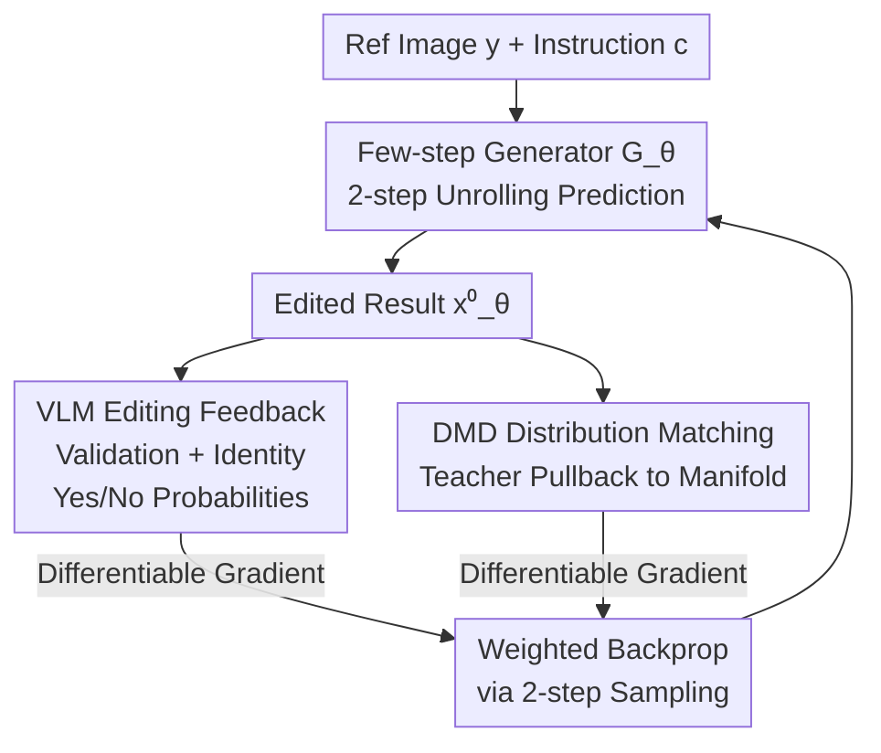

# Learning an Image Editing Model without Image Editing Pairs

**Conference**: ICLR 2026  
**OpenReview**: [https://openreview.net/forum?id=OHqZ61ZqNO](https://openreview.net/forum?id=OHqZ61ZqNO)  
**Code**: None  
**Area**: Diffusion Models / Image Editing  
**Keywords**: Image editing, unpaired training, VLM feedback, distribution matching distillation, few-step diffusion

## TL;DR
Ours proposes NP-Edit (No-Pair Edit), a training paradigm that **requires no "before-after" image pairs**. It unrolls a few-step diffusion generator during training, utilizes differentiable gradient feedback from a Vision-Language Model (VLM) to judge instruction following and content preservation, and employs Distribution Matching Distillation (DMD) to pull outputs back to the real image manifold. Under a 4-step sampling setting, it matches models trained on large-scale paired data and outperforms RL-based methods like Flow-GRPO that also use VLM rewards.

## Background & Motivation

**Background**: Instruction-based image editing (e.g., "change the background to grass") currently relies on Supervised Fine-Tuning (SFT), which requires triplets of "input image + instruction + target edited image" to learn the mapping.

**Limitations of Prior Work**: **Paired data is extremely difficult to scale.** Pixel-aligned real-world pairs for the same scene are nearly non-existent. Prior attempts include: ① synthesizing pairs using pre-trained models (InstructPix2Pix), which causes the final model to inherit or amplify quirks/artifacts from the base model; ② extracting frames from videos, which is limited by natural motion and alignment issues; ③ manual creation, which is labor-intensive and non-scalable.

**Key Challenge**: Supervision for editing tasks naturally exists as "target images," but **target images are exactly what is hardest to obtain.** Using synthetic targets limits the model quality to the generator's ceiling.

**Goal**: Completely bypass the need for "target edited images" and find a source of supervision that does not rely on pixel-level ground truth.

**Key Insight**: VLMs possess general image understanding and can answer questions about images. Instead of fitting a target image, one can use a VLM as a judge to evaluate if the edit succeeded and if irrelevant content was preserved, then backpropagate the **gradients** of this judgment to the generator. This replaces the "need for a target image" with a "need for a scoring VLM."

**Core Idea**: Utilize **differentiable feedback** from a VLM to replace paired supervision. Editing success is formulated as Yes/No probabilities from a VLM. End-to-end gradients optimize a few-step generator while DMD constrains outputs within the real image distribution.

## Method

### Overall Architecture
Ours fine-tunes a pre-trained Text-to-Image (T2I) model $G_{init}$ into a 4-step image editing model $G_\theta$ **without any target images**. The training data consists only of "reference image $y$ + instruction $c$ + two text descriptions (reference description $c^y$, edited description $c^x$)," with **no ground-truth edited image $x$**.

The workflow is as follows: Given a reference image and instruction, the generator starts from noise and uses a **two-step unrolling** process to predict an edited result $x_\theta^0$. This result is fed into two supervision signals: a **VLM Editing Loss**, which uses Yes/No questions to verify the edit and content preservation, and a **DMD Loss**, which uses a pre-trained teacher model to pull the output back to the real image manifold. Weighted gradients from both paths are backpropagated through the two-step sampling process. An auxiliary network $A_\phi$ is used to estimate the current generator's distribution for DMD.

### Key Designs

**1. Two-step Unrolling Generator: Creating scorable states without ground truth**
Standard diffusion training requires adding noise to a ground-truth image, which is unavailable here. Directly mapping noise to an edited image in one step yields poor fidelity. NP-Edit unrolls the backward diffusion trajectory using two steps: it first predicts a temporary clean image $\hat{x}_\theta^0 = \epsilon - \hat{v}_\theta$ from noise $\epsilon$; then re-noises it to $\hat{x}_\theta^t = (1-t)\hat{x}_\theta^0 + t\epsilon$ and feeds it back to get the final $x_\theta^0$. This trains the model on noisy intermediate states while being more efficient than full unrolling. This is crucial because **few-step generators provide clearer denoised estimates $x_\theta^0$** during intermediate steps, ensuring reliable VLM feedback compared to noisy/blurry inputs.

**2. Differentiable VLM Feedback: Converting "success" into binary cross-entropy on logits**
To evaluate edits without target images, NP-Edit asks the VLM binary questions. The VLM is restricted to "Yes/No" answers, and the loss is defined as the binary cross-entropy on the difference between logits: $\mathcal{L}_{\text{VLM}} = -\sum_j \log p(a_j)$, where $p(a_j) = \sigma(\ell^{(j)}_{a_j} - \ell^{(j)}_{\bar{a}_j})$. Two types of questions are used: ① **Editing Validation** ("Does the second image follow the instruction?") and ② **Identity Preservation** ("Ignoring the edit, is the second image identical to the first?"). This design allows for a **single forward pass** with the VLM, making it fast and differentiable, while significantly improving stability compared to full-vocabulary cross-entropy.

**3. DMD Distribution Matching: VLM for "what to do," Teacher for "how to look"**
VLM feedback alone does not guarantee image realism, which can lead to distribution collapse. Ours introduces Distribution Matching Distillation (DMD) to minimize the KL divergence between $G_\theta$ and the pre-trained teacher $G_{init}$. The gradient is simplified as $\nabla_\theta D_{KL} = \mathbb{E}\big[-(v_{\text{real}}(x_\theta^t, t, c^x) - v_{\text{gen}}(x_\theta^t, t, c^x))\frac{dG}{d\theta}\big]$, where $v_{\text{real}}$ comes from the frozen teacher and $v_{\text{gen}}$ from an auxiliary model $A_\phi$ trained online. These two losses are complementary: one ensures the edit is correct, while the other ensures the result looks like a real image.

### Loss & Training
- **Dataset**: Candidate instructions generated by Qwen2.5-32B across multiple categories (Add, Replace, Remove, etc.) and verified by VLM; ~3M images for local edits, ~600K for free-form.
- **Image Conditioning**: Reference image VAE latents are concatenated with noisy target latents along the token dimension.
- **Warmup (Identity Loss)**: Initially, the model is trained to reconstruct the reference image ($\mathcal{L}_{id} = \lVert v - v_\theta\rVert$) to stabilize the output on the real image manifold.
- **Total Loss**: Generator loss $\theta_G \leftarrow \theta_G - \eta_G\lambda_{vlm}\nabla\mathcal{L}_{\text{VLM}} - \eta_G\lambda_{dmd}\nabla D_{KL}$. The auxiliary network $A_\phi$ is updated $N_{aux}$ times for every generator update. Base model is a 2B DiT; VLM is LLaVA-OneVision-7B.

## Key Experimental Results

### Main Results

GEdit-Bench (English subset) local editing, VIEScore (Perception PQ, Semantic Consistency SC, Overall):

| Method | Params | Steps | SC↑ | PQ↑ | Overall↑ |
|------|--------|------|------|------|----------|
| Qwen-Image-Edit (Upper Bound) | 20B | 50 | 7.94 | 7.50 | 7.36 |
| FLUX.1-Kontext | 12B | 4 | 5.80 | 5.74 | 5.04 |
| Step-1X Edit v1.1 | 12B | 4 | 6.61 | 6.43 | 6.01 |
| Qwen-Image-Edit | 20B | 4 | 6.82 | 6.21 | 6.06 |
| Turbo-Edit (Zero-shot) | 1B | 4 | 3.84 | 6.67 | 3.84 |
| **NP-Edit (Ours)** | **2B** | **4** | 6.16 | **7.69** | **6.10** |

In the few-step setting, NP-Edit achieves the highest Overall and PQ scores. Compared to multi-step baselines, the 4-step NP-Edit outperforms OmniGen and matches larger models like FLUX.1-Kontext and BAGEL while being 6x smaller.

### Ablation Study

Training Objective Ablation (GEdit-Bench):

| Config | SC↑ | PQ↑ | Overall↑ | Description |
|------|------|------|----------|------|
| Full model | 6.16 | 7.69 | 6.10 | Full NP-Edit |
| w/ only DMD | 4.93 | 7.51 | 4.93 | No VLM loss; instruction following collapses |
| w/ only VLM | 2.03 | 3.48 | 1.93 | No DMD; output is unrealistic |
| w/o VLM ID Question | 5.70 | 7.67 | 5.76 | Consistency degrades |
| w/ Standard CE Loss | 5.95 | 7.64 | 5.89 | Falling back to full vocab CE drops performance |

### Key Findings
- **VLM and DMD are Both Essential**: DMD alone fails at instruction following (especially "Remove"), while VLM alone leads to unrealistic images and training divergence.
- **Binary CE and ID Questions Matter**: Switching to standard CE or removing identity questions leads to significant performance drops.
- **Monotonic Scaling**: Performance increases with both data volume (1% to 100%) and VLM size (LLaVA 0.5B to 7B), showing clear scalability.
- **Superior to RL**: Ours (6.10) significantly outperforms SFT (3.64) and SFT+RL (4.19, Flow-GRPO) using the same VLM reward, without needing paired data.

## Highlights & Insights
- **Replacing Hard Targets with Scalable Judges**: By shifting from fitting target images to following a judging VLM, NP-Edit bypasses the paired data bottleneck.
- **Differentiable Feedback vs. RL Rewards**: Unlike RL methods that use scalar rewards and require SFT initialization, NP-Edit uses differentiable logits, making the training more direct and effective.
- **Engineering Cleverness**: Using a single forward pass and Yes/No normalization makes the gradient calculation both efficient and stable.
- **Unrolling for Clarity**: Two-step unrolling ensures the VLM evaluates clear denoised images, which is critical for the feedback to be meaningful.

## Limitations & Future Work
- **Lack of Pixel-level Supervision**: Without ground truth, the model may experience slight drifting in fine-grained details or identity preservation.
- **VLM Bias**: The model's performance is bound by the judgment quality and biases of the chosen VLM.
- **VRAM Overhead**: Training requires keeping a full VLM in memory, creating significant GPU memory pressure.
- **Judge Specificity**: Current evaluation uses the same VLM family (evaluator vs. judge), which may hide preference coupling.

## Related Work & Insights
- **vs. Synthetic Pairs (InstructPix2Pix)**: While synthetic methods inherit teacher artifacts, NP-Edit avoids them by not using target images at all—though it sacrifices the precision of pixel-level supervision.
- **vs. RL Post-training (Flow-GRPO)**: Ours uses differentiable gradients instead of scalar RL rewards, achieving higher scores without an SFT initialization phase.
- **vs. Few-step Distillation (DMD)**: While DMD is used for speed, NP-Edit uses it as a manifold anchor to enable new editing capabilities through VLM feedback, rather than just copying a teacher.

## Rating
- Novelty: ⭐⭐⭐⭐⭐ First to use VLM differentiable gradients for completely unpaired image editing training.
- Experimental Thoroughness: ⭐⭐⭐⭐ Solid across multiple tasks and ablations, though needs validation on larger base models.
- Writing Quality: ⭐⭐⭐⭐ Clear motivation and well-defined algorithms.
- Value: ⭐⭐⭐⭐⭐ Directly addresses the data bottleneck in the editing field with a scalable approach.

<!-- RELATED:START -->

## Related Papers

- [\[ICLR 2026\] EditReward: A Human-Aligned Reward Model for Instruction-Guided Image Editing](editreward_a_human-aligned_reward_model_for_instruction-guided_image_editing.md)
- [\[ICLR 2026\] Visual Autoregressive Modeling for Instruction-Guided Image Editing](visual_autoregressive_modeling_for_instruction-guided_image_editing.md)
- [\[CVPR 2026\] Leveraging Verifier-Based Reinforcement Learning in Image Editing](../../CVPR2026/image_generation/leveraging_verifier-based_reinforcement_learning_in_image_editing.md)
- [\[ICLR 2026\] ChronoEdit: Towards Temporal Reasoning for In-Context Image Editing and World Simulation](chronoedit_towards_temporal_reasoning_for_in-context_image_editing_and_world_sim.md)
- [\[ICLR 2026\] FlowAlign: Trajectory-Regularized, Inversion-Free Flow-based Image Editing](flowalign_trajectory-regularized_inversion-free_flow-based_image_editing.md)

<!-- RELATED:END -->
