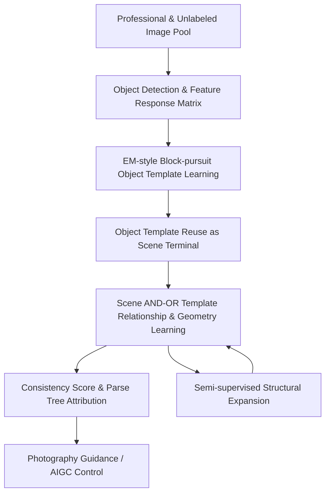

# Learning AND-OR Templates for Compositional Representation in Art and Design

**Conference**: ICLR 2026  
**OpenReview**: [https://openreview.net/forum?id=cJ4h1FhChe](https://openreview.net/forum?id=cJ4h1FhChe)  
**Code**: None  
**Area**: Image Generation / Interpretable Visual Representation / Art & Design  
**Keywords**: AND-OR Template, Compositional Representation, Interpretable Aesthetic Scoring, Semi-supervised Structure Learning, AIGC Structural Control  

## TL;DR
This paper extends the AND-OR Template from object recognition to scene composition in art and design. By employing a maximum entropy log-linear model to provide decomposable consistency scores and utilizing EM-style block-pursuit with semi-supervised structural expansion, the authors learn interpretable templates. These templates demonstrate lightweight, interpretable, and data-efficient structural priors in aesthetic classification, human preference alignment, photography guidance, and AIGC compositional constraints.

## Background & Motivation
**Background**: Visual aesthetic evaluation, photography composition suggestions, and design generation assistance currently rely heavily on deep models. Backbones like VGG, ResNet, and ViT learn effective discriminative features from large-scale annotations, while diffusion or multi-modal models generate beautiful images from text prompts. However, they typically compress the reasons for aesthetic quality into latent spaces, outputting scores or images rather than a checkable chain of structural evidence.

**Limitations of Prior Work**: Many principles in art and design do not depend on the mere presence of an object, but on the compositional structure formed by objects, local parts, relative positions, scales, orientations, and geometric relationships. For example, "a river surrounding mountains" requires more than just detecting a river and a mountain; it necessitates understanding the positional relationships between the central peak, side peaks, and river segments. Black-box deep models can fit scores but struggle to inform users which part is missing, which relationship is violated, or how to move or scale elements.

**Key Challenge**: Aesthetic judgment needs to satisfy two requirements simultaneously: first, strong representation capability to cover different themes and compositional variants; second, readability for designers to convert analysis into actionable edits. Purely manual rules are interpretable but have narrow coverage, while pure deep features are accurate but uninterpretable. An intermediate representation that can reuse structures, learn variants, and provide itemized attribution is missing.

**Goal**: The authors aim to learn a compositional structure template for art and design that: 1) extracts theme-level composition rules from a small set of professional photos; 2) reuses object-level templates for scene-level templates to avoid combinatorial explosion; 3) uses a unified consistency score for training, evaluation, and generation constraints; and 4) expands structural branches from unlabeled high-quality images.

**Key Insight**: The paper selects the classic AND-OR Template (AOT). AND nodes represent mandatory parts and geometric constraints, OR nodes represent valid structural or geometric alternatives, and terminal nodes carry observable image primitives, color, texture, and statistical attributes. This representation is naturally suited for "compositional paradigms," where a single theme can have multiple equivalent layouts, each with clear internal constituent relationships.

**Core Idea**: A two-level AND-OR structure (object template -> scene template) is used to represent composition rules. A maximum entropy log-linear model defines template matching as a decomposable information gain score, allowing aesthetic evaluation, structural interpretation, and AIGC guidance to share the same learnable compositional prior.

## Method

### Overall Architecture
The method is a pipeline from professional images to structural templates, scores, interpretations, and generation controls. Inputs consist of a small set of professional images per theme and an unlabeled expansion pool; outputs include object-level and scene-level AOTs, consistency scores, parse trees, and structural suggestions for photography or AIGC.

Objects are first detected/segmented to construct candidate terminals and feature response matrices. Then, object templates are learned via EM-style block-pursuit. These object templates are then reused as scene terminals to learn cross-object relationships and global geometric constraints. After training, a test image is recursively parsed, and activated terminals/satisfied relationships contribute to a log-likelihood gain score. In the semi-supervised phase, existing templates interpret unlabeled images; new configurations are merged into the template only when matching gain and structural consistency exceed thresholds.

### Key Designs
**1. Two-level AND-OR Templates: Reusing Local Parts for Scene Composition**

A critical structural choice is not enumerating all fine-grained parts at the scene level, but first learning object-level templates and then treating them as scene-level terminals. Object templates contain segments, textures, color histograms, and local geometry; scene templates treat "mountain," "river," or "facade" as high-level elements, learning their relative positions and layout variants. This design solves the combinatorial explosion problem, keeping the representation "recomposable but controlled."

**2. Unified Consistency Score: Goodness as Information Gain over a Reference Distribution**

Consistency scores are defined within a maximum entropy log-linear framework. Given a reference natural image distribution $q(I)$, the model reweights it via selected features to obtain a target theme distribution $p(I)$. The score is a log-likelihood ratio:

$$
Score(I)=\log \frac{p(I\mid s,g,\beta)}{q(I)}=\sum_{k=1}^{K} Score(PAT_k,I).
$$

Where $s$ is structural choice, $g$ is geometric configuration, and $PAT_k$ is the activated photography art template. Each terminal contribution is $Score(PAT_k,I)=s_k(\sum_j \beta_{k,j}r_j(I)-\log Z_k)$. This facilitates "evidence-to-prescription": negative contributions reveal missing elements or incorrect scales, translating directly into editing actions.

**3. EM-style block-pursuit: Controlling Growth via Sparsity and Mutual Exclusion**

Learning starts from a response matrix $R \in [0, 1]^{N \times D}$. The E-step performs terminal matching and geometric searching within local windows. The M-step seeks blocks with high response and information gain to add to the template. A penalized marginal gain decides whether to add a new feature or branch, incorporating sparsity regularizations to prevent the template from becoming too bloated and local mutual exclusion to ensure one image region is explained by at most one block.

**4. Semi-supervised Structural Expansion: Growing Branches from Explainable New Images**

The goal is to cautiously expand the AOT when existing templates cannot fully explain high-quality samples. New samples from the pool are matched; if matching is insufficient but structural consistency is high, the configuration is added as a new branch. A "dual threshold" ensures the template absorbs useful structures without being corrupted by noise.

### Loss & Training
The objective is penalized maximum likelihood. The likelihood consists of structure/geometry priors $p(s, g \mid Temp)$ and conditional image likelihood $p(I \mid s, g, \beta)$. The M-step minimizes $-L(R, \beta, s, g) + penalty(\beta)$. The score for a block $B_k$ is:

$$
Score(B_k)=\sum_{i\in rows(B_k),j\in cols(B_k)}(\beta_{k,j}R_{ij}-\log z_{k,j}).
$$

Inference uses recursive SUM-MAX: terminal responses are locally MAXed, parts are weighted SUMmed, and object/scene levels are combined per AND-OR logic.

## Key Experimental Results

### Main Results
The method was validated on 14 themes from the AVA dataset. It was compared against baseline deep models trained for 2-class aesthetic classification.

| Method | Accuracy (%) | Parameters | Training Complexity | SRCC |
|------|--------------|--------|------------|------|
| Ours | 85.65 | $2.3\times10^3$ | $6.7\times10^4$ | 0.8419 |
| VGG19 (2-class) | 78.08 | $1.39\times10^8$ | $1.96\times10^{10}$ | 0.7506 |
| ResNet50 (2-class) | 85.71 | $2.35\times10^7$ | $4.09\times10^9$ | 0.7842 |
| ViT-B/16 (2-class) | 85.38 | $8.58\times10^7$ | $1.75\times10^{10}$ | 0.7590 |

Ours achieves competitive accuracy with ResNet50 and ViT while using 4–5 orders of magnitude fewer parameters. Notably, it yields the highest SRCC, indicating its scores align most closely with human aesthetic rankings.

### Ablation Study
| Configuration / Analysis | Key Metric | Description |
|-------------|----------|------|
| Expert vs. Learned | High consistency | Learned templates highly match constraints summarized by experts |
| Counterfactual Perturbation | Score drops significantly | Swapping parts or disrupting relations lowers scores, proving structural reliance |
| Geometric Jitter | Score drops significantly | Scale and position perturbations are effectively penalized |
| User Study (Experts) | 74.8% mostly consistent | Professionals found learned structures valid and aligned with themes |
| Human Preference | MSE = 0.0286 | Scores highly correlate with Bradley-Terry scores from human pairwise comparisons |

### Key Findings
- Structural templates provide higher Spearman correlation with human preferences than black-box deep models.
- Structural features are complementary to deep features; late fusion improves the performance of VGG, ResNet, and ViT.
- Semi-supervised growth is sub-linear, indicating that nodes are effectively reused across different sub-graphs.

## Highlights & Insights
- **Repurposing Grammar Vision**: AOT is re-applied to aesthetic composition, providing a clear role for classical grammar models in the era of generative AI.
- **Unified Interface**: Consistency scores serve training, evaluation, and explanation simultaneously, ensuring explanations are intrinsically linked to the decision process.
- **Practical Two-level Reuse**: Reusing object templates as scene terminals is a simple but effective strategy to handle complex scene relationships without combinatorial explosion.
- **Evidence-to-Prescription**: The ability to map negative scoring terms to actionable edits (e.g., "move object," "adjust scale") is highly valuable for creative assistance tools.

## Limitations & Future Work
- **Domain Dependence**: Initial theme templates still require expert curation; "good composition" varies significantly across cultures and art movements.
- **Low-level Focus**: Current modeling focuses on parts and geometry, with less emphasis on lighting, material, psychological color impact, or complex semantic narratives.
- **Sensitivity to Thresholds**: Semi-supervised expansion is sensitive to thresholds; overly loose thresholds introduce noise, while tight ones limit structural discovery.
- **AIGC Integration**: While promising for structural control, integration with models like Midjourney remains an external constraint. Future work could integrate templates as energy-guided priors for diffusion models.

## Related Work & Insights
- **vs. AOT/HIT**: Traditional AOT targets object detection; this work elevates it to scene composition and aesthetic quality.
- **vs. Deep Aesthetic Classifiers**: While CNNs/ViTs provide high accuracy, they lack the granular, actionable explanations (parse trees) that this template approach provides.
- **vs. Scene Graphs**: While scene graphs emphasize semantics, this method focuses specifically on aesthetic constraints and geometric compatibility within those relationships.

## Rating
- Novelty: ⭐⭐⭐⭐☆
- Experimental Thoroughness: ⭐⭐⭐⭐☆
- Writing Quality: ⭐⭐⭐☆☆
- Value: ⭐⭐⭐⭐☆

<!-- RELATED:START -->

## Related Papers

- [\[CVPR 2026\] ShadowDraw: From Any Object to Shadow-Drawing Compositional Art](../../CVPR2026/image_generation/shadowdraw_from_any_object_to_shadow-drawing_compositional_art.md)
- [\[ICLR 2026\] RIDER: 3D RNA Inverse Design with Reinforcement Learning-Guided Diffusion](rider_3d_rna_inverse_design_with_reinforcement_learning-guided_diffusion.md)
- [\[ICLR 2026\] Generalization of Diffusion Models Arises with a Balanced Representation Space](generalization_of_diffusion_models_arises_with_a_balanced_representation_space.md)
- [\[ICLR 2026\] Exploring the Design Space of Transition Matching](exploring_the_design_space_of_transition_matching.md)
- [\[ICLR 2026\] On the Design of One-Step Diffusion via Shortcutting Flow Paths](on_the_design_of_one-step_diffusion_via_shortcutting_flow_paths.md)

<!-- RELATED:END -->
## Related Papers

- [\[CVPR 2026\] ShadowDraw: From Any Object to Shadow-Drawing Compositional Art](../../CVPR2026/image_generation/shadowdraw_from_any_object_to_shadow-drawing_compositional_art.md)
- [\[ICLR 2026\] RIDER: 3D RNA Inverse Design with Reinforcement Learning-Guided Diffusion](rider_3d_rna_inverse_design_with_reinforcement_learning-guided_diffusion.md)
- [\[ICLR 2026\] Generalization of Diffusion Models Arises with a Balanced Representation Space](generalization_of_diffusion_models_arises_with_a_balanced_representation_space.md)
- [\[ICLR 2026\] Learning to Generate Stylized Handwritten Text via a Unified Representation of Style, Content, and Noise](learning_to_generate_stylized_handwritten_text_via_a_unified_representation_of_s.md)
- [\[ICLR 2026\] Exploring the Design Space of Transition Matching](exploring_the_design_space_of_transition_matching.md)

<!-- RELATED:END -->
