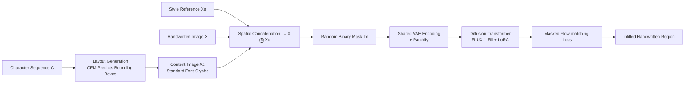

# Learning to Generate Stylized Handwritten Text via a Unified Representation of Style, Content, and Noise

**Conference**: ICLR 2026  
**OpenReview**: [https://openreview.net/forum?id=FBPuLChGNX](https://openreview.net/forum?id=FBPuLChGNX)  
**Code**: To be confirmed  
**Area**: Image Generation / Handwritten Text Generation  
**Keywords**: Handwritten Text Generation, Diffusion Transformer, In-Context Generation, Unified Latent Space, Multi-line Masked Infilling, Position Encoding, Bilingual Handwriting  

## TL;DR
InkSpire embeds style, content, and noise into the **same latent space** and leverages the in-context completion capabilities of the FLUX Diffusion Transformer to directly perform masked inpainting on original multi-line handwritten pages. By discarding the separate style/content encoders and hand-crafted losses found in previous methods, this single model generates high-fidelity, arbitrary-length bilingual (Chinese and English) handwriting and supports character-level editing.

## Background & Motivation
**Background**: Offline handwritten text generation (HTG) has shifted from GANs to diffusion models in recent years, leading to significant quality improvements. This evolution progressed from early methods that used fixed writer IDs for style conditioning (WordStylist, GC-DDPM) to subsequent approaches incorporating specialized style encoders with hand-crafted losses—such as One-DM using Laplacian contrastive loss to capture fine-grained strokes, DiffusionPen utilizing triplet + classification loss to enhance style discriminability, and TGC-Diff employing high-frequency mask loss to preserve structure.

**Limitations of Prior Work**: A common paradigm among these methods is treating **style, content, and noise as three independent factors**, associating each with a separate encoder and a hand-crafted loss. Consequently, training pipelines become increasingly complex, and the interactions among these three factors are weak due to their localized feature spaces. Worse, data preprocessing typically requires cropping paired target and style lines from a writer's multi-line images and resizing them to a fixed height. This squashes characters in highly slanted lines, introduces inconsistent distortions across lines with different slopes, and discards valuable inter-line style cues.

**Key Challenge**: While diffusion Transformers themselves naturally possess strong **in-context generation** capabilities (as demonstrated by large text-to-image models), the HTG field continues to cling to the fragmented "encoder + hand-crafted loss" paradigm, failing to exploit this unified modeling potential.

**Goal**: To design a **single unified diffusion model** that simultaneously handles style, content, and noise. This aims to eliminate redundant encoders and complex losses, enhance factor interactions via a shared latent representation, and support arbitrary-length multi-line synthesis, character-level editing, and bilingual (English and Chinese) output.

**Core Idea**: The authors observed that TGC-Diff already integrates content features and noise into the same latent space. Following this line of reasoning, they asked: since content and noise can share a latent space, **can style be brought in as well, placing all three in a single latent space?** The solution is to treat the entire image (the handwritten image $X$ spatially concatenated with the glyph content image $X_c$) as an image to be inpainted. By directly modeling this with the masked infilling of a diffusion Transformer, **style acts as the visible context, content serves as the glyph condition, and noise represents the target region—all encoded into the same feature space by a single VAE**.

## Method

### Overall Architecture
InkSpire decomposes HTG into two steps: first, a **layout generation model** $p(X_c \mid C, X_s)$ predicts the bounding box of each character and renders a content image $X_c$ in a standard font; second, an **image generation model** $p(X \mid X_s, X_c)$ "colorizes" the content image into a handwritten image following the target writer's style. This decomposition derives from the joint distribution $p(X, X_c \mid C, X_s) = p(X_c \mid C, X_s)\,p(X \mid X_s, X_c)$. The key innovations lie in the second step: instead of cropping paired samples or employing independent encoders, the method spatially concatenates $X$ and $X_c$ into a single large image, applies a random mask, and prompts a diffusion Transformer based on FLUX.1-Fill to infill the masked handwritten regions.

### Key Designs

**1. Unified Latent Space + Multi-line Masked Infilling: Replacing "paired cropping + encoders" with "raw image masking".** Previous training regimes required cropping target lines $X_{tar}$ and style lines $X_s$ from authors' multi-line pages and passing them through separate encoders, leading to inconsistent feature spaces. InkSpire takes the opposite route: it randomly crops a $P\times P$ patch directly from the raw handwritten page and applies a random binary mask $M$. This naturally partitions the image into a masked region $X_{mis}=M\otimes X$ and a visible context $X_{ctx}=(1-M)\otimes X$. Ingeniously, $X_{mis}$ implicitly acts as the "target line" $X_{tar}$, while $X_{ctx}$ acts as the "style reference" $X_s$. The training objective directly becomes $p(X_{mis,t-1}\mid X_{mis,t}, X_{ctx}, X_c)$, completely bypassing cropped-pair preprocessing. Specifically, the handwritten image and content image are spatially concatenated as $I = X \,ⓒ\, X_c$. After masking, this yields $I_i = I\otimes(1-I_m)$, which is encoded by the **same VAE** and patchified into image tokens $F_i$ and mask tokens $F_m$. Finally, the noise tokens $F_n$ are concatenated along the channel dimension: $F_{input}=F_n\odot F_i\odot F_m$. Since style, content, and noise share a single VAE encoder, they are unified into the same feature space, allowing interaction among factors to emerge naturally without auxiliary encoders or hand-crafted losses.

**2. Mask-Conditioned Flow-Matching Objective: Computing velocity loss only on masked regions.** Training adopts the rectified flow paradigm. Given a clean latent $x_0$, Gaussian noise $z_1\sim\mathcal{N}(0,I)$, and noise scale $\sigma_t$, the interpolation is constructed as $x_t=(1-\sigma_t)x_0+\sigma_t z_1$. The model learns the velocity vector pointing from $x_0$ to $z_1$. The loss is computed only on the masked region: $L = \mathbb{E}_{t,x_0,z_1}\,\lVert m\odot(\hat{v}_\theta(x_t,t,c)-(z_1-x_0))\rVert_2^2$, where the condition $c$ is composed of $X_{ctx}$ and $X_c$. Here, the authors deliberately keep the objective "clean" by **excluding perceptual losses or CTC losses**, echoing the core philosophy of discarding hand-crafted losses, leaving only a single flow-matching loss throughout the optimization process.

**3. Rotated Aligned Position Encoding (R-APE): Matching style and content tokens in the positional space.** When directly fine-tuning a pre-trained diffusion Transformer, naïve 2D RoPE lays out tokens row by row, resulting in interleaved standard font tokens and handwriting tokens. Since handwritten lines vary dramatically in length, the model struggles to distinguish whether a given token serves as a style condition or a content condition. To address this, the authors first propose **Aligned Position Encoding (APE)**: while the token physical layout remains unchanged, the positional encoding assigned to $X_c$ **directly reuses the encoding of its corresponding position in $X$**, enabling the content token to share coordinates with the target handwritten token it guides. For long text lines where width is much larger than height, they further propose **Rotated APE (R-APE)**: rotating both $X$ and $X_c$ clockwise by 90° before concatenation, which maintains spatial proximity between target tokens and their content condition tokens in the positional space. Ablation shows that APE slashes the FID on IAM from 15.12 to 9.31, and R-APE further reduces it to 7.92.

**4. Inference as "Mask Manipulation": Unifying synthesis and editing under a single masking framework.** Because style, content, and noise are integrated into a single unified model, switching tasks during inference simply requires modifying the mask $M$ or the content image $X_c$. **Multi-line Synthesis**: By placing the style reference in the first line and masking out the rest, accompanied by a multi-line content image $X_c$, the model can generate an arbitrary number of lines at once (whereas previous methods were typically limited to one or two lines). **Character/Word-Level Editing**: Given a mask targeting a specific edit region along with an edited content image rendered in standard font, the model modifies only the masked words while leaving the unmasked regions intact. Additionally, trained on mixed Chinese-English corpora, the single model handles bilingual tasks directly, removing the need for language-specific systems.

## Key Experimental Results

### Main Results

English IAM text line generation:

| Method | FID↓ | KID↓ | HWD↓ | ΔCER↓ |
|---|---|---|---|---|
| HWT | 44.72 | 43.49 | 2.97 | 0.33 |
| VATr | 34.00 | 29.68 | 2.38 | 0.03 |
| One-DM | 43.89 | 44.48 | 2.83 | 0.13 |
| DiffPen | 12.89 | 9.73 | 2.13 | 0.03 |
| **InkSpire** | **7.92** | **4.83** | **0.62** | **0.01** |

Chinese ICDAR2013 text line generation:

| Method | FID↓ | KID↓ | HWD↓ | CR↑ | AR↑ |
|---|---|---|---|---|---|
| One-DM | 34.36 | 28.37 | 0.80 | 73.19 | 72.33 |
| TGC-Diff | 23.43 | 13.85 | 0.63 | 89.99 | 89.13 |
| **InkSpire** | **10.98** | **11.45** | **0.41** | **92.92** | **91.56** |

Across both English and Chinese, InkSpire substantially outperforms baseline approaches in both style metrics (FID/KID/HWD) and content metrics (ΔCER/CR/AR). The improvement in HWD is particularly striking, dropping from 2.13 (DiffPen) to 0.62 in English.

### Ablation Study

Positional encoding ablation (IAM):

| Setting | FID↓ | KID↓ | HWD↓ | ΔCER↓ |
|---|---|---|---|---|
| baseline | 15.12 | 19.27 | 0.97 | 0.11 |
| +APE | 9.31 | 7.21 | 0.58 | 0.05 |
| +R-APE | 7.92 | 4.83 | 0.62 | 0.01 |

Masking strategy ablation (IAM):

| Setting | FID↓ | KID↓ | HWD↓ | ΔCER↓ |
|---|---|---|---|---|
| F-TopMask (Fixed top visible) | 8.73 | 6.13 | 0.78 | 0.07 |
| R-Mask (Random multi-region) | 7.92 | 4.83 | 0.62 | 0.01 |

Layout modeling ablation (IAM, L1×10³): Autoregressive (Δy 17.04) < Masked modeling (14.51) < **Masked + CFM (14.39)**, with CFM performing optimally across all four layout parameters.

### Key Findings
- **Position encoding is crucial for multi-line generation**: Naïve RoPE suffices for single-line generation but often directly duplicates the input image and exhibits sensitivity to resolution in multi-line scenarios. APE enables the model to distinguish between style and content tokens, and R-APE further improves token location under long-line, one-shot settings.
- **Random multi-region masking outperforms fixed top masking**: R-Mask aligns more closely with the natural distribution than F-TopMask, yielding consistent improvements across both datasets.
- **CFM layout modeling outperforms autoregressive and masked modeling**: Continuous denoising (10-step ODE) captures spatial dependencies more effectively than token-by-token autoregression.
- **Efficiency**: Based on FLUX.1-Fill-dev, a LoRA rank of 32 introduces only ~115.9M trainable parameters. Training takes 20k steps on 4×A100 GPUs, with inference requiring about 20 ODE steps.

## Highlights & Insights
- **"Unified Latent Space" represents a genuine paradigm simplification**: The three factors of style, content, and noise—previously decoupled by independent encoders and hand-crafted losses—are merged into a single feature space using a "shared VAE + spatial concatenation + masked completion." Consequently, the training objective simplifies to a single flow-matching loss. Rather than assembling a collection of superficial tricks, this elegant outcome naturally emerges from reformulating the task as an inpainting problem.
- **The insight of treating "masking as pairing" is highly ingenious**: Consuming $X_{mis}$ as the target and $X_{ctx}$ as the style reference completely eliminates the messy preprocessing of cropping pairs, while preserving inter-line style cues and generalization across resolutions.
- **Leveraging the in-context capability of pre-trained text-to-image models**: Stripping away text encoders in favor of pure visual conditioning to transfer the large model's in-context capacity to HTG represents an exemplary choice of utilizing the right tool for the job.
- **Engineering insights in position encoding**: By rotating, R-APE maintains spatial proximity between target and content tokens in long lines—a precise fix for RoPE's failure on variable-length lines.

## Limitations & Future Work
- **Limited language coverage**: Evaluated only on bilingual English and Chinese corpora; the authors note the need to scale to more languages and datasets to enhance generalization.
- **Dependency on layout generation quality**: In the two-step framework, the content image $X_c$ is rendered based on bounding boxes predicted by the layout model. Consequently, layout errors cascade to the final handwritten output, an aspect not thoroughly analyzed in the paper.
- **High computational cost**: Built upon massive models like FLUX.1-Fill with a 1024×1024 patch size on 4×A100 GPUs, making it less accessible for resource-constrained scenarios.
- **Unexplored boundaries in editing capabilities**: Although character-level editing demonstrates word replacement, there is a lack of quantitative evaluation regarding robustness during complex layout rearrangement or cross-line edits.

## Related Work & Insights
- **Offline HTG Lineage**: GAN era (HiGAN, Alonso et al.) $\rightarrow$ CNN-Transformer hybrids (HWT, VATr) $\rightarrow$ Diffusion dominance (One-DM, DiffusionPen, TGC-Diff). InkSpire's "unified latent space" takes a direct step forward from TGC-Diff's "shared content + noise latent space."
- **In-Context Generation**: Progressing from InstructPix2Pix to instruction-driven editors like Emu Edit, OmniGen, ICEdit, and then to diffusion Transformers with LoRA branches. This work is the first to introduce the "unified editing & generation" in-context capacity to the handwriting domain.
- **Insights**: When multiple "factors" in a field are segregated by multiple encoders and hand-crafted losses, one should ask: "Can they share a single representation?" Reformulating the task into a more generalized generative paradigm (in-painting, in this case) often yields substantial pipeline simplification and performance gains. Positional encoding mismatch on variable-length sequences is a recurring pitfall when adapting pre-trained Transformers, making the "alignment + rotation" approach of R-APE highly referenceable.

## Rating
- **Novelty**: ⭐⭐⭐⭐ — The paradigm shift of "unified latent space + masked completion instead of cropped pairs" is clean and powerful, and R-APE shows originality. Points are deducted because core components (FLUX, flow-matching, and RoPE variants) are largely clever combinations of existing technologies.
- **Experimental Thoroughness**: ⭐⭐⭐⭐ — Covers both English and Chinese, with comprehensive ablations across style/layout, position encoding, and masking strategies, supported by both qualitative and quantitative results. However, it lacks a cascade error analysis and broader multilingual validation.
- **Writing Quality**: ⭐⭐⭐⭐ — Clear motivational flow (tracing from "factor fragmentation" to "unified modeling"), appropriate diagrams and formulas, and "InkSpire" is an evocative and memorable name.
- **Value**: ⭐⭐⭐⭐ — Significantly simplifies the HTG training pipeline while achieving SOTA performance. Offers strong practicality through bilingual single-model processing, arbitrary-length generation, and character editing, carrying direct value for handwriting synthesis, OCR data augmentation, and typeface design.

<!-- RELATED:START -->

## Related Papers

- [\[CVPR 2026\] SplitFlux: Learning to Decouple Content and Style from a Single Image](../../CVPR2026/image_generation/splitflux_learning_to_decouple_content_and_style_from_a_single_image.md)
- [\[ICCV 2025\] SCFlow: Implicitly Learning Style and Content Disentanglement with Flow Models](../../ICCV2025/image_generation/scflow_implicitly_learning_style_and_content_disentanglement_with_flow_models.md)
- [\[ICML 2026\] Content-Style Identification via Differential Independence](../../ICML2026/image_generation/content-style_identification_via_differential_independence.md)
- [\[CVPR 2026\] Learning to Generate via Understanding: Understanding-Driven Intrinsic Rewarding for Unified Multimodal Models](../../CVPR2026/image_generation/learning_to_generate_via_understanding_understanding-driven_intrinsic_rewarding_.md)
- [\[ICLR 2026\] DiffInk: Glyph- and Style-Aware Latent Diffusion Transformer for Text to Online Handwriting Generation](diffink_glyph-_and_style-aware_latent_diffusion_transformer_for_text_to_online_h.md)

<!-- RELATED:END -->
