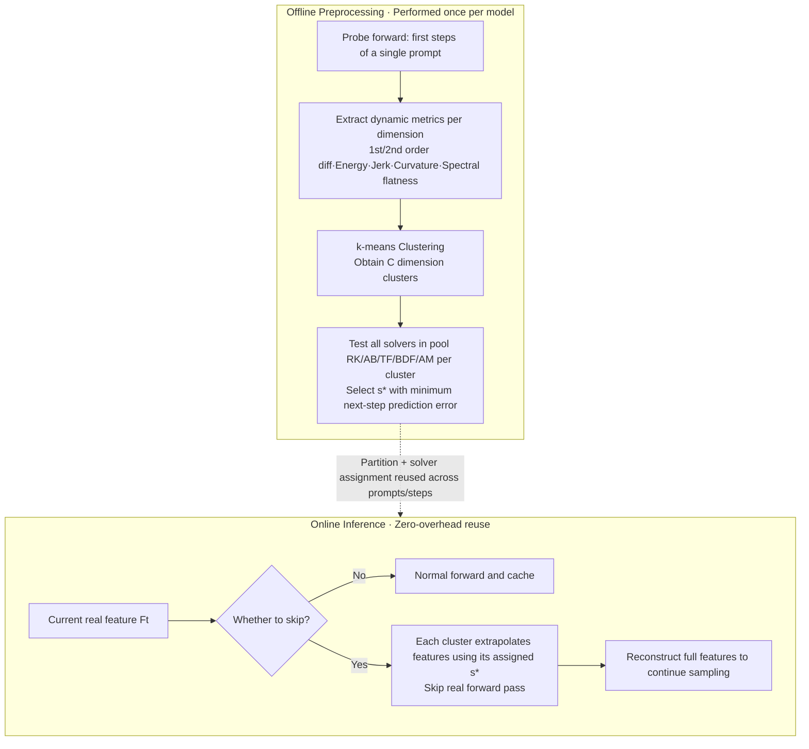

# Let Features Decide Their Own Solvers: Hybrid Feature Caching for Diffusion Transformers

**Conference**: ICLR 2026  
**OpenReview**: [https://openreview.net/forum?id=URbsHlTK8c](https://openreview.net/forum?id=URbsHlTK8c)  
**Code**: Project Page (Paper Project Page, repository to be confirmed)  
**Area**: Image Generation / Diffusion Model Inference Acceleration  
**Keywords**: Diffusion Transformer, Feature Caching, ODE Solver, Training-free Acceleration, Dimension-level Caching  

## TL;DR
HyCa conceptualizes the evolution of latent features in Diffusion Transformers as a hybrid system where "different dimensions follow different ODEs." By offline selecting the most appropriate numerical solver for each cluster of dimensions to predict or reuse features, it achieves 5.5× to 6.2× near-lossless training-free acceleration on FLUX, HunyuanVideo, and Qwen-Image.

## Background & Motivation
**Background**: Diffusion Transformers (DiTs) deliver high quality in image and video generation, but sampling requires repeated Transformer forward passes, making inference speed a major bottleneck. Feature caching is a class of training-free acceleration methods that leverage the temporal coherence of latent features between adjacent timesteps, reusing or extrapolating cached features to skip certain forward computations. Methods like FORA, ToCa, and TaylorSeer have extended caching from U-Nets to DiTs, interpreting it as "solving the temporal evolution of latent features."

**Limitations of Prior Work**: These methods implicitly assume that all feature dimensions follow a unified evolution system, thereby applying a single caching/extrapolation strategy to all dimensions. However, clustering analysis of DiT dimension variations over time reveals that some dimensions oscillate violently (corresponding to stiff or multi-modal behavior), while others remain smooth and predictable. **A one-size-fits-all solver cannot simultaneously accommodate both stiff and smooth dimensions**, leading to instability and quality degradation under aggressive acceleration.

**Key Challenge**: The high-dimensional feature space is heterogeneous, yet caching strategies remain homogeneous—this is the root cause of performance loss.

**Goal**: Without retraining, assign different "integrators" to feature dimensions with different dynamic behaviors, allowing each dimension to be predicted by its most suitable solver to approximate near-lossless acceleration.

**Core Idea**:
- **Feature Evolution = Mixture of ODEs**: The feature trajectory $\tau\mapsto F(x(\tau))$ is viewed as a continuous ODE. Different dimension clusters follow different ODEs and should utilize different numerical solutions.
- **One-Time Choosing, All-Time Solving**: The authors discovered that the clustering partition of dimensions is highly stable (ARI > 0.8) across different prompts, resolutions, and timesteps. Thus, solvers only need to be selected offline once using a single prompt and step, then reused during inference with zero additional overhead.

## Method

### Overall Architecture
HyCa reformulates the caching problem as numerical integration of the ODE $\frac{d}{d\tau}F(x(\tau)) = g_\theta(F(x(\tau)), \tau)$. The goal is to use historical cached features to predict the next step $\hat F_{t+1}\approx \text{Solver}(F_t, F_{t-1},\dots)$ instead of performing a real forward pass. The pipeline consists of two stages: **Offline Preprocessing**—calculating temporal dynamic descriptors for each feature dimension → k-means clustering → selecting the solver with the minimum error from a solver pool for each cluster; and **Online Inference**—each cluster consistently uses its assigned solver to extrapolate features, skipping actual computation during skip steps. The two-stage pipeline is shown below:

### Key Designs

**1. Reformulating Feature Caching as Mixture of ODEs: Assigning Heterogeneous Integrators to Heterogeneous Dimensions.** Since generative networks are differentiable and $x(\tau)$ evolves along a continuous reverse trajectory, the composite mapping $\tau\mapsto F(x(\tau))$ is also differentiable, satisfying $\frac{d}{d\tau}F(x(\tau)) = g_\theta(F(x(\tau)),\tau)$. Although the vector field $g_\theta$ is inaccessible, trajectories $\{F(x(\tau_k))\}$ can be sampled on a discrete timestep grid for numerical integration—naturally turning caching into an "ODE solving using only cached values" problem. Crucially, the DiT feature space is a complex system; smooth segments suit explicit high-order methods, while oscillatory/stiff segments suit implicit methods. The authors provides a diverse solver pool $S$, including Runge–Kutta (RK), Adams–Bashforth (AB), Taylor Formula (TF), Backward Differentiation Formula (BDF), and Adams–Moulton (AM), covering various stability/accuracy tradeoffs. This allows HyCa to assign tailored solutions to local dynamics instead of using a single polynomial extrapolation for all dimensions like TaylorSeer.

**2. Dimension-level Dynamic Clustering: Partitioning Dimensions with Interpretable Temporal Metrics.** HyCa performs a probe forward pass during the first few timesteps of a single prompt. For each dimension $d$, it extracts a descriptor vector $\phi_d\in\mathbb{R}^k$ containing metrics such as Jerk ratio, curvature ratio, first/second-order differences, energy, and spectral flatness to characterize temporal dynamics. k-means is then applied to obtain partitions $\{c(d)\}$. **Dimension-level** rather than token-level partitioning is chosen because empirical results show that the clustering structure of dimensions remains nearly invariant across different prompts, resolutions, and timesteps (Silhouette ≈ 0.72, ARI > 0.8), whereas token-level partitions change drastically with input and require frequent re-selection. This stability justifies the "one-time clustering, all-time reuse" approach and keeps data/computation overhead negligible.

**3. One-Time Cluster-based Selection: Treating Single-Prompt Single-Step Optima as Global Optima.** Given solver pool $S$, HyCa selects the solver with the minimum next-step prediction error for each cluster $c$:
$$\min_{\{s_c\in S\}_{c=1}^{C}} \sum_{c=1}^{C}\left[\frac{1}{|c|}\sum_{d\in c}\big\|\hat F^{(s_c,d)}_{t+1}-F^{(d)}_{t+1}\big\|_2^2\right],$$
where $\hat F^{(s_c,d)}_{t+1}$ is the feature extrapolated for dimension $d$ using solver $s_c$. While optimal solvers would normally require inference across many images, the input-invariance of cluster assignments allows the authors to reliably select solvers based on a single prompt/step evaluation. Thus, "Offline One-Time Choosing + Online All-Time Solving" holds, introducing no additional search cost during inference.

**4. Native Compatibility with Distilled Models: Handling Discrete Oscillatory Trajectories with Implicit Solvers.** Distillation compresses sampling from 50 steps to 4 or 8, making feature trajectories discrete and oscillatory, which causes traditional caching methods relying on smooth temporal assumptions to fail. HyCa’s solver pool natively includes implicit methods (e.g., BDF/AM) suitable for discrete/oscillatory dynamics. Since solvers are assigned per cluster and per model, HyCa remains effective on FLUX.1-schnell and Qwen-Image-Lightning, layering further acceleration (up to 24.4×) on top of distillation with minimal quality loss.

## Key Experimental Results

Tests were conducted on four representative models: T2I models FLUX.1-dev / Qwen-Image, T2V model HunyuanVideo, and image editing model Qwen-Image-Edit; plus distilled versions FLUX.1-schnell / Qwen-Image-Lightning. Metrics include ImageReward, CLIP, PSNR/SSIM/LPIPS, VBench, and GEdit-Bench.

### Main Results

Qwen-Image Text-to-Image (DrawBench 200 prompts, parentheses show ImageReward change relative to original):

| Method | FLOPs Gain | ImageReward ↑ | PSNR ↑ | LPIPS ↓ |
|------|-----------|---------------|--------|---------|
| Original 50 steps | 1.00× | 1.2547 (0.00%) | ∞ | 0.000 |
| TaylorSeer (N=3) | 2.78× | 1.0685 (-14.83%) | 28.29 | 0.628 |
| **Ours (N=3)** | 2.78× | **1.2363 (-1.47%)** | **30.42** | **0.247** |
| FORA (N=6) | 5.56× | 0.4781 (-61.91%) | 28.38 | 0.597 |
| **Ours (N=8)** | 6.25× | **1.0811 (-13.84%)** | 28.89 | 0.433 |

FLUX.1-dev (High acceleration zone): Ours (N=6) at 5.00× achieves ImageReward 1.0014 (+1.16%); Ours (N=7) at 5.55× still reaches 0.9895 (-0.03%), representing almost no loss, while TeaCache drops to 0.8683 and ToCa to 0.7155 at the same level.

HunyuanVideo Text-to-Video (VBench):

| Method | FLOPs Gain | VBench ↑ |
|------|-----------|----------|
| Original 50 steps | 1.00× | 80.66 |
| TaylorSeer (N=5) | 5.00× | 79.93 (-0.9%) |
| **Ours (N=6)** | **5.56×** | **80.25 (-0.5%)** |

Qwen-Image-Edit (GEdit-Bench Overall Score): Ours (N=8) at 6.24× yields CN/EN scores of 7.44/7.42, **even exceeding the original model’s 7.41/7.54 range**, whereas TaylorSeer (N=8) drops to 6.31/6.31.

### Ablation Study (FLUX)

| Comparison Dimension | Key Conclusion |
|----------|----------|
| Ours vs Single Solver | Ours achieves higher ImageReward and lower prediction error, proving "Mixture of Solvers" is superior to any single integration strategy. |
| Dimension-level vs Token-level / One-size-fits-all | Dimension-level assignment outperforms both token-level (ToCa/DuCa) and uniform full-dimension strategies (FORA/TaylorSeer). |
| Distillation Compatibility | FLUX.1-schnell 4-step: Ours at 24.42× achieves ImageReward 0.9592 (outperforming distillation baseline by +5.0%), PSNR 34.37. |

### Key Findings
- The stability of cluster assignment is the foundation of the method: across prompt/resolution/timestep, Silhouette ≈ 0.72 and ARI > 0.8, making one offline selection sufficient.
- The more aggressive the acceleration, the wider the gap between HyCa and baselines—others generally collapse at 5.5×+, while HyCa remains near-lossless, demonstrating robustness at high compression.
- In high-acceleration editing tasks, HyCa occasionally slightly outperforms the original model, suggesting that solver extrapolation may have a denoising/smoothing regularization effect.

## Highlights & Insights
- **Novelty**: It is the first to explicitly model DiT feature evolution as a "Mixture of ODEs" and empirically prove that dynamics are heterogeneous between dimensions while the clustering structure is input-invariant—an observation that transforms a problem previously perceived as homogeneous.
- **Engineering Simplicity**: All solver selections are completed offline once, resulting in zero search overhead during inference. It is essentially "free" to implement and can be stacked with distillation to reach 12×~24×.
- **Extensible Solver Pool**: Porting mature explicit/implicit ODE solvers from numerical analysis into feature caching provides an extensible path for "matching solvers to dynamic characteristics."

## Limitations & Future Work
- **Solver Pool and Metrics are Hand-designed**: Dynamic descriptors (Jerk, curvature, etc.) and candidate solvers are manually selected; whether they are optimal or could be automatically learned is not fully explored.
- **Clustering Count C and Stability Boundaries**: The paper primarily demonstrates stability under a 2-cluster setting. Whether clustering remains stable or how to adaptively choose the number of clusters in more models or higher resolutions remains open.
- **Representative Assumption of Offline Probes**: The "single-prompt single-step optimal = global optimal" assumption relies on input invariance. Stress tests on out-of-distribution prompts or extreme editing scenarios are needed.
- **Acceleration Measurements**: Acceleration is primarily calculated via FLOPs/Latency; the friendliness of scattered dimension-level skip patterns to hardware parallelism and memory access is not analyzed in depth.

## Related Work & Insights
- **Caching as Solving Temporal Evolution**: This work continues the "cache-then-forecast" paradigm of FORA, ToCa/DuCa, TaylorSeer, and FoCa, but upgrades uniform extrapolation to heterogeneous solving per dimension cluster—a direct generalization of TaylorSeer’s polynomial extrapolation.
- **Numerical ODE Solvers**: While DPM-Solver, Rectified Flow, and Consistency Models focus on "reducing steps," HyCa focuses on "reducing cost per step." The two are orthogonal and stackable (as verified with distillation).
- **Insight**: When a system is assumed to be homogeneous but is actually heterogeneous, the "cluster, divide-and-conquer with specialized strategies" approach is a universal and inexpensive improvement. "Offline one-time optimization + input invariance" can squash expensive searches into zero cost, a principle worth applying to other training-free acceleration methods.

## Rating
- **Novelty**: ⭐⭐⭐⭐ Reformulating feature caching as a Mixture of ODEs and using dimension-level clustering + solver assignment is a fresh perspective. However, the underlying components (caching, numerical solvers, k-means) are clever combinations of existing tools.
- **Experimental Thoroughness**: ⭐⭐⭐⭐ Covers four task types (T2I, video, editing, distillation), four major models, and multiple acceleration ratios. Baseline comparisons are comprehensive, supported by stability and ablation studies. Lacks systematic analysis on automatic metric/cluster selection.
- **Writing Quality**: ⭐⭐⭐⭐ The logic from motivation → observation (heterogeneous dynamics) → method → stability proof is clear. Charts and tables are informative.
- **Value**: ⭐⭐⭐⭐ Training-free, zero inference overhead, and stackable with distillation up to 24× makes it highly practical for DiT deployment. The "heterogeneous modeling + one-time selection" paradigm has significant transfer potential.

<!-- RELATED:START -->

## Related Papers

- [\[CVPR 2026\] Forecast the Principal, Stabilize the Residual: Subspace-Aware Feature Caching for Diffusion Transformers](../../CVPR2026/image_generation/forecast_the_principal_stabilize_the_residual_subspace-aware_feature_caching_for.md)
- [\[CVPR 2026\] ResCa: Residual Caching for Diffusion Transformers Acceleration](../../CVPR2026/image_generation/resca_residual_caching_for_diffusion_transformers_acceleration.md)
- [\[AAAI 2026\] ProCache: Constraint-Aware Feature Caching with Selective Computation for Diffusion Transformer Acceleration](../../AAAI2026/image_generation/procache_constraint-aware_feature_caching_with_selective_computation_for_diffusi.md)
- [\[ICLR 2026\] Scaling Laws for Diffusion Transformers](scaling_laws_for_diffusion_transformers.md)
- [\[ICLR 2026\] Rethinking Global Text Conditioning in Diffusion Transformers](rethinking_global_text_conditioning_in_diffusion_transformers.md)

<!-- RELATED:END -->
