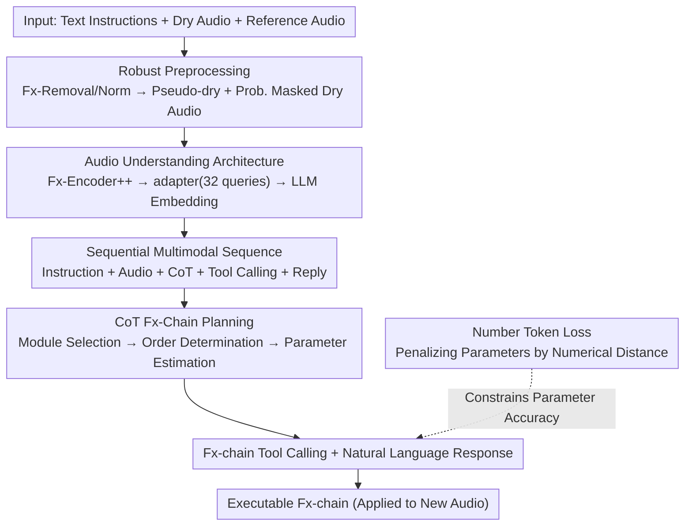

# LLM2Fx-Tools: Tool Calling for Music Post-Production

**Conference**: ICLR 2026  
**arXiv**: [2512.01559](https://arxiv.org/abs/2512.01559)  
**Code**: [Demo](https://seungheondoh.github.io/llm2fx-tools-demo/)  
**Area**: Audio Generation  
**Keywords**: Audio Effect Chain Estimation, Tool Calling, Chain-of-Thought Reasoning, Music Post-Production, Multimodal LLM

## TL;DR
LLM2Fx-Tools is the first framework to apply LLM tool calling to audio effect modules. It understands audio input through a multimodal LLM, utilizes CoT reasoning to select effect types, determines their order, and estimates parameters, achieving interpretable and controllable music post-production.

## Background & Motivation
- Audio effect (Fx) processing is central to music post-production but requires significant expertise.
- Prior automated Fx-chain estimation methods faces three limitations: gradient-based methods require differentiable modules, regression methods use fixed configurations that cannot dynamically select effects, and they lack user interpretability.
- The instruction following, CoT reasoning, and tool-calling capabilities of LLMs offer new opportunities for flexibility and interpretability.
- Previous LLM2Fx models only supported single effects (EQ and reverb) without explicit tool calling or CoT.

## Method

### Overall Architecture
LLM2Fx-Tools uses Qwen3-4B as the backbone, reframing Fx-chain estimation as a "listen, plan, and call tools" problem. Given text instructions, dry audio, and reference audio, the model first performs robust preprocessing to eliminate environment differences. It then projects the waveform into the LLM embedding space. The model generates a CoT reasoning segment to plan the effect chain and finally produces directly executable Fx-chain tool calls and natural language responses. The pipeline follows: input audio undergoes preprocessing and encoding, enters the LLM, and the LLM produces CoT, tool calls, and responses in an autoregressive sequence, ensuring post-processing is both executable and interpretable.

### Key Designs

**1. Robust Preprocessing: Normalizing recording differences and supporting dry/no-dry scenarios**

Vocal levels and reverb environments in real-world recordings vary greatly. Training directly on these causes models to mistake studio differences for the effects themselves. Furthermore, dry audio is often unavailable during inference. This work uses Fx-Removal and Fx-Normalization during both training and inference to align inputs to a unified baseline, producing pseudo-dry audio $\hat{x}_{\text{dry}}$. During training, dry audio is randomly masked with probability $p_{\text{masking}}$, forcing the model to rely only on reference audio. Thus, the model supports both reverse engineering (estimating applied effects when dry audio exists) and blind estimation (predicting required effects without dry audio).

**2. Audio Understanding Architecture: Embedding waveforms into the LLM space**

LLMs handle discrete tokens and cannot read waveforms directly. This framework uses an Fx-Encoder++, pretrained via contrastive learning, to extract audio features $f_{\text{encoder}}$, which are then projected via a Transformer adapter into the LLM space $e_{\text{audio}} = f_{\text{adapter}}(f_{\text{encoder}}(x_{\text{audio}}))$. Unlike simple linear alignment, the adapter uses 32 learnable query embeddings $e_{\text{query}}\in\mathbb{R}^{32\times d_{\text{LLM}}}$ and cross-attention to aggregate variable-length audio into 32 tokens. The resulting embeddings are concatenated with text tokens into a unified multimodal sequence $[x_{\text{instruction}}, x_{\text{dry}}, x_{\text{ref}}, x_{\text{cot}}, \mathcal{C}, x_{\text{response}}]$, allowing the model to simultaneously analyze target timbre and current state.

**3. CoT Fx-Chain Planning: Decomposing chain configuration into three reasoning steps**

Predicting an Fx-chain in one step often leads to errors in effect types or sequence. This work designs a CoT mechanism for Fx-chains, splitting decisions into three sub-tasks: effect selection, order determination, and parameter estimation. CoT generation precedes tool calling and serves as conditional context, ensuring the model explains "why" before specifying "what." Ablations show this provides the largest performance gain—effect selection accuracy rose from 67% to 80% and order correlation from 0.49 to 0.56.

**4. Number Token Loss: Accurate calculations over token guessing**

Effect parameters are continuous values, but standard cross-entropy treats numerical tokens as unordered categories (predicting 3 vs 30 incurs the same penalty). This work introduces a Number Token Loss based on Wasserstein-1 distance, making the penalty proportional to the distance between the predicted distribution and the ground truth: $\mathcal{L}_{\text{NTL-WAS}} = \frac{1}{|\mathcal{I}_{\text{num}}|} \sum_{i \in \mathcal{I}_{\text{num}}} \sum_{v \in \mathcal{V}_{\text{num}}} \hat{P}_i(v) |y_i - \text{val}(v)|$. It is linearly combined with cross-entropy using coefficient $\lambda$: $\mathcal{L}_{\text{total}} = \mathcal{L}_{\text{CE}} + \lambda \mathcal{L}_{\text{NTL}}$, reducing parameter MAE from 0.32 to 0.23.

> ⚠️ The formula above reflects the Wasserstein-1 distance reconstruction; refer to the original paper for specific notations.

### Loss & Training
Training occurs in two stages: modality alignment followed by language ability fine-tuning. Phase 1 trains only the adapter while freezing the LLM for modality alignment (Learning rate 1e-4, 100K steps). Phase 2 uses LoRA (rank=128, alpha=256) at a learning rate of 5e-5 to fine-tune the LLM for 400K steps on dialogue data to learn CoT reasoning and tool calling.

## Key Experimental Results

### Main Results (Reverse Engineering Fx-chain Estimation)

| Method | Acc↑ | Rank Corr↑ | MAE↓ | MRS L/R↓ | AFx-Rep↑ | FxEnc↑ |
|------|------|----------|------|---------|---------|--------|
| Regression | 55% | -0.03 | 0.20 | 3.81 | 0.62 | 0.64 |
| MultiTask | 61% | 0.00 | 0.23 | 3.17 | 0.63 | 0.66 |
| DeepAFx-ST | - | - | - | 1.75* | 0.62 | 0.66 |
| Gemini 2.5 Flash | 78% | 0.54 | 0.32 | 3.42 | 0.56 | 0.50 |
| **LLM2Fx-Tools** | **80%** | **0.56** | **0.23** | **3.13** | **0.68** | **0.67** |

### Ablation Study

| Config | Acc↑ | Rank Corr↑ | MAE↓ | MRS L/R↓ |
|------|------|----------|------|---------|
| LLM2Fx-Tools (Full) | 80% | 0.56 | 0.23 | 3.13 |
| w/o CoT | 67% | 0.49 | 0.24 | 3.34 |
| w/o NTL | 73% | 0.51 | 0.32 | 3.69 |
| w/o MST | 76% | 0.55 | 0.25 | 3.21 |

### Key Findings
- CoT significantly improves effect selection (67→80%) and ordering (0.49→0.56), making it the most critical component.
- NTL reduces parameter MAE from 0.32 to 0.23, contributing most to numerical precision.
- Regression methods achieve the lowest MAE (0.20) but fail at selecting effects, leading to worse perceptual distance.
- MUSHRA listening tests: LLM2Fx-Tools (62.8) significantly outperforms Gemini (56.5) and DeepAFx-ST (54.8).
- In style transfer tasks, LLM2Fx-Tools demonstrates the best generalization (AF=7.41 vs second-best 7.62).

## Highlights & Insights
- First to introduce the LLM tool-calling paradigm to audio effects, integrating non-differentiable modules into a generative framework.
- CoT not only improves performance but provides an interpretable reasoning process (why this effect was chosen).
- Fx-chain ordering is vital to quality; even with high parameter accuracy, incorrect sequencing degrades the output.
- The LP-Fx dataset (101K dialogues) provides infrastructure for future audio effect LLM research.

## Limitations & Future Work
- The toolset is limited to 9 modules and 26 parameters, whereas real-world production is more complex.
- Data generation depends on LLM-synthesized dialogues, which may contain distribution biases.
- 4B parameter models may struggle in highly complex scenarios.
- Iterative optimization (adjusting effects via multi-turn dialogue) has not yet been explored.

## Related Work & Insights
- Work on single-effect prediction in LLM2Fx inspired the expansion to Fx-chains.
- Tool-calling paradigms (Toolformer, Gorilla) widely used in Vision/NLP are successfully migrated to Audio.
- Provides a new paradigm for interpretable automation in AI-assisted music production.

## Rating
- Novelty: ⭐⭐⭐⭐ First audio effect tool-calling framework; clever integration of CoT.
- Experimental Thoroughness: ⭐⭐⭐⭐⭐ MUSHRA tests + multi-dimensional metrics + ablations + style transfer.
- Writing Quality: ⭐⭐⭐⭐ Clear task definition and methodology.
- Value: ⭐⭐⭐⭐ Opens new application directions for LLMs in audio post-production.

<!-- RELATED:START -->

## Related Papers

- [\[CVPR 2025\] FilmComposer: LLM-Driven Music Production for Silent Film Clips](../../CVPR2025/image_generation/filmcomposer_llm-driven_music_production_for_silent_film_clips.md)
- [\[ICLR 2026\] TreeGRPO: Tree-Advantage GRPO for Online RL Post-Training of Diffusion Models](treegrpo_tree-advantage_grpo_for_online_rl_post-training_of_diffusion_models.md)
- [\[ICLR 2026\] Many-for-Many: Unify the Training of Multiple Video and Image Generation and Manipulation Tasks](many-for-many_unify_the_training_of_multiple_video_and_image_generation_and_mani.md)
- [\[ICLR 2026\] Generalization of Diffusion Models Arises with a Balanced Representation Space](generalization_of_diffusion_models_arises_with_a_balanced_representation_space.md)
- [\[AAAI 2026\] Melodia: Training-Free Music Editing Guided by Attention Probing in Diffusion Models](../../AAAI2026/image_generation/melodia_training-free_music_editing_guided_by_attention_probing_in_diffusion_mod.md)

<!-- RELATED:END -->
