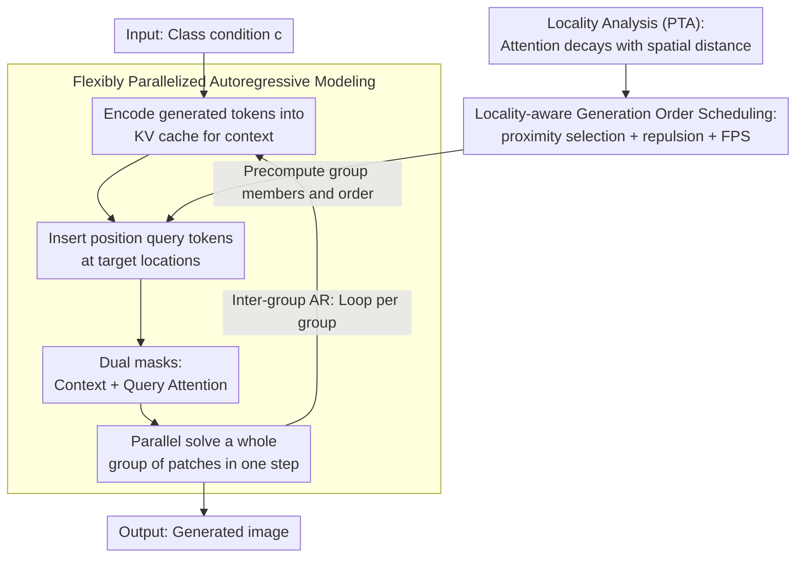

# Locality-aware Parallel Decoding for Efficient Autoregressive Image Generation

**Conference**: ICLR 2026 Oral  
**arXiv**: [2507.01957](https://arxiv.org/abs/2507.01957)  
**Code**: [GitHub](https://github.com/mit-han-lab/lpd)  
**Area**: Autoregressive Image Generation  
**Keywords**: Parallel decoding, autoregressive modeling, spatial locality, position query, efficient inference

## TL;DR
The authors propose Locality-aware Parallel Decoding (LPD), which reduces the generation steps for $256 \times 256$ images from 256 to 20 by flexibly parallelizing the autoregressive modeling architecture and employing locality-aware generation order scheduling, achieving at least a $3.4\times$ reduction in latency.

## Background & Motivation
- Next-patch prediction in autoregressive image generation is a memory-bottlenecked operation where latency grows linearly with the number of steps.
- Next-scale prediction (e.g., VAR) uses fewer steps but relies on multi-scale token representations that are incompatible with flat vision perception models (CLIP, DINO).
- Existing parallelization methods (PAR, RandAR) achieve only limited parallelization; PAR uses a fixed parallel order, while RandAR tokens are invisible to each other during generation.
- There is a need for efficient inference that maintains the universality and compatibility of flat token representations.

## Method

### Overall Architecture
LPD decomposes the generation of an image into several "groups." Multiple patches within each group are generated synchronously in parallel, while groups maintain autoregressive conditional dependencies. It consists of two components: a flexibly parallelized autoregressive architecture that supports arbitrary generation orders and degrees of parallelism, and a locality-aware generation order scheduler. The scheduler ensures that parallel tokens in each group receive sufficient context while minimizing mutual dependencies. During inference, the scheduler precomputes the locations and sequence for each group offline. The architecture then loops through groups, encoding generated tokens into the KV cache as context and using position query tokens to decode all patches in a group in a single parallel step until the image is complete.

### Key Designs

**1. Flexibly Parallelized Autoregressive Modeling: Enabling decoder-only models to solve a whole group of arbitrary patches at once**

Standard autoregressive models predict the next token in a sequence with fixed positions and orders, preventing parallel decoding of multiple arbitrary positions. LPD decouples "providing context" from "generating targets." Generated tokens contribute to context and are stored in the KV cache, while target positions receive learnable position query tokens (shared learnable embeddings plus position encodings). These query tokens drive parallel generation. The model uses dual attention masks: Context Attention allows subsequent tokens to attend causally to prior context tokens, and Query Attention ensures query tokens within the same step are mutually visible (enabling coordination to avoid inconsistency) while preventing subsequent tokens from attending back to these queries. Since query token KVs do not need to be preserved, encoding and decoding for a group are fused into a single operation during inference, only saving KV caches for the final generated tokens.

**2. Locality Analysis and the PTA Metric: Quantifying spatial decay to determine which patches fit in the same group**

Parallelization requires identifying positions that can be generated simultaneously without conflict. Analyzing LlamaGen-1.4B revealed that attention is highly concentrated on spatially proximal tokens. To quantify this, the authors define Per-Token Attention (PTA) as the average attention weight for tokens at spatial distance $s$:

$$PTA_s = \frac{1}{N}\sum_{i=1}^N \frac{\sum_j \text{Attention}(T_i,T_j) \cdot \mathbb{I}[d(T_i,T_j)=s]}{\sum_j \mathbb{I}[d(T_i,T_j)=s]}$$

Observations show $PTA_s$ drops sharply as distance $s$ increases. This leads to two scheduling principles: parallel tokens should be close to already generated tokens (for strong contextual conditioning) but far from each other (to minimize mutual dependence and maintain generation quality).

**3. Locality-aware Generation Order Scheduling: Greedily selecting independent patches with sufficient context**

The scheduler applies these principles at each step $k$. It calculates the Euclidean distance from unselected tokens to selected tokens as "proximity." Tokens with high proximity (above threshold $\tau$) form candidate set $c_1$. It then iteratively selects tokens from $c_1$ using a repulsion threshold $\rho$ to filter out nearby candidates, ensuring group members are spatially separated. If more tokens are needed, Farthest Point Sampling (FPS) is used on the remaining set $c_2$. The number of tokens per group typically follows an increasing cosine schedule—generating fewer tokens early on when context is scarce and accelerating later. The sequence depends only on grid geometry and is precomputed once.

### Loss & Training
The model is trained using a grouped autoregressive objective. Dividing $N$ tokens into $G$ groups, the joint probability is decomposed as: $p(x_1,\dots,x_N;c) = \prod_{g=1}^G p(X_g \mid X_{<g};c)$. Optimization uses standard cross-entropy loss. The dual attention masks are applied during training to achieve teacher-forcing causal constraints and intra-group parallel prediction in a single forward pass.

## Key Experimental Results

### Main Results (ImageNet 256×256)

| Type | Model | Parameters | FID↓ | IS↑ | #Steps | Latency(s) | Throughput |
|------|------|------|------|-----|--------|-----------|-----------|
| AR | LlamaGen-XXL | 1.4B | 2.34 | 253.9 | 576 | 24.40 | 0.72 |
| AR | RAR-XXL | 1.5B | 1.48 | 326.0 | 256 | 6.59 | 6.72 |
| Par.AR | PAR-XXL-4× | 1.4B | 2.35 | 263.2 | 147 | 6.26 | 2.33 |
| Par.AR | RandAR-L | 343M | 2.55 | 288.8 | 88 | 1.97 | 28.59 |
| **Par.AR** | **LPD-L** | **343M** | **2.31** | **284.9** | **20** | **0.40** | **92.42** |
| **Par.AR** | **LPD-XL** | **775M** | **1.97** | **304.0** | **20** | **0.57** | **60.27** |

### ImageNet 512×512

| Model | Parameters | FID↓ | #Steps | Latency(s) | Throughput |
|------|------|------|--------|-----------|-----------|
| LlamaGen-XXL | 1.4B | 2.59 | 1024 | - | - |
| **Ours (LPD-XXL)** | **1.4B** | **2.25** | **48** | **2.78** | **6.56** |

### Key Findings
- LPD-L generates $256 \times 256$ images in just 20 steps with FID=2.31, outperforming LlamaGen-XXL (2.34) which takes 576 steps.
- Throughput reaches 92.42 img/s, far exceeding RandAR (28.59) and PAR (6.83).
- For $512 \times 512$, it requires only 48 steps (vs 1024), reducing FID from 2.59 to 2.25.
- Locality-aware scheduling is significantly superior to raster, random, and Halton sequences.
- Zero-shot image editing (class-conditional editing, inpainting, outpainting) is naturally supported.

## Highlights & Insights
- The "decoupled" design using position query tokens elegantly solves the flexibility limitations of standard decoder-only models.
- Query Attention ensures that synchronously generated tokens are mutually visible, avoiding the inconsistencies caused by independent sampling.
- Locality analysis provides an empirical foundation for parallelization strategies—the PTA metric is transferable to other vision autoregressive models.
- Compared to VAR, LPD maintains flat token representations, ensuring compatibility with vision backbones like CLIP and DINO.

## Limitations & Future Work
- Currently validated only on ImageNet class-conditional generation, not yet extended to text-to-image generation.
- Overhead from additional parameters and attention computation introduced by position query tokens.
- Hyperparameters for scheduling ($\tau$, $\rho$, group size schedule) require tuning for different scenarios.
- A gap in FID still exists compared to the best MAR/VAR methods (though throughput is significantly higher).

## Related Work & Insights
- Motivated by the limitations of parallel autoregressive methods like PAR, RandAR, and SAR.
- Inspired by the masked prediction in MaskGIT for the increasing group size design.
- The spatial locality observation provides insights into understanding the attention mechanism in vision autoregressive models.
- Provides an efficient solution for the image component in unified multimodal generation (text+image).

## Technical Details
- Group size increases via a cosine schedule: fewer tokens are generated when context is limited, increasing as context grows.
- Position Query Token = Shared learnable embedding + Position encoding of the target location.
- KVs for query tokens are not stored during inference; only KVs for generated tokens are cached.
- 20 steps for $256 \times 256$ generation; 48 steps for $512 \times 512$.
- Supports zero-shot image editing (class-conditional, inpainting, outpainting).
- LPD-L with 343M parameters achieves FID=2.31, outperforming the 1.4B LlamaGen-XXL.

## Rating
- Novelty: ⭐⭐⭐⭐⭐ The combination of position query decoupling and locality-aware scheduling is novel and effective.
- Experimental Thoroughness: ⭐⭐⭐⭐ Extensive systematic comparisons, although T2I and multimodal experiments are missing.
- Writing Quality: ⭐⭐⭐⭐⭐ Clear motivation and thorough comparative analysis with other methods.
- Value: ⭐⭐⭐⭐⭐ Significantly reduces latency in autoregressive image generation, which is crucial for unified multimodal systems.

<!-- RELATED:START -->

## Related Papers

- [\[ICLR 2026\] Autoregressive Image Generation with Randomized Parallel Decoding](autoregressive_image_generation_with_randomized_parallel_decoding.md)
- [\[CVPR 2026\] Parallel Jacobi Decoding for Fast Autoregressive Image Generation](../../CVPR2026/image_generation/parallel_jacobi_decoding_for_fast_autoregressive_image_generation.md)
- [\[CVPR 2026\] Multi-Scale Local Speculative Decoding for Image Generation](../../CVPR2026/image_generation/multi-scale_local_speculative_decoding_for_image_generation.md)
- [\[ICLR 2026\] ToProVAR: Efficient Visual Autoregressive Modeling via Tri-Dimensional Entropy-Aware Semantic Analysis and Sparsity Optimization](toprovar_efficient_visual_autoregressive_modeling_via_tri-dimensional_entropy-aw.md)
- [\[AAAI 2026\] Annealed Relaxation of Speculative Decoding for Faster Autoregressive Image Generation](../../AAAI2026/image_generation/annealed_relaxation_of_speculative_decoding_for_faster_autor.md)

<!-- RELATED:END -->
