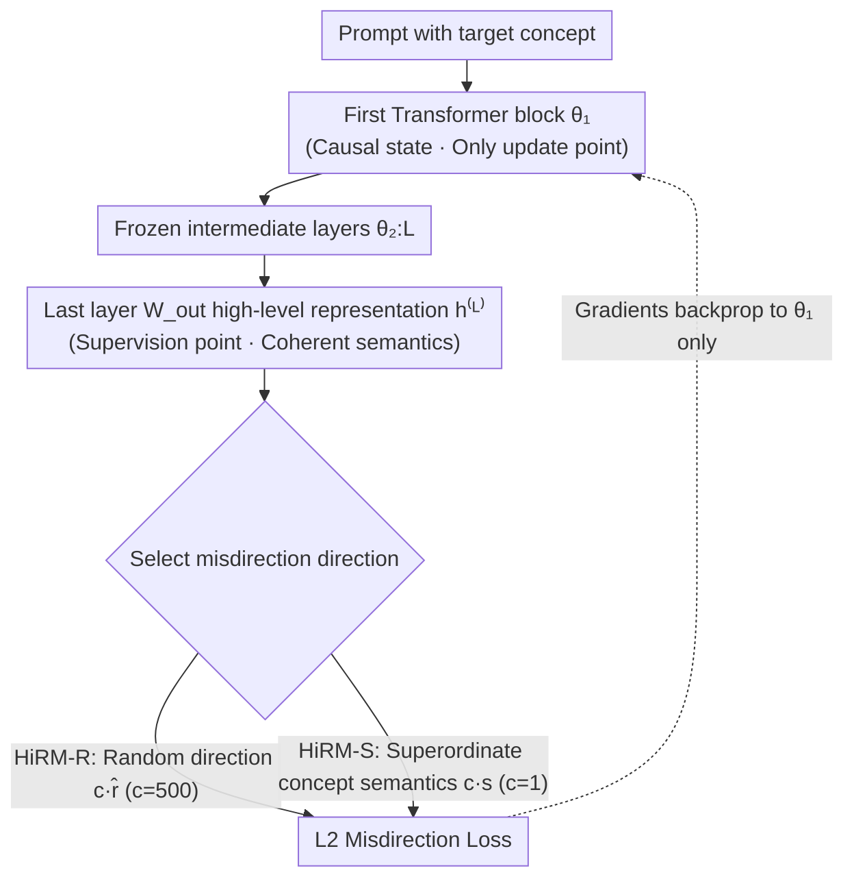

# Localized Concept Erasure in Text-to-Image Diffusion Models via High-Level Representation Misdirection

**Conference**: ICLR 2026  
**arXiv**: [2602.19631](https://arxiv.org/abs/2602.19631)  
**Code**: [GitHub](https://github.com/Coffeeloveman/HiRM)  
**Area**: Diffusion Models / Safety / Unlearning  
**Keywords**: Concept Erasure, Text Encoder, Causal Tracing, Representation Misdirection, Modular Safety Patch  

## TL;DR

HiRM proposes a concept erasure strategy that "decouples update location from erasure target"—it updates only the weights of the first layer of the CLIP text encoder while applying erasure supervision on the high-level semantic representations of the last layer. By misdirecting target concept representations toward random (HiRM-R) or semantic (HiRM-S) directions, it achieves efficient erasure of styles, objects, and nudity on UnlearnCanvas and NSFW benchmarks, with zero-shot transferability to the Flux architecture.

## Background & Motivation

**Background**: Concept erasure is mainly divided into training-based methods (fine-tuning U-Net, e.g., ESD, SalUn, MACE) and training-free methods (closed-form editing or prompt manipulation, e.g., UCE, RECE, SAFREE). Both categories primarily modify the U-Net/denoiser.

**Limitations of Prior Work**: Modifying U-Net is computationally expensive and tends to damage the generation quality of unrelated concepts; training-free methods struggle to balance erasure effectiveness with preservation.

**Key Challenge**: Causal tracing by Basu et al. found that the first layer of the CLIP text encoder acts as the causal state for visual attributes, theoretically allowing direct intervention. However, directly editing early layers (e.g., Diff-QuickFix) performs poorly on abstract concepts (e.g., NSFW/nudity) and damages overall model quality because early-layer representations are "bags of concepts"—modifying them affects all shared base features.

**Goal**: To achieve precise concept erasure within the text encoder while satisfying: (a) erasure efficacy for both specific (style/object) and abstract (nudity) concepts; (b) preservation of non-target generation quality; (c) high computational efficiency and cross-architecture transferability.

**Key Insight**: Toker et al. found that coherent high-level semantic representations form only in the last few layers, while early layers contain scattered low-level features. Therefore, the update point and supervision point should be decoupled—perform gradient updates at the first layer (where the causal state resides) but define the erasure loss at the last layer (where high-level semantics form).

**Core Idea**: Use updates at the first layer weights to "remotely" misdirect the high-level semantic representations of target concepts in the last layer, achieving localized concept erasure.

## Method

### Overall Architecture

HiRM aims to precisely erase a concept (a specific style, object, or nudity) within the CLIP text encoder without modifying the diffusion model's U-Net. The method revolves around a counter-intuitive split between **where to modify weights** and **what criteria to use for modification**: gradients update only the parameters $\theta_1$ of the first Transformer block (where the "causal state" of visual attributes resides), while the erasure loss is defined on the high-level semantic representation $h^{(L)}$ output by the $W_{\text{out}}$ projection of the last layer (where coherent semantics are formed).

Specifically, a prompt containing the target concept passes through all $L$ layers to obtain the representation $h^{(L)}$. The loss "misdirects" it toward a specified direction—either a random direction (HiRM-R) or a semantically related superordinate concept (HiRM-S). During backpropagation, gradients flow back only to $\theta_1$, allowing the slight modifications at the first layer to "remotely" reshape the last-layer semantics through the frozen intermediate layers. This preserves the localization of the causal state at the first layer while avoiding the collateral damage associated with direct early-layer editing by leveraging high-level semantics at the last layer.

### Key Designs

**1. Decoupling Update and Supervision Points: Updating first-layer weights based on last-layer semantics**

This is the structural core of HiRM that distinguishes it from existing text encoder editing methods. Causal tracing confirms that visual attributes concentrate in the first Transformer block of the CLIP text encoder, making it the logical update point. However, defining the erasure target in early layers (e.g., Diff-QuickFix's direct modification of projection matrices) causes "representation shattering" because early layers contain fundamental features shared across concepts. HiRM resolves this by performing gradient updates at $\theta_1$ but defining the erasure loss on the last-layer high-level representation $h^{(L)}$, where scattered features are integrated into precise semantics. Ablations confirm that moving the supervision point to the last layer achieves the best balance between erasure and preservation.

**2. HiRM-R: Brutally dispersing last-layer semantics via random directions**

HiRM-R pushes the target representation toward a "meaningless" target. It samples a random unit vector $\hat{r}_t$ for each token representation $h_t^{(L)}$ and uses a large steering coefficient $c=500$ to pull the representation away:

$$\mathcal{L}_{\text{HiRM-R}} = \frac{1}{T} \sum_{t=1}^T \|h_t^{(L)} - c \cdot \hat{r}_t\|^2$$

Random directions are universal—erasure occurs without needing to define a specific target concept, as the noise itself destroys the original semantics.

**3. HiRM-S: Guiding toward semantically adjacent superordinate concepts for cleaner erasure**

HiRM-S aligns the target representation with a semantically related superordinate concept (e.g., mapping "Van Gogh" to "Painting"). This keeps the results within a reasonable semantic neighborhood, causing less disruption to non-target generation:

$$\mathcal{L}_{\text{HiRM-S}} = \frac{1}{T} \sum_{t=1}^T \|h_t^{(L)} - c \cdot s_t^{(L)}\|^2$$

Here $s_t^{(L)}$ is the last-layer representation of the superordinate concept, and $c=1$ is sufficient. For abstract NSFW concepts, a "safety misdirection vector" is constructed based on the Ring-A-Bell framework to serve as the guiding target.

### Loss & Training

- Style Erasure: lr=5e-5, 40 epochs (HiRM-R) / 30 epochs (HiRM-S), single-word prompts.
- Object Erasure: lr=5e-5, 25 epochs (HiRM-R) / 15 epochs (HiRM-S).
- Nudity Erasure: lr=1e-4, 50 epochs (HiRM-R) / 25 epochs (HiRM-S), joint multi-keyword training.
- Training time ~1.2s, VRAM usage 1.60 GB, no retain set required.

## Key Experimental Results

### UnlearnCanvas Benchmark (Style + Object)

| Method | Training-based | Style UA↑/IRA↑/AA↑ | Object UA↑/IRA↑/AA↑ | Training Time (s) |
|------|--------|-------------------|---------------------|-------------|
| ESD | ✓ | 98.58/80.97/91.17 | 92.15/55.78/64.05 | 7372 |
| MACE | ✓ | 54.69/89.85/81.10 | 67.65/98.52/87.85 | 175 |
| SalUn | ✓ | 86.26/90.39/90.58 | 86.91/96.35/94.28 | 610 |
| Diff-Q | ✗ | 96.40/93.91/95.81 | 94.00/98.37/96.19 | - |
| **HiRM-R** | ✓ | 95.50/89.31/94.24 | 93.20/98.18/94.65 | **1.20** |
| **HiRM-S** | ✓ | **96.20/92.67/95.54** | **96.20/97.77/96.94** | **1.20** |

### NSFW Erasure (Robustness to Adversarial Attacks)

| Method | Ring-16↓ | Ring-77↓ | MMA↓ | I2P↓ | COCO CLIP↑ |
|------|----------|----------|------|------|------------|
| SalUn | 0.00 | 2.11 | 0.90 | 0.57 | 0.293 |
| RECE | 1.05 | 1.05 | 0.40 | 0.57 | 0.277 |
| Ediff | 2.11 | 1.05 | 4.10 | 0.85 | 0.307 |
| **HiRM-R** | **0.00** | **0.00** | 8.00 | 0.96 | 0.304 |
| **HiRM-S** | 1.05 | **0.00** | **3.30** | **0.66** | **0.306** |

### Key Findings

- HiRM-S achieves the best AA (Action Accuracy) for style and object erasure simultaneously, with a training time of only 1.2s, which is 145× faster than the fastest training-based baseline MACE.
- Synergy effect: HiRM-R combined with EraseAnything on Flux reduces Ring-16 from 29.47% to 3.16% while maintaining nearly identical CLIP scores.
- Zero-shot transfer to Flux: By simply replacing the text encoder without additional training, Ring-16 is reduced from 88.42% to 37.89%.
- Multi-concept erasure (S-HiRM-S = SPEED + HiRM-S): Successfully erases 50 celebrities and nudity while maintaining MMA 1.70% and Ring-16 1.05%.
- t-SNE visualizations confirm that only target concept representations are moved while non-target concepts remain stable.

## Highlights & Insights

- **Elegant Decoupled Design**: Applying updates at the first layer (causal state) and defining supervision at the last layer (high-level semantics) via frozen intermediate layers is highly intuitive.
- **Modular Safety Patch**: Because only the text encoder is modified, it serves as a plug-and-play module that can be applied to any model using the same CLIP encoder (including LoRA fine-tuned versions and Flux).
- **Synergy with U-Net Methods**: HiRM modifies the text encoder while other methods modify the denoiser, creating a dual defense line with significant synergistic effects.

## Limitations & Future Work

- Uniform misdirection applied to all tokens may suppress some target-irrelevant information.
- Robustness against white-box adversarial attacks (UnLearnDiffAtk) is relatively weak (22.54% ASR) compared to SalUn/RECE.
- Multi-concept erasure currently uses simple weight averaging, leading to some drop in IRA (65.56%), suggesting the need for more sophisticated fusion strategies.
- The model-agnostic nature provides simplicity but limits the ability to exploit internal model-specific structures.

## Related Work & Insights

- **vs. Diff-QuickFix**: Both edit the text encoder, but Diff-Q uses a closed-form solution on the first layer, which fails on NSFW tasks (I2P 7.09% but CLIP drops to 0.273). HiRM resolves this via decoupled supervision.
- **vs. ESD**: A U-Net fine-tuning approach that is strong for style but degrades significantly for objects (Object AA 64.05%), with a training time of over 2 hours.
- **vs. SPEED**: A complementary relationship—SPEED modifies U-Net cross-attention weights for multi-concept erasure (100 concepts in 5s), while HiRM modifies the text encoder for nudity; their combination (S-HiRM-S) yields optimal results.
- **Insight**: The paradigm of causal tracing → localization → decoupled intervention is promising for extension to safety alignment in LLMs.

## Rating

- Novelty: ⭐⭐⭐⭐⭐ 
- Experimental Thoroughness: ⭐⭐⭐⭐⭐ 
- Writing Quality: ⭐⭐⭐⭐ 
- Value: ⭐⭐⭐⭐⭐ 

<!-- RELATED:START -->

## Related Papers

- [\[CVPR 2026\] Neighbor-Aware Localized Concept Erasure in Text-to-Image Diffusion Models](../../CVPR2026/image_generation/neighbor-aware_localized_concept_erasure_in_text-to-image_diffusion_models.md)
- [\[ICLR 2026\] SPEED: Scalable, Precise, and Efficient Concept Erasure for Diffusion Models](speed_scalable_precise_and_efficient_concept_erasure_for_diffusion_models.md)
- [\[ICLR 2026\] AEGIS: Adversarial Target-Guided Retention-Data-Free Robust Concept Erasure from Diffusion Models](aegis_adversarial_target-guided_retention-data-free_robust_concept_erasure_from_.md)
- [\[ICLR 2026\] Generalization of Diffusion Models Arises with a Balanced Representation Space](generalization_of_diffusion_models_arises_with_a_balanced_representation_space.md)
- [\[AAAI 2026\] Mass Concept Erasure in Diffusion Models with Concept Hierarchy](../../AAAI2026/image_generation/mass_concept_erasure_in_diffusion_models_with_concept_hierarchy.md)

<!-- RELATED:END -->
