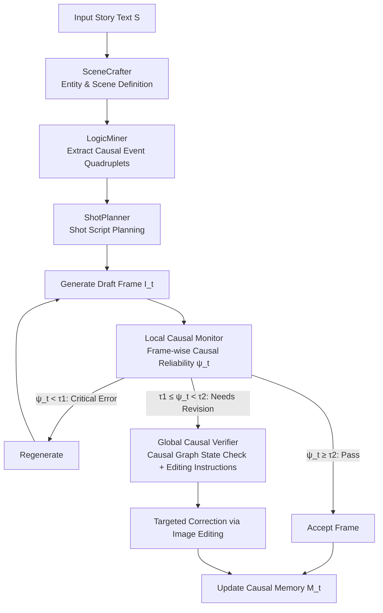

# LogiStory: A Logic-Aware Framework for Multi-Image Story Visualization

**Conference**: ICLR 2026  
**OpenReview**: [https://openreview.net/forum?id=OG1JMhoBKU](https://openreview.net/forum?id=OG1JMhoBKU)  
**Code**: TBD  
**Area**: Image Generation / Story Visualization  
**Keywords**: Story Visualization, Visual Logic, Multi-Agent, Causal Reasoning, Multi-Image Sequence Generation

## TL;DR
This work proposes the concept of "visual logic" and introduces LogiStory, a framework combining multi-agent planning with causal verification. It transforms multi-image story visualization from generating "beautiful isolated pictures" into a reasoning problem that "explicitly models causal coherence between characters, actions, and scenes," accompanied by the LogicTale benchmark with causal annotations.

## Background & Motivation
**Background**: Diffusion models and MLLMs (GPT-4o, Gemini, Nano Banana) can generate high-fidelity single images. Research in story visualization (generating a sequence of coherent images for a narrative) has mostly focused on visual quality and character consistency—ensuring the protagonist wears the same clothes and maintains the same face across frames.

**Limitations of Prior Work**: Although single images are increasingly exquisite, the generated image sequences often suffer from "logical breakage"—object states change abruptly without explanation, character behaviors/emotions are inconsistent, and narratives are fragmented. The result is a series of "image snapshots" rather than a readable story. While structured logical planning (event graphs, commonsense reasoning) exists on the text side, these capabilities have not been transferred to visual expression.

**Key Challenge**: Existing methods treat narrative coherence as an "implicit byproduct" of image generation, expecting models to learn causal relationships while pursuing pixel quality. However, causal chains in visual sequences (e.g., a crow dropping stones in a bottle $\rightarrow$ water level rising $\rightarrow$ reaching the water) are never guaranteed by pixel similarity. **Visual logic is a severely neglected dimension that requires explicit modeling.**

**Goal**: Elevate visual logic—the perceptual and causal coherence of characters, actions, and scenes over time—from an implicit byproduct to an explicit modeling objective, and provide a benchmark to measure it.

**Core Idea**: **Explicit Modeling of Visual Logic**. A multi-agent system decomposes the narrative into structured character definitions, causal events, and shot scripts. A dual-layer causal verification module (Global Causal Graph + Local Frame-by-Frame Monitoring) checks and corrects logical breaks in real-time during generation, turning "narrative coherence" into a computable and enforceable goal.

## Method

### Overall Architecture
Given a text story $S$, the goal is to generate an image sequence $I=\{I_1,\dots,I_T\}$ that simultaneously satisfies instance consistency, narrative causality, and story readability. LogiStory consists of two major components: a **Logic-Aware Multi-Agent System** translates the story into a structured intermediate representation (characters/objects/scenes/shot events), followed by a **Visual Logic Enhancement Module** that introduces multi-layer causal verification during frame-by-frame synthesis, triggering re-generation or targeted editing for illogical frames.

### Key Designs

**1. Logic-Aware Multi-Agent System: Translating Narrative into Structured Visual Skeletons**  
This stage is completed by three collaborating agents. SceneCrafter handles entity definition, $E=F_{\text{craft}}(S)$, extracting character set $C$, object set $O$, scene set $S$, and their attributes to form a "visual grounding vocabulary" reused across shots, ensuring character and prop consistency. LogicMiner is the core—it compresses the story into causal event quadruplets $k_j=(\text{actor},\text{action},\text{target},\text{result})$, where $K=F_{\text{mine}}(S,E)$. It captures not only explicit actions but also infers **implicit state changes**: from "the crow puts a stone in the cup," it automatically derives the consequence "water level rises," which might be unwritten but must be visualized. These events form the causal backbone. Finally, ShotPlanner arranges events and entities into a sequence of shot specifications $P=F_{\text{shot}}(K,E)$, incorporating visual narrative conventions (composition, camera movement, pacing).

**2. Local Causal Monitor: Simulating Linear Reading Comprehension**  
Humans read comic strips frame by frame, comparing each new frame with accumulated understanding. This module uses an MLLM to simulate this path: it maintains a text-based causal memory buffer $M_{t-1}$ of states and actions from $\{p_1,\dots,p_{t-1}\}$. For the current frame $I_t$, it calculates a causal reliability score $\psi_t=C_p(I_t\mid M_{t-1})$, measuring whether the depicted state transition is coherent with the context. It **does not demand deterministic prediction**, accepting both expected plot progression and reasonable twists, as long as they do not contradict prior states.

**3. Global Causal Verifier: Maintaining Story-Level Consistency via Causal Graphs**  
While the local monitor ensures smoothness between adjacent frames, the global verifier ensures the entire causal chain is correct. It constructs a directed causal graph $G_{\text{causal}}$ based on events $K$ and story $S$, where nodes are critical states and edges are causal/temporal dependencies. A state logger tracks the current status of all instances. For each action $a_t$, it defines pre-conditions $S^{\text{pre}}_t$ and post-conditions $S^{\text{post}}_t$, ensuring the transition $S^{\text{pre}}_t \xrightarrow{a_t} S^{\text{post}}_t$ falls on a valid path in the causal graph: $\forall t,\ (S^{\text{pre}}_t, S^{\text{post}}_t)\in\text{Paths}(G_{\text{causal}})$. Inconsistencies (e.g., characters reviving out of nowhere) are flagged for targeted correction.

**4. Thresholded Image Refinement Loop: Closing the Loop with Generation**  
LogiStory uses two empirical thresholds $\tau_1=0.4$ and $\tau_2=0.7$ to categorize local reliability $\psi_t\in[0,1]$: if $\psi_t<\tau_1$, the frame is irrelevant and regenerated; if $\tau_1\le\psi_t<\tau_2$, it has minor logical flaws and is fixed using structured revision instructions via inpainting/editing tools; if $\psi_t\ge\tau_2$, it is accepted. After each frame, its caption is merged into memory $M_t=M_{t-1}\cup\{\text{Caption}(I_t)\}$.

## Key Experimental Results

Implementation Details: Agents use DeepSeek-V3 as the backbone LLM; initial shots are synthesized by Flux; refinement/editing integrates GPT-image-1 and Gemini 2.0 Flash with inpainting models.

### Main Results
Comparison on the LogicTale benchmark against closed/open-source baselines (Bold indicates best):

| Method | ICons.↑ | NCausal.↑ | SRead.↑ | AesthQ.↑ | SCons.↑ | CExpr.↑ | User App.↑ |
|------|---------|-----------|---------|----------|---------|---------|-----------|
| DeepSeek-R1 + SDXL | 2.17 | 2.02 | 0.568 | 0.290 | 0.775 | 2.13 | 3.0 |
| DeepSeek-R1 + Flux | 3.87 | 3.43 | 0.687 | 0.305 | 0.833 | 4.20 | 3.8 |
| DeepSeek-R1 + StoryDiff | 3.07 | 2.06 | 0.541 | 0.291 | 0.828 | 2.07 | 2.6 |
| MM-StoryAgent | 3.03 | 2.63 | 0.579 | 0.294 | 0.802 | 2.54 | 2.6 |
| Gemini 2.0 Flash | 3.62 | 3.88 | 0.651 | 0.255 | 0.820 | 3.48 | 2.8 |
| Nano Banana | 4.20 | 4.08 | 0.744 | **0.310** | **0.903** | 4.26 | 4.4 |
| GPT-4o + GPT-image-1 | **4.67** | 3.96 | 0.762 | 0.283 | 0.898 | 4.15 | **4.6** |
| **LogiStory (Ours)** | 4.23 | **4.45** | **0.827** | 0.309 | 0.857 | **4.32** | 4.2 |

LogiStory leads in narrative causality, story readability, and character expressiveness; instance and style consistency are slightly lower than GPT-image-1 but remain competitive.

### Ablation Study

| Planning Method | ICons. | NCausal. | SRead. |
|----------|--------|----------|--------|
| Direct DeepSeek-V3 | 3.92 | 3.64 | 0.723 |
| Direct DeepSeek-R1 | 3.87 | 3.86 | 0.716 |
| Direct Qwen2.5-72B | 3.66 | 3.52 | 0.661 |
| **Multi-Agent (Ours)** | **4.23** | **4.45** | **0.827** |

| Enhancement Module | ICons. | NCausal. | SRead. |
|----------|--------|----------|--------|
| w/ none | 4.16 | 3.93 | 0.653 |
| w/ global only | 4.12 | 4.27 | 0.728 |
| w/ local only | 4.24 | 4.10 | 0.773 |
| **w/ both (Ours)** | 4.23 | **4.45** | **0.827** |

### Key Findings
- **Multi-agent planning significantly outperforms direct prompting**: Decomposing narratives into structured entities and events provides a strong prior for sequence generation.
- **Verification modules are complementary**: The Global Causal Verifier primarily improves narrative causality, while the Local Causal Monitor enhances story readability.
- **Human evaluation aligns with automated metrics**: Pearson correlation coefficients for the three logical dimensions were 0.959/0.978/0.909, validating the automated protocol.
- **Bottleneck exists in generation, not planning**: In complex cases (multi-thread narratives, flashbacks), the causal graph correctly identifies dependencies, but the underlying image models occasionally fail to express fine-grained emotions or event-level coherence.

## Highlights & Insights
- **Conceptual contribution outweighs engineering**: Explicitly defining "visual logic" as a neglected dimension and grounding it into a measurable task provides guidance for story visualization and video generation.
- **Explicating implicit goals**: Using causal graphs and state loggers compiles commonsense constraints (e.g., object state continuity) into enforceable path checks.
- **Dual-layer verification**: The "local + global" division of labor is intuitive and empirically sound, simulating both step-by-step reading and holistic comprehension.
- **LogicTale Benchmark**: It fills a gap with 60 stories annotated with causal chains and state flows, using BLIP-2 captioning + LLM reverse-inference for readability evaluation.

## Limitations & Future Work
- **Heavy reliance on closed-source MLLMs**: The dependency on models like DeepSeek-V3 and GPT-image-1 leads to high costs and reproduction barriers.
- **Generation-side bottlenecks**: Causal verification cannot compensate for the lack of expressivity in the underlying generative models for complex emotions.
- **Empirical thresholds**: $\tau_1$ and $\tau_2$ are fixed based on preliminary experiments; adaptive thresholds were not discussed.
- **Benchmark scale**: 60 stories, while comparable to similar works, is relatively small for large-scale training, and causal weight annotation relies on manual labor.

## Related Work & Insights
- **Evolution of Story Visualization**: Progressed from GAN-based sentence-to-image to diffusion-based identity consistency, and now to LLM-driven agent pipelines. This work emphasizes "causal logic" over mere "consistency."
- **Transfer of Textual Causal Reasoning**: Causal modeling (event graphs) is mature in text generation; this work bridges the gap by applying these structured planning ideas to visual sequences.
- **Implications for Video Generation**: This work serves as a foundational step for modeling visual logic in video, where dense sequences require even stricter narrative consistency.

## Rating
- **Novelty**: ⭐⭐⭐⭐ Redefines story visualization as a causal reasoning problem with a dual-layer verification approach.
- **Experimental Thoroughness**: ⭐⭐⭐⭐ Compares 7 strong baselines with clear ablation studies and human-machine alignment analysis.
- **Writing Quality**: ⭐⭐⭐⭐ Clear problem definition, convincing motivation, and well-structured methodology sections.
- **Value**: ⭐⭐⭐⭐ Provides a clear roadmap for research into narrative consistency in visual sequence generation.

<!-- RELATED:START -->

## Related Papers

- [\[ICLR 2026\] Story-Iter: A Training-free Iterative Paradigm for Long Story Visualization](story-iter_a_training-free_iterative_paradigm_for_long_story_visualization.md)
- [\[CVPR 2026\] ViStoryBench: Comprehensive Benchmark Suite for Story Visualization](../../CVPR2026/image_generation/vistorybench_comprehensive_benchmark_suite_for_story_visualization.md)
- [\[CVPR 2026\] DreamingComics: A Story Visualization Pipeline via Subject and Layout Customized Generation using Video Models](../../CVPR2026/image_generation/dreamingcomics_a_story_visualization_pipeline_via_subject_and_layout_customized_.md)
- [\[ICLR 2026\] W-Edit: A Wavelet-based Frequency-aware Framework for Text-driven Image Editing](w-edit_a_wavelet-based_frequency-aware_framework_for_text-driven_image_editing.md)
- [\[ICLR 2026\] MOSAIC: Multi-Subject Personalized Generation via Correspondence-Aware Alignment and Disentanglement](mosaic_multi-subject_personalized_generation_via_correspondence-aware_alignment_.md)

<!-- RELATED:END -->
