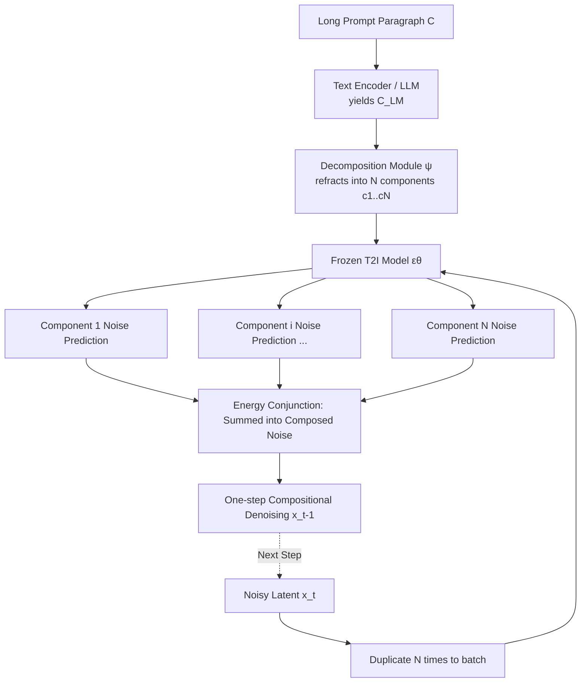

# Long-Text-to-Image Generation via Compositional Prompt Decomposition

**Conference**: ICLR 2026  
**OpenReview**: [https://openreview.net/forum?id=jxyEci13Dd](https://openreview.net/forum?id=jxyEci13Dd)  
**Code**: [jy-joy.github.io/PRISM](https://jy-joy.github.io/PRISM) (Project Page)  
**Area**: Image Generation / Long Text-to-Image  
**Keywords**: Long Text-to-Image, Compositional Generation, Energy-Based Models, Prompt Decomposition, Diffusion Models, Training-Free Generalization  

## TL;DR
PRISM "refracts" a lengthy descriptive prompt into several semantic components within the text representation space. It allows frozen pre-trained T2I models to independently denoise each component and adopts the concept conjunction of energy-based models to sum the noise predictions into a single-step compositional denoising. This enables T2I models to render long paragraphs exceeding 500+ tokens without fine-tuning the backbone or losing details.

## Background & Motivation
- **Background**: Modern text-to-image (T2I) diffusion models perform exceptionally well on short prompts. however, training data (e.g., LAION) consists almost entirely of short, tag-like captions. Models learn "phrase $\rightarrow$ visual feature" mappings rather than an understanding of dispersed details within narrative text.
- **Limitations of Prior Work**: Faced with a descriptive paragraph (averaging 284.9 tokens in the DetailMaster benchmark), even SOTA models like FLUX and Qwen-Image, which use powerful LLM text encoders, miss more than half of the specified objects. Existing solutions have significant flaws: (1) **Fine-tuning methods** (LongAlign, ParaDiffusion) are effective within their training lengths but performance drops sharply (by 30% for >500 tokens) when extrapolating to longer prompts, often suffering from "catastrophic forgetting" of pre-trained knowledge; (2) **Projection methods** (ELLA, LLM4GEN) compress long prompts into the original compact text embedding space of T2I, where the information bottleneck sacrifices the precious details of long prompts.
- **Key Challenge**: Long paragraphs are naturally out-of-distribution (OOD) inputs for pre-trained T2I models—they cannot be easily learned via fine-tuning (poor extrapolation) nor stuffed via projection (poor fidelity). How to **reuse the existing "short prompt" expertise of models** to render long and precise paragraphs remains an open question.
- **Goal**: Enable frozen pre-trained T2I models to handle long sequence inputs, preserving both pre-training priors and detail fidelity, while achieving stronger generalization for prompts exceeding training lengths.
- **Core Idea**: **Reformulate "long text-to-image" as a compositional task**. Instead of forcing the model to understand the entire OOD text at once, decompose it into a set of "model-understandable" semantic components $\{c_1,\dots,c_N\}$. The same T2I model denoises each component separately. Leveraging the property that diffusion models can be viewed as composable energy-based models (EBM), components' noise predictions are summed to sample images from a factorized distribution $p(x|C)\propto\prod_i p(x|c_i)$ that satisfies all components.

## Method

### Overall Architecture
PRISM (Prompt Refraction for Intricate Scene Modeling) inserts a lightweight "decomposition module" $\psi$ outside the original T2I denoising loop. It refracts the long prompt encoding $C_{\text{LM}}$ into $N$ component representations. During each denoising step, the current noisy latent is duplicated into a batch of $N$; the frozen T2I model performs independent noise prediction for each component, and finally, energy conjunction (summation) merges the $N$ predictions into a single compositional denoising output. The entire compositional model is trained end-to-end in an unsupervised manner, with loss derived solely from the diffusion reconstruction error of the frozen T2I model—no backbone parameters are modified, only $\psi$ (or LoRA on the text encoder) is learned.

### Key Designs

**1. Compositional Denoising via Energy Conjunction: From "Adding Noise Predictions" to "Multiplying Probability Distributions"** — This is the physical foundation of the method. A diffusion model's noise prediction is proportional to the time-dependent score function $\epsilon_\theta\propto-\nabla_{x_t}\log p_t(x_t|c)$, while sampling from a product of distributions in EBM is equivalent to adding energy functions. The two fit perfectly: to sample from the product of conditional distributions $c_1$ and $c_2$, one simply sums their respective noise predictions $\epsilon_{\text{composed}}=\epsilon_\theta(x_t,t,c_1)+\epsilon_\theta(x_t,t,c_2)\propto\nabla_{x_t}\log(p_t(x_t|c_1)\cdot p_t(x_t|c_2))$. The resulting compositional score guides generation toward an image that satisfies both prompts. PRISM generalizes this "concept conjunction" to $N$ components: $\epsilon_\theta(x_t,t,C)=\sum_{i=1}^N\epsilon_\theta(x_t,t,c_i)$. Crucially, the synthesized image does not need to appear in the training distribution of any single component, allowing for the creation of complex scenes from simple concepts—the root of compositional generalization.

**2. Learning Decomposition in Representation Space over Linguistic Sentence Splitting** — An intuitive approach is using an LLM to split paragraphs into short sentences as components. However, the conjunction in Eq.3 lacks explicit spatial control; splitting by sentence causes each component to lose global context (lighting, style, spatial relations), leading to scene inconsistency and blurred local concepts (in ablation studies, "sentence splitting" resulted in only 6.44% for Character Location and 5.18% for Spatial Relation, nearly failing). PRISM chooses to **learn a trainable decomposition module $\psi$ in the text representation space**, letting $\psi(C_{\text{LM}})=\{c_1,\dots,c_N\}$ directly output component representations optimized for compositional generation rather than interpretable natural language sentences. This learned decomposition effectively distributes spatial relations and global attributes—which are critical for consistency but lost in linguistic splitting—across components.

**3. Unsupervised End-to-End Training of Decomposition Module with Frozen T2I Teacher** — Since no ground-truth labels exist for decomposition, PRISM uses the diffusion reconstruction loss on the compositional score as the sole supervisory signal: $L(\psi)=\mathbb{E}_{x,t}\big\lVert\sum_{i=1}^N\epsilon_\theta(x_t,t,c_i)-\epsilon\big\rVert^2$, where $\psi(C_{\text{LM}})=\{c_1,\dots,c_N\}$. Because the T2I backbone is frozen, $\psi$ is forced to learn to "refract" information into components that the **pre-trained model already understands and can compose into a coherent image**, thereby preserving pre-training priors while ensuring detail fidelity by offloading semantic weight across multiple specialized components.

**4. Dual-form Decomposition Modules Adapted to Various Text Encoders** — PRISM is a general framework with two implementations. For **bi-directional attention encoders** (e.g., T5 used by SD-3.5 / FLUX), $\psi$ is implemented as a Querying Transformer: $N$ sets of learnable query vectors (each $L\times D$) serve as queries, while the long prompt encoding $C_{\text{LM}}$ serves as key/value, allowing queries to extract semantic components under the guidance of the conjunction loss. For **causal LLM encoders** (e.g., Qwen2.5-VL in Qwen-Image), instead of an external module, the input tokens are duplicated $N$ times, with each segment prepended by a trainable special token $\langle|\text{comp}_i|\rangle$, forming an extended sequence. LoRA is applied to the text encoder to output $N$ component representations in a single sequence during inference, directly leveraging the LLM's reasoning capabilities for decomposition.

## Key Experimental Results

### Main Results (DetailMaster Benchmark, Accuracy %, Bold indicates best in group)

| Model | Char. Presence | Char. Attr.(Person) | Char. Location | Scene(Style) | Spatial Rel. |
|------|------|------|------|------|------|
| StableDiffusion-1.5 | 19.12 | 80.73 | 8.66 | 7.18 | 24.53 |
| ELLA | 25.57 | 80.33 | 15.04 | 15.17 | 69.15 |
| LongAlign | 25.88 | 83.85 | 14.12 | 21.24 | 78.60 |
| **PRISM-SD1.5** | **28.21** | **84.54** | **16.57** | 20.88 | **82.45** |
| PRISM w/ tuning | 25.99 | 86.16 | 16.21 | 24.47 | 90.96 |
| FLUX-Dev. | 42.02 | 90.23 | 38.18 | 44.94 | 95.73 |
| Qwen-Image | 40.46 | 91.29 | 40.14 | 47.02 | 92.00 |
| **PRISM-Qwen** | **46.84** | **93.53** | **41.49** | **49.23** | 94.62 |

> In the SD-1.5 group, PRISM outperforms specialized methods in a training-free manner (+2.33 in Char. Presence, +1.53 in Char. Location). When combined with fine-tuning, it surpasses LongAlign by 4.65% on average across all metrics. Adding PRISM to the powerful Qwen-Image improves Char. Presence by **6.38%** on average, indicating that the root of long-text challenges lies in the scarcity of long-caption training data rather than the weakness of text encoders.

### Ablation Study (Table 3)

| Variant | Char. Presence | Char. Location | Scene Attr. | Spatial Rel. |
|------|------|------|------|------|
| Sentence Splitting | 14.01 | 6.44 | 58.69 | 5.18 |
| w/o Composition (Single Comp = Projection) | 28.98 | 16.16 | 78.92 | 20.97 |
| w/ Composition (Full PRISM) | 29.49 | 17.10 | 85.34 | 22.22 |

### Key Findings
- **Composition is Essential**: Removing composition (reducing to single-component projection) leads to significant performance drops; linguistic sentence splitting causes catastrophic failure (Spatial Relation at only 5.18%), proving that "learned representation space decomposition" is indispensable.
- **Finer Decomposition Enhances Generalization**: As $N$ increases from 3 to 4 to 5, the gain relative to same-computation fine-tuning baselines continues to expand. Visualizations show that at $N=5$, component content is more dispersed and semantically lighter, whereas at $N=3$, components are nearly identical to the composed image (semantic coupling).
- **Excellent Length Generalization**: LongAlign performs well under 300 tokens but drops up to 30% for >500 tokens. Projection methods are limited by fixed context windows. PRISM remains robust across all length buckets, exceeding baselines by **7.4%** for prompts >500 tokens.
- **Leading Image Quality**: PRISM-Qwen achieves best-in-class performance on DenScore (22.93), PickScore (22.04), and VQAScore (86.21), and improves Qwen-Image's HPSv3 from 8.56 to 12.05.
- **Compatibility with Fine-tuning**: Since components reside in the input space expected by pre-trained models, PRISM can be combined with fine-tuning methods for further gains (PRISM w/ tuning increased Style from 20.88 to 24.47), showing it is an orthogonal capability enhancement rather than a replacement.

## Highlights & Insights
- **A Third Path for "Priors vs. Fidelity"**: Fine-tuning fails to preserve priors, while projection fails to preserve fidelity. PRISM achieves both using compositional generation (clearly shown in the three-quadrant comparison in Fig. 2) while **keeping the backbone completely frozen**.
- **Valuable Diagnostic Conclusion**: Substantial improvements gained by adding PRISM to Qwen-Image (already using an MLLM encoder) directly refute the common assumption that "stronger text encoders solve long prompts," shifting the focus toward training data distribution issues.
- **Learning Decomposition in Representation Space**: This is a masterstroke—it acknowledges that "human-readable sentence splits" and "optimally composable factors for the model" are different, and uses the frozen model's diffusion loss to learn the latter unsupervised.
- **Universal Framework**: The core idea holds across Querying Transformer and LoRA implementations, covering generations of architectures from SD-1.5/SD-3.5 to FLUX and Qwen-Image.

## Limitations & Future Work
- **Lack of Explicit Spatial Control**: Energy conjunction provides no explicit spatial constraints during generation; factorization remains purely data-driven, relying on learning rather than control for complex spatial relations.
- **Fixed Decomposition Granularity**: Currently, $N$ is a fixed hyperparameter. The authors suggest that an ideal approach would be adaptive decomposition based on prompt complexity—using fewer components for short prompts to improve efficiency.
- **Computational Overhead from Component Count**: Each step requires duplicating latents $N$ times through the T2I model. Larger $N$ improves generalization but increases inference costs linearly, presenting an accuracy-efficiency trade-off.
- **Dependence on Long Caption Data**: Training the decomposition module still requires approximately 2 million re-captioned images (similar to LongAlign), meaning the need for long-text paired data is not entirely eliminated.

## Related Work & Insights
- **Compositional Generation Modeling** (Du & Kaelbling 2024; concept conjunction in Liu et al. 2022a; Composable Diffusion) serves as a direct conceptual foundation—viewing models as soft constraints and using optimization to find high-likelihood samples across constraints. The novelty here is advancing "composition" from "adding manually written prompts" to "automatically learning optimal factors from a single long paragraph."
- **Comparison to MultiDiffusion / Projection**: MultiDiffusion fuses diffusion paths spatially, while projection methods (ELLA/LLM4GEN) compress long prompts. PRISM factorizes in the conditional input space, preserving all information.
- **Insights**: (1) When input is OOD for a pre-trained model, "decomposition into the model's comfort zone + output-side composition" may be more elegant than "hard fine-tuning/projection." This strategy could transfer to long video, long document, or multi-constraint generation tasks. (2) Using the reconstruction loss of a frozen generative model to learn a "translation/decomposition" module represents a lightweight paradigm for capability expansion.

## Rating
- **Novelty**: ⭐⭐⭐⭐⭐ Systematically applies the compositional EBM perspective to "long-text-to-image" and proposes "unsupervised decomposition in representation space"—a non-trivial and cohesive innovation.
- **Experimental Thoroughness**: ⭐⭐⭐⭐ Covers multiple architectures (SD-1.5/3.5/FLUX/Qwen), multiple DetailMaster dimensions, 5 preference models, and length-bucket generalization. A complete chain of evidence is present, though quantitative analysis of inference overhead vs. $N$ is slightly lacking.
- **Writing Quality**: ⭐⭐⭐⭐⭐ The metaphor of "refracting long prompts like a prism" is well-maintained. Fig. 2's three quadrants, Fig. 5's length generalization, and Fig. 8's semantic decoupling clearly explain motives and mechanisms.
- **Value**: ⭐⭐⭐⭐ Enhances long-prompt following for any T2I model in a training-free manner and can be stacked on latest SOTAs; possesses both practical utility and theoretical inspiration.

<!-- RELATED:START -->

## Related Papers

- [\[ICLR 2026\] TIPO: Text to Image with Text Pre-sampling for Prompt Optimization](tipo_text_to_image_with_text_pre-sampling_for_prompt_optimization.md)
- [\[CVPR 2026\] Synthetic Curriculum Reinforces Compositional Text-to-Image Generation](../../CVPR2026/image_generation/synthetic_curriculum_reinforces_compositional_text-to-image_generation.md)
- [\[AAAI 2026\] Right Looks, Wrong Reasons: Compositional Fidelity in Text-to-Image Generation](../../AAAI2026/image_generation/right_looks_wrong_reasons_compositional_fidelity_in_text-to-image_generation.md)
- [\[CVPR 2026\] Compositional Text-to-Image Generation Via Region-aware Bimodal Direct Preference Optimization](../../CVPR2026/image_generation/compositional_text-to-image_generation_via_region-aware_bimodal_direct_preferenc.md)
- [\[ICLR 2026\] VisualPrompter: Semantic-Aware Prompt Optimization with Visual Feedback for Text-to-Image Synthesis](visualprompter_semantic-aware_prompt_optimization_with_visual_feedback_for_text-.md)

<!-- RELATED:END -->
