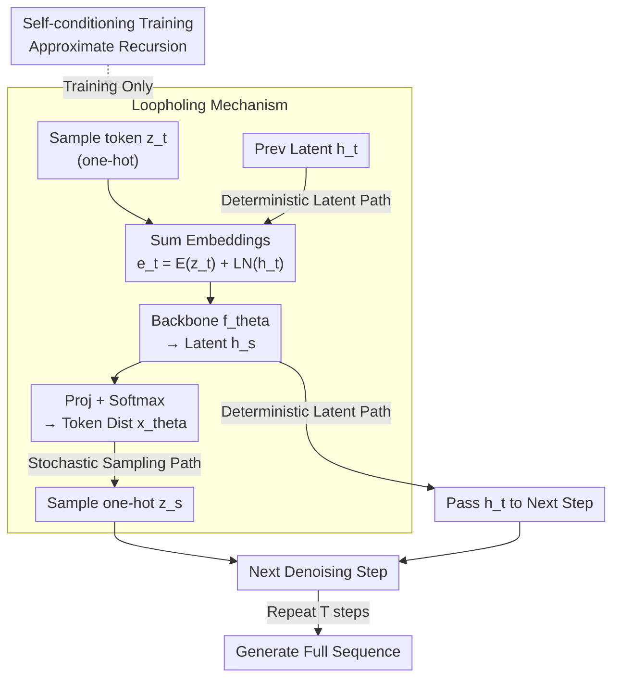

# Loopholing Discrete Diffusion: Deterministic Bypass of the Sampling Wall

**Conference**: ICLR 2026  
**arXiv**: [2510.19304](https://arxiv.org/abs/2510.19304)  
**Code**: [GitHub](https://github.com/ahn-ml/lddm)  
**Area**: Discrete Diffusion Models / Text Generation  
**Keywords**: Discrete diffusion, sampling wall, deterministic bypass, self-conditioning, non-autoregressive text generation

## TL;DR
This paper identifies the "sampling wall" problem in discrete diffusion models (where categorical distribution information collapses into one-hot vectors after sampling) and proposes the Loopholing mechanism. By introducing a deterministic latent path to propagate rich distribution information, it reduces generation perplexity by up to 61%, significantly narrowing the gap with autoregressive models.

## Background & Motivation
- Discrete diffusion models offer speed advantages through parallel decoding, but generation quality still lags behind autoregressive (AR) models.
- Known issues: **idle steps** (multiple denoising steps producing the same result) and **temporal oscillation** (tokens repeatedly switching between candidates).
- **Key Challenge (Sampling Wall)**: The core problem is that the categorical distribution $\mathbf{x}_{\theta,t}$ contains rich information about token candidates (e.g., $[0.49, 0.51]$ vs $[0.20, 0.80]$), but it collapses into the same one-hot vector after sampling, leading to irreversible information loss.
- This information collapse forces subsequent steps to reconstruct context from limited one-hot representations, leading to inefficiency and instability.

## Method

### Overall Architecture
LDDM aims to solve the "sampling wall" in discrete diffusion: after each denoising step collapses the backbone-calculated categorical distribution into a one-hot token, subtle differences in candidate probabilities ($[0.49, 0.51]$ vs $[0.20, 0.80]$) are flattened, and the next step can only reconstruct context from the sparse one-hot input. The **Core Idea** is to open an additional **deterministic latent path** alongside the standard **stochastic sampling path**. In each denoising step, besides sampling a one-hot token as usual, the internal continuous latent representation $\mathbf{h}_s$ is passed directly to the next step, allowing distribution information that hasn't been compressed by sampling to accumulate across steps, thereby bypassing the sampling wall. This latent path creates recursive dependencies between adjacent denoising steps; while training would normally require backpropagation through the entire trajectory, LDDM simplifies it using **self-conditioning training**, which only requires two forward passes per step.

### Key Designs

**1. Loopholing Mechanism: Adding a deterministic latent path alongside the sampling path to bypass one-hot collapse**

The root of the sampling wall is that collapsing the categorical distribution into a one-hot vector at each step discards all subtle differences in candidate probabilities. Loopholing allows each denoising step to output two components: a stochastic one-hot vector on the sampling path and a deterministic continuous vector on the latent path, denoted as $(\mathbf{x}_\theta(\mathbf{z}_t, \mathbf{h}_t, t), \mathbf{h}_s) = f_{\text{Loopholing}}(\mathbf{z}_t, \mathbf{h}_t, t)$. Specifically, the current token embedding $E_\theta(\mathbf{z}_t)$ and the previous latent representation (after Layer Norm) are added to obtain $\mathbf{e}_t = E_\theta(\mathbf{z}_t) + \text{LN}(\mathbf{h}_t)$, which is fed into the backbone to get a new latent representation $\mathbf{h}_s = f_\theta(\mathbf{e}_t, t)$. The token distribution is then read out via $\mathbf{x}_{\theta} = \text{softmax}(g_\theta(\mathbf{h}_s))$. This deterministic channel functions like an RNN-style hidden state within discrete diffusion: continuous context uncompressed by sampling accumulates across steps, preventing information loss from one-hot conversion. This also mitigates two prior inefficiencies: even if a sampling result remains the same (idle step), the latent representation $\mathbf{h}_t$ continues to update, and the deterministic path maintains contextual memory, preventing tokens from oscillating excessively between candidates. Mechanism analysis confirms this: LDDM shows higher Temporal KL in early stages (faster exploration) and lower in later stages (more stability), with Token-Prediction Entropy consistently lower than the baseline.

**2. Self-conditioning Training: Simulating latent recursion during inference with two forward passes**

The latent path is recursive during inference (current $\mathbf{h}_t$ comes from the previous step). Directly mimicking this during training would require unrolling the entire denoising trajectory, which is computationally expensive. LDDM instead runs only two forward passes at each randomly sampled timestep: the first generates a pseudo-context $\mathbf{h}^0$ with $\mathbf{h}_t = \mathbf{0}$, and the second uses it as a condition $\mathbf{h}_t = \text{sg}[\mathbf{h}^0]$ (with gradients stopped) for prediction. The second pass approximates the inference scenario of "predicting with the previous latent representation" without needing cross-step backpropagation. This self-conditioning loss is used with probability $p$, while the standard loss is used with $1-p$. Experiments show $p \in [0.5, 0.9]$ is optimal, with the trade-off being a ~30% increase in training time.

### Loss & Training
The training objective reformulates the original NELBO via self-conditioning, imposing a log-likelihood constraint on masked positions $\mathbf{m}$:
$$\mathcal{L}_{\text{Loopholing}} = \mathbb{E}_{t,\mathbf{z}_t}\left[\mathbb{I}[\mathbf{z}_t = \mathbf{m}] \frac{\alpha'_t}{1-\alpha_t} \log\langle \mathbf{x}^1_\theta(\mathbf{z}_t, \text{sg}[\mathbf{h}^0], t), \mathbf{x}\rangle\right]$$
where $\mathbf{x}^1_\theta$ is the second forward pass conditioned on $\mathbf{h}^0$ with a stop-gradient. The self-conditioning probability $p$ is optimal between $0.5$ and $0.9$.

## Key Experimental Results

### Main Results (Test Perplexity ↓)

| Model | LM1B | OWT |
|------|------|-----|
| SEDD Absorb | ≤28.39 | ≤24.01 |
| MDLM | ≤27.60 | ≤23.05 |
| UDLM | ≤31.11 | ≤25.51 |
| **LDDM-M (Ours)** | **≤25.95** | **≤21.90** |
| **LDDM-U (Ours)** | **≤29.21** | **≤23.82** |

### Generation Quality (Gen PPL, GPT-2 Large Evaluation)

| Model | Gen PPL @1024 steps | Ratio to AR | Sentence Entropy |
|------|---------------|---------|--------|
| MDLM | 108.94 | 3.17× | 4.39 |
| UDLM | 73.95 | 2.15× | 4.01 |
| AR (GPT-2) | 34.33 | 1.00× | 4.27 |
| **LDDM-M** | **49.13** | **1.43×** | **4.43** |
| **LDDM-U** | **28.76** | **0.84×** | **4.16** |

### Reasoning Tasks (Success Rate %)

| Model | Params | Countdown 4 | Game of 24 | Countdown 5 |
|------|------|------------|-----------|------------|
| MGDM | 6M | 45.0 | 12.0 | 5.9 |
| **LDDM-G** | **6M** | **56.3** | **28.0** | **10.3** |
| MGDM | 85M | 86.5 | 47.0 | 35.7 |
| **LDDM-G** | **85M** | **94.4** | **63.0** | **41.3** |

### Key Findings
- Gen PPL: LDDM-M reduces MDLM's 108.94 to 49.13 (-55%), and LDDM-U reduces UDLM's 73.95 to 28.76 (-61%).
- LDDM-U even outperforms the autoregressive baseline (28.76 vs 34.33) while maintaining sentence entropy (no loss in diversity).
- Accuracy on Countdown 4 improved from 45% to 56.3% (6M model), and Game of 24 from 47% to 63% (85M).
- Performance improves with longer latent propagation lengths (Figure 5a), demonstrating the accumulation effect.
- G-eval (GPT-4.1) assessments show significant improvements in coherence and naturalness.

## Highlights & Insights
- The "Sampling Wall" concept accurately summarizes the core bottleneck of discrete diffusion models, being more fundamental than idle steps or oscillation.
- Loopholing = Discrete Diffusion + RNN-style hidden state updates, while maintaining the advantage of training without unrolling.
- Self-conditioning training cleverly simulates context propagation during inference without expensive backpropagation.
- Effective across both mask and uniform discrete diffusion frameworks, demonstrating strong generality.

## Limitations & Future Work
- Training time increases by about 30% (two forward passes), and memory increases due to doubled embedding dimensions.
- Currently only considers single-step self-conditioning; multi-step training strategies might offer further improvements.
- Lack of a rigorous mathematical framework to integrate loopholing into standard diffusion theory.
- Experiments were limited to medium-scale models (academic setting); large-scale validation is needed.

## Related Work & Insights
- Adapts self-conditioning ideas from Analog Bits and RIN to the discrete diffusion setting.
- Connection with RNNs: the deterministic path ≈ hidden state update, while the sampling path ≈ output feedback.
- Opens a path for the application of discrete diffusion models in complex reasoning tasks.

## Rating
- Novelty: ⭐⭐⭐⭐⭐ The "Sampling Wall" concept and Loopholing mechanism are highly original.
- Experimental Thoroughness: ⭐⭐⭐⭐⭐ Comprehensive coverage across language modeling, generation quality, reasoning tasks, ablation studies, and mechanism analysis.
- Writing Quality: ⭐⭐⭐⭐⭐ Clear problem definition and thorough causal analysis.
- Value: ⭐⭐⭐⭐⭐ Significantly narrows the gap between discrete diffusion and autoregressive models, with promising impact.

<!-- RELATED:START -->

## Related Papers

- [\[ICLR 2026\] Variational Autoencoding Discrete Diffusion with Enhanced Dimensional Correlations Modeling](variational_autoencoding_discrete_diffusion_with_enhanced_dimensional_correlatio.md)
- [\[ICLR 2026\] ReDDiT: Rehashing Noise for Discrete Visual Generation](reddit_rehashing_noise_for_discrete_visual_generation.md)
- [\[ICLR 2026\] Forward-Learned Discrete Diffusion: Learning how to noise to denoise faster](forward-learned_discrete_diffusion_learning_how_to_noise_to_denoise_faster.md)
- [\[ICLR 2026\] Discrete Guidance Matching: Exact Guidance for Discrete Flow Matching](discrete_guidance_matching_exact_guidance_for_discrete_flow_matching.md)
- [\[ICLR 2026\] Discrete Adjoint Matching](discrete_adjoint_matching.md)

<!-- RELATED:END -->
