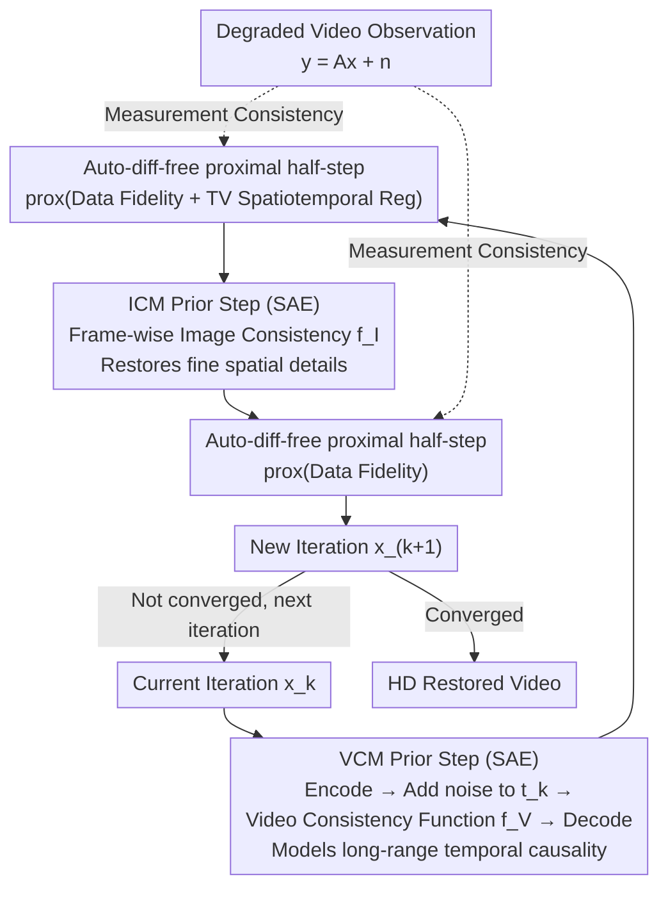

# LVTINO: LAtent Video consisTency INverse sOlver for High Definition Video Restoration

**Conference**: ICLR 2026  
**arXiv**: [2510.01339](https://arxiv.org/abs/2510.01339)  
**Code**: [GitHub](https://github.com/aspagnoletti/LVTINO)  
**Area**: Video Restoration / Diffusion Models  
**Keywords**: Video Restoration, Consistency Models, Inverse Problem Solving, Zero-shot, Diffusion Models

## TL;DR

Proposes LVTINO, the first zero-shot video inverse problem solver based on Video Consistency Model (VCM) priors. By injecting auto-differentiation-free measurement consistency constraints into the VCM sampling process, it achieves superior perceptual quality and temporal consistency over frame-wise image methods across various video inverse problems (e.g., super-resolution, deblurring, inpainting) with minimal Neural Function Evaluations (NFE).

## Background & Motivation

**Background**: The field of computational imaging increasingly leverages generative diffusion models to solve challenging image inverse problems (e.g., super-resolution, deblurring, inpainting). Current state-of-the-art zero-shot image inverse problem solvers utilize distilled text-to-image Latent Diffusion Models (LDM) as priors, achieving unprecedented performance in accuracy and perceptual quality while maintaining high computational efficiency.

**Limitations of Prior Work**: Extending these image-level advances to high-definition video restoration faces significant challenges. Video restoration requires not only recovering fine spatial details but also capturing subtle temporal dependencies between frames. Naively applying image LDM-based solvers frame-by-frame leads to temporal inconsistency in reconstruction results—each frame is generated independently, and the randomness between different frames causes flickering and incoherence. Furthermore, diffusion-based inverse solvers typically require many NFEs and auto-differentiation computations, which is inefficient.

**Key Challenge**: Video restoration needs to simultaneously optimize two competing objectives: spatial detail fidelity and temporal consistency. Image priors offer high spatial quality but lack temporal modeling; video diffusion models have temporal modeling but suffer from massive NFE overhead and are difficult to condition for inverse problems.

**Goal**: Design an efficient, plug-and-play video inverse problem solver that can: (1) leverage video generative priors (rather than image priors) to ensure temporal consistency, (2) complete reconstruction with minimal NFEs while maintaining measurement consistency, and (3) avoid auto-differentiation of the degradation operator.

**Key Insight**: Video Consistency Models (VCM) distill video latent diffusion models into fast generators that naturally capture temporal causality and require only a few sampling steps. Using VCM as a prior for video inverse problems can solve both temporal consistency and computational efficiency issues.

**Core Idea**: Inject auto-differentiation-free measurement consistency constraints into the few-step sampling process of VCM to realize the first zero-shot video inverse problem solver based on a video prior.

## Method

### Overall Architecture

LVTINO addresses high-definition video inverse problems: recovering a clean video $\mathbf{x}$ from a degraded observation $\mathbf{y} = \mathbf{A}\mathbf{x} + \mathbf{n}$ (where $\mathbf{A}$ is a linear degradation operator such as downsampling, blurring, or inpainting masks applied to the whole video). Instead of viewing this as "denoising step-by-step from noise," it is treated as **sampling from a posterior $p(\mathbf{x}\mid\mathbf{y},\mathbf{c},\lambda)$**, approximated using a Langevin sampler—a time-homogeneous process where the iteration $\mathbf{x}_k$ converges directly toward the posterior without traversing a reverse time axis like standard diffusion.

The posterior is composed of "Prior × Likelihood." The prior is the core innovation—a **product-of-experts video prior** $p(\mathbf{x}\mid\mathbf{c},\lambda) \propto p_V^{\eta}(\mathbf{x}\mid\mathbf{c})\, p_I^{1-\eta}(\mathbf{x}\mid\mathbf{c})\, p_\phi(\mathbf{x}\mid\lambda)$, which multiplies a Video Consistency Model (VCM), a frame-wise Image Consistency Model (ICM), and a spatiotemporal regularization term. These handle temporal causality, spatial detail, and stability, respectively. The likelihood $p(\mathbf{y}\mid\mathbf{x})\propto\exp\{-\|\mathbf{y}-\mathbf{A}\mathbf{x}\|^2/2\sigma_n^2\}$ enforces measurement consistency. Each Langevin iteration is split into four sequential sub-steps: VCM prior step → auto-diff-free conditioning half-step with regularization → ICM prior step → auto-diff-free conditioning half-step. The process yields restored video after a few rounds with minimal NFEs and no auto-differentiation.

### Key Designs

**1. Product-of-Experts Video Prior: VCM for Time, ICM for Space, TV for Stability**

The fundamental flaw in applying image LDMs frame-by-frame is that each frame is generated independently with different randomness, causing flickering. However, using only a video prior fails to recover sufficiently fine spatial details. LVTINO solves this by multiplying three experts as the prior: $p_V$ is provided by a text-to-video VCM to model long-range temporal causality and ensure temporal consistency; $p_I$ is provided by a high-resolution text-to-image ICM applied **frame-wise** to recover fine spatial textures; $p_\phi(\mathbf{x}\mid\lambda)\propto\exp\{-\phi_\lambda(\mathbf{x})\}$ is a convex regularizer (implemented using 3D spatial-temporal Total Variation $\mathrm{TV}^3_\lambda$) to suppress background jitter and promote smooth transitions. The temperature parameter $\eta\in(0,1)$ balances the video and image priors.

**2. SAE Step: Compressing Prior Integrals into Few Consistency Forwards**

Each Langevin step requires calculating the integral of the prior terms $\int \nabla\log p_V\,\mathrm{d}s$ and $\int \nabla\log p_I\,\mathrm{d}s$, which is intractable. LVTINO utilizes a **Stochastic Auto-Encoder (SAE) step** to approximate this: the current estimate is encoded into latent space $\mathbf{z}=\sqrt{\alpha_{t_k}}E(\mathbf{x}_k)+\sqrt{1-\alpha_{t_k}}\,\boldsymbol{\epsilon}$ at noise level $t_k$, and then mapped back to a clean latent via a consistency function $f_\vartheta(\mathbf{z},t_k)$. Since the consistency function is a fast generator distilled from LDMs, a **single forward pass** maps noisy latents to clean ones. The total NFE for the entire video is in the single digits.

**3. Auto-differentiation-free Proximal Conditioning: Closing the Loop with Observations**

LVTINO injects the likelihood via an **implicit (backward Euler) half-step**, which is equivalent to applying a **proximal operator** $\operatorname{prox}_{\delta g_y}$ to the data fidelity term. Crucially, when $\mathbf{A}$ is a linear operator, the proximal operator of $\|\mathbf{y}-\mathbf{A}\mathbf{x}\|^2$ has a **closed-form solution**. This allows conditioning **without performing auto-differentiation through the VCM/ICM networks**. This is a major distinction from solvers like DPS or $\Pi$GDM, which require backpropagation through the entire denoising network, incurring prohibitive memory costs for HD video.

### Loss & Training

LVTINO is a zero-shot (plug-and-play) method and **does not perform any training for specific degradations**. The VCM and ICM priors are pre-trained. During inference, the only adjustments needed are several sampling hyperparameters: temperature $\eta$, step size $\delta$, TV regularization strength $\lambda$, and the Moreau–Yosida parameter $\gamma$.

## Key Experimental Results

### Main Results: Video Inverse Problem Reconstruction Quality

Comparison with frame-wise image methods and video methods across multiple tasks:

| Task | Method | PSNR↑ | LPIPS↓ | FVD↓ | NFE |
|------|------|-------|--------|------|-----|
| 4× Super-Resolution | Frame-wise LDM (TINO) | High | Medium | High (Inconsistent) | 4-8/frame |
| 4× Super-Resolution | **Ours** | Slightly Lower | **Best** | **Best** | 4-8 |
| Deblurring | Frame-wise LDM | Medium | Medium | High | 4-8/frame |
| Deblurring | **Ours** | Medium | **Best** | **Best** | 4-8 |
| Inpainting | Frame-wise LDM | Medium | Medium | High | 4-8/frame |
| Inpainting | **Ours** | Medium | **Best** | **Best** | 4-8 |

LVTINO significantly outperforms frame-wise methods in perceptual metrics (LPIPS, FVD). The improvement in FVD (Fréchet Video Distance) indicates a substantial increase in temporal consistency.

### Ablation Study: VCM Prior vs. Image LDM Prior

| Prior Type | LPIPS↓ | FVD↓ | Temporal Consistency | Total NFE |
|---------|--------|------|-----------|---------|
| Frame-wise Image LDM | Medium | High | Poor (Flickering) | 4-8 × #frames |
| **VCM (Ours)** | **Low** | **Low** | **Good** | 4-8 (Total) |
| Frame-wise + Temporal Filter | Medium | Medium | Medium | 4-8 × #frames + Post |

### Key Findings

- **Qualitative Shift in Temporal Consistency**: Switching from image priors to video priors changes the results from "flickering and unusable" to "smooth and natural."
- **Massive Efficiency Gain**: VCM's few-step nature allows for a total NFE of 4-8 for the entire video clip, whereas frame-wise methods require 4-8 × number of frames.
- **Zero-shot Generalization**: Effective across multiple degradation types without retraining.
- **Perceptual Quality vs. PSNR Trade-off**: LVTINO matches the characteristics of generative priors, favoring perceptual optimization over pixel-level accuracy.

## Highlights & Insights

- **First Application of VCM as Video Inverse Prior**: Integrating the latest video consistency models into inverse problem solving is a natural yet significant connection that addresses both consistency and efficiency.
- **Value of Auto-diff-free Conditioning**: Bypassing auto-differentiation makes processing HD video feasible, moving from "paper-only" methods to practical tools.
- **Plug-and-play Zero-shot Architecture**: The design has broad transfer value as it requires no retraining, provided the degradation can be expressed as a known operator.

## Limitations & Future Work

- **Dependence on Pre-trained VCM Quality**: The upper bound is limited by the generation quality of the underlying VCM.
- **Linear Degradation Operators**: While SR and blurring are linear, the applicability to non-linear degradations (e.g., JPEG artifacts) needs further verification.
- **Ultra-long Video Handling**: Current methods operate on fixed-length clips; consistency between segments remains a potential issue.

## Related Work & Insights

- **vs. Image Solvers (DPS, DDRM)**: These lack temporal consistency when applied frame-by-frame; LVTINO fundamentally solves this via the VCM prior.
- **vs. Direct Conditional Video Generation**: Direct methods require many NFEs; LVTINO leverages VCM distillation to compress NFE to single digits.
- **vs. Optical Flow Post-processing**: LVTINO models temporal dynamics during the generative process rather than attempting a post-hoc remedy.

## Rating

- Novelty: ⭐⭐⭐⭐ 
- Experimental Thoroughness: ⭐⭐⭐ 
- Writing Quality: ⭐⭐⭐⭐ 
- Value: ⭐⭐⭐⭐ 

<!-- RELATED:START -->

<!-- RELATED:END -->

## Related Papers

- [\[ICCV 2025\] LATINO-PRO: LAtent consisTency INverse sOlver with PRompt Optimization](../../ICCV2025/image_generation/latino-pro_latent_consistency_inverse_solver_with_prompt_optimization.md)
- [\[ICLR 2026\] Dual-Solver: A Generalized ODE Solver for Diffusion Models with Dual Prediction](dual-solver_a_generalized_ode_solver_for_diffusion_models_with_dual_prediction.md)
- [\[ICLR 2026\] Eliminating VAE for Fast and High-Resolution Generative Detail Restoration](eliminating_vae_for_fast_and_high-resolution_generative_detail_restoration.md)
- [\[ICLR 2026\] Bridging Degradation Discrimination and Generation for Universal Image Restoration](bridging_degradation_discrimination_and_generation_for_universal_image_restorati.md)
- [\[ICLR 2026\] QVGen: Pushing the Limit of Quantized Video Generative Models](qvgen_pushing_the_limit_of_quantized_video_generative_models.md)

<!-- RELATED:END -->
