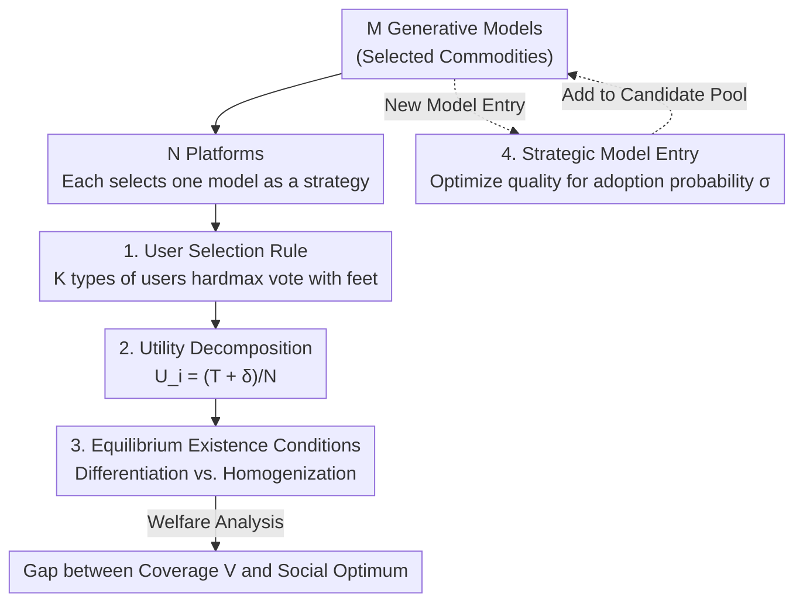

# Market Games for Generative Models: Equilibria, Welfare, and Strategic Entry

**Conference**: ICLR 2026  
**arXiv**: [2602.17787](https://arxiv.org/abs/2602.17787)  
**Code**: [GitHub](https://github.com/osu-srml/Generative_Competition)  
**Area**: Game Theory / Generative Model Markets  
**Keywords**: Market games, Nash equilibrium, generative model competition, social welfare, strategic entry

## TL;DR

This paper formalizes a three-layer model-platform-user market game to analyze the existence conditions of pure strategy Nash equilibrium, market structure, and social welfare impacts under generative model competition, while designing optimal entry strategies for model providers.

## Background & Motivation

- The generative model ecosystem has evolved into a competitive multi-platform market (e.g., Azure vs. Bedrock, Midjourney vs. Stability AI).
- Existing research is mostly limited to two-layer markets (developers serving users directly), ignoring the intermediate platform layer.
- **Key Challenge**: When does competition lead to homogenization? Does increasing models/platforms improve user welfare? How should model providers enter the market strategically?

## Method

### Overall Architecture

The paper abstracts the generative model market into a three-layer game forming a causal chain. The bottom layer consists of $M$ generative models $\mathbb{G}=\{g_1,\dots,g_M\}$ as "commodities"; the middle layer consists of $N$ platforms, where each platform selects one model $f_i\in\mathbb{M}$ as its strategy to compete for users; the top layer consists of $K$ types of heterogeneous users $\Theta=\{\boldsymbol{\theta}_1,\dots,\boldsymbol{\theta}_K\}$ who "vote with their feet" by choosing the platform offering the highest score.

The analysis follows this chain: first, a **user choice rule** defines the platform's market share (Design 1); then platform utility is **decomposed** into "global quality + local misalignment advantage" (Design 2), leading to **equilibrium existence conditions** for differentiation or homogenization (Design 3). Finally, the perspective shifts to a new model provider seeking entry, determining how to train a model to be most likely adopted—defined as **strategic model entry** (Design 4).

### Key Designs

**1. User Selection Rule: Defining "Voting with Feet" as a Share Function**

To study platform competition, users must first be characterized by how they distribute across platforms. The paper adopts hardmax selection, where users of type $\boldsymbol{\theta}$ flock to the platform with the highest current score and split equally among ties:

$$p_i(\boldsymbol{\theta}) = \begin{cases} 0 & \text{if } f_i \notin \arg\max_{i'} S_{f_{i'}}(\boldsymbol{\theta}) \\ \frac{1}{|\arg\max_{i'} S_{f_{i'}}(\boldsymbol{\theta})|} & \text{otherwise} \end{cases}$$

This "winner-takes-all/split-ties" setting makes each platform's share a discrete function of the model score $S$, compressing continuous competition into an enumerable strategic game.

**2. Utility Decomposition: Splitting Gains into "Global Quality + Local Misalignment Advantage"**

Directly analyzing platform utility is difficult, so the paper decomposes the utility of platform $i$ choosing model $f_i$:

$$U_i(f_i; \boldsymbol{f}_{-i}) = \frac{1}{N}(T_{f_i} + \delta_{f_i}(\boldsymbol{f}))$$

Where $T_j=\sum_{\boldsymbol{\theta}}\pi_{\boldsymbol{\theta}}S_j(\boldsymbol{\theta})$ is the average score across the user distribution, representing "raw strength"; the deviation advantage $\delta_{f_i}$ represents the net share gained by "competing in niches where others have poor coverage." This decomposition indicates that platforms want both the strongest average model and to avoid crowds to capture differentiation dividends.

**3. Equilibrium Existence Conditions: Characterizing the Divide Between Differentiation and Homogenization**

Based on the decomposition, the paper provides precise conditions for two types of pure strategy equilibria. A fully differentiated equilibrium (each platform selects a different model) exists if and only if for every platform $i$, deviating to any alternative model $f_i$ is not profitable:

$$T_{f_i^*} - T_{f_i} \geq \delta_{f_i}(\boldsymbol{f}_{-i}^* \cup f_i) - \delta_{f_i^*}(\boldsymbol{f}^*)$$

Intuitively, the "loss of average performance" must outweigh the "gain from niche misalignment." Conversely, when a dominant user type has a sufficiently large share ($\pi_{\boldsymbol{\theta}^*}\geq 1-\frac{1}{1+2\Gamma/\rho}$), the incentive to capture that group overwhelms everything else, leading all platforms to converge on the same model—a homogenized equilibrium.

**4. Strategic Model Entry: Targeted Optimization for Adoption Probability**

From the provider's side, the goal is to train a model most likely to be adopted by platforms and selected by users. The objective is defined as adoption-weighted quality:

$$\max F(\phi) = \sum_{\boldsymbol{\theta}} \pi_{\boldsymbol{\theta}} \sigma_{\boldsymbol{\theta}} S_\phi(\boldsymbol{\theta})$$

The adoption probability is represented by a Bradley-Terry soft-gate $\sigma_{\boldsymbol{\theta}}=\sigma(\beta\Delta_{\boldsymbol{\theta}})$, which increases monotonically with the new model's advantage $\Delta_{\boldsymbol{\theta}}=S_\phi(\boldsymbol{\theta})-\bar{S}(\boldsymbol{\theta})$ over the strongest competitor. Providers should concentrate effort on user groups where existing models are not firmly entrenched and where they can achieve a performance lead.

## Key Experimental Results

### Experiment Setup

Based on a CIFAR-10 DDPM model pool (5 LoRA variants) + 6 heterogeneous user groups + ResNet20 reward functions.

### Impact of Model Pool Expansion on the Market

| No. Models/Platforms | HHI Diversity Change | Coverage Value Change | Equilibrium Type |
|-------------|-------------|----------|---------|
| M=2, N=3 | Highly Homogenized | Baseline | Homogenized |
| M=3, N=3 | Significantly Lower (Differentiated) | Increase | Differentiated |
| M=4, N=3 | Best-response cycles emerge | Fluctuating | No Pure Equilibrium |
| M=5, N=3 | Re-homogenized | Decrease | Homogenized |

### Ablation Study: Increase in Platform Count

| Platform Count | HHI Diversity | Coverage Value | Key Findings |
|-------|-----------|-------|---------|
| N=1 | 1.00 | Lowest | Monopoly |
| N=3 | Moderate | Increase | Differentiation emerges |
| N=6 | Lowest | Highest | More adoption opportunities |

### Key Findings

1. Expanding the model pool does not necessarily increase diversity—only sufficiently unique models promote differentiation.
2. Increasing the number of platforms generally improves diversity, but welfare never reaches social optimum.
3. First-movers often choose the "best" model, but latecomers may achieve higher individual utility.
4. Market structure is determined by the interplay of average performance and local deviation advantage.

## Highlights & Insights

1. **Key Insight**: Increasing competition (more models or platforms) can paradoxically decrease user welfare and market diversity.
2. **Novelty**: First to formalize the three-layer generative model market game with rigorous game-theoretic analysis.
3. **Value**: Provides a theoretical foundation for AI ecosystem governance, explaining current homogenization trends in generative model markets.

## Limitations & Future Work

- The hardmax user choice assumption is idealized; while extended to softmax, real user behavior is more complex.
- Experiments are limited to CIFAR-10 and lack validation on real-world market datasets.
- Assumes platforms select only one model, whereas platforms may offer suites of models in reality.
- Does not account for dynamic or repeated game scenarios.

## Related Work

- **Classifier Market Competition**: Einav & Rosenfeld (2025), Jagadeesan et al. (2023)
- **Generative Model Competition**: Taitler & Ben-Porat (2025), Raghavan (2024)
- **Three-layer Market Structure**: Fallah et al. (2024)

## Rating

- Novelty: ⭐⭐⭐⭐⭐ 
- Technical Depth: ⭐⭐⭐⭐ 
- Experimental Thoroughness: ⭐⭐⭐ 
- Value: ⭐⭐⭐⭐ 

<!-- RELATED:START -->

## Related Papers

- [\[ICCV 2025\] GameFactory: Creating New Games with Generative Interactive Videos](../../ICCV2025/image_generation/gamefactory_creating_new_games_with_generative_interactive_videos.md)
- [\[ICLR 2026\] NeuralOS: Towards Simulating Operating Systems via Neural Generative Models](neuralos_towards_simulating_operating_systems_via_neural_generative_models.md)
- [\[ICLR 2026\] QVGen: Pushing the Limit of Quantized Video Generative Models](qvgen_pushing_the_limit_of_quantized_video_generative_models.md)
- [\[ICLR 2026\] DoFlow: Flow-based Generative Models for Interventional and Counterfactual Forecasting](doflow_flow-based_generative_models_for_interventional_and_counterfactual_foreca.md)
- [\[ICLR 2026\] Bridging Generalization Gap of Heterogeneous Federated Clients Using Generative Models](bridging_generalization_gap_of_heterogeneous_federated_clients_using_generative_.md)

<!-- RELATED:END -->
